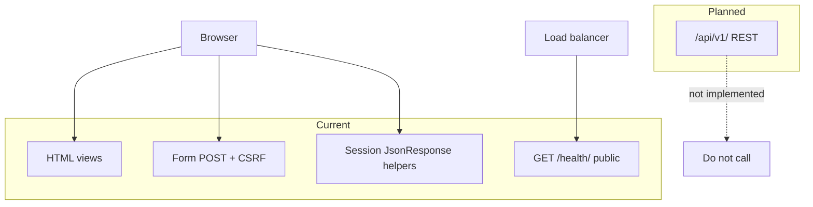
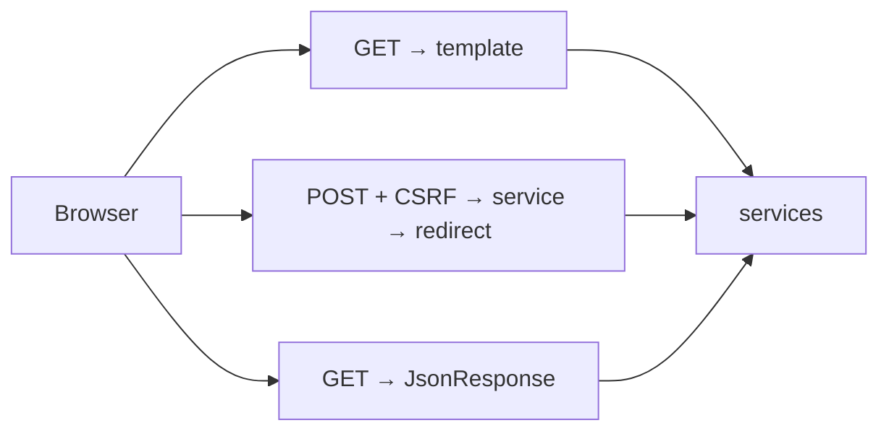
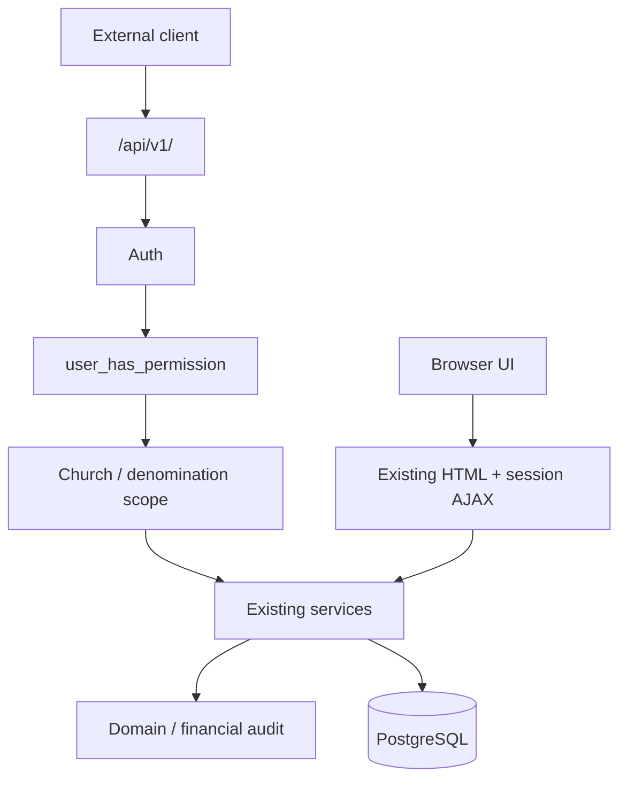

# ChurchHub — API Conventions

**Audience:** Engineers, AI agents, integrators  
**Source of truth:** Live Django URLs and views  
**Companions:** `API_REFERENCE.md`, `docs/SECURITY/AUTHENTICATION.md`, `AUTHORIZATION.md`, `AUDIT_COMPLIANCE.md`, root `API_STANDARDS.md`, `AGENTS.md` §5

| Label | Meaning |
|-------|---------|
| **Current** | How HTTP is actually used today |
| **Planned (AGENTS.md)** | Future versioned REST |
| **Recommended** | How to evolve without breaking the monolith |

---

## 1. Current API status

ChurchHub is a **server-rendered Django application**.

| Claim | Reality |
|-------|---------|
| Django REST Framework | **Not installed** (`INSTALLED_APPS` / requirements) |
| Public `/api/v1/` | **Does not exist** |
| JWT / OAuth / API token auth | **Not implemented** |
| OpenAPI / Swagger runtime | **Not present** |
| Primary UI contract | HTML templates + form POST + redirect (PRG) |
| JSON usage | Small set of **session-authenticated internal helpers** + public `/health/` |

Root `API_STANDARDS.md` and `AGENTS.md` describe a **future** public API. **Do not invent endpoints** to match those docs.



---

## 2. Existing AJAX / JSON endpoints (Current)

Complete inventory of views that return `JsonResponse` (verified in code):

| Method | Path | Purpose |
|--------|------|---------|
| GET | `/health/` | Ops health probe |
| GET | `/dashboard/teller-console/` | Teller / cash position widget |
| GET | `/dashboard/notifications/count/` | Unread notification badge |
| GET | `/dashboard/notifications/pending/` | Pending announcement approvals badge |
| GET | `/members/api/search/` | Member picker search |
| GET | `/ledger/api/categories/` | Ledger category list by type |
| GET | `/ledger/api/categories/<uuid>/` | Single ledger category |

**Related but not AJAX:** `GET /members/<uuid>/export/` returns a JSON **file download** (`Content-Disposition: attachment`) with member subject-access payload + `MemberAuditLog` EXPORT.

All other app routes under `/members/`, `/transactions/`, `/platform/`, etc. are **HTML** (or file exports), not REST APIs.

Full request/response detail: `API_REFERENCE.md`.

---

## 3. Request and response patterns (Current)



| Pattern | When used |
|---------|-----------|
| GET → render template | Lists, detail, dashboards |
| POST → form → service → redirect | Mutations (PRG) |
| GET → `JsonResponse` | UI widgets / pickers / health |
| File download | CSV / Excel / PDF / JSON export |

### Response shape note

There is **no** universal JSON envelope today. Each helper defines its own keys (`results`, `categories`, `count`, `error`, health `status`/`checks`). Decimals in the teller API are serialized as **strings**. UUIDs as strings.

---

## 4. Authentication expectations (Current)

| Concern | Expectation |
|---------|-------------|
| Browser / AJAX helpers | Django **session cookie** after `/accounts/login/` (or portal login) |
| `@login_required` | Required on all JSON helpers except `/health/` |
| Token / JWT | Not used |
| Platform JSON | None — `/platform/` is HTML only |
| Public | `/health/` only among JSON endpoints |

See `docs/SECURITY/AUTHENTICATION.md`.

### Planned (AGENTS.md)

Token/JWT (or equivalent) for mobile/integrations; session remains for first-party UI.

### Recommended

Keep session auth for internal AJAX. Introduce token auth **only** on a future `/api/v1/` package — never on ad hoc helpers without design review.

---

## 5. Permission checks (Current)

| Endpoint family | Gate |
|-----------------|------|
| Health | None (public) |
| Teller console | `can_manage_finances` **or** `can_view_transactions` → else JSON 403 |
| Notification count | Login only (user’s own unread) |
| Pending announcements | Login; count is 0 unless `can_approve_announcements` |
| Member search | Any of several member/finance/ledger/welfare-related `can_*` codes |
| Ledger category APIs | `@ledger_finance_required` = login + feature `ledger` + any of `view_ledger` / `manage_ledger_entries` / `manage_finances` |
| Member JSON export | `require_export_members` |

Template `` tags never authorize these endpoints. Server checks are mandatory.

See `docs/SECURITY/AUTHORIZATION.md`.

---

## 6. Church / denomination scoping (Current)

| Rule | Implementation |
|------|----------------|
| Active church | `get_active_church` / `require_church` / `filter_by_church` |
| Member search | `filter_by_church(Member…)` — no cross-church results |
| Ledger APIs | `require_church`; category filtered by `church=` |
| Teller | Uses active church; empty church → soft error payload |
| Denomination wall | Middleware blocks wrong-denomination institution sessions |

**Never** trust client-supplied church IDs for isolation. Server scope wins.

See `docs/ARCHITECTURE/MULTI_TENANCY.md`.

---

## 7. Error handling conventions (Current)

| Situation | Behavior |
|-----------|----------|
| Permission denied (HTML) | `PermissionDenied` → `handler403` → HTML `403.html` |
| Teller forbidden | `{"error":"forbidden"}` **403** |
| Teller no church | `{"error":"no_church","tellers":[],"totals":{}}` (200) |
| Member search unauthorized | `PermissionDenied` (HTML 403 handler) |
| Ledger unknown type | `{"categories":[]}` |
| Not found | `Http404` / `get_object_or_404` |
| Health degraded | JSON **503** with `status: "degraded"` and check details |

No shared `error_code` / `details` envelope across helpers.

### Planned / Recommended

`/api/v1/` should adopt one success/error envelope (see §12). Do not silently retrofit today’s helpers without a compatibility plan.

---

## 8. CSRF requirements (Current)

- All browser **POST** forms require CSRF (`CsrfViewMiddleware`).  
- Existing JSON helpers are **GET-only** — CSRF token not required for those GETs.  
- Clients use `Accept: application/json` / `X-Requested-With: XMLHttpRequest` (`member-picker.js`, `ledger-entry.js`).  
- Any future session-authenticated JSON **POST** must send `X-CSRFToken` (or form body `csrfmiddlewaretoken`).

Never disable CSRF globally.

---

## 9. Validation patterns (Current)

| Layer | Mechanism |
|-------|-----------|
| Forms | Django `Form` / `ModelForm` for HTML mutations |
| Models | `clean()` / DB constraints |
| Services | Domain exceptions (finance balance, period, working day) |
| JSON helpers | Query params (`q`, `id`, `type`); church from session/scope |

Client-side JS is convenience only.

---

## 10. Financial data protection rules (Current)

| Rule | Detail |
|------|--------|
| No public finance JSON | Teller and ledger APIs require session + finance/ledger permissions |
| Church isolation | Cash position / teller summary only for active church |
| Amount serialization | Teller money fields as decimal **strings** (avoid float) |
| No journal POST via AJAX | Financial mutations go through HTML forms → services (balance, period, working day, idempotency) |
| Giving / payroll PII | Not exposed via these JSON helpers |
| Future API | Must reuse `transactions` / `ledger` / `payroll` services; never bypass approval/void rules; prefer idempotency keys on money writes; audit via `FinancialAuditLog` / domain logs |

See `docs/MODULE_SPECIFICATIONS/FINANCE/finance_spec.md`, `TRANSACTIONS/transactions_spec.md`, `docs/SECURITY/AUDIT_COMPLIANCE.md`.

---

## 11. Current limitations

- No versioned public REST surface  
- Ad hoc JSON shapes  
- Uneven error styles (JSON `{error}` vs HTML 403)  
- Password-reset / portal login not covered by login rate-limit middleware (login POST only)  
- Internal AJAX paths may change when UI changes — **not** a stable integration contract  
- Chart series on dashboard are embedded in HTML context, not HTTP JSON APIs  
- `/platform/health/` is **HTML**, not the public JSON health endpoint  

---

## 12. Planned architecture (AGENTS.md)

AGENTS §5 and root `API_STANDARDS.md` call for:

```text
Client → /api/v1/ → Authentication → Permission → Validation
      → Service Layer → Database
```

- Versioned REST (`/api/v1/`, later `/api/v2/`)  
- Consistent success/error envelopes  
- Pagination, filtering, ordering  
- OpenAPI / Swagger documentation  
- Auth for every non-public endpoint  
- Permission + tenant isolation on every query  

**None of this is implemented today.**

### Illustrative planned envelope (not live)

```json
{
  "success": true,
  "message": "optional",
  "data": {},
  "pagination": {},
  "metadata": {}
}
```

```json
{
  "error_code": "…",
  "message": "…",
  "details": {}
}
```

---

## 13. Recommended future `/api/v1/` approach

1. Keep HTML + current session helpers as the first-party UI contract.  
2. Add a dedicated API package (DRF or equivalent) mounted at `/api/v1/` when a real client exists.  
3. **Reuse existing services** — never reimplement finance/member rules in serializers.  
4. Enforce for every route:  
   - Authentication (token or approved scheme)  
   - RBAC via `user_has_permission`  
   - Church / denomination isolation  
   - Audit logging for sensitive reads/exports and all money writes  
5. Financial POSTs: period/working-day/balance + idempotency keys.  
6. Rate-limit search, login-adjacent, and export endpoints.  
7. Publish OpenAPI; treat undocumented fields as unstable.  
8. Version breaking changes under `/api/v2/` — do not silently break v1.  
9. Do **not** rebrand today’s `/members/api/search/` or `/ledger/api/categories/` as public REST without versioning and contracts.



---

## 14. Agent rules

1. Never invent `/api/v1/…` endpoints in code or docs as if they exist.  
2. Prefer extending services + HTML views for product features.  
3. New JSON helpers must be session-authenticated, permissioned, and church-scoped.  
4. Keep JSON shapes UI-specific unless designing a real public API.  
5. When `/api/v1/` ships, update **Current** sections in both API docs.  
6. AJAX endpoints are **internal application endpoints**, not a public integration surface.

---

## 15. Related documents

- Endpoint inventory: `API_REFERENCE.md`  
- AuthZ: `docs/SECURITY/AUTHENTICATION.md`, `AUTHORIZATION.md`, `AUDIT_COMPLIANCE.md`  
- Architecture: `docs/ARCHITECTURE/SYSTEM_ARCHITECTURE.md`, `MULTI_TENANCY.md`  
- Aspiration (not live): root `API_STANDARDS.md`  
- Module mounts: `docs/MODULE_SPECIFICATIONS/*`  
