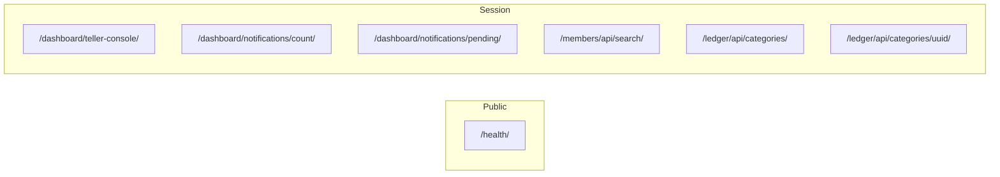

# ChurchHub — API / HTTP Reference

**Audience:** Engineers, AI agents  
**Source of truth:** `church_system/urls.py`, app `urls.py`, and views returning `JsonResponse`  
**Companions:** `API_CONVENTIONS.md`, `docs/SECURITY/*`, `docs/MODULE_SPECIFICATIONS/*`

| Label | Meaning |
|-------|---------|
| **Current** | Live routes confirmed in code |
| **Planned** | Future `/api/v1/` (not implemented) |
| **Recommended** | Evolution notes |

---

## 0. Status banner

```text
NO Django REST Framework
NO /api/v1/ public API
YES session HTML app + a few internal JsonResponse helpers
YES public GET /health/ for ops probes
```

AJAX endpoints below are **internal application endpoints** for first-party UI (`fetch` from templates/JS). They are **not** a stable public integration API.

Anything under **§ Planned** is future-only — do not call or invent implementations to match.

---

## 1. Root mounts (context)

| Prefix | Purpose |
|--------|---------|
| `/health/` | Public health **JSON** |
| `/apply/`, `/apply/success/` | Public tenant application (HTML) |
| `/accounts/login/` | Login (HTML) |
| `/admin/` | Django admin (HTML) |
| `/dashboard/` … `/platform/` | Institution / platform HTML apps |
| `/` | Redirect → `login` |

`handler403` → HTML permission denied page (also used when AJAX raises `PermissionDenied`).

Full HTML route catalogs live in module specs; this file focuses on **JSON / AJAX**.

---

## 2. JSON / AJAX endpoints (Current)



---

### 2.1 `GET /health/`

| Item | Detail |
|------|--------|
| **Purpose** | Load-balancer / monitoring probe |
| **URL name** | `health_check` |
| **View** | `church_system.views.health_check` |
| **Service** | `church_system.health.run_health_checks` |
| **Method** | GET |
| **Auth** | **Public** (no login) |
| **Permissions** | None |
| **Tenant context** | None |
| **Parameters** | None |
| **Related models** | None (DB/cache/migrations probes) |

**Success response** — HTTP **200**:

```json
{
  "status": "ok",
  "service": "churchhub",
  "checks": {
    "database": "ok",
    "cache": "ok",
    "migrations": "ok"
  }
}
```

**Degraded** — HTTP **503**:

```json
{
  "status": "degraded",
  "service": "churchhub",
  "checks": {
    "database": "error",
    "database_detail": "…",
    "cache": "ok",
    "migrations": "ok"
  }
}
```

**Security:** Do not put secrets in check details. Suitable for external probes.

---

### 2.2 `GET /dashboard/teller-console/`

| Item | Detail |
|------|--------|
| **Purpose** | Live teller daily summary + cash position for dashboard widget |
| **URL name** | `dashboard:teller_console_api` |
| **View** | `dashboard.views.teller_console_api` |
| **Services** | `transactions.treasury.get_teller_daily_summary`, `get_cash_position` |
| **Method** | GET |
| **Auth** | Session (`@login_required`) |
| **Permissions** | `can_manage_finances` **or** `can_view_transactions`; else `{"error":"forbidden"}` **403** |
| **Tenant context** | Active church via `get_active_church`; if none → soft empty payload |
| **Parameters** | None |
| **Related models** | `Transaction` / lines / `Account` (via treasury); `WorkingDay` |

**No church** — HTTP **200**:

```json
{"error": "no_church", "tellers": [], "totals": {}}
```

**Success** — HTTP **200** (money fields are **strings**):

```json
{
  "business_date": "2026-07-19",
  "working_day_open": true,
  "tellers": [
    {
      "receipts": "100.00",
      "expenses": "0.00",
      "transfers": "0.00"
    }
  ],
  "totals": {
    "entries": 1,
    "receipts": "100.00",
    "expenses": "0.00",
    "pending": 0
  },
  "cash_position": {
    "cash": "0.00",
    "bank": "0.00",
    "petty_cash": "0.00",
    "total_liquid": "0.00"
  }
}
```

(Teller row keys also include identity fields from the summary service besides the three money keys.)

**Security:** Finance permission required. Church-scoped. Do not expose as public API. Financial protection: read-only aggregation; no posting.

---

### 2.3 `GET /dashboard/notifications/count/`

| Item | Detail |
|------|--------|
| **Purpose** | Unread in-app notification badge |
| **URL name** | `dashboard:notification_count` |
| **View** | `dashboard.views.notification_count` |
| **Method** | GET |
| **Auth** | Session |
| **Permissions** | Login only |
| **Tenant context** | User’s own `Notification` rows |
| **Parameters** | None |
| **Related models** | `dashboard.Notification` |

**Response** — HTTP **200**:

```json
{"count": 3}
```

**Security:** Only counts `user=request.user`. No cross-user leakage.

---

### 2.4 `GET /dashboard/notifications/pending/`

| Item | Detail |
|------|--------|
| **Purpose** | Count of announcements pending approval for the current user |
| **URL name** | `dashboard:pending_announcements_count` |
| **View** | `dashboard.views.pending_announcements_ajax` |
| **Service** | `announcements.services.pending_for_user` |
| **Method** | GET |
| **Auth** | Session |
| **Permissions** | If not `can_approve_announcements` → `count` is **0** (no 403) |
| **Tenant context** | Via announcement visibility / pending helpers |
| **Parameters** | None |
| **Related models** | `announcements.Announcement` |

**Response** — HTTP **200**:

```json
{"count": 2}
```

**Security:** Does not disclose pending content — count only. Note: view imports `can_approve_announcements` from `accounts.permissions` (legacy path) while registry checks live under `permissions.checks`.

---

### 2.5 `GET /members/api/search/`

| Item | Detail |
|------|--------|
| **Purpose** | Member picker for members/finance forms |
| **URL name** | `members:search` |
| **View** | `members.views.member_search` |
| **Client** | `static/js/member-picker.js` |
| **Method** | GET |
| **Auth** | Session |
| **Permissions** | Any of: `can_view_members`, `can_manage_members`, `can_manage_finances`, `can_manage_member_records`, `can_manage_leadership`, `can_manage_families`, `can_transfer_members`, `can_manage_spiritual_gifts`, `can_manage_receipts`, `can_manage_ledger_entries`, `can_manage_welfare_cases` — else `PermissionDenied` |
| **Tenant context** | `filter_by_church` on active/manageable church; `is_active=True` only |
| **Related models** | `members.Member` (+ department/family/occupation) |

**Parameters**

| Query | Required | Behavior |
|-------|----------|----------|
| `q` | Yes* | Search string; empty → `{"results":[]}` |
| `id` | No | If set, filter to that PK (within church scope) instead of text search |

\*Unless `id` is provided.

**Response** — HTTP **200** (max **20** results):

```json
{
  "results": [
    {
      "id": "uuid",
      "name": "Jane Doe",
      "subtitle": "phone · Department",
      "photo_url": "/media/…",
      "initials": "JD"
    }
  ]
}
```

**Security:** PII-lite (name, phone in subtitle, photo). Must stay permissioned and church-scoped. Not a public directory API. Prefer limiting fields if exposing further.

---

### 2.6 `GET /ledger/api/categories/`

| Item | Detail |
|------|--------|
| **Purpose** | List active ledger categories for entry form by transaction type |
| **URL name** | `ledger:api_categories` |
| **View** | `ledger.views.api_categories` |
| **Service** | `ledger.services.get_categories_for_type`, `category_to_dict` |
| **Client** | `static/js/ledger-entry.js` |
| **Method** | GET (`@require_GET`) |
| **Auth** | Session |
| **Permissions / feature** | `@ledger_finance_required`: login + `require_feature("ledger")` + any of `view_ledger` / `manage_ledger_entries` / `manage_finances` |
| **Tenant context** | `require_church` |
| **Related models** | `ledger.LedgerCategory`, `transactions.Account` |

**Parameters**

| Query | Default | Values |
|-------|---------|--------|
| `type` | `RECEIPT` | `RECEIPT`, `EXPENSE`, `TRANSFER` (invalid → empty list) |

**Response** — HTTP **200**:

```json
{
  "categories": [
    {
      "id": "uuid",
      "code": "TITHE",
      "name": "…",
      "transaction_type": "RECEIPT",
      "debit_account_id": "uuid",
      "debit_account_name": "…",
      "credit_account_id": "uuid",
      "credit_account_name": "…",
      "default_narration": "…",
      "requires_member": true,
      "remit_to_district": true,
      "offering_type": "TITHE"
    }
  ]
}
```

**Security:** Feature + finance/ledger permission. Church-scoped. Read-only; posting remains HTML confirm → `post_ledger_entry`.

---

### 2.7 `GET /ledger/api/categories/<uuid:pk>/`

| Item | Detail |
|------|--------|
| **Purpose** | Single category detail for entry form |
| **URL name** | `ledger:api_category_detail` |
| **View** | `ledger.views.api_category_detail` |
| **Method** | GET |
| **Auth / permissions / feature** | Same as §2.6 |
| **Tenant context** | Category must match `church` and `is_active=True` |
| **Parameters** | Path `pk` (UUID) |
| **Response** | Single object (same fields as one element of `categories` above) |
| **Not found** | HTTP 404 |

**Security:** Cannot fetch another church’s category by UUID guessing — queryset filters `church=`.

---

### 2.8 Related: `GET /members/<uuid:member_id>/export/` (JSON download)

| Item | Detail |
|------|--------|
| **Purpose** | Subject-access style member JSON export |
| **URL name** | `members:member_export` |
| **View** | `members.views.member_export` |
| **Service** | `members.export.export_member_json` |
| **Method** | GET |
| **Auth** | Session |
| **Permissions** | `require_export_members` |
| **Tenant context** | `filter_by_church` |
| **Response** | `Content-Type: application/json` + `Content-Disposition: attachment; filename="member-<uuid>.json"` |
| **Audit** | `MemberAuditLog` action `EXPORT` |

Not used by the member-picker AJAX client; included because it returns JSON.

---

## 3. Quick lookup — JSON only

| Method | Path | Auth | Notes |
|--------|------|------|-------|
| GET | `/health/` | Public | Ops |
| GET | `/dashboard/teller-console/` | Session + finance | Money strings |
| GET | `/dashboard/notifications/count/` | Session | Own unread |
| GET | `/dashboard/notifications/pending/` | Session | Count or 0 |
| GET | `/members/api/search/` | Session + member-related | Max 20 |
| GET | `/ledger/api/categories/` | Session + ledger feature/perms | `?type=` |
| GET | `/ledger/api/categories/<uuid>/` | Session + ledger feature/perms | Detail |

Optional download: `GET /members/<uuid>/export/`.

---

## 4. What is explicitly not an API

| Path / pattern | Reality |
|----------------|---------|
| `/api/v1/**` | **Does not exist** |
| `/platform/health/` | HTML platform page |
| Dashboard chart series | JSON strings in **template context**, not HTTP endpoints |
| Form POST endpoints | HTML PRG mutations, not REST resources |
| DRF viewsets / serializers | None |

---

## 5. Common security considerations (all AJAX helpers)

1. Session authentication required (except `/health/`).  
2. CSRF not applicable to current GET helpers; required for any future POST.  
3. Church / denomination isolation on church-owned data.  
4. Permission (and often feature) checks on the server.  
5. Financial JSON is read-only aggregation — posting stays in services behind HTML.  
6. Do not build external products on these URLs without treating them as unstable.  
7. Future public API must add auth, tenancy, RBAC, and audit — see conventions.

---

## 6. Planned public APIs (Future — not implemented)

> **Do not call these.** Reserved for a future DRF (or equivalent) layer per `AGENTS.md` / `API_STANDARDS.md`.

Illustrative only:

```text
/api/v1/auth/…
/api/v1/members/…
/api/v1/transactions/…
/api/v1/organizations/…
/api/v1/reports/…
```

When implemented, each route must:

1. Authenticate (token/JWT or approved scheme)  
2. Authorize via `user_has_permission`  
3. Enforce church / denomination scope  
4. Delegate to existing `services.py`  
5. Audit sensitive reads/exports and all financial writes  
6. Use versioned envelopes + OpenAPI  

---

## 7. Recommended evolution

1. Keep session JSON helpers under app prefixes; label them internal.  
2. Introduce `/api/v1/` as a separate package when a real client exists.  
3. Add contract tests for `/health/` and any helper marked ops-stable.  
4. Align error shapes gradually if UI can tolerate it.  
5. Update this file’s **Current** section whenever a new `JsonResponse` view ships.

---

## 8. Related documents

- Conventions & `/api/v1/` guidance: `API_CONVENTIONS.md`  
- Security: `docs/SECURITY/AUTHENTICATION.md`, `AUTHORIZATION.md`, `AUDIT_COMPLIANCE.md`  
- Finance rules: `docs/MODULE_SPECIFICATIONS/FINANCE/finance_spec.md`, `TRANSACTIONS/`, `LEDGER/`  
- Members search/export: `docs/MODULE_SPECIFICATIONS/MEMBERS/members_spec.md`  
- Aspiration (not live): root `API_STANDARDS.md`  
