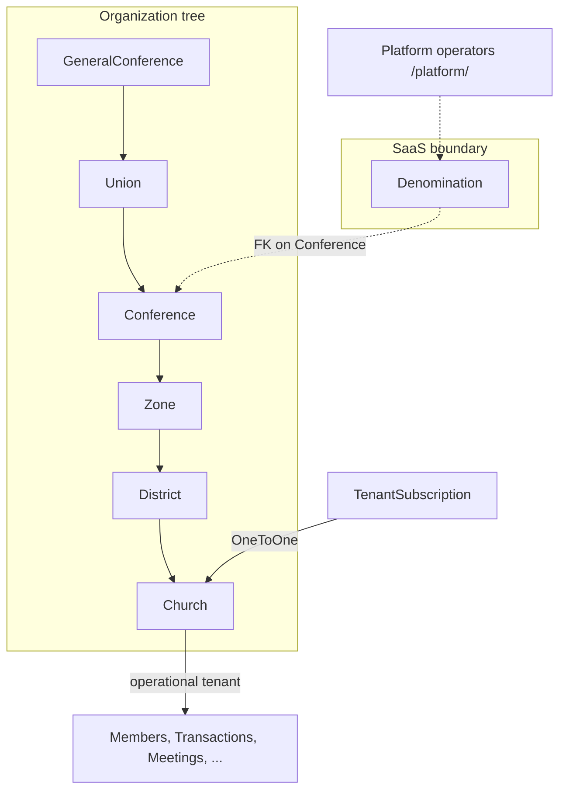
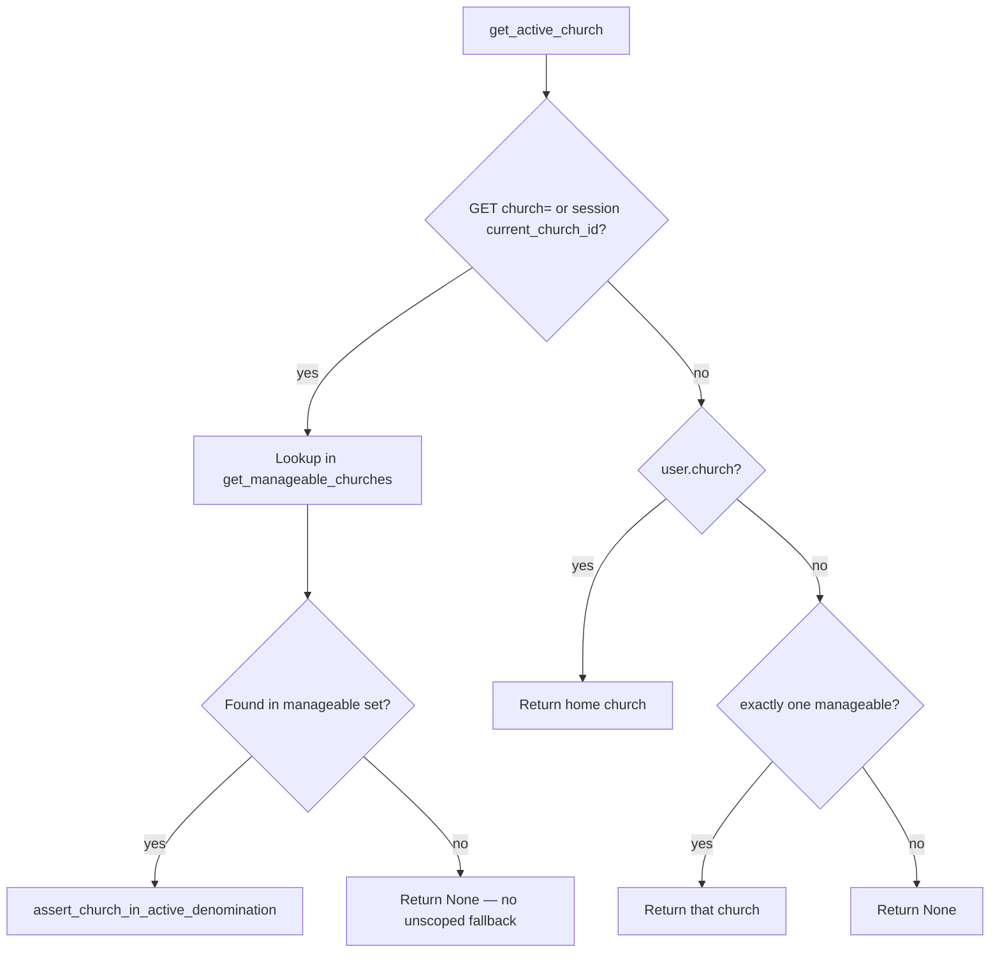
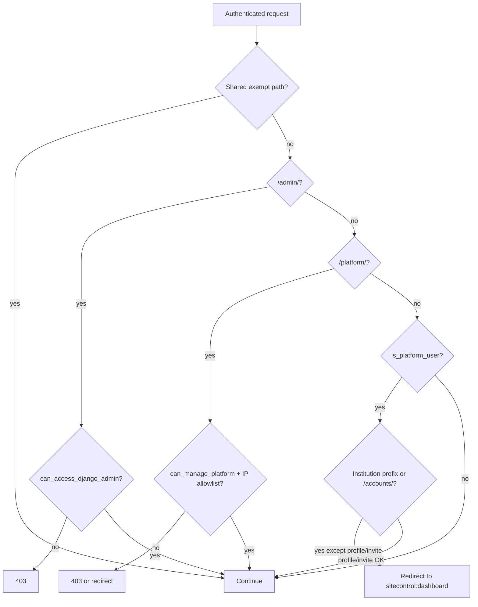
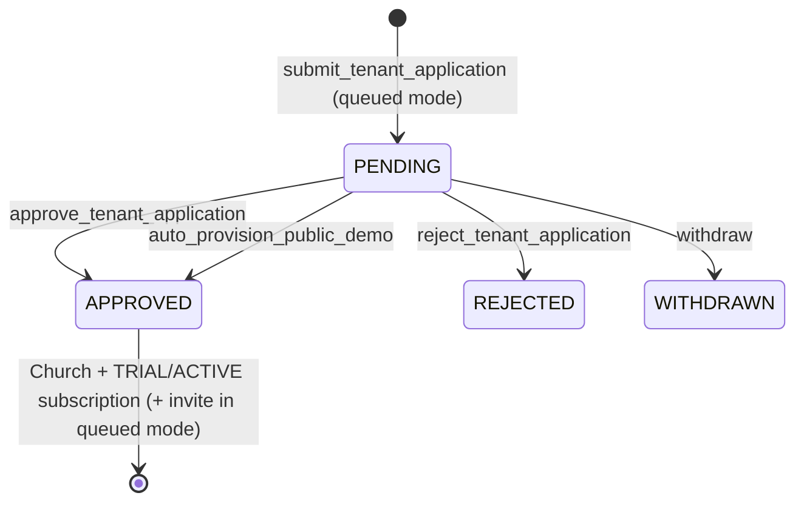

# ChurchHub — Multi-Tenancy Architecture

**Audience:** Architects, AI agents, security reviewers  
**Source of truth:** Live Django scoping helpers, middleware, and models  
**Companions:** `SYSTEM_ARCHITECTURE.md`, `SECURITY_ARCHITECTURE.md`, `docs/AI_CONTEXT/SYSTEM_OVERVIEW.md`, `DATABASE_MAP.md`, `AGENTS.md`

| Label | Meaning |
|-------|---------|
| **Current** | Implemented today |
| **Planned (AGENTS.md)** | Documented enterprise isolation standards |
| **Recommended** | Hardening and clarity improvements |

---

## 1. Tenancy model overview (Current)

ChurchHub uses **two complementary isolation layers**, plus a **platform operator lane**:



| Layer | Model / concept | Purpose |
|-------|-----------------|---------|
| SaaS tenant wall | `sitecontrol.Denomination` | Isolate church bodies / branding / seeds / feature flags on one deployment |
| Operational tenant | `organization.Church` | Most business rows FK to Church |
| Org authorization scope | User `scope_level` + scope FKs | Hierarchy admins see a subtree of churches |
| Platform lane | `User.is_platform_user` | Operators manage SaaS, not institution dashboards |

**There is no generic `Organization` model and no `Division` model.**  
`AGENTS.md` sometimes says “Division”; in code the SaaS top concept is **Denomination**, and the org-tree top is **GeneralConference**.

---

## 2. Hierarchy (Current)

```
GeneralConference
  → Union
    → Conference  (+ optional denomination FK)
      → Zone
        → District
          → Church   ← operational tenant
```

- `Conference.union` may be null.  
- `Church.denomination` is a **property** via `conference.denomination`.  
- Church flags: `is_active`, `financials_provisioned`.  
- Cross-denomination church moves are blocked in `Church.clean` (use transfer workflow).

### Planned vocabulary (AGENTS.md)

Division → Union → Conference → Zone → District → Local Church.

### Recommended

Keep code names; document the mapping (as here). Do not rename models without approval.

---

## 3. How tenant context is resolved (Current)

### 3.1 Denomination context

**Middleware:** `sitecontrol.denomination_middleware.DenominationContextMiddleware`  
**Helpers:** `church_system/denomination_scope.py`

- Sets `request.denomination = get_active_denomination(request)`  
- Persists `active_denomination_id` in session for institution users  
- In `process_view`, rejects institution users whose denomination ≠ active denomination (`PermissionDenied`)

Key helpers: `get_user_denomination`, `get_active_denomination`, `filter_by_denomination`, `assert_same_denomination`, `assert_church_in_active_denomination`, `churches_for_denomination`.

### 3.2 Church context

**Helpers:** `church_system/church_scope.py`



| Function | Behavior |
|----------|----------|
| `get_active_church` | Resolve context church within manageable set |
| `filter_by_church` | Filter queryset to active church, or manageable set if user can view all churches |
| `require_church` | Raise `PermissionDenied` if no context |
| `get_available_churches` | Toolbar switch list (denomination-filtered) |

**Critical rule:** Invalid `?church=` IDs must **not** fall through to unscoped lookups (enforced in current `get_active_church`).

### 3.3 Org subtree scope

**Helpers:** `permissions/org_scope.py`, `permissions/scoping.py`

- `OrgScopeLevel`: `CHURCH`, `DISTRICT`, `ZONE`, `CONFERENCE`, `UNION`, `GENERAL_CONFERENCE`, `DENOMINATION`  
- `church_q_for_scope(user)` — Q object for churches in scope  
- `get_manageable_churches(user)` — queryset of churches the user may administer  
- `user_may_manage_target` — user-to-user management checks  

User model fields: `scope_level`, `scope_district`, `scope_zone`, `scope_conference`, `scope_union`, `scope_general_conference`, plus home `church` and optional `denomination`.

---

## 4. Platform vs institution lanes (Current)

**Middleware:** `sitecontrol.middleware.UserScopeMiddleware`



Institution prefixes include `/dashboard/`, `/members/`, `/organization/`, `/transactions/`, `/permissions/`, `/announcements/`, `/reports/`, `/meetings/`, `/budgets/`, `/giving/`, `/ledger/`, `/remittance/`, `/payroll/`, `/assets/`.

Platform IP allowlisting uses `SiteSettings` via `ip_allowed_for_platform`.

---

## 5. Role enforcement for church assignment (Current)

**Middleware:** `permissions.middleware.RoleEnforcementMiddleware`

- Institution users with `requires_church` and no `church_id` (and not platform, and not `can_view_all_churches`) are redirected to profile to get a church assigned.  
- Exempt prefixes include `/accounts/login`, `/admin/`, `/platform/`, `/apply/`, `/permissions/`, `/health/`, static/media, etc.

---

## 6. Data ownership rules (Current)

| Record type | Tenant ownership |
|-------------|------------------|
| Member, Department, Family, … | `church` FK |
| Account, Transaction, Budget, WorkingDay, … | `church` FK |
| Announcement, Meeting, FixedAsset, … | `church` FK |
| RemittancePolicy / SettlementBatch | Polymorphic `unit_type` + `unit_id` (app-enforced) |
| Employee | `host_church` + polymorphic paying unit |
| TenantSubscription | OneToOne Church |
| Denomination / SiteSettings / Plans | Platform scope |

**Never** trust client-side filtering alone. Always apply server-side `filter_by_church` / manageable queryset / denomination asserts.

---

## 7. SaaS tenant lifecycle (Current)



- Application types: `EXISTING_DISTRICT`, `NEW_HIERARCHY`
- **Current public demo:** when `SiteSettings.allow_church_self_registration` and `auto_provision_public_trials` are on, `/apply/` creates the church, first local-pastor user, and a `TRIAL` subscription in one transaction under the **DEMO** denomination (read-only; posted denomination is ignored). `expires_at` is frozen as `started_at + public_demo_trial_days` (hard cap **30**). No operator approval. No invitation.
- Queued mode (`auto_provision_public_trials=False`): approval still provisions church + subscription + invitation.
- Subscription statuses: `TRIAL`, `ACTIVE`, `SUSPENDED`, `EXPIRED`
- `TenantSubscription.is_operational` is false if suspended/expired, if `TRIAL` has no `expires_at`, or if `expires_at` is today or earlier. Middleware `SubscriptionAccessMiddleware` enforces this on every authenticated institution request.
- After cutoff, church users use `/accounts/subscription-expired/` then `/accounts/subscription-subscribe/` to store church details and a **payment reference** (no email). That creates `SubscriptionActivationRequest` (`PENDING`) and immediately creates in-app `Notification` rows for every active `is_platform_user`. Operators see a Control Room alert, a top-bar count, and `/platform/activation-requests/`. Paid access is still turned on with **Record payment** on the tenant subscription (which marks matching requests `ACTIVATED`).
- One public demo per email, username, or normalized phone (`TenantApplication` APPROVED identity lock).

Public entry: `/apply/`. Operator tools: `/platform/`.

---

## 8. Cross-tenant protections (Current)

| Control | Mechanism |
|---------|-----------|
| Denomination wall | Middleware + `denomination_scope` asserts |
| Church manageability | `get_manageable_churches` / `church_q_for_scope` |
| Session church switch | Constrained to manageable churches |
| Member transfer | Blocks cross-denomination when both denoms set |
| Church district move | `Church.clean` blocks denomination change |
| Platform isolation | UserScopeMiddleware + IP allowlist |
| Reports / exports | Must use scoped querysets (enforced in services/views — verify when changing) |

Isolation tests exist under `church_system/` (e.g. tenant isolation / church scope tests).

---

## 9. Polymorphic units (Current gap / risk)

Remittance and payroll use `unit_type` + `unit_id` (UUID) **without DB foreign keys**.

| Implication | Detail |
|-------------|--------|
| Flexibility | Policies/settlements across hierarchy levels |
| Risk | No referential integrity at DB level; validation must stay in services |
| Recommended | Keep service validators strict; consider constrained content-type or concrete FKs long-term |

---

## 10. Planned (AGENTS.md) vs Current

| AGENTS.md expectation | Current |
|-----------------------|---------|
| Every business record belongs to an organization | Mostly Church FK; some polymorphic units |
| Hierarchy filtering in all queries/APIs/reports | Strong patterns; must be applied consistently per view |
| Soft-delete preserves history | Not implemented as soft-delete columns |
| Division at top | Denomination (SaaS) + GeneralConference (org) |
| Cross-tenant reports forbidden | Enforced when scoped helpers used correctly |

---

## 11. Recommended future architecture

1. **Documentation sync** — keep this file + AI_CONTEXT as the agent source of truth for tenancy vocabulary.  
2. **Fetch-time scoping** — prefer `get_object_or_404` on already-scoped querysets; avoid load-by-PK-then-check.  
3. **Admin queryset audit** — every ModelAdmin should filter by denomination/church/manageable set.  
4. **Remittance unification** — one settlement lifecycle to reduce dual-path confusion.  
5. **Optional concrete FKs** for high-volume polymorphic references where performance/integrity demand it.  
6. **API tenancy middleware** — when `/api/v1/` arrives, reuse the same church/denomination resolution (do not invent a parallel scheme).

---

## 12. Agent checklist

When adding any church-owned feature:

- [ ] Queryset filtered by `filter_by_church` or `get_manageable_churches` / `church_q_for_scope`  
- [ ] Mutations call `require_church` or equivalent  
- [ ] Cross-church operations call `assert_same_denomination` / transfer services  
- [ ] Platform-only features live under `/platform/` with platform checks  
- [ ] Tests cover deny cases for out-of-scope church IDs  

---

## 13. Related documents

- `SYSTEM_ARCHITECTURE.md` — request pipeline  
- `SECURITY_ARCHITECTURE.md` — RBAC and lanes  
- `WORKFLOW_ARCHITECTURE.md` — transfer / provisioning flows  
- `docs/AI_CONTEXT/BUSINESS_LOGIC.md` — business rules  
- `docs/AI_CONTEXT/CODING_GUIDE.md` — import cheat sheet  
