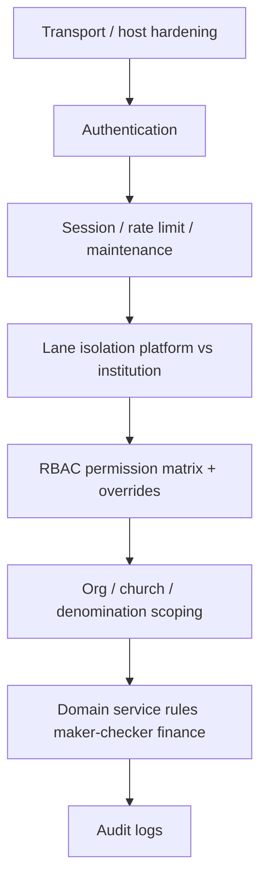
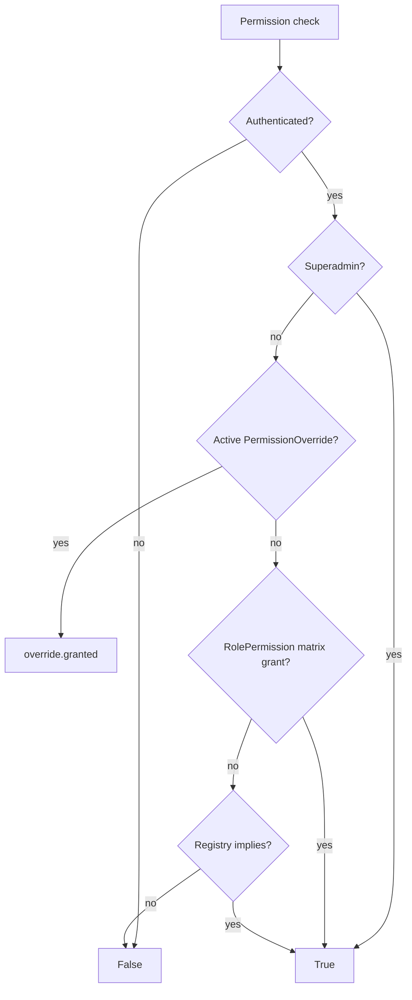

# ChurchHub — Security Architecture

**Audience:** Security reviewers, architects, AI agents  
**Source of truth:** Live Django settings, middleware, permissions, and domain services  
**Companions:** `MULTI_TENANCY.md`, `SYSTEM_ARCHITECTURE.md`, root `SECURITY.md`, `SECURITY_ARCHITECTURE.md` (root), `AGENTS.md` §4, `docs/AI_CONTEXT/BUSINESS_LOGIC.md`

| Label | Meaning |
|-------|---------|
| **Current** | Controls implemented in code |
| **Planned (AGENTS.md)** | Enterprise security constitution |
| **Recommended** | Prioritized hardening |

---

## 1. Security philosophy

ChurchHub handles member PII, giving, payroll, and organizational data. Security is enforced **on the server**. UI permission flags are convenience only.

Defense layers (Current):

---

## 2. Authentication (Current)

| Control | Implementation |
|---------|----------------|
| User model | `accounts.User` (`AUTH_USER_MODEL`) |
| Password hashing | Django password framework |
| Password validators | Django defaults + `accounts.validators` (platform min length / uppercase) |
| Login | `/accounts/login/` — `ChurchHubLoginView` |
| Login rate limit | `LoginRateLimitMiddleware` (IP + username; SiteSettings thresholds) |
| Invitations | `UserInvitation` + `accounts.services` |
| MFA | `User.mfa_enabled` **stub only** — enforcement not implemented |

### Planned (AGENTS.md)

Username/email login, MFA (TOTP/email OTP/recovery codes), password history/expiration, account lockout, device tracking, OAuth readiness.

### Recommended

1. Implement TOTP MFA for platform operators, SUPER_ADMIN, and high-privilege finance roles.  
2. Keep rate limiting; add clearer permanent lock / admin unlock if not already complete in SiteSettings flows.  
3. Do not claim MFA is live until enforcement exists.

---

## 3. Session security (Current)

| Control | Implementation |
|---------|----------------|
| Session age default | `SESSION_COOKIE_AGE` = 4 hours in settings |
| Platform-configurable idle | `PlatformSessionMiddleware` sets expiry from `SiteSettings.session_timeout_minutes` |
| Production cookies | When `DEBUG=False`: `SESSION_COOKIE_SECURE`, `CSRF_COOKIE_SECURE`, HSTS, SSL redirect |
| CSRF | `CsrfViewMiddleware` globally enabled |
| Clickjacking | `X_FRAME_OPTIONS = DENY` |
| Content type | `SECURE_CONTENT_TYPE_NOSNIFF = True` |

### Planned

Absolute timeout, logout-all-devices, device lists, invalidate sessions on password change (verify/extend as needed).

---

## 4. Authorization / RBAC (Current)

**Engine:** `permissions.services.user_has_permission`  
**Decorators / helpers:** `permissions.checks` (`permission_required`, `any_permission_required`, `can_*`)  
**Catalog / defaults:** `permissions.registry`, models `Permission`, `RolePermission`, `PermissionOverride`  
**Audit:** `PermissionAuditLog`  
**Request cache:** `PermissionCacheMiddleware` binds per-request cache  

### Roles (`permissions.roles.UserRole`)

`SUPER_ADMIN`, `GENERAL_OVERSEER`, `UNION_ADMIN`, `CONFERENCE_ADMIN`, `ZONE_DIRECTOR`, `DISTRICT_PASTOR`, `LOCAL_PASTOR`, `SECRETARY`, `TREASURY`, `BOARD_MEMBER`, `MEMBER`

### Org scope levels

`CHURCH`, `DISTRICT`, `ZONE`, `CONFERENCE`, `UNION`, `GENERAL_CONFERENCE`, `DENOMINATION`

### Object-level helpers

`permissions.scoping_checks`: `can_act_on_church`, `can_approve_for_church`, `filter_queryset_for_church_scope`, `exclude_self_submitted`, `pending_for_church_scope`, …

### Platform RBAC

Separate platform capability checks in `sitecontrol` (e.g. `can_manage_platform`, `can_access_django_admin`) — not the same as institution matrix.

### Planned (AGENTS.md)

Broader maker-checker everywhere, delegated authority, field-level PII masking framework, export/audit as first-class permission categories (many already exist as codenames — enforce consistently).

### Recommended

- Prefer scoped queryset fetch over post-fetch authorization.  
- Audit every new view for decorator + church filter.  
- Mask phone/DOB/address in templates/JSON unless permission allows.

---

## 5. Lane isolation and admin break-glass (Current)

Documented in detail in `MULTI_TENANCY.md`. Security-relevant points:

| Lane | Access |
|------|--------|
| Institution | Domain apps under `/dashboard/`, `/members/`, … |
| Platform | `/platform/` — requires `can_manage_platform` + optional IP allowlist |
| Django admin | `/admin/` — restricted to break-glass operators via `can_access_django_admin` |
| Public | `/apply/`, `/health/`, login/password paths |

Platform users hitting institution URLs are redirected to the platform dashboard (except limited account profile/invite paths).

Maintenance mode (`MaintenanceModeMiddleware`) blocks institution users; platform/admin/health/login remain available per rules.

---

## 6. Multi-tenant isolation (Current)

See `MULTI_TENANCY.md`. Security summary:

- Denomination wall in middleware  
- Church context constrained to manageable churches  
- Org subtree Q filters  
- Cross-denomination transfer/church-move guards  

**Gap:** Polymorphic `unit_type`/`unit_id` lacks DB FK integrity — service validation is mandatory.

---

## 7. Financial integrity controls (Current)

Finance is a security domain (fraud / unauthorized mutation):

| Control | Mechanism |
|---------|-----------|
| Balance | Line amounts must sum to 0 |
| Maker-checker | Approval approval statuses; permission-gated approve/reject/void |
| Lock | Approved transactions can lock; lines reject edits when locked |
| Void/reversal | New reversing transaction; original `is_voided` — no silent edit |
| Periods | `FinancialPeriod.is_locked` |
| Working day | Open business date gate |
| Idempotency | `FinancialIdempotencyKey` for retries |
| Audit | `FinancialAuditLog` |

Payroll sensitive fields use encryption helpers (`tin_encrypted`, etc.).

---

## 8. Secrets and configuration (Current)

| Item | Rule in code |
|------|----------------|
| `DJANGO_SECRET_KEY` | Required when `DEBUG=False`; insecure default only allowed in DEBUG |
| `DJANGO_DEBUG` | Defaults True if unset — production must set False |
| DB / Redis / SMTP | Environment / SiteSettings — never commit secrets |
| SMTP password | Platform settings historically risk plaintext storage — prefer encrypted field usage |

### Recommended

- Fail CI/deploy if DEBUG True in production.  
- Encrypt SMTP credentials at rest; rotate keys.  
- Keep `.env` out of VCS.

---

## 9. Input, upload, and injection defenses (Current)

| Threat | Current mitigation |
|--------|--------------------|
| CSRF | Global middleware |
| SQL injection | Prefer ORM; avoid string-built SQL |
| XSS | Template auto-escape; sanitize where HTML allowed |
| Clickjacking | `X_FRAME_OPTIONS=DENY` |
| File uploads | Model `ImageField` / attachments with app validation — no virus-scan integration yet |
| Mass assignment | Forms / explicit service parameters |

### Planned

Virus scan integration, stricter MIME/extension pipelines, field-level encryption for more PII categories.

---

## 10. Logging and audit (Current)

Domain audit tables exist (financial, member, org, permission, platform, asset, remittance, announcement, report access, user activity, payroll run, …).

Logging config: `church_system/logging_config.py`. Optional Sentry via `SENTRY_DSN`.

**Rules:** Never log passwords, tokens, or unnecessary PII.

### Planned

Unified immutable audit schema, security monitoring alerts for privilege escalation / large exports.

---

## 11. Soft delete and data retention (Gap)

| Planned (AGENTS.md) | Current |
|---------------------|---------|
| Soft delete on business records | Not implemented (`is_deleted` absent) |
| Never hard-delete audited data | Relies on status/void/archive patterns where coded |

**Recommended:** Introduce a soft-delete mixin carefully (members, announcements, org units) without breaking finance void semantics.

---

## 12. API security (Gap)

| Planned | Current |
|---------|---------|
| Versioned REST with authz, rate limits, OpenAPI | No DRF `/api/v1/` |
| Token / OAuth readiness | Not a general API surface |

Small session-authenticated JSON helpers (e.g. ledger) must remain permissioned and church-scoped.

**Recommended:** When API ships, reuse services + tenancy middleware; never expose unscoped serializers.

---

## 13. Threat model mapping (Current vs gap)

| Threat | Mitigations present | Residual gap |
|--------|---------------------|--------------|
| Credential stuffing | Login rate limit, password validators | MFA stub |
| Privilege escalation | RBAC + overrides audit + platform lane | Post-fetch check inconsistency risk |
| Cross-tenant leakage | Denomination + church scope + tests | Polymorphic units; admin scoping unevenness |
| Financial fraud | Maker-checker, lock, void, periods | Dual remittance paths need care |
| Session hijack | Secure cookies in prod, timeout | Device binding not full |
| Insider misuse | Audits, dual approval on payroll | Field-level privacy incomplete |
| Upload malware | Basic validation | No AV scan |

---

## 14. Security checklist for agents

Before merging a change:

- [ ] Authentication required unless explicitly public (`/apply/`, `/health/`, login)  
- [ ] `permission_required` / equivalent on mutating views  
- [ ] Church/denomination scoping on querysets  
- [ ] No secrets in code  
- [ ] CSRF-safe forms  
- [ ] Finance changes use services (no direct silent journal edits)  
- [ ] Sensitive logs avoided  
- [ ] Tests for deny / out-of-scope cases when touching authz or tenancy  

---

## 15. Related documents

- Root `SECURITY.md`, root `SECURITY_ARCHITECTURE.md` (policy depth)  
- `MULTI_TENANCY.md`  
- `WORKFLOW_ARCHITECTURE.md` (maker-checker flows)  
- `docs/AI_CONTEXT/CODING_GUIDE.md`  
- `docs/AI_CONTEXT/CURSOR_AUDIT_REPORT.md` (prioritized risks)  
