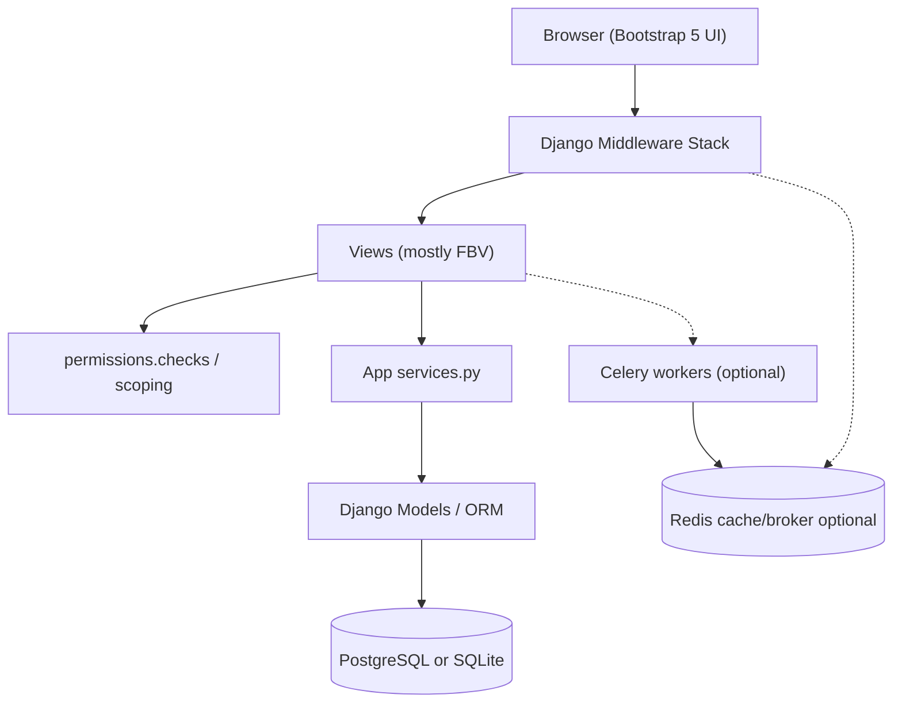
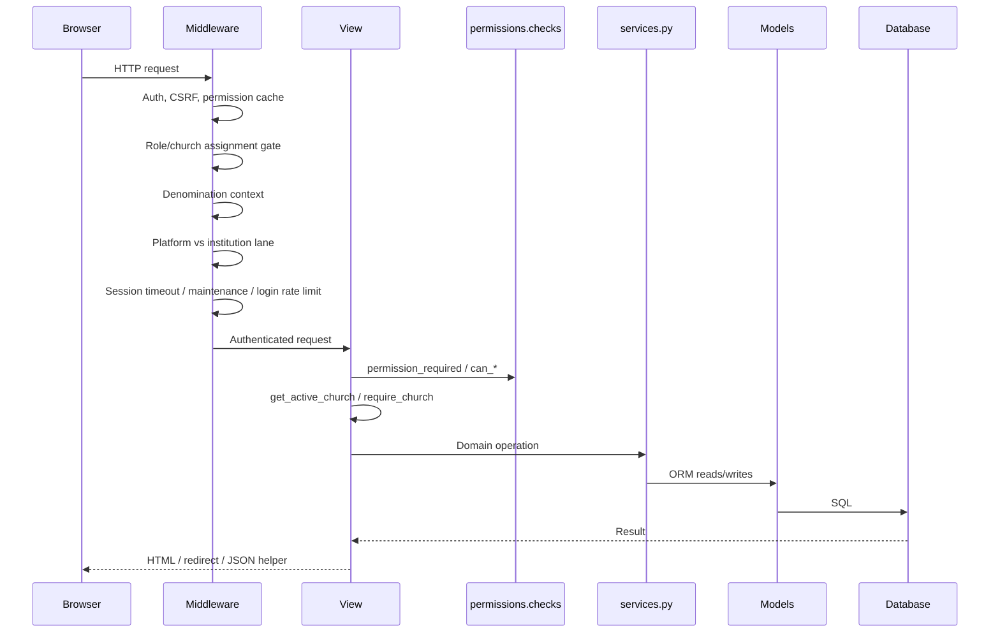
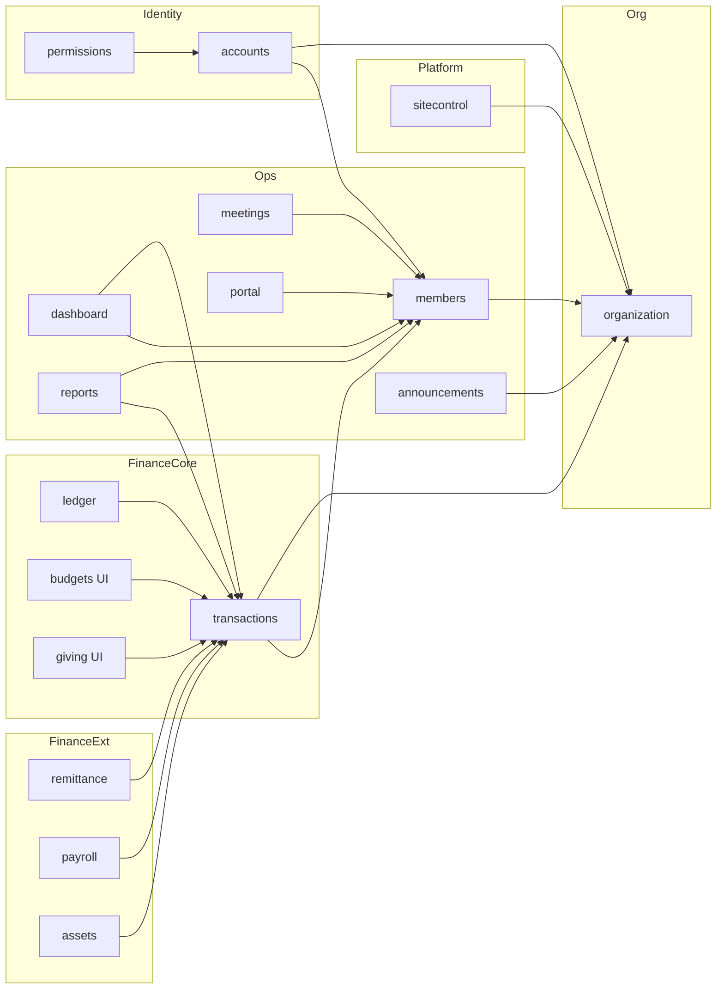
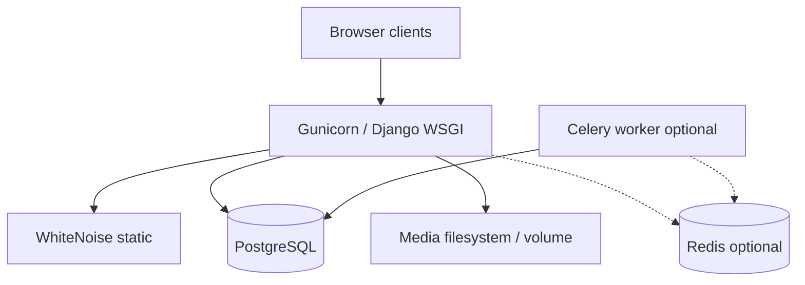

# ChurchHub — System Architecture

**Audience:** Architects, AI agents, senior engineers  
**Source of truth:** Live Django codebase  
**Companions:** `docs/AI_CONTEXT/SYSTEM_OVERVIEW.md`, `CODING_GUIDE.md`, `DATABASE_MAP.md`, root `ARCHITECTURE.md`, `AGENTS.md`

This document distinguishes three layers of truth:

| Label | Meaning |
|-------|---------|
| **Current** | Implemented in code today |
| **Planned (AGENTS.md)** | Enterprise constitution / aspirational standards |
| **Recommended** | Next architectural steps that close gaps without rewriting working modules |

---

## 1. System purpose (Current)

ChurchHub is a **server-rendered Django monolith** that provides:

- Hierarchical church administration (General Conference → … → Church)
- SaaS multi-tenancy via Denomination isolation
- Membership, meetings, attendance, announcements
- Double-entry financial books with maker-checker controls
- Remittance/settlement, welfare, payroll, fixed assets, budgets, giving views, reports
- A separate platform control plane (`/platform/`) for operators and tenant lifecycle

It is **not** a SPA and **does not** currently expose Django REST Framework `/api/v1/`.

---

## 2. Logical architecture

### 2.1 Current implementation



**Layering in practice**

| Layer | Responsibility | Location |
|-------|----------------|----------|
| Presentation | Templates, forms, HTTP | `templates/`, `*/views.py`, `*/forms.py` |
| Authorization | RBAC + object scope | `permissions/*`, scoping helpers |
| Application / domain | Business workflows | `*/services.py` (+ sibling modules) |
| Persistence | Models, constraints, light `clean`/`save` | `*/models.py` |
| Infrastructure | Settings, Celery, mail, logging | `church_system/` |

### 2.2 Planned (AGENTS.md / ARCHITECTURE.md)

```
Browser → Views/API → Permission Validation → Services
       → Selectors / Managers / Repositories → Models → PostgreSQL
Background: Celery + Redis
```

Planned extras not present today: managers, repositories, selectors, versioned REST API, soft-delete framework as a first-class layer.

### 2.3 Recommended future

1. Keep the monolith; introduce selectors/managers **incrementally** where query duplication hurts (members, transactions, reports).  
2. Add `/api/v1/` only when a real client needs it, reusing the same services and tenancy middleware.  
3. Split mega-services (`payroll`, `transactions`, `dashboard`) into focused modules without changing public behavior.  
4. Thin fat views behind service orchestration — do not rewrite modules wholesale.

---

## 3. Request flow (Current)



### Middleware order (`church_system/settings.py`)

1. `SecurityMiddleware`  
2. `WhiteNoiseMiddleware`  
3. `SessionMiddleware`  
4. `CommonMiddleware`  
5. `CsrfViewMiddleware`  
6. `AuthenticationMiddleware`  
7. `permissions.middleware.PermissionCacheMiddleware`  
8. `MessageMiddleware`  
9. `permissions.middleware.RoleEnforcementMiddleware`  
10. `sitecontrol.denomination_middleware.DenominationContextMiddleware`  
11. `sitecontrol.middleware.UserScopeMiddleware`  
12. `sitecontrol.middleware.PlatformSessionMiddleware`  
13. `sitecontrol.middleware.MaintenanceModeMiddleware`  
14. `sitecontrol.middleware.LoginRateLimitMiddleware`  
15. `XFrameOptionsMiddleware`  

Details: `MULTI_TENANCY.md`, `SECURITY_ARCHITECTURE.md`.

---

## 4. Application modules and interactions (Current)



| Dependency pattern | Reality |
|--------------------|---------|
| Financial books of record | Always `transactions` |
| Ledger / budgets / giving | Facades or templates over `transactions` |
| Payroll / assets / remittance | Post or settle into `transactions` via services |
| Membership | Owned by `members`; referenced by finance/meetings/payroll |
| Platform | Provisions org trees, subscriptions, denominations |

---

## 5. Deployment topology (Current)



- Local: SQLite common; Redis/Celery optional  
- Production (e.g. Render): `DATABASE_URL` PostgreSQL required; SSL redirect / secure cookies when `DEBUG=False`  
- Health: `/health/`  

---

## 6. Architectural styles in use

| Style | Current | Planned |
|-------|---------|---------|
| Modular monolith by domain app | Yes | Yes |
| Layered architecture | Partial (services + views) | Full (managers/repos/selectors) |
| DDD-ish app boundaries | Yes (pragmatic) | Stronger |
| Multi-tenant SaaS | Denomination + Church | Same, more formalized |
| Event-driven | Minimal (signals in places) | Broader async suite |
| API-first | No | Versioned REST |
| CQRS | No | Not required |

---

## 7. Architectural gaps (explicit)

| Gap | Current state | Planned / Recommended |
|-----|---------------|------------------------|
| Managers / repositories / selectors | Absent | Introduce incrementally |
| Soft delete | Not on models | Standard mixin + policy |
| Versioned REST API | Absent | `/api/v1/` when needed |
| MFA enforcement | Stub field only | Enforce for privileged roles |
| Visitors / inventory / procurement / petty cash | Not implemented | Roadmap domains |
| Dual remittance concepts | `MonthlyCutoff` + `SettlementBatch` | Unify lifecycle |
| Fat views / mega-services | Present | Split and thin |
| Nested docs historically empty | Architecture docs now filled here | Keep AI_CONTEXT + this tree synced |

---

## 8. Design principles for changes

Aligned with `AGENTS.md` and current code:

1. Prefer improving existing services over new parallel systems.  
2. Preserve tenant isolation and financial integrity.  
3. Keep views thin going forward; put rules in services.  
4. Do not invent schema or APIs to match aspirational docs alone.  
5. Small, reviewable, tested changes.

---

## 9. Related documents

| Topic | Document |
|-------|----------|
| Tenancy | `MULTI_TENANCY.md` |
| Security layers | `SECURITY_ARCHITECTURE.md` |
| Workflows | `WORKFLOW_ARCHITECTURE.md` |
| Agent coding rules | `docs/AI_CONTEXT/CODING_GUIDE.md` |
| Model map | `docs/AI_CONTEXT/DATABASE_MAP.md` |
| Root constitution | `AGENTS.md`, `ARCHITECTURE.md` |
