# ChurchHub — Workflow Architecture

**Audience:** Architects, AI agents, domain engineers  
**Source of truth:** Live `*/services.py` and workflow modules  
**Companions:** `SYSTEM_ARCHITECTURE.md`, `SECURITY_ARCHITECTURE.md`, `docs/AI_CONTEXT/BUSINESS_LOGIC.md`, `DATABASE_MAP.md`, `AGENTS.md`

| Label | Meaning |
|-------|---------|
| **Current** | Workflows implemented in services today |
| **Planned (AGENTS.md)** | Broader maker-checker / lifecycle aspirations |
| **Recommended** | Consolidation and hardening |

---

## 1. Workflow design pattern (Current)

Most critical workflows follow:

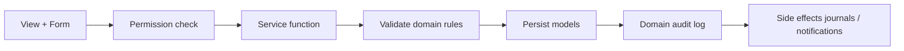

**Conventions**

- State transitions live in **services**, not templates.  
- Permissions checked in views (decorators) and often re-checked in services / workflow helpers.  
- Maker-checker: submitter often cannot approve their own item (`exclude_self_submitted` / `can_approve_for_church` patterns).  
- Finance: never edit posted history — void/reversal or new postings.

---

## 2. Application layering in workflows (Current)

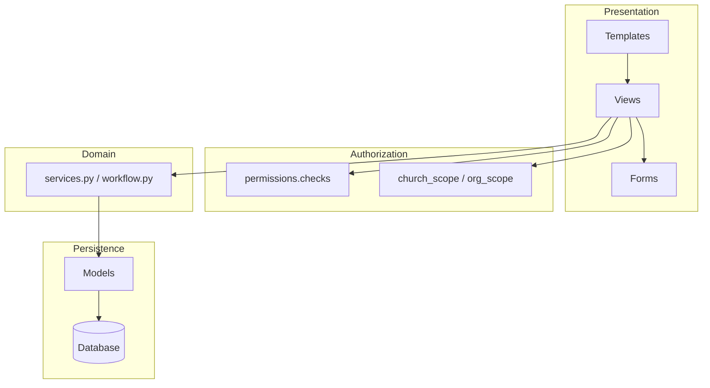

**Planned (AGENTS.md):** Insert Selectors (reads) and Managers/Repositories between services and models.  
**Recommended:** Extract read-side selectors for reports/dashboards first; keep write workflows in services.

---

## 3. Financial transaction workflow (Current)

**Owner:** `transactions/services.py`  
**Models:** `Transaction`, `TransactionLine`, `WorkingDay`, `FinancialPeriod`

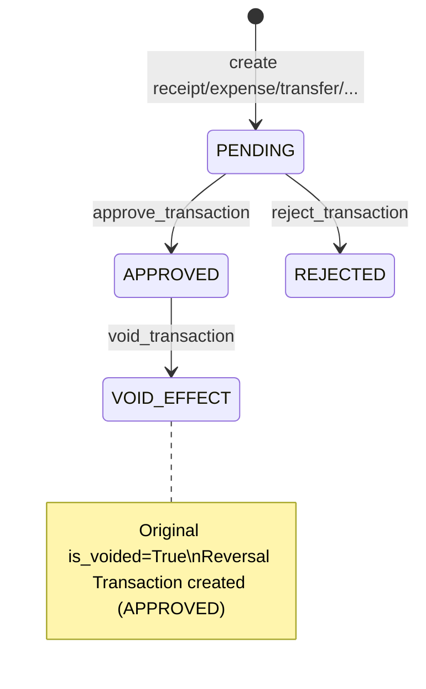

### Gates before posting / approval effects

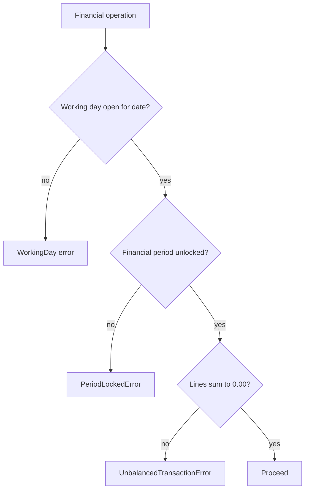

| Service (examples) | Role |
|--------------------|------|
| `record_receipt` / `record_expense` / … | Create draft/pending journals |
| `approve_transaction` | Maker-checker approve → may lock |
| `reject_transaction` | Reject pending |
| `void_transaction` | Reversal path for approved non-reversal txns |
| `open_working_day` / close helpers | Business date control |
| `lock_financial_period` | Close books for month |
| `generate_monthly_cutoff` | Aggregate remit payables for a month |

**Downstream posters into this workflow:** payroll (`PAYROLL` type), assets (capital/depreciation), remittance settlements, ledger guided entry.

### Planned

Universal fund accounting entity, hard budget limits everywhere, multi-currency.

### Recommended

Keep `transactions` as the single books-of-record; never create a parallel GL in `ledger` or elsewhere.

---

## 4. Monthly cutoff vs settlement (Current — dual path)

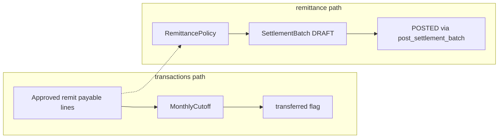

| Concept | Model | Notes |
|---------|-------|-------|
| Cutoff | `transactions.MonthlyCutoff` | Per church/month tithe+combined payable totals |
| Settlement | `remittance.SettlementBatch` | Hierarchy unit-to-unit settlement lifecycle |

**Architectural gap:** Two remittance-related lifecycles. Agents must inspect both before changing remittance behavior.

**Recommended:** Unify into one audited settlement lifecycle; wrap or deprecate cutoff as a report/snapshot if still needed.

---

## 5. Remittance policy and welfare (Current)

### Policy

- `retain_percent + remit_percent == 100`  
- Offering types: `TITHE`, `COMBINED`, `WELFARE`  
- Polymorphic unit targeting  

### Welfare case workflow

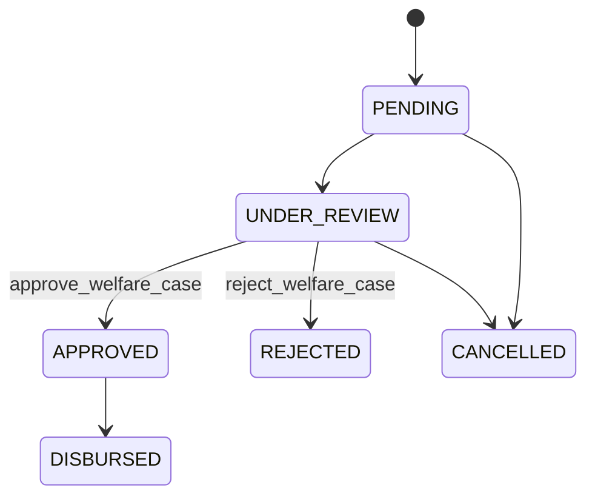

Services: `remittance/services.py`, `remittance/welfare_services.py` (approve/reject also appear in both — prefer the module used by views; do not duplicate new logic).

---

## 6. Payroll run workflow (Current)

**Owner:** `payroll/services.py`

```mermaid
stateDiagram-v2
  [*] --> DRAFT: create_payroll_run
  DRAFT --> CALCULATED: calculate_payroll_run
  CALCULATED --> APPROVED: approve_payroll_run
  CALCULATED --> REJECTED: reject_payroll_run
  APPROVED --> APPROVED: treasury_approve_payroll_run
  note right of APPROVED: Dual approval fields; status stays APPROVED
  APPROVED --> POSTED: post_payroll_run
  POSTED --> PAID: pay_payroll_run
  DRAFT --> VOID: void_payroll_run
  CALCULATED --> VOID: void_payroll_run
  REJECTED --> DRAFT: reopen_payroll_run
```

| Step | Side effect |
|------|-------------|
| `post_payroll_run` | Creates `transactions.Transaction` type `PAYROLL` |
| `pay_payroll_run` | Creates payment transaction; links payment fields |

Idempotency keys supported on post/pay paths.

---

## 7. Fixed asset workflow (Current)

**Owner:** `assets/services.py`

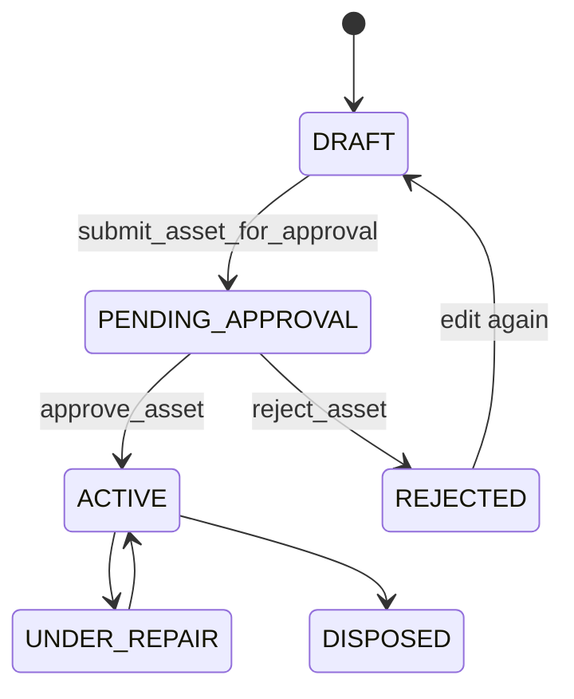

Capitalization / depreciation post into `transactions` accounts (PPE, accum. depreciation, expense). Editable when `DRAFT` or `REJECTED`.

---

## 8. Membership transfer workflow (Current)

**Owner:** `members/services.py`

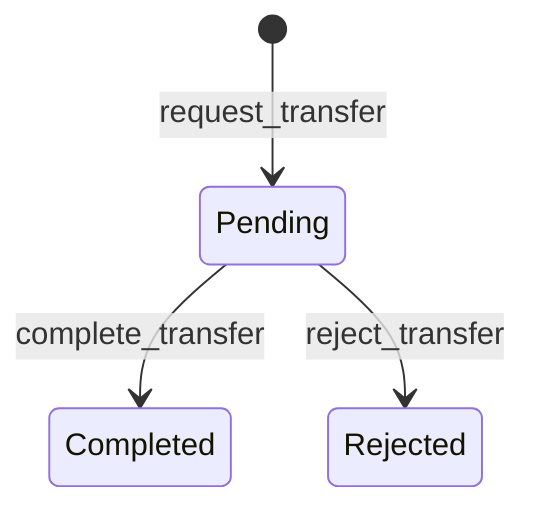

| Service | Rules (summary) |
|---------|-----------------|
| `request_transfer` | Not same church; member not already Transferred; no existing Pending; block cross-denomination when both denoms set |
| `complete_transfer` | End leadership at from-church; clear department/family; move church; set Active; history records |
| `reject_transfer` | Pending → Rejected |

Duplicate prevention on create/update is a separate guard (`find_duplicate_members` + unique phone/membership_number per church).

---

## 9. Meeting minutes workflow (Current)

**Owner:** `meetings/workflow.py`

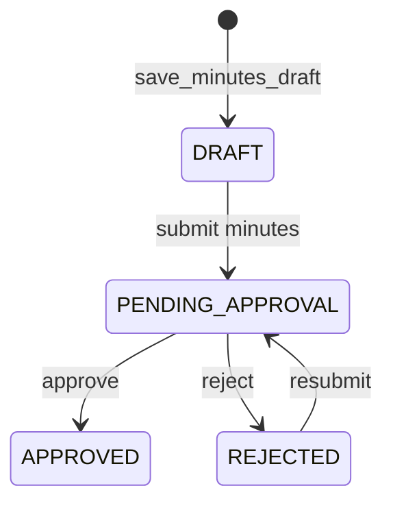

Rules of note:

- Submitter cannot approve their own minutes.  
- Approval uses `can_approve_for_church(..., "approve_minutes")`.  
- Pending queue via `pending_minutes_for_user` + `pending_for_church_scope`.

Meeting lifecycle status (`SCHEDULED` / `HELD` / `CANCELLED`) is separate from minutes status.

---

## 10. Announcement workflow (Current)

**Owner:** `announcements/services.py`

Typical pattern: create → (pending) → `approve_announcement` / `reject_announcement` → archive/pin rules in services.

Church announcements are distinct from `sitecontrol.PlatformAnnouncement`.

---

## 11. Tenant application / provisioning (Current)

**Owner:** `sitecontrol/registration_services.py`, `provisioning_services.py`

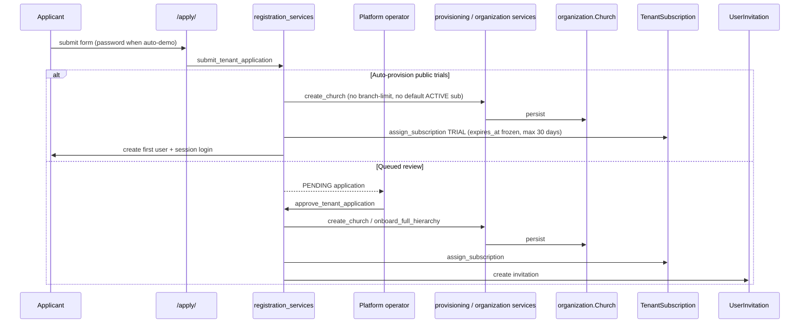

Reject path: `reject_tenant_application`.  
Application types: `EXISTING_DISTRICT`, `NEW_HIERARCHY`.

---

## 12. Reports / async jobs (Current)

**Owner:** `reports/services.py`, `ReportExportJob`

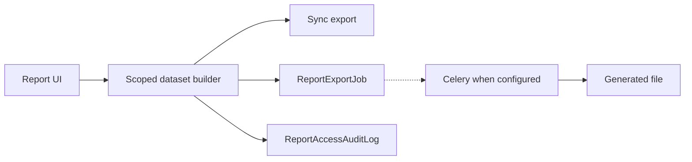

Celery is configured project-wide; tests run eager. Do not assume every report is async.

---

## 13. Cross-module interaction matrix (Current)

| Workflow | Writes | Reads | Posts journals? |
|----------|--------|-------|-----------------|
| Member transfer | members | organization | No |
| Transaction approve/void | transactions | members optional | Is the journal |
| Ledger guided entry | transactions (+ ledger category) | ledger, accounts | Yes |
| Settlement post | remittance (+ txns) | policies, hierarchy | Yes |
| Welfare approve/disburse | remittance | members, txns | Often yes |
| Payroll post/pay | payroll + transactions | employees | Yes |
| Asset approve/depreciate | assets + transactions | categories | Yes |
| Minutes approve | meetings | members | No |
| Announcement approve | announcements | — | No |
| Tenant approve | sitecontrol + organization | plans | No (provisions data) |

---

## 14. Maker-checker coverage (Current vs Planned)

| Domain | Current maker-checker | Planned breadth (AGENTS.md) |
|--------|----------------------|-----------------------------|
| Transactions | Yes | Yes |
| Payroll | Dual approval (pastor + treasury) | Yes |
| Assets | Submit / approve / reject | Yes |
| Minutes | Submit / approve / reject | Yes |
| Announcements | Approve / reject | Yes |
| Welfare | Approve / reject / disburse | Yes |
| Budgets | Permissioned manage/approve/lock codenames — verify UI path | Full lifecycle Draft→Locked |
| Role changes / bulk import | Partial via permissions admin | Universal maker-checker |

---

## 15. Architectural gaps affecting workflows

| Gap | Impact |
|-----|--------|
| No soft-delete | Workflows use status/void/archive instead |
| Dual remittance paths | Ambiguous operational source of truth |
| Fat views | Some orchestration still in views — risk of duplicated rules |
| No visitors CRM | Attendance headcount only — no conversion workflow |
| MFA stub | Privileged workflow actors not second-factored |
| No public API workflows | All flows are session/browser based |

---

## 16. Recommended future workflow architecture

1. **Single remittance lifecycle** with cutoff as derived reporting.  
2. **Workflow façade modules** per domain (like `meetings/workflow.py`) where views are still thick.  
3. **Shared maker-checker utilities** (submitter exclusion, pending queues) reused across announcements/assets/minutes.  
4. **Idempotency** extended consistently for all externalized posts (settlements, assets).  
5. **Celery Beat** for depreciation runs, reminders, cutoff generation — only after explicit product approval.  
6. When APIs arrive, expose the **same service entry points** used by views.

---

## 17. Agent rules for workflow changes

1. Find the existing service/workflow function before writing a new one.  
2. Preserve state-machine transitions; do not skip gates (working day, period, permissions).  
3. Add regression tests for illegal transitions (e.g. void unpaid rules, self-approve).  
4. Do not invent statuses not present on the model.  
5. Document dual-path areas (remittance) in the PR if you touch either side.  
6. Update `BUSINESS_LOGIC.md` when behavior changes.

---

## 18. Related documents

- `docs/AI_CONTEXT/BUSINESS_LOGIC.md` — rule details and exact status strings  
- `docs/AI_CONTEXT/DATABASE_MAP.md` — model fields  
- `docs/AI_CONTEXT/CODING_GUIDE.md` — where to put new code  
- `SYSTEM_ARCHITECTURE.md` — module graph  
- `SECURITY_ARCHITECTURE.md` — authz around workflows  
- Root `FINANCE.md`, `MEMBERSHIP.md`, `HR_AND_PAYROLL.md`, `EVENTS_AND_MEETINGS.md` — domain policy narratives (verify against code)  
