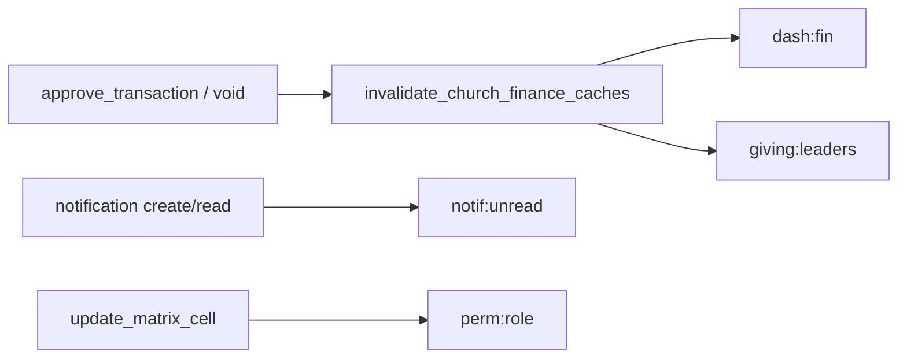

# ChurchHub — Cache Strategy

**Audience:** Developers and operators  
**Date:** 21 July 2026  
**Implementation:** `church_system/perf_cache.py`, Django `CACHES` (Redis when `REDIS_URL` set)  
**Companions:** `PERFORMANCE_REPORT.md`, `SCALABILITY_PLAN.md`

---

## Principles

1. **Correctness over hit rate** — never cache books-of-record without church + period keys and clear invalidation.  
2. **Tenant isolation** — every key includes church and/or user (and scope hash when multi-church).  
3. **Short TTLs** for financial KPIs; longer TTLs for stable config.  
4. **Request-local first** for RBAC resolution; Redis for matrix cells and hot counters.  
5. **Fail open** — cache errors must not block posting or auth (writes still hit DB).

---

## Backend

| Env | Backend |
|-----|---------|
| `REDIS_URL` set | `django.core.cache.backends.redis.RedisCache` |
| Otherwise | LocMem (dev only; **not** for multi-worker production) |

Settings: `CACHE_KEY_PREFIX` (default `churchhub`), `CACHE_DEFAULT_TIMEOUT` (300), `CACHE_VERSION` (bump to globally invalidate).

Sessions: when Redis is configured, `SESSION_ENGINE = cached_db` (speed + durability).

---

## Key catalog (Current)

| Key pattern | TTL | Contents | Invalidate |
|-------------|-----|----------|------------|
| `v{N}:dash:fin:{church_id}:{yyyy-mm}` | 60–120s (helper available) | Optional MTD KPI blob | Approve/void txn |
| `v{N}:giving:leaders:{church_id}:{year\|all}` | 300s | `[{member_id, total}, …]` | Approve/void |
| `v{N}:notif:unread:{user_id}` | 30s | int count | Create / mark-read / mark-all |
| `v{N}:perm:role:{role}:{codename}` | `PERMISSION_CACHE_TIMEOUT` (300) | bool matrix grant | Matrix cell update |
| `platform:site_settings` | 300s | SiteSettings | `clear_settings_cache` |
| `platform:active_announcement` | 120s | Announcement | with settings clear |
| `platform:church_plan:{pk}` | 300s | Plan | plan change |
| `login_fail:*` / `login_lock:*` | lockout window | Rate limit | Success / expiry |
| Request-local `(user_id, codename)` | request | Permission result | End of request |

Helpers: `church_system.perf_cache` (`giving_leaders_key`, `notif_unread_key`, `perm_role_key`, `invalidate_church_finance_caches`, …).

---

## Invalidation map

**Global flush:** increment `CACHE_VERSION` env and restart workers (invalidates all versioned keys).

---

## What not to cache

| Data | Why |
|------|-----|
| Live journal lines / balances without as-of date | Integrity / stale books risk |
| Cross-tenant aggregates under one key | Tenancy wall |
| User overrides long-term without user id | Wrong grants |
| MFA secrets / recovery codes | Security |
| CSRF / session tokens in custom cache | Use Django sessions |

---

## Dashboard / report strategy

| Surface | Strategy |
|---------|----------|
| Home finance KPIs | Prefer fewer SQL aggregates (Phase 4); optional Redis MTD key for hot churches |
| Control-center KPIs | Request-scoped reuse (compute once per request) |
| Giving leaders | Redis 5 min |
| Report HTML run | No cache of row sets (permission + date sensitive) |
| Report async job | Celery builds once; file stored on job |

---

## Permission cache layers

1. **Request dict** (`PermissionCacheMiddleware`) — primary for dashboard `can_*` storms  
2. **Redis matrix cell** — `_direct_matrix_grant` only (overrides still hit DB)  
3. **Implies recursion** — benefits from (1) once parents resolved  

On matrix reset to defaults: bump `CACHE_VERSION` or restart after deploy.

---

## Organization tree

Do **not** Redis-cache full denomination trees until a dedicated invalidation path exists for every org CRUD. Prefer ORM `prefetch_related` (already on hierarchy selectors).

---

## Ops checklist

- [ ] Production has `REDIS_URL`  
- [ ] `/health/ready/` redis/cache checks pass  
- [ ] After matrix bulk edit, bump `CACHE_VERSION` if keys linger  
- [ ] Monitor Redis memory; set `maxmemory-policy` appropriately (Render: `noeviction` for broker/cache split if needed)  
- [ ] Never point Celery broker and cache at conflicting ephemeral Redis without persistence awareness  

---

## Future (Recommended)

- `delete_pattern` helper when using redis-py directly for role-wide invalidation  
- Materialized MTD table refreshed by Beat instead of aggregate-on-read  
- Per-report ETag for identical filter params (authenticated, short TTL)
