# ChurchHub — Entity Relationship Diagrams

**Audience:** Architects, AI agents  
**Source of truth:** Live Django models  
**Companions:** `DATABASE_SCHEMA.md`, `MIGRATION_HISTORY.md`, `docs/AI_CONTEXT/DATABASE_MAP.md`

Diagrams show **Current** relationships. Planned AGENTS entities that do not exist (Visitor, Inventory, Division, soft-delete) are listed under gaps — not drawn as tables.

---

## 1. Organization hierarchy + Denomination (Current)

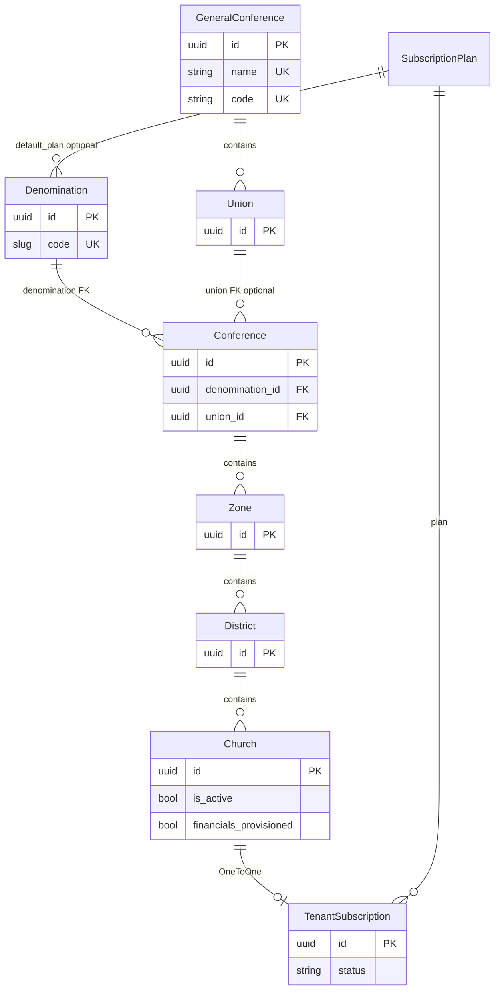

**Notes**

- Church has no direct denomination column; it is derived via district → zone → conference.  
- `OrganizationAuditLog` references entities polymorphically (`entity_type` / `entity_id`) — not drawn as FKs.

---

## 2. User, permissions, and scope (Current)

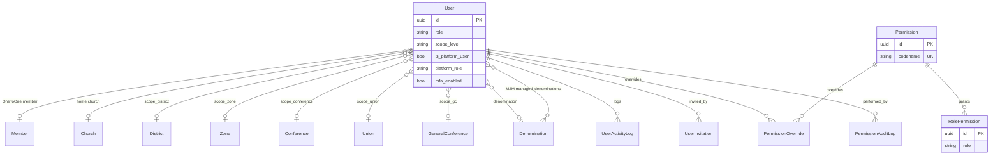

**Notes**

- Role × permission matrix is global; church isolation is applied in queries, not by FK on Permission.  
- Platform operators use `is_platform_user` + `platform_role` + managed denominations.

---

## 3. Membership domain (Current)

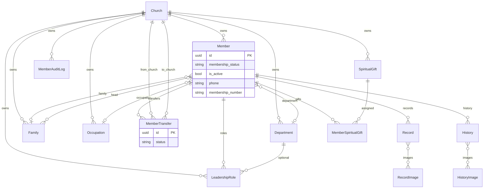

**Unique (non-empty):** `(church, phone)`, `(church, membership_number)`.

**Gap vs AGENTS:** No `Visitor` entity; attendance headcount only on `AttendanceEvent`.

---

## 4. Finance and ledger (Current)

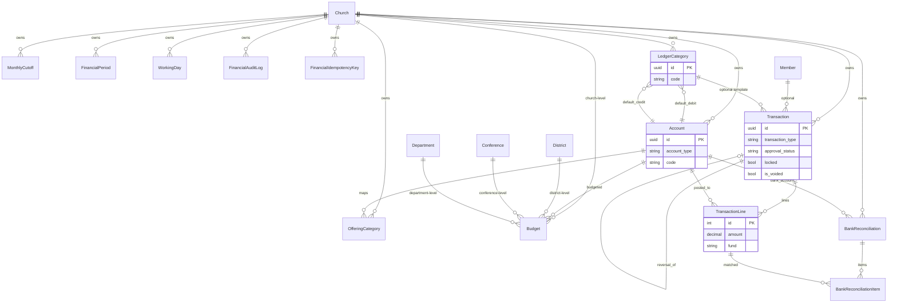

**Integrity highlights**

- Lines must balance in application code (sum amounts = 0).  
- Ledger debit ≠ credit enforced by CheckConstraint.  
- Transaction reference unique per church.  
- Budget uniqueness conditional on level.

---

## 5. Payroll (Current)

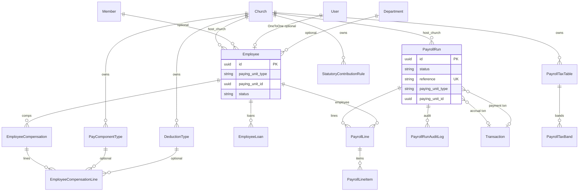

**Note:** `paying_unit_type` + `paying_unit_id` are **not** FKs to hierarchy tables.

---

## 6. Assets (Current)

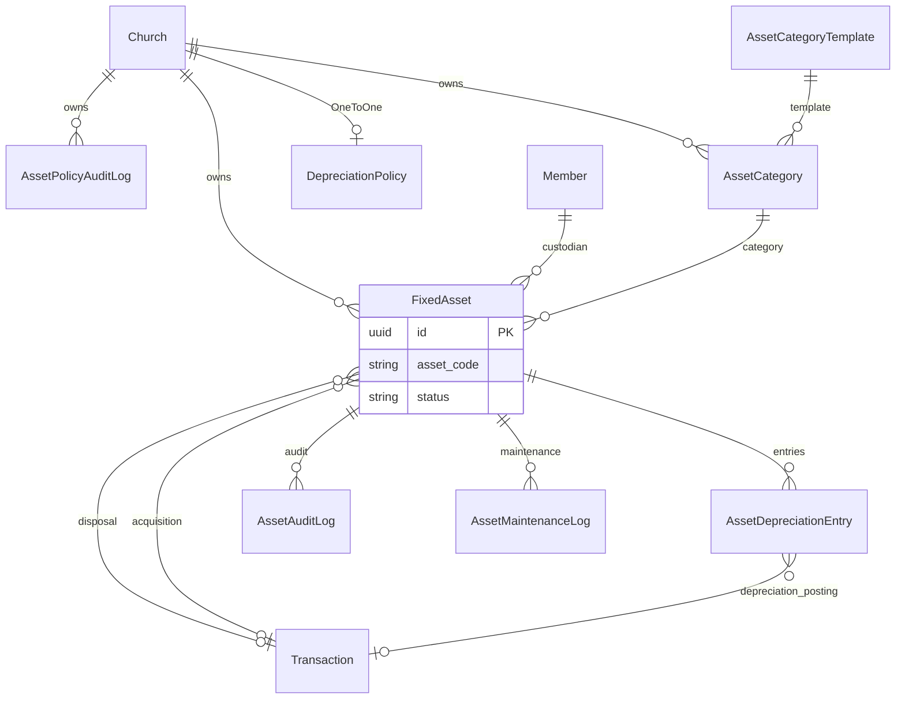

---

## 7. Remittance and welfare (Current)

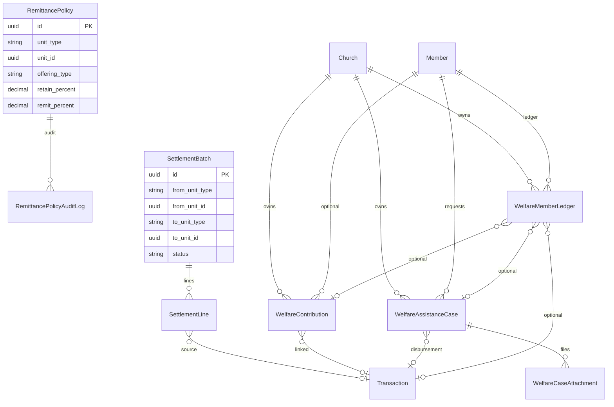

**Dual remittance note:** `transactions.MonthlyCutoff` also tracks church-month remit payables — related operationally, separate table (see `DATABASE_SCHEMA.md` / Architecture workflow docs).

---

## 8. SiteControl / SaaS (Current)

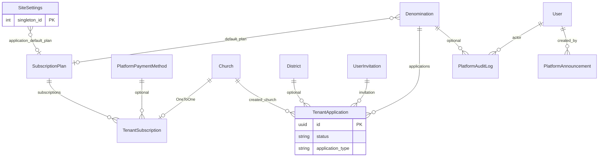

---

## 9. Meetings and attendance (Current)

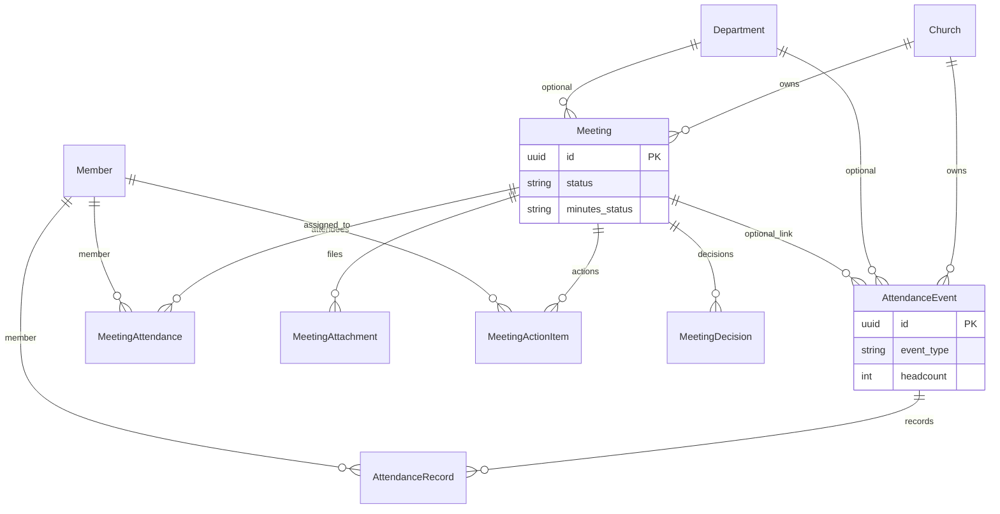

---

## 10. Announcements, reports, dashboard (Current)

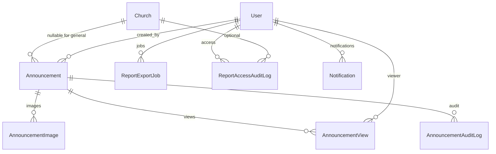

Distinct from `PlatformAnnouncement` (sitecontrol).

---

## 11. Cross-domain financial posting (Current)

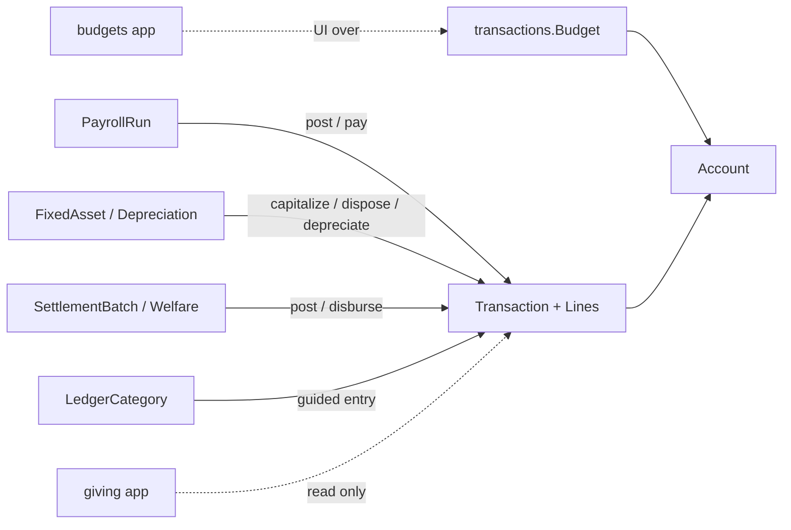

---

## 12. Planned entities (AGENTS.md) — not in ER diagrams

Do **not** assume these tables exist:

| Planned concept | Live reality |
|-----------------|--------------|
| Division | Denomination + GeneralConference |
| Generic Organization | Concrete hierarchy models |
| Visitor | AttendanceEvent.headcount only |
| Inventory / StockMovement | Absent |
| Procurement / PO | Absent |
| Petty cash | Absent |
| Soft-delete columns | Absent |
| Unified AuditEvent | Multiple domain audit tables |

---

## 13. Recommended diagram evolution

1. After soft-delete lands, annotate lifecycle fields on Member/Church/Announcement.  
2. If polymorphic units gain FKs or ContentType, redraw remittance/payroll edges.  
3. When `/api/v1/` arrives, ER stays the same — API must not invent tables.  
4. Keep `transactions` as the single financial hub in all future diagrams.

---

## 14. Related documents

- Field-level inventory: `DATABASE_SCHEMA.md`  
- Migration chronology: `MIGRATION_HISTORY.md`  
- Tenancy semantics: `docs/ARCHITECTURE/MULTI_TENANCY.md`  
- Workflow posting rules: `docs/ARCHITECTURE/WORKFLOW_ARCHITECTURE.md`  
