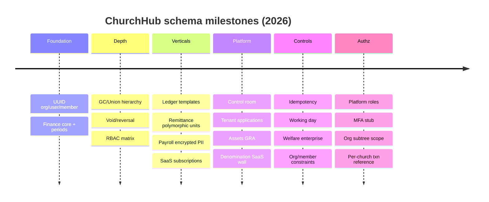

# ChurchHub — Migration History

**Audience:** Architects, AI agents, release engineers  
**Source of truth:** Django `*/migrations/*.py` (~68 modules across 14 apps)  
**Companions:** `DATABASE_SCHEMA.md`, `ENTITY_RELATIONSHIP.md`, `AGENTS.md` (migration policy)

| Label | Meaning |
|-------|---------|
| **Current** | What the migration graph produced |
| **Planned (AGENTS.md)** | Migration / data policies in the constitution |
| **Recommended** | Future migration hygiene |

**Notes**

- No squashed migrations found.  
- Cite migrations as `app_label.migration_name`.  
- Order within an app follows `dependencies`, not only filenames.  
- `giving`, `budgets`, `portal` have **no** migration history (schemaless apps).

---

## 1. Inventory by app (Current)

| App | Migrations (ordered) |
|-----|----------------------|
| **accounts** (11) | `0001_initial` → `0002_useractivitylog_userinvitation_user_phone` → `0003_alter_user_options_and_more` → `0004_platform_control_room` → `0005_user_member` → `0006_user_denomination` → `0007_user_managed_denominations` → `0008_control_tower_enterprise` → `0009_assign_platform_roles` → `0010_accounts_enterprise` → `0011_org_scope` |
| **organization** (5) | `0001_initial` → `0002_generalconference_union_conference_union` → `0003_conference_denomination` → `0004_organization_enterprise` → `0005_backfill_financials_provisioned` |
| **members** (4) | `0001_initial` → `0002_department_…` → `0003_leadershiprole_spiritualgift_…` → `0004_members_enterprise` |
| **transactions** (17) | `0001_initial` → `0002_financialperiod` → `0003_…void…` → `0004_ledger_category` → `0005_remittance_accounts_and_fund` → `0006_fix_welfare_fund_account_type` → `0007_payroll` → `0008_alter_account_account_type_and_more` → `0009_financialidempotencykey` → `0010_workingday` → `0011_welfare_enterprise` → `0012_budget_enterprise` → `0013_transactions_enterprise` → `0014_transaction_reference_per_church` → `0015_ledger_idempotency_action` → `0016_payroll_idempotency_actions` → `0017_account_code_and_active` |
| **sitecontrol** (10) | `0001_initial` → `0002_platform_control_room` → `0003_tenant_registration` → `0004_…assets…` → `0005_denomination_saas` → `0006_denomination_phases` → `0007_rename_…idx` → `0008_control_tower_enterprise` → `0009_billing_provisioning` → `0010_login_highlights` |
| **remittance** (3) | `0001_initial` → `0002_rename_…idx` → `0003_welfare_enterprise` |
| **payroll** (3) | `0001_payroll` → `0002_payrollrun_budget_warning_and_more` → `0003_payroll_enterprise` |
| **assets** (3) | `0001_initial` → `0002_seed_category_templates` → `0003_assets_enterprise` |
| **ledger** (2) | `0001_ledger_category` → `0002_ledger_enterprise` |
| **announcements** (3) | `0001_initial` → `0002_…archived…` → `0003_announcements_enterprise` |
| **meetings** (2) | `0001_initial` → `0002_meeting_workflow` |
| **dashboard** (2) | `0001_initial` → `0002_alter_notification_options_…` |
| **reports** (2) | `0001_initial` → `0002_reports_enterprise` |
| **permissions** (1) | `0001_initial` only |

---

## 2. Evolution narrative (Current)

### Phase 1 — Foundation (early Jul 2026)

| Milestone | Migration(s) |
|-----------|----------------|
| Org tree Conference→Zone→District→Church (UUID) | `organization.0001_initial` |
| Custom UUID User + roles + church FK | `accounts.0001_initial` |
| Members, records, history | `members.0001_initial` |
| Finance core: Account, Transaction, Lines, Budget, Cutoff, Offering, Reconciliation, FinancialAuditLog | `transactions.0001_initial` |
| Announcements + Notifications (integer PKs) | `announcements.0001_initial`, `dashboard.0001_initial` |
| Financial periods | `transactions.0002_financialperiod` |

### Phase 2 — Hierarchy depth + early ops

| Milestone | Migration(s) |
|-----------|----------------|
| GeneralConference + Union | `organization.0002_generalconference_union_conference_union` |
| Activity logs + invitations | `accounts.0002_…` |
| Departments, families, transfers | `members.0002_…` |
| Void / reversal on transactions | `transactions.0003_…void…` |
| Announcement archive fields | `announcements.0002_…` |
| Meetings + attendance; leadership + spiritual gifts | `meetings.0001_initial`, `members.0003_…` |
| Custom RBAC matrix | `permissions.0001_initial` |

### Phase 3 — Ledger, remittance, payroll, SaaS shell

| Milestone | Migration(s) |
|-----------|----------------|
| LedgerCategory + Transaction FK | `ledger.0001_ledger_category`, `transactions.0004_ledger_category` |
| Remittance account types + line fund | `transactions.0005_remittance_accounts_and_fund` |
| Remittance policies/settlements/welfare base (polymorphic units) | `remittance.0001_initial` |
| Data fix for account types | `transactions.0006_fix_welfare_fund_account_type` |
| Payroll domain + payroll account/txn types | `payroll.0001_payroll`, `transactions.0007_payroll` |
| Payroll treasury/void statuses | `payroll.0002_…` |
| SiteSettings, plans, TenantSubscription | `sitecontrol.0001_initial` |

### Phase 4 — Platform control room

| Milestone | Migration(s) |
|-----------|----------------|
| `User.is_platform_user` | `accounts.0004_platform_control_room` |
| Platform branding/SMTP/announcements/audit | `sitecontrol.0002_platform_control_room` |
| Index rename noise | `accounts.0003`, `remittance.0002` |

### Phase 5 — Tenant onboarding, assets, denomination SaaS

| Milestone | Migration(s) |
|-----------|----------------|
| TenantApplication | `sitecontrol.0003_tenant_registration` |
| Assets feature + FIXED_ASSET/CAPITAL types + FixedAsset domain | `sitecontrol.0004_…`, `transactions.0008_…`, `assets.0001_initial` |
| Seed category templates (data) | `assets.0002_seed_category_templates` |
| User ↔ Member link | `accounts.0005_user_member` |
| Denomination model + Conference FK + User denomination/M2M | `sitecontrol.0005_denomination_saas`, `organization.0003_conference_denomination`, `accounts.0006`, `accounts.0007` |
| Financial idempotency keys | `transactions.0009_financialidempotencykey` |
| Report export jobs | `reports.0001_initial` |

### Phase 6 — Working day + welfare enterprise

| Milestone | Migration(s) |
|-----------|----------------|
| WorkingDay | `transactions.0010_workingday` |
| Welfare enterprise (cases, ledger, attachments) | `remittance.0003_welfare_enterprise` |
| Misleading name: WorkingDay index renames only | `transactions.0011_welfare_enterprise` |
| Denomination audit phases | `sitecontrol.0006_denomination_phases` |

### Phase 7 — Enterprise polish (org, members, budget, meetings, …)

| Milestone | Migration(s) |
|-----------|----------------|
| Church is_active / financials_provisioned; code uniqueness; OrganizationAuditLog | `organization.0004_organization_enterprise` |
| Backfill financials_provisioned | `organization.0005_backfill_financials_provisioned` |
| Department budgets + conditional unique constraints | `transactions.0012_budget_enterprise` |
| Meeting minutes workflow | `meetings.0002_meeting_workflow` |
| Member constraints, baptism fields, MemberAuditLog | `members.0004_members_enterprise` |
| Finance indexes; ledger check constraint; assets/announcements/reports enterprise | `transactions.0013`, `ledger.0002`, `assets.0003`, `announcements.0003`, `reports.0002` |

### Phase 8 — Control tower, MFA stub, org scope, billing

| Milestone | Migration(s) |
|-----------|----------------|
| Platform roles, BOARD_MEMBER, M2M semantics change | `accounts.0008_control_tower_enterprise`, `sitecontrol.0008_control_tower_enterprise` |
| Assign platform roles (data) | `accounts.0009_assign_platform_roles` |
| MFA stub + invitation revoked_at | `accounts.0010_accounts_enterprise` |
| Billing / payment methods / subscription snapshots | `sitecontrol.0009_billing_provisioning` |
| Transaction reference unique **per church** (was global) | `transactions.0014_transaction_reference_per_church` |
| Idempotency actions LEDGER / PAYROLL_* | `transactions.0015`, `transactions.0016` |
| Payroll enterprise line items / audit actions | `payroll.0003_payroll_enterprise` |
| Account.code + is_active | `transactions.0017_account_code_and_active` |
| Login highlights | `sitecontrol.0010_login_highlights` |
| Org scope levels + hierarchy admin roles on User/Invitation | `accounts.0011_org_scope` |

---

## 3. Important schema milestones (summary)

---

## 4. Major refactors and semantic changes

| Change | Migration | Effect |
|--------|-----------|--------|
| Global → per-church transaction reference uniqueness | `transactions.0014` | Multi-tenant safe references |
| Empty `managed_denominations` no longer = global access | `accounts.0008` | Least privilege for platform ops |
| Announcement `status` added while booleans retained | `announcements.0003` | Dual state representation |
| Conference gains denomination FK + backfill | `organization.0003` | SaaS isolation |
| User gains scope_level + scope FKs | `accounts.0011` | Hierarchy admin model |

---

## 5. Deprecated / superseded concepts

| Concept | Status |
|---------|--------|
| Globally unique `Transaction.reference` | Superseded by per-church uniqueness |
| Empty managed denominations = global operator | Superseded |
| Soft-delete as schema standard | **Never migrated in** — planned only |
| Division table | Never existed — use Denomination + GC |
| Separate budgets/giving schemas | Never existed — Budget in transactions |
| OfferingCategory vs LedgerCategory | Both still exist; different purposes (offering map vs posting template) — not deleted |

---

## 6. Empty / rename-only / data-only migrations

| Kind | Examples |
|------|----------|
| Index rename only | `accounts.0003`, `remittance.0002`, `sitecontrol.0007`, `transactions.0011_welfare_enterprise` |
| Data-only RunPython | `transactions.0006`, `accounts.0009`, `organization.0005`, `assets.0002`, plus backfills inside larger migrations |
| Misleading name | `transactions.0011_welfare_enterprise` (indexes; welfare schema is `remittance.0003`) |

---

## 7. Remaining technical debt (Current)

1. **Mixed PK strategy** — UUID core + BigAuto leftovers (announcements, notifications, transaction lines, some member satellites).  
2. **Polymorphic UUID pairs without FK** — remittance units, payroll paying units, org audit entity refs.  
3. **`permissions.0001` role choices** may lag expanded UserRole values added later in accounts — verify matrix coverage in app code/registry.  
4. **MFA stub** — boolean only; no TOTP secret tables.  
5. **Nullable denomination FKs** — isolation depends on app logic + backfills.  
6. **Schemaless `budgets`/`giving` apps** — onboarding confusion vs `transactions.Budget`.  
7. **Dual remittance artifacts** — `MonthlyCutoff` + `SettlementBatch`.  
8. **Announcement dual status fields** — enum + legacy booleans.  
9. **Index-rename churn** — migration noise without business value.  
10. **No soft-delete columns** despite AGENTS / DATABASE_STANDARDS.

---

## 8. Planned architecture (AGENTS.md) vs migration reality

| AGENTS migration policy | Practice in this repo |
|-------------------------|------------------------|
| Explain before generating migrations | Required going forward |
| Never delete migrations | Observed — history intact |
| Avoid destructive drops without approval | Generally followed |
| Soft-delete framework | Not yet migrated |
| UUID strategy | Mostly adopted; exceptions remain |
| Preserve historical financial data | Void/reversal path migrated; no hard-delete of journals as a pattern |

---

## 9. Recommended future migrations

Prioritized, non-destructive first:

1. **Soft-delete mixin** for Member / Announcement / selected org units (additive columns + manager filters).  
2. **Align RolePermission role choices** with current UserRole set (and data check).  
3. **MFA secrets tables** when enforcement is implemented (do not fake in app without schema).  
4. **NOT NULL denomination** on Conference (and possibly User) after data audit.  
5. **Remittance unification** — clarify MonthlyCutoff vs SettlementBatch; migrate data if one path is deprecated.  
6. **Optional UUID migration** for remaining BigAuto models — high cost; document exceptions if deferred.  
7. **Squash** only after a stable release baseline and with explicit approval (none today).  
8. Avoid pure index-rename migrations unless required for deploy tooling.

### Migration authoring checklist (agents)

- [ ] Explain why, affected models, data migration need, downtime, rollback  
- [ ] Prefer additive changes  
- [ ] Never invent fields in docs without a migration  
- [ ] Include RunPython verification for financial / tenancy backfills  
- [ ] Update `DATABASE_SCHEMA.md` + AI_CONTEXT map when schema lands  

---

## 10. Related documents

- Live field inventory: `DATABASE_SCHEMA.md`  
- Diagrams: `ENTITY_RELATIONSHIP.md`  
- Tenancy: `docs/ARCHITECTURE/MULTI_TENANCY.md`  
- Agent coding rules: `docs/AI_CONTEXT/CODING_GUIDE.md`  
- Constitution: `AGENTS.md` § Database Migration Policy  
