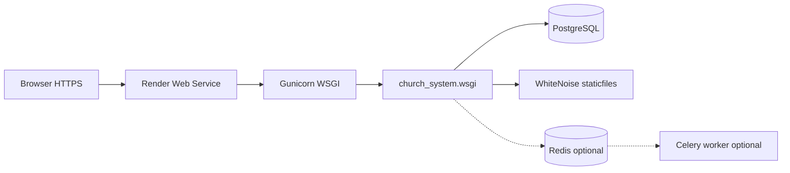

# ChurchHub — Deployment Notes

**Audience:** Operators and engineers shipping ChurchHub  
**Source of truth:** `render.yaml`, `scripts/render_*.sh`, `Dockerfile`, `docker-compose.yml`, `DEPLOY_RENDER.md`, `church_system/settings.py`  
**Companions:** `SETUP_GUIDE.md`, root `DEPLOYMENT_GUIDE.md`, `DEPLOY_RENDER.md`

| Label | Meaning |
|-------|---------|
| **Current** | Supported deploy paths in this repo |
| **Planned** | AGENTS / standards aspirations |
| **Recommended** | Hardening and ops improvements |

---

## 1. Production architecture (Current)

Primary documented production path: **Render.com** (Gunicorn + WhiteNoise + PostgreSQL).



| Component | Current implementation |
|-----------|------------------------|
| App server | **Gunicorn** (`church_system.wsgi:application`) |
| Static | **WhiteNoise** (`CompressedStaticFilesStorage`) |
| Database | **PostgreSQL** via `DATABASE_URL` (required on Render) |
| Health | `GET /health/` |
| Platform | `/platform/` control room |
| Reverse proxy / SSL | Provided by **Render** (or your own edge if self-hosting) |

### Also in repo

| Path | Purpose |
|------|---------|
| `docker compose` | Staging-like stack: Postgres 16, Redis 7, web, Celery worker |
| `Dockerfile` | `python:3.13-slim` + `docker-entrypoint.sh` → Gunicorn |
| Blueprint | `render.yaml` |

**Not in repo:** Nginx/Apache config files, uWSGI config (README mentions Gunicorn/uWSGI as options; **scripts use Gunicorn only**).

---

## 2. Environment configuration (Current)

### Required for production (`DEBUG=False`)

| Variable | Purpose |
|----------|---------|
| `DJANGO_DEBUG` | Must be `False` |
| `DJANGO_SECRET_KEY` | Strong unique secret (required when not DEBUG) |
| `DATABASE_URL` | PostgreSQL connection (Render start script refuses SQLite) |
| `DJANGO_ALLOWED_HOSTS` | Production hostname(s) |
| `DJANGO_CSRF_TRUSTED_ORIGINS` | `https://your-host` |
| `CHURCHHUB_PUBLIC_URL` | Absolute URL for emails/links |

### Bootstrap (first deploy)

| Variable | Purpose |
|----------|---------|
| `CHURCHHUB_BOOTSTRAP` | `1` first boot, then set to `0` |
| `DJANGO_SUPERUSER_USERNAME` | Platform owner (default often `platform`) |
| `DJANGO_SUPERUSER_EMAIL` | Owner email |
| `DJANGO_SUPERUSER_PASSWORD` | Strong password |
| `CHURCHHUB_BOOTSTRAP_DEMO` | Optional demo hierarchy (no sample txns) |

### Optional

| Variable | Purpose |
|----------|---------|
| `REDIS_URL` | Shared cache + login rate limits |
| `CELERY_BROKER_URL` / `CELERY_RESULT_BACKEND` | Background jobs |
| `CHURCHHUB_ASYNC_EMAIL` | Async mail only with worker |
| `MEDIA_ROOT` | Persistent media path |
| `SENTRY_DSN` / `SENTRY_ENVIRONMENT` / `SENTRY_TRACES_SAMPLE_RATE` | Monitoring |
| `SECURE_SSL_REDIRECT` | Default True when not DEBUG |
| `WEB_CONCURRENCY` / `GUNICORN_WORKERS` / `GUNICORN_TIMEOUT` | Process tuning |
| `EMAIL_*` | SMTP fallback (Platform Email UI preferred) |
| `RENDER` / `RENDER_EXTERNAL_HOSTNAME` | Auto-set by Render; host/CSRF augmented |

Full template: `.env.example`. Detailed Render steps: root `DEPLOY_RENDER.md`.

---

## 3. Render deploy flow (Current)

### Build (`scripts/render_build.sh`)

1. Install `requirements.txt`  
2. `collectstatic --noinput`

### Start (`scripts/render_start.sh`)

1. Require `DATABASE_URL` (refuse SQLite)  
2. Wait for DB  
3. `migrate --noinput`  
4. `seed_permissions`  
5. If `CHURCHHUB_BOOTSTRAP=1` → `bootstrap_production --no-input`  
6. Start Gunicorn on `$PORT` with workers/timeout  

Blueprint: `render.yaml` (web + `churchhub-db` Postgres). Health check path: `/health/`.

### Critical: link Postgres

Without `DATABASE_URL` on the web service, ephemeral SQLite failures occur (`no such table: django_session`). Always **Add from Database** → `DATABASE_URL`.

---

## 4. Static and media files (Current)

| Asset | Production behavior |
|-------|---------------------|
| Static | Collected at build; served by WhiteNoise from `STATIC_ROOT` (`staticfiles/`) |
| Media | Default filesystem under `MEDIA_ROOT`; **ephemeral on Render** unless Disk mounted |

### Media options (documented)

1. Render Disk → e.g. `MEDIA_ROOT=/var/data/media`  
2. Future: S3-compatible + django-storages (not wired in requirements today)  
3. Re-upload after redeploy for tiny deployments  

---

## 5. PostgreSQL configuration (Current)

| Concern | Behavior |
|---------|----------|
| Engine | `django.db.backends.postgresql` via `DATABASE_URL` or `DB_ENGINE=postgresql` |
| SSL on Render | `sslmode=require` when `ON_RENDER` |
| Conn pooling | `DB_CONN_MAX_AGE` / dj-database-url `conn_max_age` (default 600) |
| Local Docker | Postgres 16 Alpine, credentials in `docker-compose.yml` |

---

## 6. Gunicorn (Current)

Used in:

- `scripts/render_start.sh`  
- `docker-entrypoint.sh`  

Typical flags: `--bind 0.0.0.0:$PORT`, `--workers` from `GUNICORN_WORKERS` or `WEB_CONCURRENCY` (default 2), `--timeout` default 120.

**uWSGI:** not configured in repo scripts.  
**Nginx/Apache:** not shipped; use platform edge (Render) or your own reverse proxy in front of Gunicorn if self-hosting.

---

## 7. SSL / security settings (Current)

When `DJANGO_DEBUG=False`, settings enable:

- `SECURE_SSL_REDIRECT` (env-overridable)  
- `SESSION_COOKIE_SECURE` / `CSRF_COOKIE_SECURE`  
- HSTS (1 year) + include subdomains  
- `SECURE_PROXY_SSL_HEADER` for `X-Forwarded-Proto`  
- Always: `X_FRAME_OPTIONS=DENY`, nosniff  

Ensure CSRF trusted origins match the exact HTTPS hostname.

---

## 8. Backup strategy (Current)

| Mechanism | Notes |
|-----------|-------|
| Render PostgreSQL backups | Plan-dependent (Dashboard → Database → Backups) |
| Management command | `python manage.py backup_database` (via Render Shell / ops host) |
| Media | Back up `MEDIA_ROOT` / Disk separately |

### Planned (AGENTS.md)

Automated backups of DB, media, config, audit logs with retention policy.

### Recommended

1. Enable provider backups before go-live.  
2. Periodically test restore.  
3. Do not rely on ephemeral disk for media or SQLite.  
4. Keep `CHURCHHUB_BOOTSTRAP=0` after first success.

---

## 9. Monitoring (Current)

| Tool | How |
|------|-----|
| Health | `GET /health/` — DB, cache, migrations probes; 200/503 |
| Logs | Render Dashboard → Logs (Gunicorn access/error to stdout) |
| Sentry | Optional `SENTRY_DSN` (`send_default_pii=False`) |
| Django logging | `church_system/logging_config.py` |

Celery / Redis queue depth monitoring is an ops concern when those services are added on Render (optional today).

---

## 10. Docker staging (Current)

```bash
docker compose up --build
```

Services: `db`, `redis`, `web`, `celery`.  
Entrypoint: migrate → seed_permissions → optional demo → collectstatic → Gunicorn.

Override secrets before any internet-facing use of Compose.

---

## 11. Deployment checklist (Current)

### Pre-deploy

- [ ] `DJANGO_DEBUG=False`  
- [ ] Strong `DJANGO_SECRET_KEY`  
- [ ] `DATABASE_URL` linked to Postgres  
- [ ] Hosts + CSRF + public URL set  
- [ ] Migrations reviewed  
- [ ] CI green on target branch  

### First deploy

- [ ] `CHURCHHUB_BOOTSTRAP=1` with superuser env vars  
- [ ] Health check passes  
- [ ] Sign in → `/platform/`  
- [ ] Configure Site Settings, Email, Plans  
- [ ] Provision / approve first tenant  
- [ ] Set `CHURCHHUB_BOOTSTRAP=0`  
- [ ] Change generated passwords  

### Ongoing

- [ ] Migrations auto-applied on start (Render)  
- [ ] Monitor `/health/` and Sentry  
- [ ] Backup DB (+ media if used)  
- [ ] Redis recommended if multiple web workers (rate limits / cache)  

---

## 12. Troubleshooting (Current)

| Issue | Fix |
|-------|-----|
| 502 / won't start | Logs; `DATABASE_URL`; bootstrap password when bootstrap=1 |
| SQLite on Render | Link Postgres; start script should refuse SQLite |
| CSRF 403 | Exact `DJANGO_CSRF_TRUSTED_ORIGINS` |
| DisallowedHost | `DJANGO_ALLOWED_HOSTS` or `RENDER_EXTERNAL_HOSTNAME` |
| Missing static | Ensure build ran `collectstatic` |
| Lost uploads | Attach Disk / set `MEDIA_ROOT` |

Local prod smoke test commands are in `DEPLOY_RENDER.md`.

---

## 13. Gaps / planned / recommended

| Topic | Current | Planned / Recommended |
|-------|---------|------------------------|
| Object storage | Not wired | django-storages / S3 |
| Celery on Render | Optional later | Worker + Redis services |
| Nginx configs | Not in repo | Only if self-hosting |
| Multi-region HA | Single Render service pattern | Future scale design |
| Blue/green | Platform-dependent | Document when adopted |

---

## 14. Related documents

- Step-by-step Render: root `DEPLOY_RENDER.md`  
- Local setup: `SETUP_GUIDE.md`  
- Security settings: `docs/SECURITY/AUTHENTICATION.md`  
- Health JSON: `docs/API/API_REFERENCE.md`  
