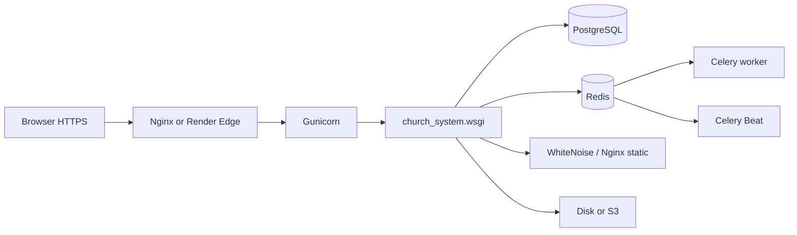

# ChurchHub — Deployment Notes

**Audience:** Operators and engineers shipping ChurchHub  
**Source of truth:** `render.yaml`, `docker-compose*.yml`, `deploy/`, `gunicorn.conf.py`, `church_system/settings/`, `scripts/`  
**Companions:** `SETUP_GUIDE.md`, `PRODUCTION_READINESS_REPORT.md`, `DEPLOYMENT_CHECKLIST.md`, `OPERATIONS_RUNBOOK.md`, root `DEPLOY_RENDER.md`

| Label | Meaning |
|-------|---------|
| **Current** | Supported deploy paths in this repo |
| **Planned** | AGENTS / standards aspirations |
| **Recommended** | Hardening and ops improvements |

---

## 1. Production architecture (Current)

Primary paths:

1. **Render.com** — web + Redis + Celery worker + Celery Beat + PostgreSQL (`render.yaml`)
2. **Docker Compose** — `docker-compose.yml` (dev/staging-like) + `docker-compose.prod.yml` (override)
3. **Self-host** — Gunicorn + Nginx + systemd/Supervisor (`deploy/`)



| Component | Current implementation |
|-----------|------------------------|
| Settings | `church_system.settings` package — `development` / `staging` / `production` via `DJANGO_ENV` |
| App server | **Gunicorn** (`gunicorn.conf.py`) |
| Static | **WhiteNoise** (CompressedStaticFilesStorage); Nginx serves `/static/` when self-hosting |
| Media | Filesystem `MEDIA_ROOT` or S3 via `django-storages` when `AWS_STORAGE_BUCKET_NAME` set |
| Database | **PostgreSQL** (required staging/production) |
| Cache / rate limits / sessions | **Redis** (`REDIS_URL`); sessions `cached_db` when Redis present |
| Workers | Celery worker + Beat schedules (notifications purge, DB backup, health probe) |
| Health | `/health/`, `/health/live/`, `/health/ready/`, `/metrics/` |

---

## 2. Environment configuration (Current)

| Variable | Purpose |
|----------|---------|
| `DJANGO_ENV` | `development` \| `staging` \| `production` |
| `DJANGO_SETTINGS_MODULE` | Default `church_system.settings` (auto-selects by `DJANGO_ENV`) |
| `DJANGO_SECRET_KEY` | Required unique secret when not DEBUG |
| `DJANGO_DEBUG` | Must be False in production |
| `DATABASE_URL` / `DB_ENGINE` | Postgres in staging/production |
| `REDIS_URL` | **Required in production** validation |
| `DJANGO_ALLOWED_HOSTS` / `DJANGO_CSRF_TRUSTED_ORIGINS` | Host + CSRF |
| `CHURCHHUB_PUBLIC_URL` | Absolute URL for emails |
| `CHURCHHUB_FILE_LOGS` / `CHURCHHUB_LOG_DIR` | Rotating application/security/audit logs |
| `SENTRY_DSN` | Error reporting |
| `AWS_*` / `S3_BUCKET` | Optional object storage for media |

Full template: `.env.example`.

Production validation: `church_system.env.validate_production_environment` — refuses insecure secret, DEBUG, SQLite, missing Redis/CSRF origins.

---

## 3. Render deploy flow (Current)

### Build (`scripts/render_build.sh`)

1. Install `requirements.txt`
2. `collectstatic --noinput`

### Start (`scripts/render_start.sh`)

1. Require `DATABASE_URL` (refuse SQLite)
2. Wait for DB → `migrate` → `seed_permissions`
3. Optional `bootstrap_production` when `CHURCHHUB_BOOTSTRAP=1`
4. Gunicorn via `gunicorn.conf.py`

Blueprint services: web, celery worker, celery beat, Redis, Postgres. Health check: `/health/ready/`.

---

## 4. Docker (Current)

```bash
# Dev / local stack (Postgres + Redis + web + celery + beat)
docker compose up --build

# Production-oriented override (set secrets in env)
docker compose -f docker-compose.yml -f docker-compose.prod.yml up -d --build
```

`Dockerfile` uses `ENTRYPOINT docker-entrypoint.sh` (migrate, seed, collectstatic, then CMD/args).

---

## 5. Self-host (Current)

| Artifact | Path |
|----------|------|
| Nginx | `deploy/nginx/churchhub.conf` |
| systemd | `deploy/systemd/churchhub-*.service` |
| Supervisor | `deploy/supervisor/churchhub.conf` |
| Deploy script | `scripts/deploy_selfhost.sh` |
| Backup script | `scripts/backup.sh` → `manage.py backup_database` |

---

## 6. Celery Beat schedules (Current)

| Task | Schedule |
|------|----------|
| `purge_old_notifications_task` | Daily 02:15 |
| `backup_database_task` | Daily 03:00 (Postgres only) |
| `health_probe_task` | Hourly :05 |

Disable with `CHURCHHUB_CELERY_BEAT=0`.

---

## 7. SSL / security settings (Current)

When `DEBUG=False` / production settings:

- `SECURE_SSL_REDIRECT`, secure cookies, HSTS
- `SECURE_PROXY_SSL_HEADER` for `X-Forwarded-Proto`
- `X_FRAME_OPTIONS=DENY`, nosniff, referrer policy

---

## 8. Backup strategy (Current)

| Mechanism | Notes |
|-----------|-------|
| Render / provider Postgres backups | Enable in dashboard |
| `manage.py backup_database` / `scripts/backup.sh` | pg_dump gzip |
| Celery Beat `backup_database_task` | Daily when Beat + Postgres |
| Media | Disk snapshot or S3 versioning |

**SECRET_KEY rotation:** MFA TOTP secrets are Fernet-derived from `DJANGO_SECRET_KEY` — plan re-enrollment before rotating.

---

## 9. Monitoring (Current)

| Tool | How |
|------|-----|
| Liveness | `GET /health/live/` |
| Readiness | `GET /health/ready/` |
| Full health | `GET /health/` |
| Metrics JSON | `GET /metrics/` |
| Sentry | `SENTRY_DSN` (+ Celery/Redis integrations) |
| Logs | stdout + optional rotating files (`application.log`, `security.log`, `audit.log`) |

---

## 10. CI/CD (Current)

`.github/workflows/ci.yml`: lint (Ruff), SQLite+coverage, Postgres+Redis tests, pip-audit (advisory).  
`.github/workflows/deploy-production.yml`: manual `workflow_dispatch` with GitHub Environment `production` approval gate.

---

## 11. Related documents

- Checklist: `docs/DEPLOYMENT_CHECKLIST.md`
- Runbook: `docs/OPERATIONS_RUNBOOK.md`
- Readiness: `docs/PRODUCTION_READINESS_REPORT.md`
- Risks: `docs/RISK_REGISTER.md`
