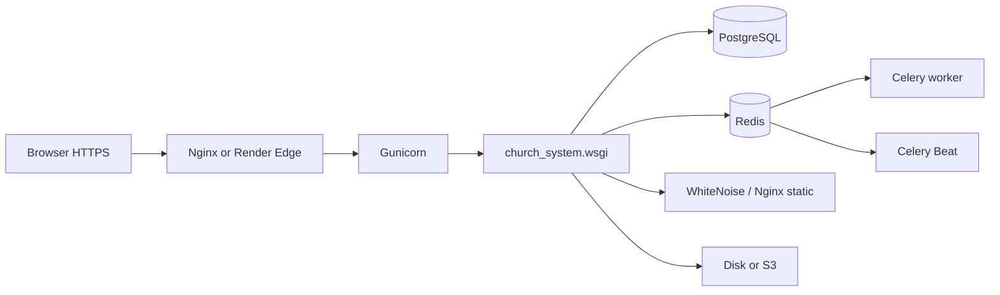

# ChurchHub — Deployment Notes

**Audience:** Operators and engineers shipping ChurchHub  
**Source of truth:** `render.yaml`, `docker-compose*.yml`, `deploy/`, `gunicorn.conf.py`, `church_system/settings/`, `scripts/`  
**Companions:** `SETUP_GUIDE.md`, `PRODUCTION_READINESS_REPORT.md`, `DEPLOYMENT_CHECKLIST.md`, `OPERATIONS_RUNBOOK.md`, root `DEPLOY_RENDER.md`

| Label | Meaning |
|-------|---------|
| **Current** | Supported deploy paths in this repo |
| **Planned** | AGENTS / standards aspirations |
| **Recommended** | Hardening and ops improvements |

---

## 1. Production architecture (Current)

Primary paths:

1. **Render.com** — web + Redis + Celery worker + Celery Beat + PostgreSQL (`render.yaml`)
2. **Docker Compose** — `docker-compose.yml` (dev/staging-like) + `docker-compose.prod.yml` (override)
3. **Self-host** — Gunicorn + Nginx + systemd/Supervisor (`deploy/`)



| Component | Current implementation |
|-----------|------------------------|
| Settings | `church_system.settings` package — `development` / `staging` / `production` via `DJANGO_ENV` (`.env` loaded in `settings/__init__.py` **before** selection) |
| App server | **Gunicorn** (`gunicorn.conf.py`) |
| Static | **WhiteNoise** (CompressedStaticFilesStorage); Nginx serves `/static/` when self-hosting |
| Media | Filesystem `MEDIA_ROOT` or S3 via `django-storages` when `AWS_STORAGE_BUCKET_NAME` set |
| Database | **PostgreSQL** (required staging/production) |
| Cache / rate limits / sessions | **Redis** (`REDIS_URL`); sessions `cached_db` when Redis present |
| Workers | Celery worker + Beat schedules (notifications purge, DB backup, health probe) |
| Health | `/health/`, `/health/live/`, `/health/ready/`, `/metrics/` |

---

## 2. Environment configuration (Current)

| Variable | Purpose |
|----------|---------|
| `DJANGO_ENV` | `development` \| `staging` \| `production` |
| `DJANGO_SETTINGS_MODULE` | Default `church_system.settings` (auto-selects by `DJANGO_ENV` after `ensure_dotenv_loaded()`) |

### Settings loading flow (Current)

1. Entry points (`manage.py`, `wsgi.py`, `asgi.py`, `celery.py`) default `DJANGO_SETTINGS_MODULE=church_system.settings`.
2. `church_system.settings.__init__` calls `ensure_dotenv_loaded()` so project `.env` populates unset variables.
3. `resolve_django_env()` reads `DJANGO_ENV` / `CHURCHHUB_ENV` (process env wins over `.env`).
4. Imports `settings.production` \| `staging` \| `development` accordingly.
5. Systemd production units still set `Environment=DJANGO_ENV=production` (behavior unchanged); interactive shell now matches when `.env` alone provides `DJANGO_ENV`.

| Variable | Purpose |
|----------|---------|
| `DJANGO_SECRET_KEY` | Required unique secret when not DEBUG |
| `DJANGO_DEBUG` | Must be False in production |
| `DATABASE_URL` / `DB_ENGINE` | Postgres in staging/production |
| `REDIS_URL` | **Required in production** validation |
| `DJANGO_ALLOWED_HOSTS` / `DJANGO_CSRF_TRUSTED_ORIGINS` | Host + CSRF |
| `CHURCHHUB_PUBLIC_URL` | Absolute URL for emails |
| `CHURCHHUB_TRUST_X_FORWARDED_FOR` | Trust forwarded client IPs only behind the configured reverse proxy (production default: true) |
| `CHURCHHUB_TRUSTED_PROXY_IPS` | Comma-separated proxy IPs/CIDRs allowed to supply `X-Forwarded-For` (default: loopback) |
| `CHURCHHUB_FILE_LOGS` / `CHURCHHUB_LOG_DIR` | Rotating application/security/audit logs |
| `SENTRY_DSN` | Error reporting |
| `AWS_*` / `S3_BUCKET` | Optional object storage for media |

Full template: `.env.example`.

Production validation: `church_system.env.validate_production_environment` — refuses insecure secret, DEBUG, SQLite, missing Redis/CSRF origins.

---

## 3. Render deploy flow (Current)

### Build (`scripts/render_build.sh`)

1. Install `requirements.txt`
2. `collectstatic --noinput`

### Start (`scripts/render_start.sh`)

1. Require `DATABASE_URL` (refuse SQLite)
2. Wait for DB → `migrate` → `seed_permissions`
3. Optional `bootstrap_production` when `CHURCHHUB_BOOTSTRAP=1`
4. Gunicorn via `gunicorn.conf.py`

Blueprint services: web, celery worker, celery beat, Redis, Postgres. Health check: `/health/ready/`.

---

## 4. Docker (Current)

```bash
# Dev / local stack (Postgres + Redis + web + celery + beat)
docker compose up --build

# Production-oriented override (set secrets in env)
docker compose -f docker-compose.yml -f docker-compose.prod.yml up -d --build
```

`Dockerfile` uses `ENTRYPOINT docker-entrypoint.sh` (migrate, seed, collectstatic, then CMD/args).

---

## 5. Self-host (Current)

| Artifact | Path |
|----------|------|
| Nginx | `deploy/nginx/churchhub.conf` |
| systemd | `deploy/systemd/churchhub-*.service` |
| Supervisor | `deploy/supervisor/churchhub.conf` |
| Deploy script | `scripts/deploy_selfhost.sh` |
| Backup script | `scripts/backup.sh` → `manage.py backup_database` |

---

## 6. Celery Beat schedules (Current)

| Task | Schedule |
|------|----------|
| `purge_old_notifications_task` | Daily 02:15 |
| `backup_database_task` | Daily 03:00 (Postgres only) |
| `health_probe_task` | Hourly :05 |

Disable with `CHURCHHUB_CELERY_BEAT=0`.

---

## 7. SSL / security settings (Current)

When `DEBUG=False` / production settings:

- `SECURE_SSL_REDIRECT`, secure cookies, HSTS (HSTS/cookies follow `SECURE_SSL_REDIRECT` so IP-only HTTP can work before TLS)
- `SECURE_PROXY_SSL_HEADER` for `X-Forwarded-Proto`
- `X_FRAME_OPTIONS=DENY`, nosniff, referrer policy

---

## 8. Ubuntu VPS self-host (Current)

**Topology:** Nginx → Gunicorn (`127.0.0.1:8000`) → Django · PostgreSQL · Redis · Celery/Beat (systemd).

### Phase A — IP access (HTTP)

1. Copy `deploy/nginx/churchhub.conf` → `/etc/nginx/sites-available/churchhub` (set `server_name` to the VPS IP if desired).
2. Install units from `deploy/systemd/` → `daemon-reload` → `enable --now`.
3. `.env` essentials:

| Variable | Example |
|----------|---------|
| `DJANGO_ENV` | `production` |
| `DJANGO_DEBUG` | `False` |
| `DJANGO_SECRET_KEY` | unique long secret |
| `DJANGO_ALLOWED_HOSTS` | `YOUR.VPS.IP` |
| `DJANGO_CSRF_TRUSTED_ORIGINS` | `http://YOUR.VPS.IP` |
| `CHURCHHUB_PUBLIC_URL` | `http://YOUR.VPS.IP` |
| `SECURE_SSL_REDIRECT` | `false` |
| `DATABASE_URL` | Postgres URL |
| `REDIS_URL` | `redis://127.0.0.1:6379/0` (**required** for multi-worker MFA OTP + rate limits) |
| `CHURCHHUB_HEALTH_TOKEN` | long random string |

4. Deploy: `bash scripts/deploy_selfhost.sh` (migrate, collectstatic, restart units).
5. Permissions: `chown -R churchhub:www-data media staticfiles logs var` · dirs `750` · files `640` as needed for Nginx read of static/media.
6. MFA: Platform → Security → require MFA for OWNER/SECURITY; enroll after login. Session uses Redis `cached_db` across Gunicorn workers. Users outside the MFA audience are **not** forced to verify.

### Phase B — Domain + TLS (zreta.com / Cloudflare)

1. Cloudflare DNS: orange-cloud **both** `zreta.com` and `www`; SSL/TLS mode **Full (Strict)**.
2. Origin: valid Let's Encrypt (or Cloudflare Origin) cert on Nginx 443.
3. Install real-IP snippet (so rate limits / Fail2Ban see visitors, not CF anycast):

```bash
sudo cp deploy/nginx/cloudflare-realip.conf /etc/nginx/snippets/cloudflare-realip.conf
# Render site config with webroot substituted, then:
sudo nginx -t && sudo systemctl reload nginx
```

4. Django `.env` **must** set (otherwise Secure cookies/HSTS stay off even when `production.py` loads):

| Variable | Value |
|----------|--------|
| `SECURE_SSL_REDIRECT` | `true` |
| `DJANGO_ALLOWED_HOSTS` | `zreta.com,www.zreta.com` |
| `DJANGO_CSRF_TRUSTED_ORIGINS` | `https://zreta.com,https://www.zreta.com` |
| `CHURCHHUB_PUBLIC_URL` | `https://zreta.com` |
| `CHURCHHUB_TRUST_X_FORWARDED_FOR` | `true` |
| `CHURCHHUB_TRUSTED_PROXY_IPS` | `127.0.0.1,::1` when Gunicorn is reachable only through local Nginx |

5. `systemctl restart churchhub-web` and `sudo systemctl reload nginx`.
6. Verify: HTTP→301 HTTPS; login `Set-Cookie` includes `Secure`; Django shell prints `SECURE_SSL_REDIRECT True` and `SESSION_COOKIE_SECURE True`.

**Root cause reminder:** `production.py` ties `SESSION_COOKIE_SECURE` / `CSRF_COOKIE_SECURE` / HSTS to `SECURE_SSL_REDIRECT`. Leaving `false` from Phase A HTTP looks like “production settings not loaded.”

Nginx must overwrite forwarded headers; never expose Gunicorn directly while forwarded-IP trust is enabled. If the reverse proxy uses a non-loopback address, add only that proxy address/CIDR to `CHURCHHUB_TRUSTED_PROXY_IPS`.

### Phase B+ — Private media (auth + X-Accel-Redirect)

Sensitive uploads (`members/`, `records/`, `history/`, `meetings/`, `exports/`, etc.) are **not** aliased openly. Nginx serves only:

- `/media/platform/branding/` and `/media/denominations/branding/` (anonymous)
- `/internal-media/` (**internal** only — Django sets `X-Accel-Redirect`)
- other `/media/*` → proxied to Django `protected_media` (login required)

Apply with the TLS nginx template from this repo, then:

```bash
# Ensure production uses X-Accel (default when DJANGO_DEBUG=False):
# MEDIA_X_ACCEL_REDIRECT=true
sudo systemctl restart churchhub-web
sudo nginx -t && sudo systemctl reload nginx
```

Verify:

```bash
# Public branding still works logged out:
curl -sI "https://zreta.com/media/platform/branding/<logo-file>" | head -5
# Private member file must NOT be 200 anonymously (expect 302 → login):
curl -sI "https://zreta.com/media/members/profile_pictures/<file>" | head -10
```

### Phase C — Fail2Ban + UFW (host hardening)

Templates: `deploy/fail2ban/`, `deploy/firewall/ufw-churchhub.sh`. Full notes: `deploy/fail2ban/README.md`, `docs/WAVE1_INFRA_SECURITY_PLAN.md`.

**Fail2Ban (preserve SSH):**

```bash
sudo fail2ban-client status sshd   # snapshot live thresholds first
sudo cp -a /etc/fail2ban/jail.d "/etc/fail2ban/jail.d.bak.$(date +%Y%m%d%H%M)" 2>/dev/null || true
sudo cp deploy/fail2ban/filter.d/churchhub-nginx-auth.conf /etc/fail2ban/filter.d/
sudo cp deploy/fail2ban/jail.d/churchhub-sshd.conf /etc/fail2ban/jail.d/
sudo cp deploy/fail2ban/jail.d/churchhub-nginx-auth.conf /etc/fail2ban/jail.d/
# If live sshd was stricter, edit the copied jail to match before reload
sudo fail2ban-client reload
# HTTP jail stays enabled=false until Cloudflare real-IP is verified
```

**UFW (additive — never resets):**

```bash
sudo bash deploy/firewall/ufw-churchhub.sh --plan
sudo bash deploy/firewall/ufw-churchhub.sh --status   # save numbered output for rollback
sudo bash deploy/firewall/ufw-churchhub.sh --apply    # ensures SSH/80/443; no ufw reset
sudo bash deploy/firewall/ufw-churchhub.sh --check-exposure
```

**Exposure:** Gunicorn `:8000`, Postgres `:5432`, Redis `:6379` must bind to loopback only (script fails if `0.0.0.0`).

**Rollback**

| Component | Steps |
|-----------|--------|
| Fail2Ban | Restore `jail.d.bak.*`; remove `churchhub-*.conf`; `fail2ban-client reload` |
| UFW | `ufw status numbered` → `ufw delete N` only for rules you added; do **not** `ufw reset` unless rebuilding from scratch with a console session |
| Mistaken ban | `fail2ban-client set sshd unbanip A.B.C.D` |

**Verify bundle:** `bash deploy/scripts/wave1_infra_verify.sh`

### Logs

| Source | Where |
|--------|--------|
| Django app / security / audit | `logs/application.log`, `security.log`, `audit.log` (+ journal) |
| Gunicorn | `journalctl -u churchhub-web` (optional file via `GUNICORN_*_LOG`) |
| Auth / MFA | `accounts` → security handlers; `UserActivityLog` |

---

## 9. Backup strategy (Current)

| Mechanism | Notes |
|-----------|-------|
| Render / provider Postgres backups | Enable in dashboard |
| `manage.py backup_database --verify` | Streaming pg_dump→gzip; optional age encrypt; `0600` files |
| `manage.py restore_database` | Requires `--confirm DESTROY_LOCAL_DATA` (+ production flag) |
| `scripts/backup.sh` | Wrapper; honors `CHURCHHUB_BACKUP_DIR` |
| Celery Beat `backup_database_task` | Daily ~03:00 when Beat + Postgres |
| systemd `churchhub-backup.timer` | Daily 03:15 oneshot (optional; see below) |
| Offsite | `deploy/backup/rclone-sync.sh` — **opt-in** via env |
| Media | Disk snapshot or S3 versioning |

### Install backup timer (VPS)

```bash
# Edit WorkingDirectory / paths if using /home/churchhub/apps/churchhub
sudo cp deploy/systemd/churchhub-backup.service deploy/systemd/churchhub-backup.timer /etc/systemd/system/
sudo systemctl daemon-reload
sudo systemctl enable --now churchhub-backup.timer
sudo systemctl list-timers | grep churchhub-backup
journalctl -u churchhub-backup -n 50
```

**Rollback timer:** `sudo systemctl disable --now churchhub-backup.timer`

**SECRET_KEY rotation:** MFA TOTP secrets are Fernet-derived from `DJANGO_SECRET_KEY` — plan re-enrollment before rotating.

Detail: `docs/WAVE1_BACKUP_RECOVERY_PLAN.md`, `deploy/backup/README.md`, `docs/OPERATIONS_RUNBOOK.md` §5.

---

## 10. Monitoring (Current)

| Tool | How |
|------|-----|
| Liveness | `GET /health/live/` (`X-Health-Token` when `CHURCHHUB_HEALTH_TOKEN` set) |
| Readiness | `GET /health/ready/` — DB, migrations, cache, redis, debug-safe |
| Full health | `GET /health/` — includes redis + celery broker |
| Metrics JSON | `GET /metrics/` (authenticated operators) |
| Sentry | Optional `SENTRY_DSN` (+ scrubber; optional `SENTRY_RELEASE`) |
| Logs | stdout/journal + rotating `application.log` / `security.log` / `audit.log` |

Production health JSON redacts raw exception text. See `docs/WAVE1_OBSERVABILITY_PLAN.md` and OPERATIONS_RUNBOOK §6.0.

---

## 11. CI/CD (Current)

`.github/workflows/ci.yml`: lint (Ruff), SQLite+coverage, Postgres+Redis tests, pip-audit (advisory).  
`.github/workflows/deploy-production.yml`: manual `workflow_dispatch` with GitHub Environment `production` approval gate.

---

## 12. Related documents

- Checklist: `docs/DEPLOYMENT_CHECKLIST.md`
- Runbook: `docs/OPERATIONS_RUNBOOK.md` / `docs/PRODUCTION_RUNBOOK.md`
- Readiness: `docs/PRODUCTION_READINESS_REPORT.md`
- Risks: `docs/RISK_REGISTER.md`
