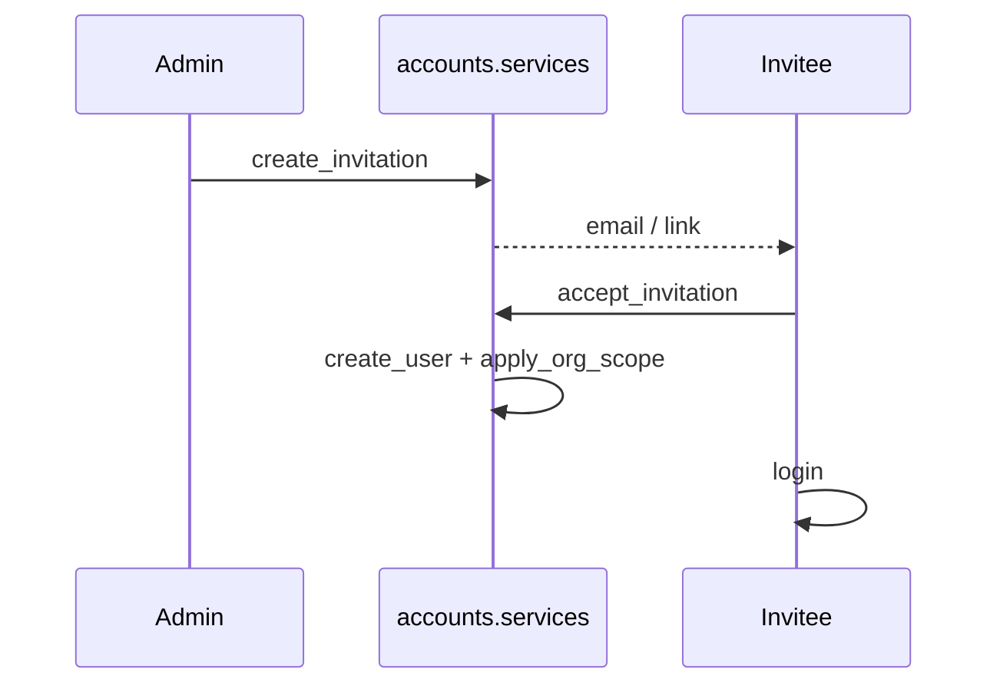
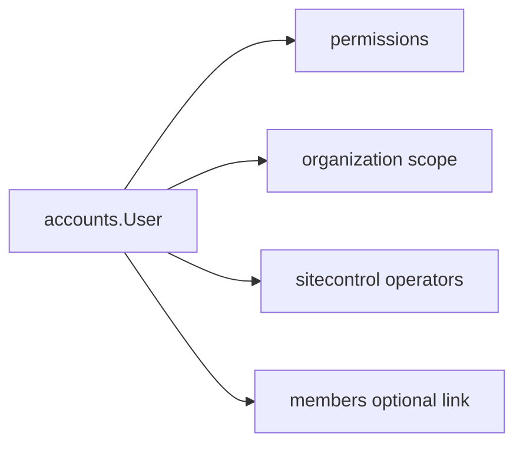

# Accounts Module Specification

**App:** `accounts`  
**Mount:** `/accounts/` (+ project login / Django auth URLs)  
**Source of truth:** Live Django code  
**Companions:** `docs/SECURITY/AUTHENTICATION.md`, `docs/AI_CONTEXT/DATABASE_MAP.md`, `AGENTS.md`

| Label | Meaning |
|-------|---------|
| **Current** | Implemented today |
| **Planned (AGENTS.md)** | Constitution aspirations |
| **Recommended** | Future improvements |

---

## 1. Purpose

Own **identity and user administration** for ChurchHub: custom user model, invitations, profile/password, activity logging, and integration with institution RBAC / org scope / platform operators.

`AUTH_USER_MODEL = accounts.User`.

---

## 2. Responsibilities (Current)

| Owns | Does not own |
|------|----------------|
| User credentials & profile fields | Permission matrix (→ `permissions`) |
| Invitations lifecycle | Org hierarchy CRUD (→ `organization`) |
| User activate/deactivate | Member pastoral records (→ `members`) |
| Activity log for auth/user admin | Platform SaaS billing (→ `sitecontrol`) |
| Platform password validators | Login rate limit (→ `sitecontrol` middleware) |

---

## 3. Models (Current)

**Managers:** default Django managers only (no custom Manager classes).

### `User` (extends `AbstractUser`)

| Area | Fields |
|------|--------|
| PK | UUID `id` |
| Role / scope | `role` (`UserRole`), `scope_level` (`OrgScopeLevel`), FKs `church`, `scope_district/zone/conference/union/general_conference` |
| Links | OneToOne `member` → `members.Member`; FK `denomination`; M2M `managed_denominations` |
| Platform | `is_platform_user`, `platform_role` (OWNER/SECURITY/BILLING/SUPPORT/READONLY) |
| Other | `phone`, `mfa_enabled` (**stub**) |
| Indexes | `(role, is_active)`, `(church, is_active)`, `(scope_level, is_active)` |

`clean()` / `save()`: platform users cannot have church; scope anchors required by level; local roles require church; `is_staff` cleared unless superuser.

### `UserActivityLog`

Actions: LOGIN, LOGOUT, PASSWORD_CHANGE, ROLE_CHANGE, CHURCH_ASSIGN, USER_CREATE/DEACTIVATE/ACTIVATE, INVITE_*, PROFILE_UPDATE, EMAIL_CHANGE, SCOPE_CHANGE.

### `UserInvitation`

Email/username/role/scope/church/denomination; unique `token`; accept/revoke/expiry; `is_valid` property.

---

## 4. Managers

**None custom.**

---

## 4b. Layering (Current — Phase 2 / P1-2 Accounts slice)

```
Views → Services → Selectors → Repositories → Models
```

| Layer | File | Role |
|-------|------|------|
| Selectors | `accounts/selectors.py` | User/invitation/activity reads; form org/member lookups; directory filters |
| Repositories | `accounts/repositories.py` | User/invitation/activity persistence (no business rules) |
| Services | `accounts/services.py` | Invite lifecycle, activate/deactivate, profile/role rules, activity orchestration |
| MFA | `accounts/mfa.py` / `mfa_views.py` | TOTP helpers; MFA field saves via repositories; pending-user lookup via selectors |
| Views / forms | `accounts/views.py`, `forms.py` | HTTP/forms only; password + manage saves via `commit=False` + repositories |

`tests_layers.py` characterizes selectors, repositories, invitation flow, activity logging, church/denomination/platform isolation.

---

## 5. Services (Current)

**File:** `accounts/services.py`

| Function | Role |
|----------|------|
| `log_activity` | Write activity log |
| `assert_can_assign_role` | Role-assign gate |
| `assign_user_to_church` | Set church + log |
| `create_invitation` / `send_invitation_email` | Invite create + email |
| `accept_invitation` | Create user from invite (atomic) |
| `revoke_invitation` / `resend_invitation` | Invite lifecycle |
| `deactivate_user` / `activate_user` | `is_active` toggle |
| `update_user_role` / `update_user_profile` | Admin/profile updates |
| `get_client_ip`, `sync_role_groups` | Re-exports from permissions (groups sync is no-op) |

Also: `accounts/control_center.py` (nav context), `accounts/validators.py` (SiteSettings-driven password rules), management command `setup_churchhub`.

---

## 6. Views (Current)

| View | Purpose |
|------|---------|
| `profile` | Profile + password change |
| `user_list` / `user_detail` | Manageable users; activate/deactivate; role/scope |
| `invite_user` / `invite_detail` | Create / view invite |
| `invite_revoke` / `invite_resend` | POST actions |
| `accept_invite` | Public token accept |
| `activity_log` | Scoped activity |

Project: `ChurchHubLoginView` at `/accounts/login/` (not in `accounts/urls.py`).

---

## 7. URLs (Current)

`app_name = accounts` under `/accounts/`:

| Path | Name |
|------|------|
| `profile/` | `accounts:profile` |
| `users/` | `accounts:user_list` |
| `users/<uuid>/` | `accounts:user_detail` |
| `users/invite/` | `accounts:invite_user` |
| `users/invite/<uuid>/` | `accounts:invite_detail` |
| `users/invite/<uuid>/revoke/` | `accounts:invite_revoke` |
| `users/invite/<uuid>/resend/` | `accounts:invite_resend` |
| `users/activity/` | `accounts:activity_log` |
| `invite/accept/<uuid:token>/` | `accounts:accept_invite` |

Plus Django `auth.urls` (password reset, etc.).

---

## 8. Templates (Current)

`templates/accounts/`: `profile.html`, `user_list.html`, `user_detail.html`, `invite.html`, `invite_detail.html`, `accept_invite.html`, `invite_invalid.html`, `activity_log.html`.

---

## 9. Forms (Current)

`ProfileForm`, `UserInviteForm`, `AcceptInvitationForm`, `UserManageForm`.

---

## 10. Permissions (Current)

- `accounts/permissions.py` re-exports `permissions.checks` + scoping helpers.
- Views typically: `@login_required` + `can_manage_users` / `can_view_activity_logs` / manageable-user checks.
- Finer codes `invite_users`, `deactivate_users` exist in registry but invite/deactivate UI primarily gates on **`can_manage_users`**.

---

## 11. Business rules (Current)

- Platform users: no home church; use `/platform/`.
- Local roles require church assignment.
- Invitations: unique username; no active duplicate email invite; seat limits via `can_add_user_to_church` on accept.
- Cannot deactivate self.
- Role assignment limited by `UserRole.can_assign_role` / assignable choices.
- Institution invites may be blocked by site registration flags.

---

## 12. Workflows (Current)



Also: revoke/resend invite; activate/deactivate; role/scope update; profile/password change.

---

## 13. Signals (Current)

`accounts/signals.py` (loaded in `apps.ready`):

- `user_logged_in` → `sync_role_groups` + log LOGIN  
- `user_logged_out` → log LOGOUT  

---

## 14. Middleware interactions (Current)

- Does **not** register its own middleware in settings.
- `accounts/middleware.py` only re-exports `RoleEnforcementMiddleware` from permissions (settings uses `permissions.middleware`).
- Consumes: session auth, RoleEnforcement (church assignment), UserScope (platform lane), LoginRateLimit, PlatformSession.

---

## 15. Dependencies (Current)

`organization`, `permissions`, `sitecontrol`, `members` (optional link), `church_system` (flash, email/tasks, denomination_scope).

---

## 16. Public interfaces (Current)

| Interface | Consumers |
|-----------|-----------|
| `accounts.User` | Entire project (`AUTH_USER_MODEL`) |
| `accounts.services.*` | Views, setup commands |
| `accounts.permissions` | Legacy import path |
| Login / invite accept URLs | Browsers |

No REST API.

---

## 16b. Cross-module interactions & financial implications



**Financial implications:** None directly. Users who hold finance permissions act in other apps; accounts must not bypass finance maker-checker rules.

---

## 17. Security considerations (Current)

- Passwords hashed by Django; validators include SiteSettings min length / uppercase.
- MFA field is stub — not enforced.
- Invitation tokens are capability URLs — treat as secrets.
- Activity log for auth events; do not log passwords.
- Manageable-user scoping prevents cross-tenant user admin when helpers used correctly.

---

## 18. Testing notes (Current)

`accounts/tests.py`: permissions, role assignment, manageable scope, services, forms, views, middleware-related cases.

---

## 19. Current vs Planned vs Recommended

| Topic | Current | Planned (AGENTS) | Recommended |
|-------|---------|------------------|-------------|
| MFA | Stub field | TOTP / recovery | Implement for privileged roles |
| Soft-delete | `is_active` only | Soft-delete framework | Keep deactivate; soft-delete if hard delete ever added |
| Managers | None | Managers layer | Optional User queryset helpers |
| Password policy | Min length + uppercase | History, expiry, complexity | Expand SiteSettings + validators |
| Maker-checker on role change | No | Yes for critical ops | Dual approval for SUPER_ADMIN grants |
| Granular invite/deactivate perms | Underused | Fine-grained | Enforce `can_invite_users` / `can_deactivate_users` in views |

---

## 20. Known technical debt

- MFA stub / admin readonly checkbox.  
- `sync_role_groups` no-op (Django groups retired).  
- Activity log not full AGENTS audit schema.  
- Views use broad `can_manage_users` vs granular invite/deactivate codes.

---

## 21. Admin

`CustomUserAdmin`, read-mostly `UserActivityLogAdmin`, `UserInvitationAdmin`.
