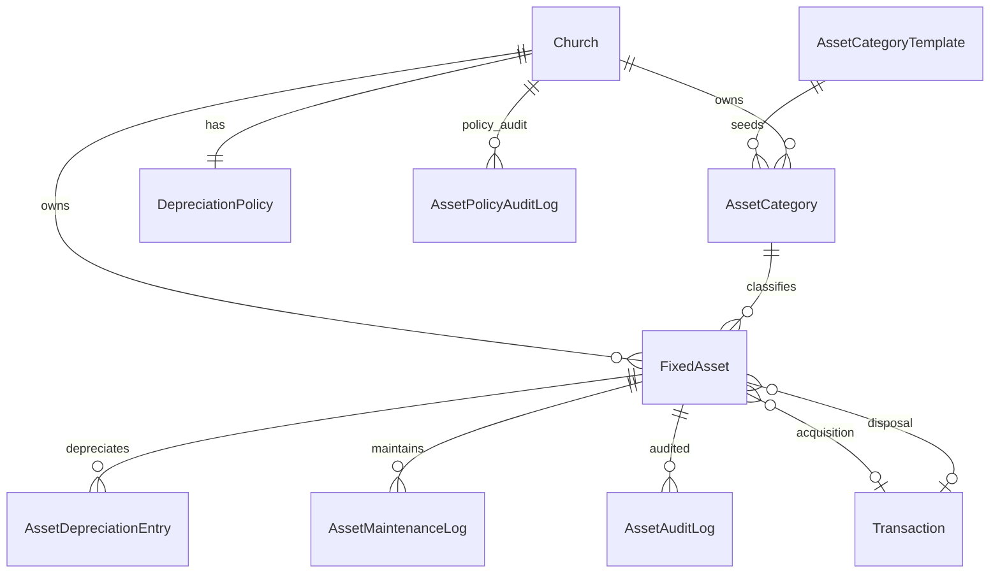
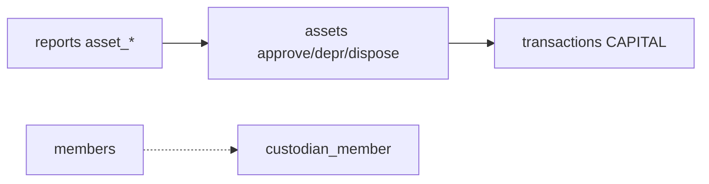

# Assets Module Specification

**App:** `assets` (`AssetsConfig`)  
**Mount:** `/assets/`  
**Companions:** `../TRANSACTIONS/transactions_spec.md`, `../FINANCE/finance_spec.md`, `AGENTS.md` §3  
**Source of truth:** Live Django code

| Label | Meaning |
|-------|---------|
| **Current** | Implemented |
| **Planned (AGENTS.md)** | Constitution aspirations |
| **Recommended** | Future improvements |

---

## 1. Purpose and responsibilities

Fixed-asset register with categories (GRA-aligned templates), depreciation policy, approval workflow, capitalization/depreciation/disposal journals (CAPITAL), maintenance log, hierarchy rollup, activity audit.

| Owns | Does not own |
|------|----------------|
| AssetCategoryTemplate / AssetCategory | Inventory stock (not implemented) |
| DepreciationPolicy | Generic CoA |
| FixedAsset lifecycle | Petty cash / procurement |
| Depreciation entries + maintenance | Remittance |

---

## 2. Models and relationships

### Enumerations
- Status: DRAFT / PENDING_APPROVAL / ACTIVE / UNDER_REPAIR / DISPOSED / REJECTED  
- Methods: STRAIGHT_LINE / DECLINING_BALANCE  
- GRA classes 1–4 on templates/categories/assets  

### FixedAsset (selected fields)
`asset_code`, name, cost, salvage, useful life, method, custodian member/name, insurance/warranty, supplier/invoice, approval/disposal fields, NBV tracking via depreciation entries, optional GL transaction links as implemented.

**Managers:** none custom. RBAC helpers in `assets/rbac.py`.

---

## 3. Business rules (Current)

1. Draft → submit → approve/reject; approve may capitalize (`capitalize_on_approval`).  
2. Segregation of duties: submitter cannot approve (assert helpers).  
3. Monthly depreciation: calculate → post DEPRECIATION_EXPENSE / ACCUMULATED_DEPRECIATION via transactions when policy allows.  
4. Dispose writes off NBV when `post_disposal_to_ledger`.  
5. Church-scoped categories unique by code; templates are platform-wide.  
6. Feature flag: `assets`.  
7. Commands: `setup_assets`, `run_asset_depreciation`.

---

## 4. Services (Current)

`assets/services.py`: seed templates/categories/policy; code generation; submit/approve/reject; post acquisition/depreciation/disposal; run/preview monthly depreciation; register CSV; hierarchy rollup; activity logs; KPIs; report builders for reports app.

---

## 5. Permissions (Current)

Registry: `view_assets`, `manage_assets`, `approve_assets`, `dispose_assets`, `manage_asset_policy`, `export_assets`.

**Debt:** `assets.rbac.user_may_view_assets` currently accepts manage/approve/policy paths and does **not** treat `view_assets` as sufficient for read access — registry code is underused in the RBAC helper.

---

## 6. URL structure (Current)

`/assets/` (`app_name=assets`):

| Path | Name |
|------|------|
| `` | `index` |
| `assets/`, `new/`, `<uuid>/`, edit, submit, approve, reject, dispose, maintenance | register lifecycle |
| `assets/export.csv` | export |
| `policy/`, `categories/…` | policy & categories |
| `depreciation/run/` | run depreciation |
| `activity/`, `activity/export.csv` | audit |
| `hierarchy/` | rollup |

---

## 7. Forms / Views / Templates

**Forms:** `FixedAssetForm`, `RejectAssetForm`, `DepreciationPolicyForm`, `AssetCategoryForm`, `MaintenanceLogForm`, `RunDepreciationForm`.

**Views:** `_assets_access` / `_policy_access` / `_assets_read_access`.

**Templates:** `templates/assets/`.

---

## 8. Signals

**None** dedicated. Defaults via `ensure_asset_defaults_for_church` / management commands / migration seed templates.

---

## 9. Middleware dependencies

Auth, CSRF, church/denomination scope, `require_feature("assets")`, platform maintenance/login limits.

---

## 10. Cross-module interactions

---

## 11. Financial implications

- Acquisition: FIXED_ASSET vs CASH/BANK (per policy).  
- Depreciation: expense vs accumulated depreciation.  
- Disposal: write-off NBV.  
- All must balance; respect working day/period when txn services assert.

---

## 12. Security considerations

- SoD on approve.  
- Hierarchy rollup scoped by user manageable churches.  
- Export gated by `export_assets`.  
- Audit logs read-oriented in admin.

---

## 13. Known architectural gaps

- No inventory submodule (AGENTS inventory is planned).  
- Units-of-production depreciation not implemented.  
- Soft-delete absent (status DISPOSED/REJECTED).  
- No Church `post_save` auto-seed (use `setup_assets` / `ensure_asset_defaults_for_church`).  
- `view_assets` underused in `user_may_view_assets`.  
- Minimal Django admin (audit-oriented; FixedAsset not fully admin-managed).  
- No REST API.

---

## 14. Planned vs Recommended

| Topic | Current | Planned | Recommended |
|-------|---------|---------|-------------|
| Lifecycle | Approve/capitalize/depr/dispose | Full AGENTS asset lifecycle | Keep GL posts via transactions |
| Methods | SL + declining balance | + units of production | Add only with tests |
| Inventory | Absent | Stock movements | Separate app if needed |

**Must not change:** SoD on approve; balanced capitalization/depreciation/disposal; church isolation.
