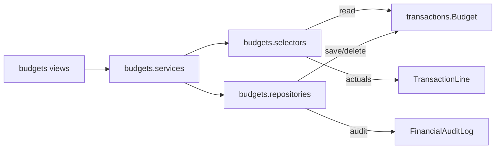

# Budgets Module Specification

**App:** `budgets`  
**Mount:** `/budgets/`  
**Role:** Budget planning UI, variance, KPIs, and exports over `transactions.Budget`  
**Companions:** `../TRANSACTIONS/transactions_spec.md`, `../FINANCE/finance_spec.md`, `AGENTS.md` §3 (Budgets)

| Label | Meaning |
|-------|---------|
| **Current** | Implemented |
| **Planned** | AGENTS aspirations |
| **Must not change** | Integrity invariants |

---

## 1. Purpose

Church/district/conference/department **budget planning** with budget-vs-actual variance against approved journals. This app does **not** own a Budget model — persistence is `transactions.Budget`.

---

## 2. Responsibilities (Current)

| Owns | Does not own |
|------|----------------|
| Planning UI + forms | Budget table schema |
| Variance / KPI / export shaping | Journal posting |
| Duplicate validation + delete guards | Period/working-day models |
| Feature flag `budgets` | Formal Draft→Approved→Locked status machine |

---

## 3. Architecture (Current)

**Critical:** Transactions owns Budget persistence. Budgets provides workflows, reports, and UI.

**Layering (P1-2):** Views → services → selectors/repositories → `transactions` models.

---

## 4. Models (Current)

**None local.** `budgets/models.py` is empty.

SoR: `transactions.models.Budget` (levels CHURCH / DEPARTMENT / DISTRICT / CONFERENCE; uniqueness constraints per level).

---

## 5. Services / selectors / repositories (Current)

| Module | Role |
|--------|------|
| `selectors.py` | Scoped budget lists, detail-by-pk, church rollups for actuals, duplicate checks, form Account/Department querysets |
| `repositories.py` | `save_budget`, `delete_budget`, audit via `transactions.repositories.create_audit_log` |
| `services.py` | Scope resolution, variance polarity, KPIs (income/expense split), YTD forecast, year clone, export rows, duplicate validation, delete-when-actuals guard |

`tests_layers.py` characterizes selector reads, repository writes, church isolation, variance, and delete blocked when approved actuals exist.

---

## 6. Views / URLs (Current)

`app_name=budgets` under `/budgets/`: list, create, clone, edit, delete.  
Gates: feature `budgets` + `view_budgets` / `manage_budgets` / `manage_finances`.

List UI uses plain numeric amounts (no currency symbols/badges), Budget vs Actual with **Forecast** (linear YTD extrapolation), and **Clone budget year** for managers.

Legacy `transactions:budget_report` redirects here.

---

## 7. Approval / lock (Current vs Planned)

| Topic | Current | Planned (AGENTS) |
|-------|---------|------------------|
| Approval | No Draft/Approved status on Budget; changes audited (`BUDGET_CREATE` / `UPDATE` / `DELETE`) | Maker-checker / approve_budgets |
| Lock | Soft integrity: cannot delete a non-department line once approved actuals exist for that year/account scope | Explicit Locked status / `lock_budgets` |

Permissions `approve_budgets` / `lock_budgets` may exist in the matrix but are **not** wired into this app’s workflow today.

---

## 8. Church & denomination scoping (Current)

Lists filter by active church (or district/conference for higher levels). `get_editable_budget` enforces tenancy (404 cross-church). Denomination wall via global middleware.

---

## 9. AI agent hard stops

Do **not**:

- Invent a second Budget model or migrations in `budgets`  
- Post journals from this app  
- Claim Draft→Approved→Locked as Current without code  
- Bypass church filters or delete-with-actuals guard  
