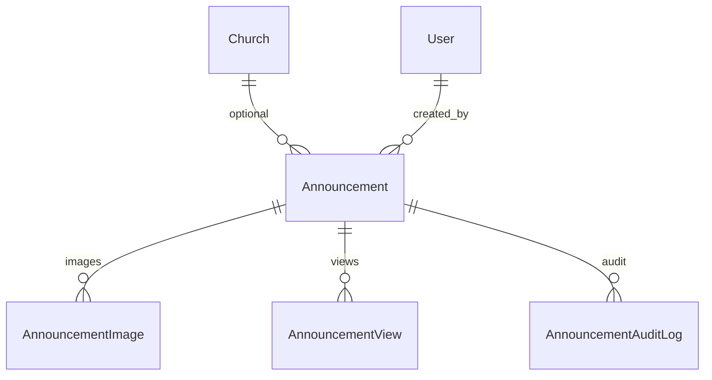
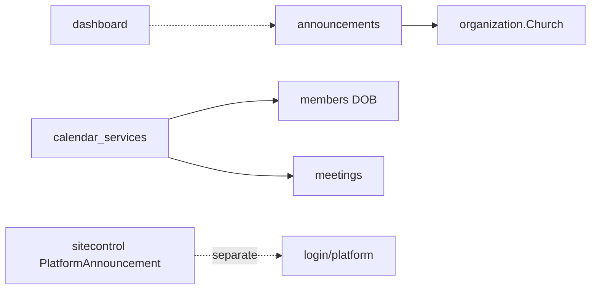

# Communications Module Specification

**Important:** There is **no** Django app named `communications`.  
**Live app:** `announcements`  
**AppConfig label:** `CommunicationsConfig` (`name = "announcements"`)  
**Mount:** `/announcements/`  
**Companions:** `../EVENTS/events_spec.md` (meetings calendar feed), `AGENTS.md` §5  
**Source of truth:** Live Django code

| Label | Meaning |
|-------|---------|
| **Current** | Implemented in `announcements` |
| **Planned (AGENTS.md)** | SMS/email campaigns, broader comms |
| **Recommended** | Future improvements |

---

## 1. Purpose and responsibilities

Church **announcements** with create → approve/reject → archive lifecycle, pinning, scheduling (`publish_at`), images, view tracking, audit log, and a **communications calendar** (birthdays + meetings + announcement events).

| Owns | Does not own |
|------|----------------|
| Announcement + images + views + audit | Platform announcements (→ `sitecontrol` `/platform/announcements/`) |
| Approval workflow | Email/SMS blast engine (absent) |
| Upcoming calendar aggregation | Member pastoral edits |
| Nav label “Communications” | App folder remains `announcements` |

---

## 2. Models and relationships

### `Announcement`
- Visibility: `general` / `church`  
- Status: PENDING / APPROVED / REJECTED / ARCHIVED (plus legacy boolean flags `is_approved`, `is_archived`, `is_rejected`)  
- `event_date`, `publish_at`, `auto_expire`, `is_pinned`  
- Max pinned per church: `MAX_PINNED_PER_CHURCH = 3`  
- Image rules: max 5 MB; jpeg/png/gif/webp  

**PK type:** integer (not UUID) on Announcement.

**Managers:** none custom.

---

## 3. Business rules (Current)

1. Create may land PENDING pending approval permissions.  
2. Pin limit enforced in services.  
3. Scheduled items hidden until `publish_at`.  
4. Self-approve blocked where `can_approve_announcement` enforces.  
5. Archive / reject recorded with audit.  
6. View tracking via `mark_viewed` / `track_view`.  
7. Calendar combines birthdays (members), meetings, announcement event dates.  
8. **No `@require_feature`** on announcement views — module is available whenever the user has announcement permissions (unlike meetings/ledger/etc.).

---

## 4. Services (Current)

**`announcements/services.py`:** create/update/approve/reject/archive, visibility querysets, pin asserts, export table, view counts.

**`announcements/calendar_services.py`:** upcoming birthdays/meetings/announcement events, grouped calendar, summary counts.

---

## 5. Permissions (Current)

`view_announcements`, `create_announcements`, `approve_announcements`, `archive_announcements`, `export_announcements`.

---

## 6. URL structure (Current)

`/announcements/` (`app_name=announcements`):

| Path | Name |
|------|------|
| `` | `announcement_list` |
| `upcoming/` | `upcoming_calendar` |
| `create/` | `create_announcement` |
| `mine/` | `my_announcements` |
| `pending/` | `pending_approvals` |
| `<int:pk>/`, edit, approve, reject, archive | detail lifecycle |
| `track/<int:pk>/` | `track_view` |

---

## 7. Forms / Views / Templates

**Forms:** `AnnouncementForm`, `AnnouncementEditForm`, `AnnouncementRejectForm`, `AnnouncementImageForm`.

**Views:** create/list/detail/edit; pending approve/reject; archive; calendar; track.

**Templates:** `templates/announcements/`.

---

## 8. Signals

**None** dedicated. Creator notifications via in-view `_notify_creator` helpers (uses notification patterns available in project).

---

## 9. Middleware dependencies

Auth, CSRF, church/denomination scope, RoleEnforcement, maintenance/login limits. No communications-specific middleware.

---

## 10. Cross-module interactions

---

## 11. Financial implications

**None.**

---

## 12. Security considerations

- Image MIME/size validation.  
- Approval segregation.  
- Church visibility filtering.  
- Do not expose rejected content broadly.  
- Upload path sanitization via Django storage.

---

## 13. Known architectural gaps

- Spec name COMMUNICATIONS vs app `announcements`.  
- No email/SMS/push campaign engine.  
- Dual status representation (enum + booleans) — debt.  
- Integer PKs while most apps use UUID.  
- Soft-delete = archive status only.  
- No REST API.

---

## 14. Planned vs Recommended

| Topic | Current | Planned (AGENTS) | Recommended |
|-------|---------|------------------|-------------|
| Channels | In-app announcements | Multi-channel comms | Add providers without rewriting model |
| Calendar | Aggregated upcoming | Richer pastoral calendar | Keep service-based aggregation |
| Status fields | status + booleans | Single status | Migrate carefully |

**Must not change:** pin limit without product approval; approval before broad visibility; church scoping.
