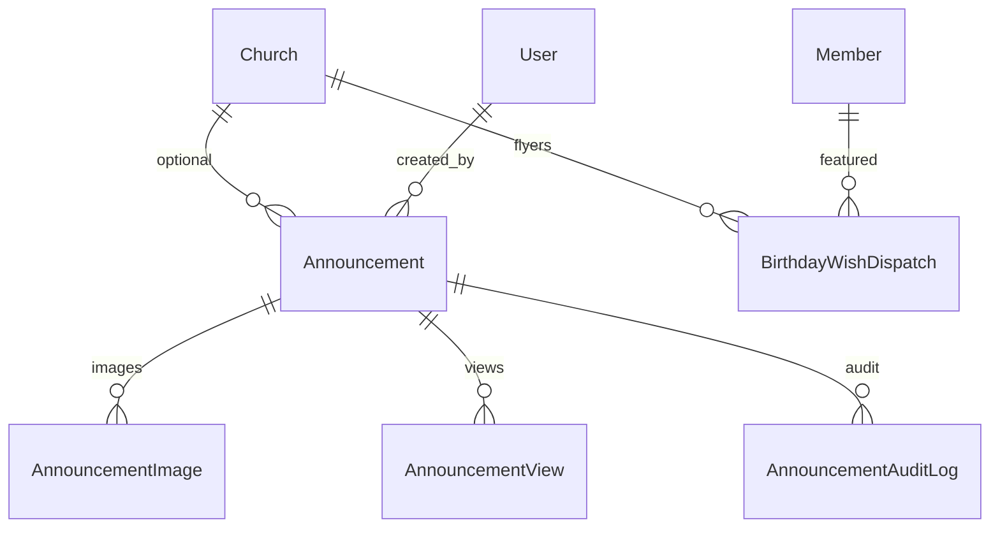
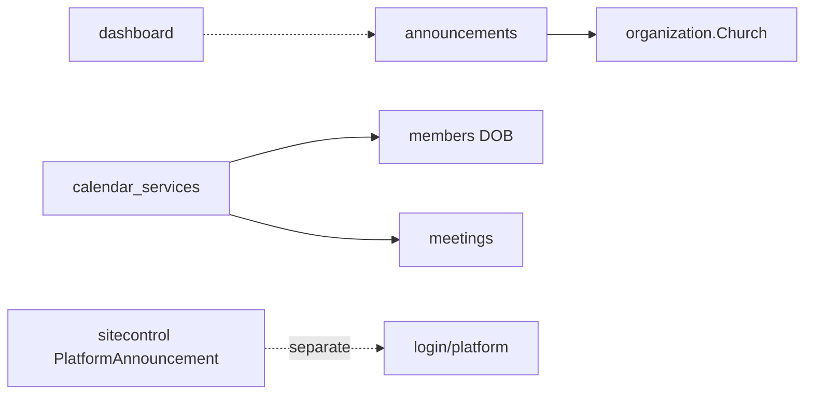

# Communications Module Specification

**Important:** There is **no** Django app named `communications`.  
**Live app:** `announcements`  
**AppConfig label:** `CommunicationsConfig` (`name = "announcements"`)  
**Mount:** `/announcements/`  
**Companions:** `../EVENTS/events_spec.md` (meetings calendar feed), `AGENTS.md` §5  
**Source of truth:** Live Django code

| Label | Meaning |
|-------|---------|
| **Current** | Implemented in `announcements` |
| **Planned (AGENTS.md)** | SMS/email campaigns, broader comms |
| **Recommended** | Future improvements |

---

## 1. Purpose and responsibilities

Church **announcements** with create → approve/reject → archive lifecycle, pinning, scheduling (`publish_at`), images, view tracking, audit log, a **communications calendar** (birthdays + meetings + announcement events), and a **birthday flyer desk** (clerk-prepared PNG + caption for the church WhatsApp group).

| Owns | Does not own |
|------|----------------|
| Announcement + images + views + audit | Platform announcements (→ `sitecontrol` `/platform/announcements/`) |
| Approval workflow | Email/SMS blast engine (absent) |
| Upcoming calendar aggregation | Member pastoral edits |
| Birthday flyer desk (`BirthdayWishDispatch`) | WhatsApp Cloud API / unofficial Web send |
| Nav label "Church Life" | App folder remains `announcements` |
| Church History mega-nav entry (UI) | Chronicle model lives in `organization.ChurchHistoryEntry` |

---

## 2. Models and relationships

### `Announcement`
- Visibility: `general` / `church`  
- Status: PENDING / APPROVED / REJECTED / ARCHIVED (plus legacy boolean flags `is_approved`, `is_archived`, `is_rejected`)  
- `event_date`, `publish_at`, `auto_expire`, `is_pinned`  
- Max pinned per church: `MAX_PINNED_PER_CHURCH = 3`  
- Image rules: max 5 MB; jpeg/png/gif/webp via shared `church_system.uploads` validators

**PK type:** integer (not UUID) on Announcement.

**`BirthdayWishDispatch` (Current):** UUID PK; church + member + `occurrence_date` unique; flyer PNG under `announcements/birthdays/`; statuses PREPARED / DOWNLOADED / POSTED; editable caption. **Does not show turning age.** Photo used only when `Member.profile_picture` is set **and** `allow_birthday_photo` is true; otherwise initials. `hide_public_birthday` excludes the member from the desk, calendar, and reminders.

**Managers:** none custom.

---

## 3. Business rules (Current)

1. Create lands PENDING by default (maker-checker). Explicit `auto_approve=True` only when the actor may approve that scope.  
2. Pin limit enforced in services.  
3. Scheduled items hidden until `publish_at`.  
4. Pending queue excludes the submitter's own rows; approve/reject require `approve_announcements` + church scope.  
5. Archive / reject recorded with audit; archive requires `archive_announcements` or creator.  
6. View tracking via `mark_viewed` / `track_view`.  
7. Calendar combines birthdays (members), meetings, announcement event dates. Birthday cards and flyers **do not display turning age**.  
8. Optional `target_roles` + department targeting; empty = entire visibility scope.  
9. List/detail/calendar require `view_announcements`; export uses `export_announcements`.  
10. **Birthday flyer desk** (`/announcements/birthdays/`): requires an **active church**, `view_announcements` **and** `view_members`, and is denied for portal `MEMBER`. Staff generate/download/share a PNG, copy or edit the caption, and post in the church WhatsApp group. Prepare-all covers the current window. `manage.py remind_birthday_desk` notifies SECRETARY / LOCAL_PASTOR (`event_key` `birthday.desk.<church_id>.<date>`); schedule daily ~06:00 local, optional Friday `--days-ahead 1`. `manage.py purge_birthday_flyers` removes PNG files older than 90 days by default.  
11. **No `@require_feature`** on announcement views — module is available whenever the user has announcement permissions.

---

## 4. Services / selectors / repositories (Current)

| Module | Role |
|--------|------|
| `selectors.py` | Announcement list/detail/pending/visibility query helpers, view counts, calendar member/meeting reads |
| `repositories.py` | Announcement save/create, audit log, view tracking, image formset persistence |
| `services.py` | Create/update/approve/reject/archive, visibility rules, pin limits, export table, mark viewed |
| `calendar_services.py` | Upcoming birthdays/meetings/announcement events, grouped calendar, summary counts |
| `birthday_services.py` / `flyer_composer.py` | Desk windows, caption (no age), PNG flyer, prepare/download/posted, daily reminders |

**Layering (P1-2):** Views → services → selectors/repositories → models. Views handle HTTP/forms only; image formsets save via repositories. Church/visibility scope, approval workflow, and audit behavior are unchanged.

`tests_layers.py` characterizes selector reads, church/denomination isolation, publishing workflow, repository writes, view tracking, and audit creation.

---

## 5. Permissions (Current)

`view_announcements`, `create_announcements`, `approve_announcements`, `archive_announcements`, `export_announcements`. Birthday flyer desk also requires `view_members` and is denied for portal `MEMBER`.

---

## 6. URL structure (Current)

`/announcements/` (`app_name=announcements`):

| Path | Name |
|------|------|
| `` | `announcement_list` |
| `upcoming/` | `upcoming_calendar` |
| `birthdays/` | `birthday_desk` |
| `birthdays/prepare/` | `birthday_prepare` (POST) |
| `birthdays/prepare-all/` | `birthday_prepare_all` (POST) |
| `birthdays/<uuid:pk>/caption/` | `birthday_save_caption` (POST) |
| `birthdays/<uuid:pk>/download/` | `birthday_download` |
| `birthdays/<uuid:pk>/posted/` | `birthday_mark_posted` (POST) |
| `create/` | `create_announcement` |
| `mine/` | `my_announcements` |
| `pending/` | `pending_approvals` |
| `<int:pk>/`, edit, approve, reject, archive | detail lifecycle |
| `track/<int:pk>/` | `track_view` |

---

## 7. Forms / Views / Templates

**Forms:** `AnnouncementForm`, `AnnouncementEditForm`, `AnnouncementRejectForm`, `AnnouncementImageForm`.

**Views:** create/list/detail/edit; pending approve/reject; archive; calendar; birthday flyer desk; track.

**Templates:** `templates/announcements/` (`birthdays.html` for the flyer desk).

---

## 8. Signals

**None** dedicated. Creator notifications via in-view `_notify_creator` helpers (uses notification patterns available in project).

---

## 9. Middleware dependencies

Auth, CSRF, church/denomination scope, RoleEnforcement, maintenance/login limits. No communications-specific middleware.

---

## 10. Cross-module interactions

---

## 11. Financial implications

**None.**

---

## 12. Security considerations

- Image MIME/size validation.  
- Approval segregation.  
- Church visibility filtering.  
- Do not expose rejected content broadly.  
- Upload path sanitization via Django storage.  
- Birthday flyer files use prefix `announcements/birthdays/` **before** generic `announcements/` media ACL; require `view_members` + `view_announcements` and church in `get_manageable_churches`. Portal MEMBER cannot fetch flyers.

---

## 13. Known architectural gaps

- Spec name COMMUNICATIONS vs app `announcements`.  
- No email/SMS/push campaign engine.  
- Dual status representation (enum + booleans) — debt.  
- Integer PKs while most apps use UUID.  
- Soft-delete = archive status only.  
- No REST API.

---

## 14. Planned vs Recommended

| Topic | Current | Planned (AGENTS) | Recommended |
|-------|---------|------------------|-------------|
| Channels | In-app announcements + dashboard notifications | Multi-channel comms | Email for publish/export (Phase 3) |
| Audience | Church/general + optional roles/departments | Richer pastoral targeting | Keep server-side filters |
| Calendar | Aggregated upcoming (no turning age on birthday UI) | Richer pastoral calendar | Keep service-based aggregation |
| Birthday outreach | Clerk PNG + caption (copy/preview/share/prepare-all); photo consent; quiet list; 90-day flyer purge | WhatsApp Cloud API (cannot join existing groups as Current) | Story (1080×1920) layout |
| Status fields | status + booleans | Single status | Migrate carefully |
| Notifications | Inbox filters, POST mark-read, MEETING/SYSTEM categories, export-ready notify | Preferences / push | Optional email prefs |

**Must not change:** pin limit without product approval; approval before broad visibility; church scoping.
