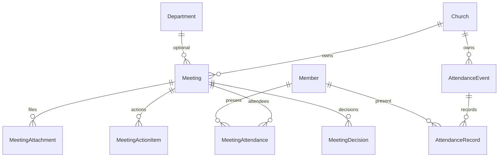
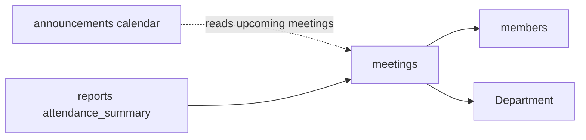

# Events Module Specification

**Important:** There is **no** Django app named `events`.  
**Live app:** `meetings`  
**Mount:** `/meetings/`  
**AppConfig:** `MeetingsConfig`  
**Companions:** `../MEMBERS/members_spec.md`, `AGENTS.md` §2 (Attendance / Meetings)  
**Source of truth:** Live Django code

| Label | Meaning |
|-------|---------|
| **Current** | Implemented in `meetings` |
| **Planned (AGENTS.md)** | Broader events/camp meeting finance |
| **Recommended** | Future improvements |

---

## 1. Purpose and responsibilities

Church **board/department meetings** with minutes workflow, action items, decisions, attachments, plus **AttendanceEvent** / **AttendanceRecord** for worship/event attendance capture.

| Owns | Does not own |
|------|----------------|
| Meeting + minutes approval | Announcement calendar (→ `announcements`) |
| Meeting attendance | Member transfers |
| AttendanceEvent / AttendanceRecord | Event financial budgets (AGENTS — not here) |
| Action items / decisions | Remittance / payroll |

---

## 2. Models and relationships

### Enumerations
- `MeetingStatus`: SCHEDULED / HELD / CANCELLED  
- `MeetingType`: BOARD / CHURCH_BOARD / DEACONS / DEPARTMENT / GENERAL / OTHER  
- `MinutesStatus`: DRAFT / PENDING_APPROVAL / APPROVED / REJECTED  
- `ActionItemStatus`: (see model)  
- `EventType` on AttendanceEvent (worship/event types as coded)

### Meeting highlights
Structured minutes fields (opening, previous, deliberations, motions, votes, adjournment), `minutes_locked`, submit/approve metadata.  
**Online / Zoom (Current):** `join_url`, `join_passcode`, `show_on_portal`; type `ONLINE_SERVICE`; member portal join at `/portal/meetings/<uuid>/`.

**Managers:** none custom. Workflow helpers in `meetings/workflow.py`.

---

## 3. Business rules (Current)

1. Meetings are church-scoped (`filter_by_church` / `require_church`).  
2. Minutes: draft → submit → approve/reject; approved minutes lock editing.  
3. Creator/secretary permissions via `can_edit_minutes`, `can_submit_minutes`, `can_approve_meeting_minutes`.  
4. Attendance recording for meetings and separate AttendanceEvents.  
5. Unique `(meeting, member)` on MeetingAttendance.  
6. Feature flag: views use `@require_feature("meetings")` (`feature_meetings` / `global_enable_meetings`).

---

## 4. Services / selectors / repositories (Current)

| Module | Role |
|--------|------|
| `selectors.py` | Church-scoped meeting/attendance reads, filter helpers, member/department form querysets, attachment lookup |
| `repositories.py` | Meeting / attachment / action / decision / attendance persistence; attendance upsert + roll sync deletes |
| `services.py` | Mark held; bulk attendance sync with church-member validation |
| `workflow.py` | Minutes draft/submit/approve/reject, pending queue, capability helpers |

**Layering (P1-2):** Views → services/workflow → selectors/repositories → models. Views/forms handle HTTP and forms only; ModelForm CRUD uses `commit=False` + repositories. Church scope, minutes maker-checker, and attendance behavior are unchanged.

`tests_layers.py` characterizes selector reads, attendance isolation, cross-church denial, repository writes, attachment handling, and attendance re-record identity.

---

## 5. Permissions (Current)

Registry/helpers include: `view_meetings`, `manage_meetings`, `manage_attendance`, `submit_minutes`, `approve_minutes`, `export_minutes`.

---

## 6. URL structure (Current)

`/meetings/` (`app_name=meetings`):

| Path | Name |
|------|------|
| `` | `list` |
| `pending/` | `pending_minutes` |
| `add/` | `create` |
| `<uuid>/`, edit, action, attendance, actions, decisions | meeting detail flows |
| `attendance/`, add, detail, record | AttendanceEvent flows |

---

## 7. Forms / Views / Templates

**Forms:** `MeetingForm`, `MeetingFilterForm`, `MeetingMinutesForm`, `MeetingAttachmentForm`, `MinutesRejectForm`, `ActionItemForm`, `DecisionForm`, `AttendanceEventForm`.

**Views:** list/create/detail/edit/action; attendance list/create/detail/record; pending minutes.

**Templates:** `templates/meetings/`.

---

## 8. Signals

**None** dedicated.

---

## 9. Middleware dependencies

Auth, CSRF, church/denomination scope, RoleEnforcement (church assignment for local roles), maintenance/login limits.

---

## 10. Cross-module interactions

---

## 11. Financial implications

**None in current code.** AGENTS event finance (camp meeting budgets/income) is **planned**, not implemented in `meetings`.

---

## 12. Security considerations

- Church isolation on all querysets.  
- Minutes approval segregation.  
- Attachment uploads — validate in forms/views as implemented.  
- No hard-delete policy documented as soft-delete; cancelling uses status.

---

## 13. Known architectural gaps

- Spec folder named EVENTS but app is `meetings`.  
- No camp-meeting / registration / ticketing.  
- No event GL integration.  
- Soft-delete not implemented.  
- No REST API.

---

## 14. Planned vs Recommended

| Topic | Current | Planned (AGENTS) | Recommended |
|-------|---------|------------------|-------------|
| Naming | `meetings` | Events & meetings | Keep app name; document alias |
| Attendance | Meeting + AttendanceEvent | Broader Sabbath/event types | Unify attendance UX |
| Event finance | Absent | Budget/income/expense | New module or extend carefully |

**Must not change:** church scoping; minutes lock after approve; do not invent an `events` app without approval.
