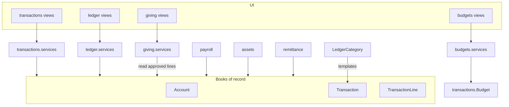
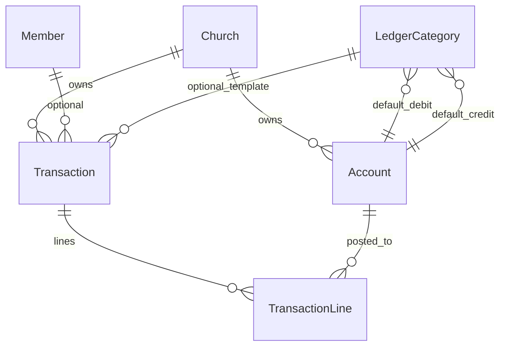
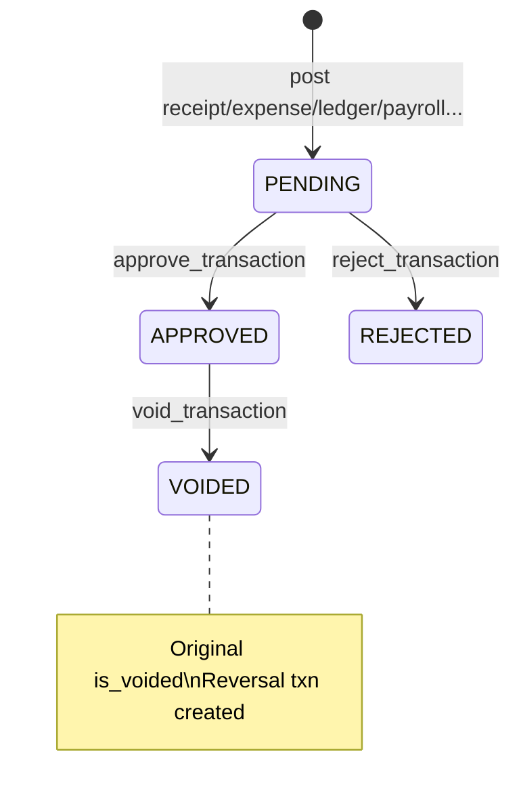
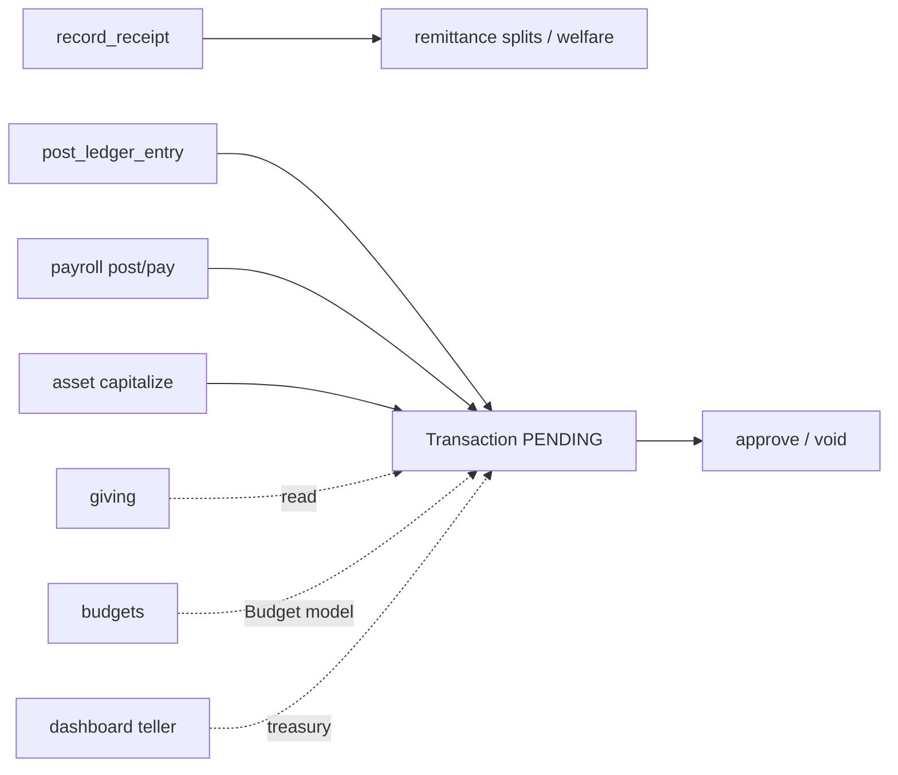

# Finance Domain Specification (Umbrella)

**Important:** There is **no** Django app named `finance`.  
**Books of record:** `transactions`  
**Related apps:** `ledger`, `budgets`, `giving`, `remittance`, `payroll`, `assets`, `reports`, `dashboard`  
**Companions:** `transactions_spec.md`, `ledger_spec.md`, `giving_spec.md`, `docs/SECURITY/AUDIT_COMPLIANCE.md`, `AGENTS.md` §3

| Label | Meaning |
|-------|---------|
| **Current** | Implemented in code |
| **Planned (AGENTS.md)** | Constitution aspirations |
| **Must not change** | Integrity invariants for AI agents |

---

## 1. Purpose

Describe how ChurchHub implements church finance end-to-end: chart of accounts, double-entry journals, business date/periods, approvals, remittance hooks, and read-only giving — without inventing a separate finance package.

---

## 2. Responsibilities (Current)

| Concern | Owning app |
|---------|------------|
| Accounts, journals, lines, working day, periods, cutoff, recon, financial audit, budget **model**, idempotency | **`transactions`** |
| Posting **templates** (LedgerCategory), CoA UI, category-driven entry | **`ledger`** |
| Budget planning UI / variance (model in transactions) | **`budgets`** |
| Member giving statements / leaders (read-only) | **`giving`** |
| Remit policies, settlements, welfare | **`remittance`** |
| Payroll → journals | **`payroll`** |
| Fixed assets → CAPITAL journals | **`assets`** |
| Cash/teller widgets | **`dashboard`** (+ `transactions.treasury`) |

---

## 3. Architecture (Current)

### Planned (AGENTS.md)

Dedicated finance/accounting/treasury modules, full fund accounting entities, multi-currency, soft-delete, REST `/api/v1/` finance APIs.

### Must not change

- Do **not** create a parallel general ledger beside `Transaction` / `TransactionLine`.  
- Do **not** invent a `finance` app or fake REST endpoints.  
- Keep all posting through services that enforce balance, period, and working day.

---

## 4. Models (domain map)

See `transactions_spec.md` for full field inventory. Summary:

| Model | Role |
|-------|------|
| `Account` | Per-church CoA |
| `Transaction` + `TransactionLine` | Journals (signed amounts) |
| `WorkingDay` / `FinancialPeriod` | Business date / month lock |
| `MonthlyCutoff` | Remittance payable snapshot |
| `OfferingCategory` | Offering → account map |
| `Budget` | Budget lines by level |
| `BankReconciliation` (+ items) | Bank recon |
| `FinancialAuditLog` | Financial audit |
| `FinancialIdempotencyKey` | POST idempotency |
| `ledger.LedgerCategory` | DR/CR posting templates |

`giving` / `budgets` apps: **no local models**.

---

## 5. Enumerations (Current — selected)

| Enum | Values |
|------|--------|
| Transaction types | RECEIPT, EXPENSE, TRANSFER, PAYROLL, CAPITAL |
| Approval | PENDING, APPROVED, REJECTED |
| Line funds | OPERATIONAL, TITHE_TRUST, COMBINED_TRUST, COMBINED_RETENTION, WELFARE |
| WorkingDay | OPEN, CLOSED |
| Budget levels | CHURCH, DEPARTMENT, DISTRICT, CONFERENCE |
| LedgerCategory types | RECEIPT, EXPENSE, TRANSFER |

Account types include tithe/combined/income/expense, remit payables, welfare, payroll payables, BANK, CASH, PPE/depreciation, etc. (full list in `transactions_spec.md`).

---

## 6. Relationships — double-entry (Current)

**Integrity rule:** sum of `TransactionLine.amount` for a transaction must equal **0** (quantized). There are no separate “debit column / credit column” fields — signs encode DR/CR.

---

## 7. Managers

**None** in finance apps. Planned managers/repos: not implemented. Prefer services + scoped querysets.

---

## 8. Services (Current overview)

| App | Entry points |
|-----|----------------|
| `transactions.services` | `record_receipt/expense/transfer`, remittance, approve/reject/void, working day, periods, recon, cutoff |
| `transactions.treasury` | Cash position, teller summary |
| `transactions.idempotency` | Claim/complete keys |
| `ledger.services` | Seed, categories, `post_ledger_entry`, CoA CRUD helpers |
| `budgets.services` | Save/delete budget, variance, KPIs, export |
| `giving.services` | Read-only summaries / leaders |

---

## 9–12. Forms / Views / URLs / Templates

Documented per app in sibling specs. Mounts:

| Prefix | App |
|--------|-----|
| `/transactions/` | transactions |
| `/ledger/` | ledger |
| `/budgets/` | budgets |
| `/giving/` | giving |

---

## 13. Business & financial rules (Current)

1. Journals must balance.  
2. Posting requires open `FinancialPeriod` and open `WorkingDay` matching date.  
3. Approved transactions lock; lines on locked txns cannot change.  
4. Corrections via `void_transaction` (reversal), not silent edit.  
5. Maker-checker: creator cannot approve own (except superadmin path).  
6. Church isolation on every account/line/txn.  
7. Receipt references unique per church.  
8. Idempotency on financial POSTs where implemented.  
9. Remittance retain% + remit% = 100 (remittance app).  

---

## 14. Approval workflows (Current)

Ledger posts typically land **PENDING** then go to transactions approval queue.

---

## 15. Validation rules (Current)

- Positive amounts on receipt/expense forms.  
- Account church = transaction church.  
- Period/working-day asserts before post.  
- Ledger: debit ≠ credit; `requires_member` when flagged.  
- Recon finalize: matched total equals statement balance.

---

## 16. Permissions (Current)

Finance codenames include (among others): `view_transactions`, `manage_finances`, `manage_receipts`, `manage_expenses`, `approve_transactions`, `void_transactions`, `reject_transactions`, `lock_periods`, `unlock_periods`, `manage_working_day`, reconciliation/cutoff/export codes, `view_ledger`, `manage_ledger_entries`, `manage_gl_categories`, `manage_chart_of_accounts`, budget/giving codes.

**Debt:** some POST paths gate mainly on `can_approve_transactions` while finer `can_*` appear only in templates — see `transactions_spec.md`.

Feature flags: `ledger`, `budgets`, `giving_portal` (sitecontrol).

---

## 17. Church & denomination scoping (Current)

- All core models keyed by `church` (budget also district/conference levels).  
- Views: `require_church` / `filter_by_church`.  
- Denomination wall via global middleware; remittance/transfer rules block cross-denomination where coded.

---

## 18. Audit logging (Current)

`FinancialAuditLog` actions: CREATE, UPDATE, APPROVE, REJECT, VOID, REMIT, BUDGET_*.  
Admin read-only. Budget audits written from `budgets.services`.

---

## 19. Reports (Current)

| Report | Location |
|--------|----------|
| Transaction register export | transactions list |
| Financial dashboard statement CSV/Excel/PDF | `transactions.reporting` |
| Ledger entries export | ledger entries view |
| Budget vs actual / KPIs | budgets services |
| Giving statement export | giving statement |
| Broader analytics | `reports` app |

---

## 20. Module interactions

---

## 21. Current vs Planned vs Must-not-change

| Topic | Current | Planned | Must not change |
|-------|---------|---------|-----------------|
| GL storage | `transactions` | Richer CoA taxonomy | No second GL in `ledger` |
| Soft-delete | Void/reversal | Soft-delete columns | Do not hard-delete posted journals |
| Currency | Single (implicit) | Multi-currency | Do not invent FX fields without migration |
| API | Session JSON helpers only | `/api/v1/` | Do not invent fake REST |
| Petty cash / procurement / vendors | Absent | AGENTS domains | Do not invent tables |

---

## 22. Technical debt

- Permission granularity uneven between templates and POST gates.  
- Dual remittance paths (`MonthlyCutoff` vs `SettlementBatch`).  
- AGENTS “Assets/Liabilities/Equity” taxonomy vs domain `ACCOUNT_TYPES`.  
- `giving` / `budgets` naming vs empty models.  
- Mega `transactions/services.py`.

---

## 23. Future recommendations

1. Unify remittance lifecycle documentation and ops.  
2. Align POST permission gates with registry `can_*`.  
3. Thin finance views; split services by posting/approval/period.  
4. Soft-delete only with explicit design (void remains for journals).  
5. When `/api/v1/` arrives, wrap existing services — never bypass them.

---

## 24. Signals (domain)

| App | Signals |
|-----|---------|
| `transactions` | Church `post_save` → seed default accounts/offerings when not provisioned |
| `ledger` | Church create → seed ledger categories/accounts (wired in `ledger/signals.py`) |
| `giving` | None |
| `budgets` | None (uses `transactions.Budget`) |

---

## 25. Middleware dependencies (domain)

Finance apps do not register their own middleware. They depend on:

- Authentication + CSRF  
- `permissions` cache + role enforcement  
- `sitecontrol` denomination context, user scope, maintenance, login rate limit  
- Feature gates via `require_feature(...)` (`ledger`, `budgets`, `giving_portal`, `remittance`, `payroll`, `assets`, `advanced_reports`)

---

## 26. Security considerations (domain)

- Server-side church isolation on every journal/account.  
- Maker-checker: no self-approve (except superadmin path).  
- Locked journals; corrections via void/reversal.  
- Financial idempotency on POSTs.  
- Giving/payroll PII and statements permission-gated.  
- No DRF surface — session auth only.  
- Do not log secrets or raw bank/TIN data.

---

## 27. Known architectural gaps

- No `finance` app package.  
- Dual remittance paths (MonthlyCutoff vs SettlementBatch); district+ settlement posting incomplete.  
- `Budget` model in `transactions`; UI in `budgets` (`approve_budgets` / `lock_budgets` largely unused).  
- Domain `Account.account_type` vs AGENTS classic A/L/E taxonomy.  
- Soft-delete not implemented (void/status instead).  
- No `/api/v1/` finance API.  
- Uneven POST permission granularity in transactions; some companion apps auto-APPROVE journals (payroll/assets/settlements) while ledger posts stay PENDING.

---

## 28. Planned (AGENTS.md) vs Recommended

| Topic | Current | Planned | Recommended |
|-------|---------|---------|-------------|
| Module layout | Split apps | Richer treasury/accounting packages | Keep `transactions` as books of record |
| Soft-delete | Void/reversal | Soft-delete columns | Do not hard-delete posted journals |
| API | Session helpers | Versioned REST | Wrap existing services only |
| Multi-currency | Implicit single | Multi-currency | Explicit design + migrations |

---

## 29. Related specs

- `../TRANSACTIONS/transactions_spec.md`  
- `../LEDGER/ledger_spec.md`  
- `../GIVING/giving_spec.md`  
- `../REMITTANCE/remittance_spec.md`  
- `../PAYROLL/payroll_spec.md`  
- `../ASSETS/assets_spec.md`  
