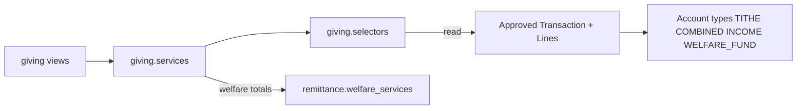
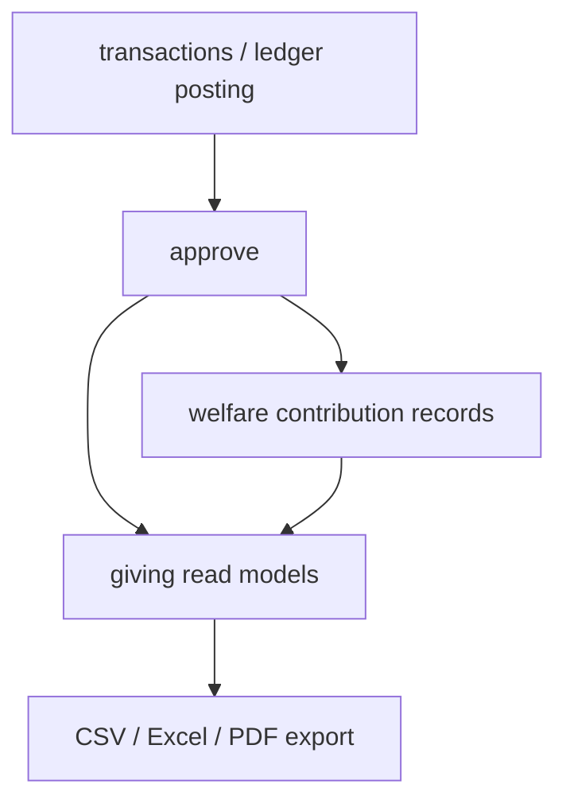
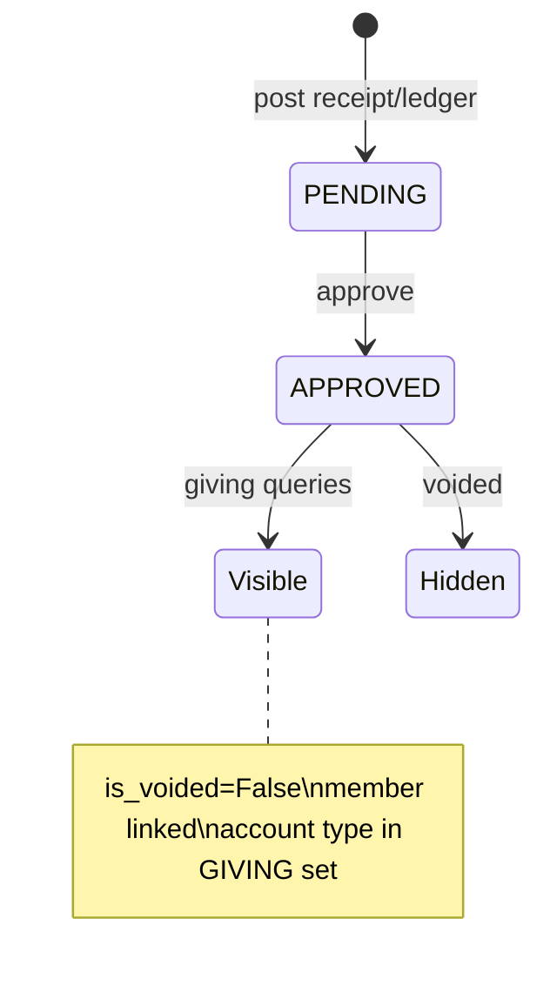
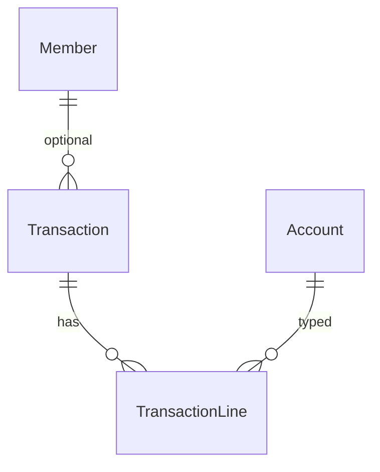
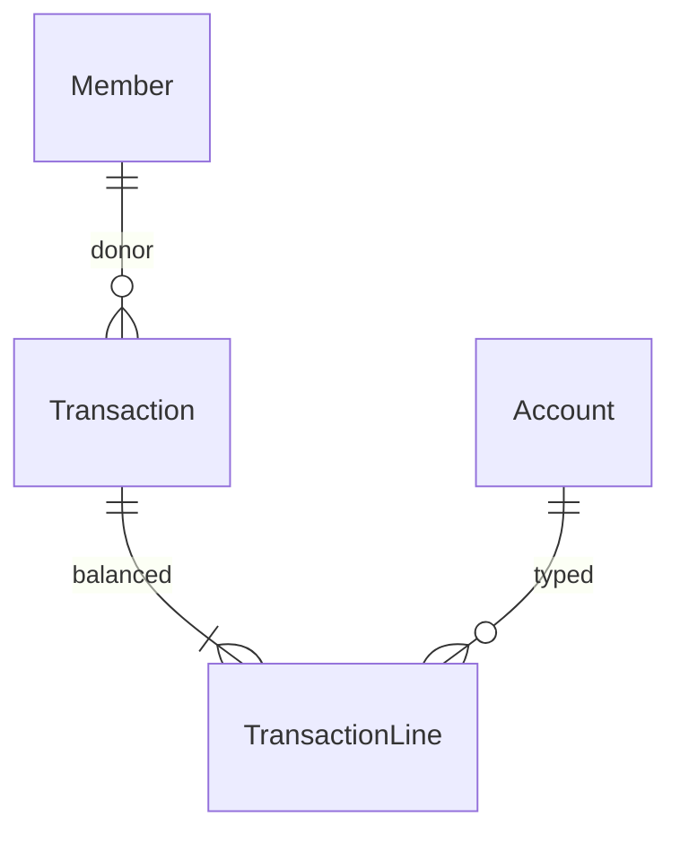

# Giving Module Specification

**App:** `giving`  
**Mount:** `/giving/`  
**Role:** Read-only member giving statements and church leaderboards from approved journals  
**Companions:** `../TRANSACTIONS/transactions_spec.md`, `../FINANCE/finance_spec.md`, `AGENTS.md` §3 (Tithes/Offerings/Donations)

| Label | Meaning |
|-------|---------|
| **Current** | Implemented |
| **Planned** | AGENTS aspirations |
| **Must not change** | Integrity invariants |

---

## 1. Purpose

Surface **approved, non-voided** tithe/combined/income/welfare giving history per member and top contributors per church. This app does **not** record receipts — posting remains in `transactions` / `ledger`.

---

## 2. Responsibilities (Current)

| Owns | Does not own |
|------|----------------|
| Read helpers over `TransactionLine` | Chart of accounts |
| Church leaders list | Receipt/expense posting |
| Member statement UI + export | Approvals / voids |
| Feature flag `giving_portal` | Envelope/receipt number generation |

---

## 3. Architecture (Current)



Repositories are empty — Giving does not write journals.
### Module interactions



### Transaction lifecycle (giving consumes end state)



---

## 4. Models (Current)

**None.** `giving/models.py` is empty.

All data comes from:

- `transactions.Transaction` / `TransactionLine` / `Account`  
- `remittance` welfare summaries (via `member_welfare_summary`)  
- `members.Member` for church-scoped lookup  

---

## 5. Enumerations (Current)

Service constant (not a Django choices field):

```text
GIVING_ACCOUNT_TYPES = ("TITHE", "COMBINED", "INCOME", "WELFARE_FUND")
```

Leaders board uses only `TITHE` and `COMBINED`.

---

## 6. Relationships

No local FKs. Logical:



Giving filters: `approval_status=APPROVED`, `is_voided=False`, member set, account type in giving set.

---

## 7. Managers / selectors / repositories (Current)

**Managers:** none.

| Module | Role |
|--------|------|
| `selectors.py` | Approved journal/line reads, church-scoped member lookup, leaderboard line qs, type aggregates |
| `repositories.py` | **Empty by design** — Giving persists nothing; books of record stay in `transactions` |

**Layering (P1-2):** Views → services → selectors → (read-only) models in `transactions` / `members`.  
**Giving = reporting/statement layer.** **Transactions = accounting system of record.** Church scope, permissions, and export behavior are unchanged.

`tests_layers.py` characterizes selector reads, church isolation, statement aggregation, export row prep, and repository read-only posture.

---

## 8. Services (Current)

| Function | Behavior |
|----------|----------|
| `can_view_member_giving(user, member)` | Finance / view_giving / manage_members, or linked member + `view_own_giving` |
| `member_giving_lines(member, year=None)` | Approved non-voided lines for giving account types (via selectors) |
| `member_giving_summary(member, year=None)` | Abs totals by type + total; adds `welfare_contributed` / `welfare_received` |
| `church_giving_leaders(church, year=None, limit=20)` | Top members by abs TITHE+COMBINED |
| `export_giving_statement_table(lines)` | Headers/rows for CSV/Excel/PDF (abs amounts) |

**Does not create, approve, or void transactions.**

---

## 9. Forms (Current)

**None.** Year filter via `GET ?year=`.

---

## 10. Views (Current)

| View | Gates |
|------|--------|
| `giving_index` | login + feature `giving_portal` + (`view_giving` or `manage_finances`) |
| `member_statement` | login + feature + `can_view_member_giving`; church-scoped member via `filter_by_church` |

Export on statement: `?export=csv|excel|pdf` requires `export_giving` or `manage_finances`.

---

## 11. URLs (Current)

`app_name=giving` under `/giving/`:

| Path | Name |
|------|------|
| `` | `index` |
| `member/<uuid:member_id>/` | `member_statement` |

---

## 12. Templates (Current)

- `templates/giving/index.html` — leaders  
- `templates/giving/statement.html` — member statement  

---

## 13. Business rules (Current)

- Read-only portal; no write path.  
- Feature `giving_portal` must be enabled.  
- Only approved, non-voided member-linked journals count.  
- Own-giving requires `user.member_id` match + `view_own_giving`.  
- Statement amounts displayed as `abs(line.amount)`.  

---

## 14. Financial rules (Current)

Giving **never** posts journals. Financial integrity remains entirely in `transactions` (balance, period, working day, void = reversal).

Agents must not add “quick tithe create” inside this app without going through txn/ledger services.

---

## 15. Approval workflows (Current)

**None local.** Visibility depends on transactions approval/void state.

---

## 16. Validation rules (Current)

- Year parsed from query string (defaults to current year).  
- Member must be in requester’s church scope.  
- Export format whitelist: `csv`, `excel`, `pdf`.  

---

## 17. Permissions (Current)

| Code | Helper | Used for |
|------|--------|----------|
| `view_giving` | `can_view_giving` | Index / statements |
| `manage_giving` | `can_manage_giving` | Registered; index currently uses view/manage_finances |
| `view_own_giving` | `can_view_own_giving` | Self statement |
| `export_giving` | `can_export_giving` | Exports |
| `manage_finances` | `can_manage_finances` | Broad override on index/export |
| `manage_members` | `can_manage_members` | Statement access via `can_view_member_giving` |

---

## 18. Church & denomination scoping (Current)

`require_church` on index; `filter_by_church(Member…)` on statement. Leaders query filters `Transaction.church=church`. Cross-church leakage blocked by scope helpers.

---

## 19. Audit logging (Current)

No dedicated giving audit table. Underlying CREATE/APPROVE/VOID remain on `FinancialAuditLog` in transactions. Statement exports call `reports.services.audit_export` (`report_key=giving_statement`).

---

## 20. Reports (Current)

- Church leaders (top 20 by year)  
- Member statement with optional CSV / Excel / PDF via `reports.exporters`  

AGENTS-style donation acknowledgments / corporate donors / restricted gifts: **not implemented** here.

---

## 21. Integration with other modules

| Module | Integration |
|--------|-------------|
| transactions | Source journals/lines/accounts |
| remittance | Welfare contributed/received in summary |
| members | Member identity + church filter |
| permissions / sitecontrol | Codes + `giving_portal` |
| reports | Table exporters |

### Double-entry relationship (read path)



Giving selects a subset of credit/debit lines by account type; it does not rebalance.

---

## 22. Current vs Planned vs Must-not-change

| Topic | Current | Planned (AGENTS) | Must not change |
|-------|---------|-------------------|-----------------|
| Posting | None | Envelope/receipt UX may expand elsewhere | Do not post from `giving` bypassing txn services |
| Models | Empty app | Possible statement cache / pledges | Do not invent Donation tables without approval |
| Anonymous / corporate / in-kind | Absent | AGENTS donation types | Document as planned only |
| Privacy | Permission-gated | Stronger PII masking | Do not expose statements without `can_view_member_giving` |
| API | HTML + export query | `/api/v1/` | Do not invent REST |

---

## 23. Technical debt

- `manage_giving` registered but index does not call it.  
- Leaders/summary loops can be expensive (Python aggregation).  
- Signed amounts → `abs()` may confuse fund-side interpretation if account signs vary.  
- Empty models.py invites agents to invent schema — resist.  

---

## 24. Future recommendations

1. Keep giving read-only; add pledges/acknowledgments only via approved design.  
2. Align `manage_giving` usage with registry description.  
3. Aggregate with ORM `annotate` for leaders performance.  
4. Optional export audit events if compliance requires.  

---

## 25. Signals (Current)

**None.**

---

## 26. Middleware dependencies (Current)

Auth/CSRF + church scope + `require_feature("giving_portal")` + permissions checks. No giving-specific middleware.

---

## 27. Security considerations (Current)

- Statement access via `can_view_member_giving` (finance/giving/members/own).  
- Exports require `export_giving` or `manage_finances`.  
- Church-filtered member lookup.  
- Do not expose other churches’ donors.  
- Read-only — no financial mutation surface.

---

## 28. Known architectural gaps

- Empty models; AGENTS donation types absent.  
- `manage_giving` underused vs registry.  
- Python aggregation for leaders may not scale.  
- Export audited via `ReportAccessAuditLog` (`audit_export`); no domain-specific giving audit table.

---

## 29. Planned vs Recommended

| Topic | Current | Planned (AGENTS) | Recommended |
|-------|---------|------------------|-------------|
| Posting | None | Envelope/receipt UX elsewhere | Keep giving read-only |
| Donations | Tithe/combined/income/welfare lines | Anonymous/corporate/in-kind | Design before schema |
| API | HTML + export | `/api/v1/` | Permission-identical to views |

---

## 30. AI agent hard stops

Do **not**:

- Add write/post endpoints that create journals without `transactions`/`ledger` services  
- Invent Giving/Donation models or migrations without approval  
- Bypass church filters or permission checks  
- Treat voided or PENDING journals as giving history  
- Claim soft-delete or DRF APIs exist in this app  
