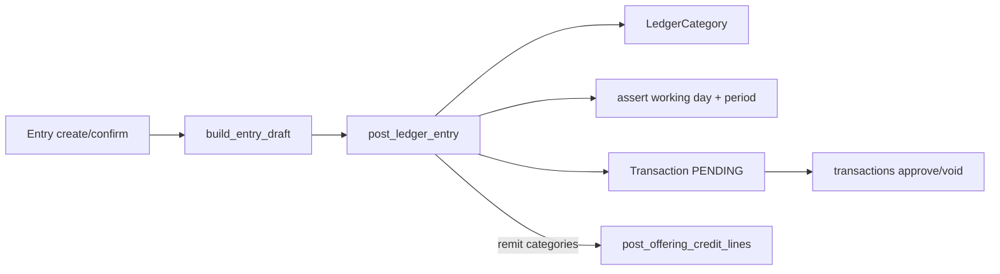
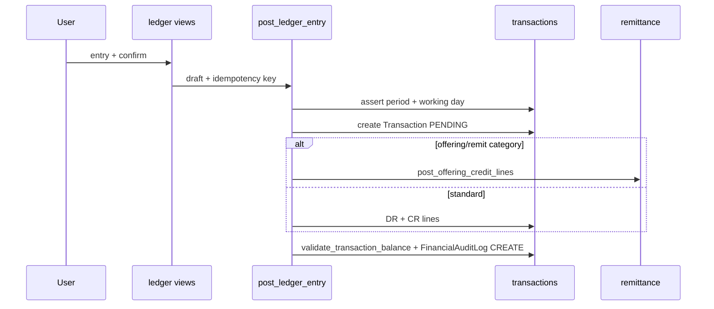
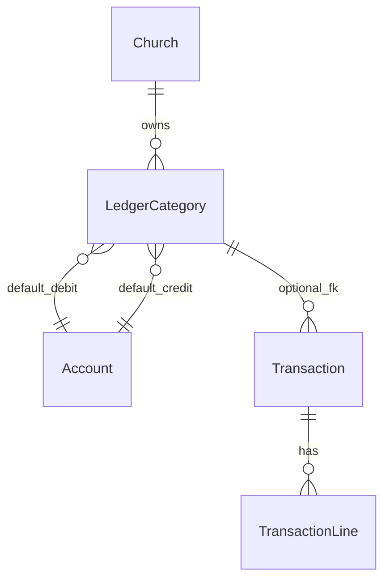
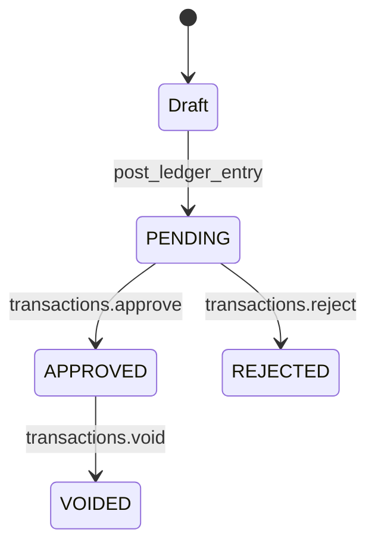
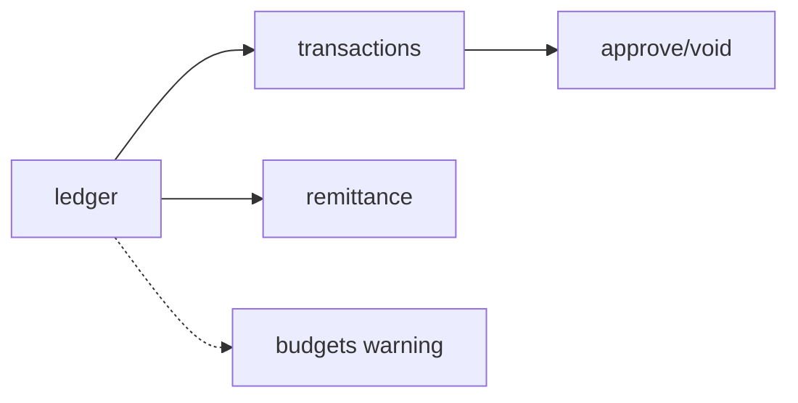

# Ledger Module Specification

**App:** `ledger`  
**Mount:** `/ledger/`  
**Role:** Chart-of-accounts **UI** + **LedgerCategory** debit/credit templates + guided posting — **not** a second general ledger  
**Companions:** `../TRANSACTIONS/transactions_spec.md`, `../FINANCE/finance_spec.md`, `AGENTS.md` §3

| Label | Meaning |
|-------|---------|
| **Current** | Implemented |
| **Planned** | AGENTS aspirations |
| **Must not change** | Integrity invariants |

---

## 1. Purpose

Provide church-scoped posting templates (`LedgerCategory`) and UI to create **PENDING** `transactions.Transaction` journals (with optional remittance credit splits). CoA create/edit helpers live here but persist `transactions.Account`.

---

## 2. Responsibilities (Current)

| Owns | Does not own |
|------|----------------|
| `LedgerCategory` model | Journal approve/reject/void |
| Seed categories/accounts helpers | Working day / period models |
| Posting draft → confirm → `post_ledger_entry` | Budget planning UI |
| Category JSON helpers | Giving statements |
| CoA list/add/edit UI | Remittance policy definitions |

---

## 3. Architecture (Current)

**Critical:** Ledger does **not** store balances. Every post becomes `Transaction` + `TransactionLine`s.

### Financial posting flow (ledger path)

---

## 4. Models (Current)

**Only model:** `LedgerCategory`

| Field | Notes |
|-------|--------|
| `id` | UUID PK |
| `church` | FK `organization.Church` |
| `code`, `name` | Unique together `(church, code)` |
| `transaction_type` | RECEIPT / EXPENSE / TRANSFER |
| `default_debit_account` | FK `transactions.Account` PROTECT |
| `default_credit_account` | FK `transactions.Account` PROTECT |
| `default_narration` | Optional suggested text |
| `requires_member` | Tithe-style receipts |
| `remit_to_district` | Receipts use remittance policy splits |
| `is_active`, `sort_order`, `created_at` | |

**Constraint:** `ledger_category_debit_ne_credit` (debit ≠ credit).  
`clean()`/`save()` require both accounts belong to the same church.

**Managers:** none custom.

---

## 5. Enumerations (Current)

`LedgerCategory.TRANSACTION_TYPES`: `RECEIPT`, `EXPENSE`, `TRANSFER` only (not PAYROLL/CAPITAL — those post elsewhere).

---

## 6. Relationships

`Transaction.ledger_category` set when posted from this app.

---

## 7. Managers / selectors / repositories (Current)

**Managers:** none custom.

| Module | Role |
|--------|------|
| `selectors.py` | Category/account/entry reads, church-scoped lookups, summary counts, budget lookup for expense warning |
| `repositories.py` | LedgerCategory create/update/seed writes; Account/Transaction persistence via `transactions.repositories` |

**Layering (P1-2):** Views → services → selectors/repositories → models. Views/forms handle HTTP and forms only. **Ledger = posting templates/categories + CoA UI.** **Transactions = Account, Transaction, TransactionLine (books of record).** Church scope, finance permissions, and posting behavior are unchanged.

`tests_layers.py` characterizes selector reads, church isolation, permission helpers, repository writes, and transaction integration.

---

## 8. Services (Current)

Key functions in `ledger/services.py`:

| Function | Role |
|----------|------|
| `seed_ledger` / `seed_ledger_accounts` / `seed_ledger_categories` | Provision templates |
| `get_categories_*`, `get_ledger_summary`, `get_ledger_entries` | Read helpers |
| `get_category_gl_totals`, `export_ledger_entries_table` | Report helpers |
| `build_entry_draft` | Preview lines + optional budget warning |
| `post_ledger_entry` | Atomic post → PENDING txn + audit + optional welfare |
| `create_ledger_category` / `update_ledger_category` | Category CRUD |
| `create_gl_account` / `update_gl_account` | CoA via `transactions.Account` |

**Signals:** church create → seed ledger (when wired).  
**Command:** `seed_ledger`.

**Posting rules inside `post_ledger_entry`:**

- Idempotency action `"LEDGER"` when key provided  
- Period + working day asserts  
- Amount > 0  
- Remittance-aware credits when `offering_type_for_category` resolves  
- Else DR `+amount` / CR `-amount` with fund tags from account type  
- `validate_transaction_balance`  
- Welfare contribution hook when offering type WELFARE + member  
- Receipt auto-approve when under treasury limit  

**Treasury Record Receipt (Current):** uses RECEIPT `LedgerCategory` rows via `transactions.record_receipt_by_category` → `post_ledger_entry` (same account/remittance rules; description field retained on the form).
---

## 9. Forms (Current)

| Form | Role |
|------|------|
| `LedgerEntryForm` | Amount, date, category, narration, member |
| `LedgerCategoryCreateForm` / `LedgerCategoryEditForm` | Template CRUD |
| `AccountForm` | CoA create/edit |

---

## 10. Views (Current)

Decorator `ledger_finance_required`: login + feature `ledger` + any of `view_ledger` / `manage_ledger_entries` / `manage_finances`.

Views: index, account list/create/edit, category list/create/detail/edit, category report, entry list, entry create, entry confirm, `api_categories`, `api_category_detail`.

Finer create/edit gates use `manage_gl_categories` / `manage_chart_of_accounts` / `manage_ledger_entries` as coded in each view.

---

## 11. URLs (Current)

`app_name=ledger` under `/ledger/`:

| Path | Name |
|------|------|
| `` | `index` |
| `accounts/`, `accounts/add/`, `accounts/<uuid>/edit/` | CoA |
| `categories/`, `categories/add/`, `categories/<uuid>/`, `…/edit/` | categories |
| `by-category/` | `category_report` |
| `entries/` | `entries` |
| `entry/`, `entry/confirm/` | post flow |
| `api/categories/`, `api/categories/<uuid>/` | session JSON (**not** DRF `/api/v1/`) |

---

## 12. Templates (Current)

Under `templates/ledger/` (index, accounts, categories, entries, entry forms, reports). Presentation + permission display only.

---

## 13. Business rules (Current)

- Feature flag `ledger` required.  
- Debit ≠ credit; same-church accounts.  
- Posts create **PENDING** transactions (not auto-approved).  
- Remit categories use remittance policy splits instead of flat credit.  
- `requires_member` enforced when flagged.  

---

## 14. Financial rules (Current)

| Rule | Enforced by |
|------|-------------|
| Balance = 0 | `validate_transaction_balance` |
| Period open | `assert_period_open` |
| Working day | `assert_working_day_allows_posting` |
| Approval / void | `transactions` only |
| DR ≠ CR | DB constraint + `clean` |

---

## 15. Approval workflows (Current)

---

## 16. Validation rules (Current)

Forms + `build_entry_draft` / `post_ledger_entry` ValueErrors; category church ownership; optional budget soft warning (does not hard-block unless budgets hard limits exist elsewhere — current path warns).

---

## 17. Permissions (Current)

| Code | Helper |
|------|--------|
| `view_ledger` | `can_view_ledger` |
| `manage_ledger_entries` | `can_manage_ledger_entries` |
| `manage_gl_categories` | `can_manage_gl_categories` |
| `manage_chart_of_accounts` | `can_manage_chart_of_accounts` |
| `manage_finances` | also satisfies `ledger_finance_required` |

---

## 18. Church & denomination scoping (Current)

All categories and posts require `require_church`; accounts/categories filtered to that church. Denomination wall via global middleware.

---

## 19. Audit logging (Current)

`FinancialAuditLog` CREATE with `details.source = "ledger"` via transactions `_log_audit`. Category/CoA changes follow service/view logging as implemented — no separate ledger audit table.

---

## 20. Reports (Current)

- Entry list + export helper  
- Category GL totals / by-category report  
- Broader statements remain under `transactions` / `reports`

---

## 21. Integration with other modules

| Module | Integration |
|--------|-------------|
| transactions | Books of record; Account CoA; balance/period/WD; audit |
| remittance | Offering credit splits; welfare contribution |
| budgets | Soft expense variance warning in draft |
| permissions / sitecontrol | Codes + feature `ledger` |
| organization | Church seed signal |

### Module interactions

---

## 22. Current vs Planned vs Must-not-change

| Topic | Current | Planned (AGENTS) | Must not change |
|-------|---------|-------------------|-----------------|
| Role | Templates + post UI | Rich fund/dept UX | Do not add a second GL |
| CoA taxonomy | Domain `Account.account_type` | Classic A/L/E/I/E | Do not invent types in docs alone |
| Immutability | Via txn lock/void | Stronger reverse UX | Do not edit APPROVED lines |
| API | Session JSON | `/api/v1/` | Do not claim DRF exists |

---

## 23. Technical debt

- Remittance split logic shared across ledger/transactions/remittance.  
- Easy for agents to invent `LedgerEntry` balance tables — forbidden.  
- CoA UI in ledger while `Account` lives in transactions (intentional, but easy to confuse).  

---

## 24. Future recommendations

1. Keep `post_ledger_entry` as the only ledger write path to the GL.  
2. Document clerk category→account mapping.  
3. Any future REST wrapper must call existing services.  

---

## 25. Signals (Current)

`ledger/signals.py` — church create seeds ledger accounts/categories (with `seed_ledger` command for ops).

---

## 26. Middleware dependencies (Current)

Auth/CSRF + permissions + sitecontrol scope/denomination + `require_feature("ledger")` on view decorator. No ledger-specific middleware.

---

## 27. Security considerations (Current)

- Feature + permission gates on all HTML/JSON routes.  
- Categories/accounts church-bound.  
- Posts create PENDING only; approval remains in transactions.  
- Session JSON APIs are not public REST — still auth-bound.  
- Idempotency on ledger POSTs when key supplied.

---

## 28. Known architectural gaps

- Naming confusion: “ledger” vs books of record in `transactions`.  
- Shared remittance split logic across apps.  
- No DRF; CoA UI lives here while `Account` model lives in transactions.

---

## 29. Planned vs Recommended

| Topic | Current | Planned (AGENTS) | Recommended |
|-------|---------|------------------|-------------|
| Role | Templates + post UI | Richer fund/dept UX | Never a second GL |
| API | Session JSON | `/api/v1/` | Wrap `post_ledger_entry` |

---

## 30. AI agent hard stops

Do **not**:

- Create parallel ledger balance storage  
- Auto-approve ledger posts  
- Bypass period / working-day / balance checks  
- Invent LedgerCategory fields or fake `/api/v1/` endpoints  
- Change Python/migrations when only documentation was requested  
