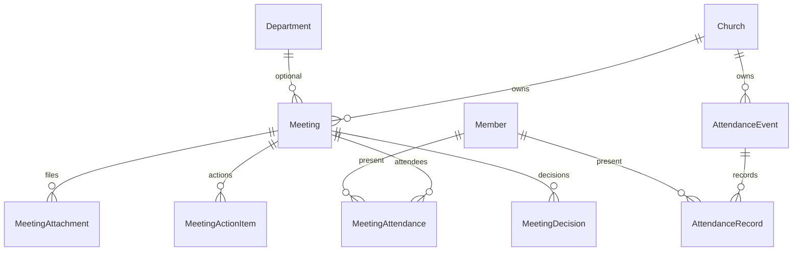

# Meetings Module Specification

**App:** `meetings` (`MeetingsConfig`)  
**Mount:** `/meetings/`  
**Canonical alias path:** `../EVENTS/events_spec.md` (spec folder EVENTS → app `meetings`)  
**Companions:** `../MEMBERS/members_spec.md`, `AGENTS.md` §2 (Attendance / Meetings)  
**Source of truth:** Live Django code

| Label | Meaning |
|-------|---------|
| **Current** | Implemented in `meetings` |
| **Planned (AGENTS.md)** | Broader events/camp meeting finance |
| **Recommended** | Future improvements |

---

## 1. Purpose and responsibilities

Church **board/department meetings** with minutes workflow, action items, decisions, attachments, plus **AttendanceEvent** / **AttendanceRecord** for worship/event attendance capture.

| Owns | Does not own |
|------|----------------|
| Meeting + minutes approval | Announcement calendar (→ `announcements`) |
| Meeting attendance | Member transfers |
| AttendanceEvent / AttendanceRecord | Event financial budgets (AGENTS — not here) |
| Action items / decisions | Remittance / payroll |

---

## 2. Models and relationships

**Managers:** none custom. Workflow helpers in `meetings/workflow.py`. Reads via `selectors.py`; writes via `repositories.py` (P1-2 layered).

---

## 3. Business rules (Current)

1. Meetings are church-scoped (`filter_by_church` / `require_church`).  
2. Minutes: draft → submit → approve/reject; approved minutes lock editing.  
3. Creator/secretary permissions via `can_edit_minutes`, `can_submit_minutes`, `can_approve_meeting_minutes`.  
4. Attendance recording for meetings and separate AttendanceEvents.  
5. Unique `(meeting, member)` on MeetingAttendance.  
6. Feature flag: views use `@require_feature("meetings")`.  
7. **Online / Zoom (Phase A):** optional `join_url`, `join_passcode`, and `show_on_portal`. Portal visibility requires a join link. Members see only `show_on_portal` sessions via `/portal/meetings/<uuid>/` (not staff meeting chrome). Staff calendar still lists all scheduled meetings.  
8. **Attachments:** validated via `church_system.uploads` (documents ≤10 MB; pdf/office/txt/csv/images; dangerous extensions blocked).

---

## 4. Services / selectors / repositories (Current)

| Module | Role |
|--------|------|
| `selectors.py` | Church-scoped meeting/attendance reads, filter helpers, member/department form querysets, attachment lookup |
| `repositories.py` | Meeting / attachment / action / decision / attendance persistence; attendance upsert + roll sync deletes |
| `services.py` | Mark held; bulk attendance sync with church-member validation |
| `workflow.py` | Minutes draft/submit/approve/reject, pending queue, capability helpers |

**Layering (P1-2):** Views → services/workflow → selectors/repositories → models. Views/forms handle HTTP and forms only; ModelForm CRUD uses `commit=False` + repositories. Church scope, minutes maker-checker, and attendance behavior are unchanged.

`tests_layers.py` characterizes selector reads, attendance isolation, cross-church denial, repository writes, attachment handling, and attendance re-record identity.

---

## 5. Permissions (Current)

Registry/helpers include: `view_meetings`, `manage_meetings`, `manage_attendance`, `submit_minutes`, `approve_minutes`, `export_minutes`.

---

## 6. URL structure (Current)

`/meetings/` (`app_name=meetings`) — list, pending minutes, create/detail/edit/action, attendance event flows. Templates under `templates/meetings/`.

---

## 7. Planned vs Recommended

| Topic | Current | Planned (AGENTS) | Recommended |
|-------|---------|------------------|-------------|
| Naming | `meetings` | Events & meetings | Keep app name; document alias |
| Layering | selectors + repositories | — | Optional split of workflow vs attendance services |
| Event finance | Absent | Budget/income/expense | New module or extend carefully |
| Live video | Zoom join link + portal page | Native WebRTC/chat room | Keep external Zoom; no in-app SFU |

**Must not change:** church scoping; minutes lock after approve; do not invent an `events` app without approval.
