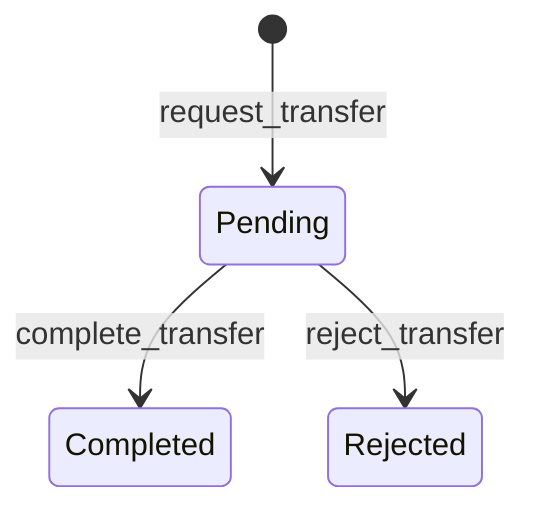
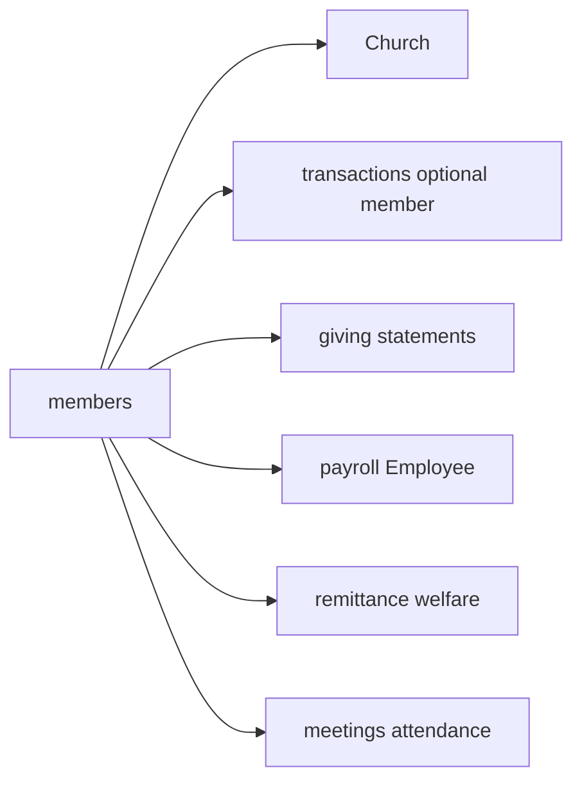

# Members Module Specification

**App:** `members`  
**Mount:** `/members/`  
**Source of truth:** Live Django code  
**Companions:** `docs/AI_CONTEXT/BUSINESS_LOGIC.md`, `docs/DATABASE/DATABASE_SCHEMA.md`, `AGENTS.md` §2 Membership

| Label | Meaning |
|-------|---------|
| **Current** | Implemented today |
| **Planned (AGENTS.md)** | Constitution aspirations |
| **Recommended** | Future improvements |

---

## 1. Purpose

Own **local church membership**: directory, member CRUD, families/departments, pastoral records, baptism register, leadership roles, spiritual gifts, church-to-church transfers, member audit, and member data export.

---

## 2. Responsibilities (Current)

| Owns | Does not own |
|------|----------------|
| `Member` and related membership entities | User accounts (→ `accounts`; optional OneToOne link) |
| Transfers between churches | Org unit transfers (→ `organization`) |
| Member audit log | Giving statements UI (→ `giving` reads transactions) |
| JSON search picker API | Visitors CRM (not implemented) |
| Baptism register | Attendance events (→ `meetings`; optional summary on detail) |
| Visitors CRM | Convert visitors → members |
| Soft-delete (`is_deleted`) on member domain entities | Hard purge tooling |

---

## 3. Models (Current)

**Managers:** default only.

### Enumerations (exact values)

| Enum | Values |
|------|--------|
| `Gender` | Male, Female |
| `MaritalStatus` | Single, Married, Widowed, Divorced |
| `MembershipStatus` | **Active, Inactive, Transferred, Deceased** |
| `TransferStatus` | Pending, Completed, Rejected |
| `RecordType` | Baptism, Marriage, Funeral, Meeting, Transfer, Other (seeded; editable via platform Member Dropdowns) |
| `MemberLookupOption` | Platform catalog for record type, status, gender, marital status, membership status |
| `RecordStatus` | Active, Archived |

### Model inventory

| Model | Highlights |
|-------|------------|
| `Department` | UUID; FK church; unique `(church, name)` |
| `Family` | UUID; FK church; optional head Member; unique `(church, name)` |
| `Occupation` | BigAuto PK; FK church; unique `(church, name)` |
| `Member` | UUID; church + optional dept/family/occupation; demographics; baptism fields; phone/membership_number partial uniques; **unique non-blank email** (case-insensitive, active records); email implies required DOB (portal); `is_active` synced from status |
| `MemberTransfer` | from/to church; status; reason/notes; requested/processed by |
| `Record` / `RecordImage` | Pastoral records + M2M images |
| `History` / `HistoryImage` | History events + images |
| `SpiritualGift` / `MemberSpiritualGift` | Gift catalog + assignments |
| `LeadershipRole` | title, dates, optional department, `is_active` |
| `MemberAuditLog` | CREATE/UPDATE/STATUS/TRANSFER_*/EXPORT/DEACTIVATE/ACTIVATE |

`Member.save`: Inactive/Transferred/Deceased → `is_active=False`; Active → `True`. Department/family/occupation must match church.

---

## 4. Managers / selectors / repositories

**Custom managers:** none.

**Current layering (Phase 2 / P1-2 Members slice):**

```
Views → Services → Selectors → Repositories → Models
```

| Layer | File | Role |
|-------|------|------|
| Selectors | `members/selectors.py` | Church-/manageable-scoped reads (directory, search, detail, records, families, transfers, leadership, gifts) |
| Repositories | `members/repositories.py` | Persistence writes (member/transfer/record/audit/dept/family/gift/leadership) |
| Services | `members/services.py` | Business rules, uniqueness, transfer lifecycle, delete blockers, audit orchestration |

Views no longer call `Member.objects` / `filter_by_church` directly for list/detail paths; they use selectors. Form `save()` on edit paths remains for ModelForm updates.

---

## 5. Services (Current)

**File:** `members/services.py`

| Function | Role |
|----------|------|
| `log_member_audit` | Audit writer |
| `find_duplicate_members` | Soft duplicate warning |
| `create_member` / `update_member` | Hard uniqueness + audit |
| `request_transfer` / `complete_transfer` / `reject_transfer` | Transfer lifecycle |
| `can_process_transfer` / `user_can_view_transfer` | Transfer authz helpers |
| `get_member_directory_stats` / `export_directory_rows` | Directory helpers |

**File:** `members/access.py` — `require_view_members`, `require_add_members`, `require_edit_members`, `require_export_members`, `require_transfer_members`, `require_process_transfers`, record/department/family/leadership/gifts/baptism requires. Granular checks do **not** OR with `manage_members` (deny overrides stick).

**File:** `members/export.py` — subject-access JSON payload helpers.  
Management: `export_member_data`.

---

## 6. Views (Current)

| View | Purpose |
|------|---------|
| `MemberListView` | Directory; `?export=csv\|excel` |
| `member_search` | JSON picker (`/api/search/`) |
| `add` / `edit` / `member_detail` / `member_timeline` | CRUD + timeline |
| `member_export` | Per-member JSON download |
| Record / department / family CRUD | Supporting entities |
| `transfer_*` | Transfer list/create/detail (+ complete/reject) |
| `baptism_register` | Baptism list/export |
| Leadership / spiritual gift views | Roles and gifts |
| `configuration_hub` / `occupation_*` / `member_lookup_*` | Administration → Configuration (occupations + form lists) |

---

## 7. URLs (Current)

`app_name = members` under `/members/`:

| Path | Name |
|------|------|
| `` | `members:list` |
| `api/search/` | `members:search` **JSON** |
| `add/`, `<uuid>/`, `edit/<uuid>/`, `timeline/<uuid>/` | add/detail/edit/timeline |
| `<uuid>/export/` | `members:member_export` |
| `records/…` | `record_*` |
| `departments/…` | `department_*` (includes hard delete) |
| `families/…` | `family_*` |
| `transfers/…` | `transfer_*` |
| `baptisms/` | `baptism_register` |
| `leadership/…` | `leadership_*` |
| `spiritual-gifts/…`, assign/remove gift | gift routes |
| `configuration/` | `members:configuration` |
| `configuration/occupations/…` | `occupation_*` (church-scoped) |
| `configuration/lists/…` | `member_lookup_*` (shared dropdown catalog; permission-gated) |

---

## 8. Templates (Current)

`templates/members/`: list/add/edit/detail/timeline, records, departments, families, transfers, baptism_register, leadership, spiritual gifts, assign_gift, confirm_delete, etc.

---

## 9. Forms (Current)

`MemberForm`, `MemberFilterForm`, `DepartmentForm`, `FamilyForm`, `RecordForm`, `MemberTransferForm`, `SpiritualGiftForm`, `MemberGiftForm`, `LeadershipRoleForm` (+ admin forms).

---

## 10. Permissions (Current)

Codenames via access helpers: `view_members`, `manage_members`, `add_members`, `edit_members`, `export_members`, `transfer_members`, `process_transfers`, `view_member_records`, `manage_member_records`, `manage_departments`, `manage_families`, `manage_leadership`, `manage_spiritual_gifts`, `manage_baptisms`.

Search API also allows selected finance/welfare/ledger perms for picker UX.

Church scoping: `filter_by_church` / `require_church` / manageable churches for transfers.

---

## 11. Business rules (Current)

**Duplicates**

- Hard: unique non-empty phone and membership_number per church (`create_member` / `update_member` + DB constraints).  
- Soft: same church, iexact name, matching DOB and/or phone → warning (create still allowed).

**Status ↔ active**

- Inactive / Transferred / Deceased force `is_active=False`.  
- Active forces `is_active=True`.

**Family / department**

- Must belong to member’s church; family head same church.  
- Transfer completion clears department and family.

---

## 12. Workflows (Current)



**Transfer rules (summary)**

| Step | Rules |
|------|-------|
| Request | Not same church; not already Transferred; no existing Pending; block cross-denomination when both denoms set |
| Complete | Pending only; process permission; end leadership at from-church; TRANSFER records both sides; move church; set Active |
| Reject | Pending → Rejected |

Baptism record add may backfill empty member baptism fields.

---

## 13. Signals

**None** in this app.

---

## 14. Middleware interactions (Current)

No members middleware. Relies on global auth, RoleEnforcement, denomination wall, and church session context. JSON search is session-authenticated and church-scoped.

---

## 15. Dependencies (Current)

`organization.Church`; `permissions.checks` / `org_scope` / `scoping`; `church_system.church_scope` / flash; optional `meetings`, `remittance.welfare_services`, `transactions` (export), `reports.exporters`.

---

## 16. Public interfaces (Current)

| Interface | Consumers |
|-----------|-----------|
| `members.Member` | Finance, payroll, meetings, portal, accounts link |
| `members.services` | Views, transfer processing |
| `members.access` | View gates |
| `members:search` JSON | `static/js/member-picker.js` |
| Directory / detail HTML | Clerks, pastors, secretaries |

---

## 16b. Cross-module interactions & financial implications



**Financial implications:** Member FK on receipts/giving/welfare/payroll — never invent parallel donor tables. Transfers must not silently reassign historical journals.

---

## 17. Security considerations (Current)

- Always church-scope member querysets.  
- Honor granular deny overrides (access.py design).  
- Exports require export permission + audit.  
- Search returns limited fields for picker — still PII; keep permissioned.  
- Department delete allowed only when no members, active leadership, or budget lines reference the row; writes `MemberAuditLog` `DEPARTMENT_DELETE`. Spiritual-gift unassign writes `GIFT_UNASSIGN` audit before delete.
- No member hard-delete view; status/`is_active` used instead.
- **Portal eligibility:** unique non-blank email + date of birth required together. Clerks should capture both accurately so members can self-serve at `/portal/login/` without staff creating user accounts.

---

## 18. Testing notes (Current)

`members/tests.py`: `ServiceTests`, `ViewTests` (matrix ensure, create/update, transfers, views).

Extend with isolation tests when changing detail/update URLs.

---

## 19. Current vs Planned vs Recommended

| Topic | Current | Planned (AGENTS) | Recommended |
|-------|---------|------------------|-------------|
| Statuses | 4 values | Many (Visitor, Missing, Suspended, …) | Additive status migration only with product approval |
| Soft-delete | Absent | Required | Introduce before any member purge tooling |
| Visitors | Headcount only elsewhere | Full visitor domain | New app/models when approved |
| Member ID | UUID + per-church membership_number | Globally unique Member ID | Clarify product rule before changing uniqueness |
| Profile richness | Limited fields | Middle name, nationality, emergency contacts, multi-contact | Additive fields |
| Managers/repos | None | Layered architecture | MemberQuerySet for directory filters |
| Family model | Single optional FK | Rich household relationships | Expand carefully |

---

## 20. Known technical debt

- Large AGENTS membership surface not modeled (skills, Bible studies, documents versioning, small groups).  
- Fat views in places.  
- Hard delete on departments/gift assignments vs “never delete history” spirit — **mitigated:** departments blocked when referenced; gift unassign audited.  
- `Occupation` / some record tables use BigAuto PKs vs UUID majority.  
- `MemberSpiritualGift` not registered in admin.

---

## 21. Admin

Church-scoped admins for Member, Department, Family, Transfer, gifts, leadership, records/history, Occupation, MemberAuditLog. `MemberSpiritualGift` not registered.
