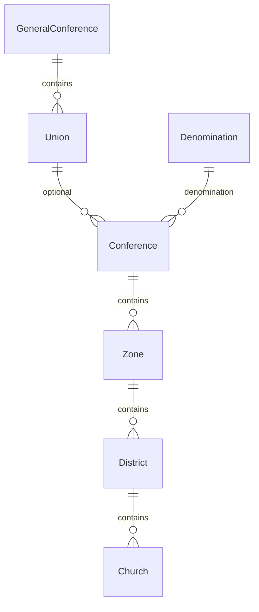
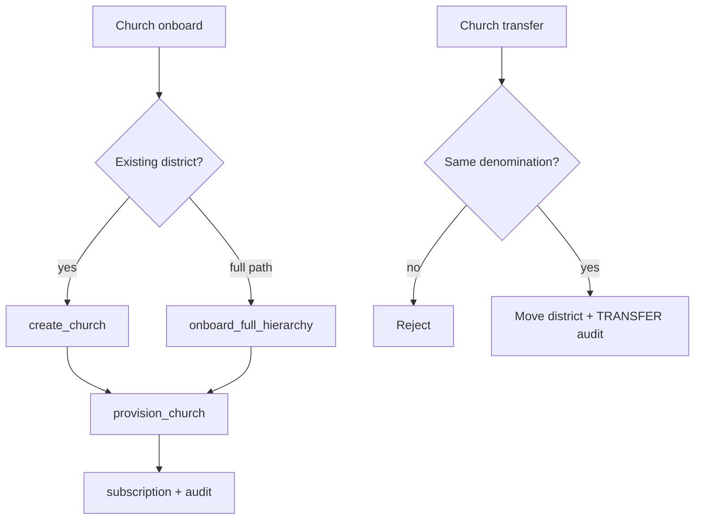
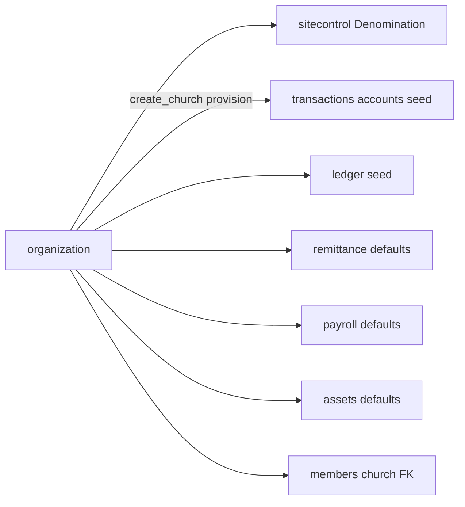

# Organization Module Specification

**App:** `organization`  
**Mount:** `/organization/`  
**Source of truth:** Live Django code  
**Companions:** `docs/ARCHITECTURE/MULTI_TENANCY.md`, `docs/AI_CONTEXT/DATABASE_MAP.md`, `AGENTS.md` §2

| Label | Meaning |
|-------|---------|
| **Current** | Implemented today |
| **Planned (AGENTS.md)** | Constitution aspirations |
| **Recommended** | Future improvements |

---

## 1. Purpose

Own the **church administrative hierarchy** and local church (operational tenant) lifecycle: structure CRUD, church onboarding/provisioning, transfer between districts, activate/deactivate, and org audit.

---

## 2. Responsibilities (Current)

| Owns | Does not own |
|------|----------------|
| GC → Union → Conference → Zone → District → Church | Denomination SaaS entity (→ `sitecontrol`) |
| Church financial provisioning orchestration | Chart of accounts rows long-term (→ `transactions`) |
| Church transfer (district move) | Member transfers (→ `members`) |
| OrganizationAuditLog | User scope fields (→ `accounts`) |
| Hierarchy export | Platform tenant applications (→ `sitecontrol`) |

---

## 3. Models (Current)

**Managers:** default only. **No** generic `Organization` or `Division` model.



| Model | Highlights |
|-------|------------|
| `GeneralConference` | UUID; unique name/code |
| `Union` | FK GC; unique `(name, general_conference)` |
| `Conference` | Unique name/code; FK `denomination` (nullable PROTECT); FK `union` (nullable) |
| `Zone` | FK conference; unique name; unique code per conference |
| `District` | FK zone; unique name; unique code per zone |
| `Church` | FK district; `address`, `is_active`, `financials_provisioned`; unique name/code per district; properties for zone/conference/union/GC/denomination |
| `OrganizationAuditLog` | CREATE/UPDATE/DEACTIVATE/ACTIVATE/TRANSFER; polymorphic entity_type/entity_id |

`Church.clean()` blocks moving to a district in another denomination (use transfer workflow).

---

## 4. Managers

**None custom.**

---

## 4b. Layering (Current — Phase 2 / P1-2 Organization slice)

```
Views → Services → Selectors → Repositories → Models
```

| Layer | File | Role |
|-------|------|------|
| Selectors | `organization/selectors.py` | Scoped hierarchy reads, directory/detail/stats, export/reconcile, form dropdown querysets |
| Repositories | `organization/repositories.py` | Audit + GC/Union/Conference/Zone/District/Church persistence (no business rules) |
| Access | `organization/access.py` | Authz gates + thin wrappers over selectors (`scoped_*`, `get_scoped_*`) |
| Services | `organization/services.py` | Hierarchy rules, provisioning orchestration, transfer/activate |
| Forms | `organization/forms.py` | Widget binding; parent FK querysets via selectors |
| Views | `organization/views.py` | Permissions, forms, HTTP only; ModelForm saves use `commit=False` + repositories |

`tests_layers.py` characterizes denomination/church isolation, hierarchy selectors, repositories, and cross-church denial.

---

## 5. Services (Current)

**File:** `organization/services.py`

| Function | Role |
|----------|------|
| `log_org_audit` | Audit writer (via repository) |
| `get_church_financial_chain` | Hierarchy chain helper |
| `setup_church_financials` / `provision_church` | Seed accounts/offerings/remittance/payroll/assets/ledger (denom or defaults) |
| `create_church` | Seat check, create, provision, subscription, audit |
| `onboard_full_hierarchy` | Conference→Zone→District→Church path |
| `update_church` | Field updates; **rejects district change** |
| `transfer_church` | Same-denomination district move + TRANSFER audit |
| `set_church_active` | Toggle `is_active` |
| `export_hierarchy_rows` | Export rows (via selectors) |
| `reconcile_organization` | Detect unprovisioned / missing subscription / orphans |

**File:** `organization/access.py` — scoped getters, `require_org_read` / `require_org_manage`, subtree/global manage asserts, capability flags.

Management: `reconcile_organization` command.

---

## 6. Views (Current)

Hierarchy overview (+ CSV/Excel export), unit directory, CRUD for GC/Union/Conference/Zone/District/Church, `church_onboard`, `church_transfer`, `church_toggle_active` (POST).

---

## 7. URLs (Current)

`app_name = organization` under `/organization/`:

| Path | Name |
|------|------|
| `` | `organization:hierarchy` |
| `directory/` | `organization:directory` |
| `general-conferences/add\|<uuid>\|edit/` | `general_conference_*` |
| `unions/…` | `union_*` |
| `conferences/…` | `conference_*` |
| `zones/…` | `zone_*` |
| `districts/…` | `district_*` |
| `churches/onboard/` | `organization:church_onboard` |
| `churches/add\|<uuid>\|edit\|transfer\|toggle-active/` | `church_*` |

---

## 8. Templates (Current)

`templates/organization/`: hierarchy, directory, `*_detail.html`, `*_form.html`, `church_onboard.html`, `church_transfer.html`, `includes/conference_tree.html`.

---

## 9. Forms (Current)

`DenominationScopedFormMixin`; `GeneralConferenceForm`, `UnionForm`, `ConferenceForm`, `ZoneForm`, `DistrictForm`, `ChurchForm`; `ChurchOnboardingForm`, `FullChurchOnboardingForm`, `ChurchTransferForm`.

---

## 10. Permissions (Current)

No app-local `permissions.py`. Uses:

- `can_view_all_churches` (read)
- `can_manage_organization` (manage)
- Transfer: `can_transfer_churches` (and scope rules in access)
- District-scoped users: restricted structure edits / onboard modes
- Onboarding may be disabled by site flags (`institution_onboarding_allowed`)

---

## 11. Business rules (Current)

- Branch seat limits before `create_church`.
- Cross-denomination church moves blocked.
- District changes only via `transfer_church`.
- Code uniqueness in target district on transfer.
- Conference code reuse blocked across denominations when resolving/creating.
- Hierarchy UI respects denomination `level_enabled` where configured.
- Financial provisioning sets `financials_provisioned`.

---

## 12. Workflows (Current)



Also: activate/deactivate church; structure CRUD; hierarchy export; reconcile command.

---

## 13. Signals

**None** in this app.

---

## 14. Middleware interactions (Current)

No organization middleware. Consumes denomination context, church scope, and permission middleware from other apps. Admin querysets use `church_q_for_scope`.

---

## 15. Dependencies (Current)

`sitecontrol` (Denomination, subscriptions, seeds, registration flags); `transactions` / `remittance` / `payroll` / `assets` / `ledger` (provision defaults); `permissions`; `members` (counts); `reports` (export helpers); `church_system` scoping/flash.

---

## 16. Public interfaces (Current)

| Interface | Consumers |
|-----------|-----------|
| Hierarchy models especially `Church` | Nearly all domain apps |
| `organization.services.create_church` / provision / transfer | Views, sitecontrol registration |
| `organization.access` | Org UI gating |
| URLs under `/organization/` | Institution admins |

---

## 16b. Cross-module interactions & financial implications



**Financial implications:** Church provisioning seeds CoA/ledger/remittance/payroll/asset defaults. Hierarchy moves must preserve denomination wall and not orphan financial rows.

---

## 17. Security considerations (Current)

- Always scope structure lists by denomination + org subtree.
- Transfers must stay within denomination.
- Provisioning can create financial artifacts — restrict to authorized org managers.
- Audit transfers and activate/deactivate.

---

## 18. Testing notes (Current)

`organization/tests.py`: `ServiceTests`, `ViewTests` (+ mixin).

---

## 19. Current vs Planned vs Recommended

| Topic | Current | Planned (AGENTS) | Recommended |
|-------|---------|------------------|-------------|
| Top of tree | GeneralConference + Denomination SaaS | “Division” language | Keep code names; document mapping |
| Soft-delete | `is_active` on Church | Soft-delete | Soft-delete before hard delete tooling |
| Transfers | Church→district only | Church/District/Conference/Union transfers with rich history | Expand carefully with audit |
| Org unit fields | Minimal (name/code/address/flags) | Phone, email, GPS, status, created_by… | Additive migrations when product needs |
| Managers | None | Managers | `ChurchQuerySet` helpers for common filters |

---

## 20. Known technical debt

- AGENTS “Division” ≠ code `GeneralConference` / `Denomination`.  
- Conference global unique name/code may be tight for multi-tenant naming.  
- Union optional → orphan conferences supported.  
- Fat views vs thin service orchestration in places.  
- No soft-delete; polymorphic audit entity refs without FK.

---

## 21. Admin

Scoped ModelAdmins for all hierarchy units + `OrganizationAuditLogAdmin`.
