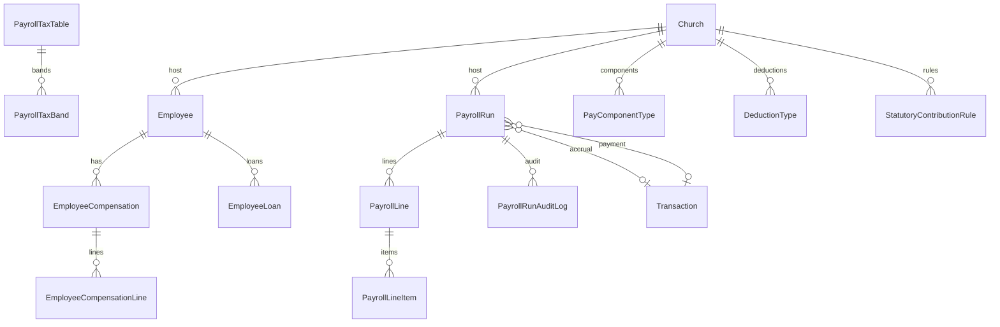
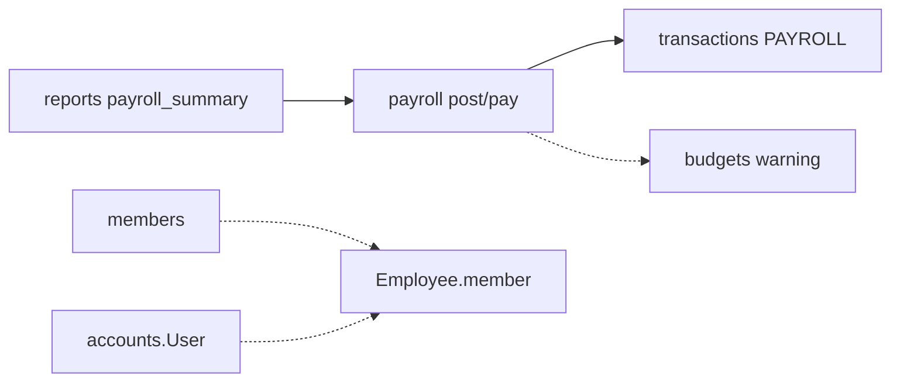

# Payroll Module Specification

**App:** `payroll` (`PayrollConfig`)  
**Mount:** `/payroll/`  
**Companions:** `../TRANSACTIONS/transactions_spec.md`, `../FINANCE/finance_spec.md`, `AGENTS.md` §3  
**Source of truth:** Live Django code

| Label | Meaning |
|-------|---------|
| **Current** | Implemented |
| **Planned (AGENTS.md)** | Constitution aspirations |
| **Recommended** | Future improvements |

---

## 1. Purpose and responsibilities

Church-scoped **HR payroll**: employees, compensation, loans, tax/statutory tables, payroll runs with calculate → approve → post → pay, payslips/schedules, encrypted PII, GL integration via PAYROLL journals.

| Owns | Does not own |
|------|----------------|
| Employee / compensation / loans | Member pastoral records |
| Tax tables, statutory rules | Chart of accounts definitions |
| PayrollRun lifecycle + audit | Remittance settlements |
| Payslip / PAYE / SSNIT PDFs | Generic reports catalog (→ `reports`) |

---

## 2. Models and relationships



### Key models
- **PayComponentType / DeductionType** — per `host_church`; deduction methods FIXED / PERCENT_GROSS / PERCENT_BASIC / COMPUTED  
- **PayrollTaxTable / PayrollTaxBand** — versioned PAYE  
- **StatutoryContributionRule** — employee/employer rates on BASIC or GROSS  
- **Employee** — employment types FULL_TIME/PART_TIME/CONTRACT/STIPEND/VOLUNTEER_ALLOWANCE; status ACTIVE/SUSPENDED/TERMINATED; optional member/user; `paying_unit_type`+`paying_unit_id`; encrypted TIN/SSNIT/bank fields  
- **EmployeeCompensation** (+ lines), **EmployeeLoan**  
- **PayrollRun** — DRAFT → CALCULATED → APPROVED → POSTED → PAID (also REJECTED, VOID); unique per host church + paying unit + year/month; FKs to accrual `transaction` and `payment_transaction`  
- **PayrollLine / PayrollLineItem**, **PayrollRunAuditLog**

**Managers:** none custom.

**Current layering (Phase 2 / P1-2 Payroll slice):**

```
Views → Services → Selectors → Repositories → Models
```

| Layer | File | Role |
|-------|------|------|
| Selectors | `payroll/selectors.py` | Church-scoped reads (employees, runs, lines, tax/statutory catalogs, budget/YTD aggregates) |
| Repositories | `payroll/repositories.py` | Persistence writes (defaults seed, run/line/audit, compensation/loan, policy) |
| Services | `payroll/services.py` | PAYE/statutory calc, run lifecycle, post/pay journals via `transactions.repositories` |

Views no longer call payroll model managers / `get_object_or_404` on domain models directly for list/detail paths.

---

## 3. Business rules (Current)

1. Rates come from tables/rules — not hardcoded PAYE bands in calc core.  
2. Run uniqueness per paying unit period.  
3. Lifecycle gated by services: calculate, treasury approve (where used), approve, reject, void, reopen, post, pay, reverse.  
4. Post/pay create balanced `transactions.Transaction` (type PAYROLL) with period/working-day/idempotency (`PAYROLL_POST` / `PAYROLL_PAY`).  
5. Soft budget warning via `check_payroll_budget`.  
6. Feature flag: `payroll`.  
7. Segregation: distinct approve / post / pay permission codes.

---

## 4. Services (Current)

**`payroll/services.py`:** defaults seed, tax/statutory lookup, `calculate_paye`, `calculate_employee_pay`, run create/calculate/approve/reject/void/reopen/post/pay/reverse, register/CSV helpers, hierarchy rollup, PII set/get/display.

**`payroll/reports.py`:** PAYE/SSNIT schedule PDFs, tax certificate, register CSV, cost reports.

**`payroll/encryption.py`:** Fernet field crypto for sensitive employee fields; account masking.

---

## 5. Permissions (Current)

`view_payroll`, `manage_payroll`, `approve_payroll`, `post_payroll`, `pay_payroll`, `manage_payroll_policy`, `export_payroll` (+ helpers in `permissions.checks`).

---

## 6. URL structure (Current)

`/payroll/` (`app_name=payroll`):

| Area | Paths |
|------|--------|
| Index / hierarchy | ``, `hierarchy/` |
| Employees | `employees/`, add, detail, edit, tax-certificate, compensation, loans |
| Runs | `runs/`, add, detail, action, bank/register export, PAYE/SSNIT PDFs |
| Payslips | `payslips/<line>/pdf/`, `my-payslips/` |
| Policies | `policies/`, rules add, tax bands add |

---

## 7. Forms / Views / Templates

**Forms:** `EmployeeForm`, `CompensationForm`, `PayrollRunForm`, `RejectPayrollForm`, `EmployeeLoanForm`, `TaxBandForm`, `StatutoryRuleForm` (+ paying unit mixin).

**Views:** `_payroll_access` / `_policy_required` gated; run_action dispatches lifecycle verbs.

**Templates:** `templates/payroll/`.

---

## 8. Signals

**None** dedicated. Church defaults via `ensure_payroll_defaults_for_church` called from services/setup paths.

---

## 9. Middleware dependencies

Auth, CSRF, denomination/user scope, `require_feature("payroll")`, platform maintenance/login rate limit.

---

## 10. Cross-module interactions



---

## 11. Financial implications

- Accrual post: expense/payable/statutory lines must balance.  
- Pay: clears payables against BANK/CASH.  
- Reverse uses txn void/reversal patterns.  
- **Must not** edit posted journals in place.

---

## 12. Security considerations

- Encrypted TIN/SSNIT/bank; display masking.  
- Export may mask accounts.  
- Self-service `my-payslips` limited to linked employee.  
- Approval ≠ post ≠ pay permissions.  
- Never log decrypted PII.

---

## 13. Known architectural gaps

- Ghana-oriented statutory defaults (PAYE/SSNIT) — not multi-country tax engines.  
- Soft-delete absent.  
- No REST API.  
- Mega `services.py`.  
- `_payroll_access` commonly requires `can_manage_payroll` (read-only hierarchy may also need overseer scope).  
- Dual approval (`approved_by` + `treasury_approved_by`) before post — not fully mirrored as separate permission codenames beyond approve/post/pay.

---

## 14. Planned vs Recommended

| Topic | Current | Planned (AGENTS) | Recommended |
|-------|---------|------------------|-------------|
| Scope | Church host + paying unit | Multi-org payroll | Keep GL posts via transactions |
| Tax | Configurable tables | Broader jurisdictions | Externalize country packs |
| Soft-delete | Status TERMINATED | Soft-delete | Prefer status + history |

**Must not change:** balanced post/pay; encrypted PII; permission segregation on lifecycle.
