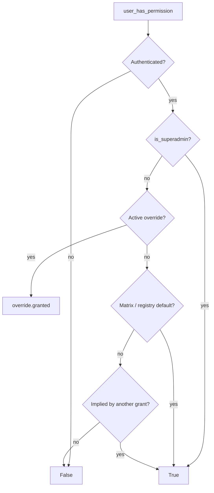
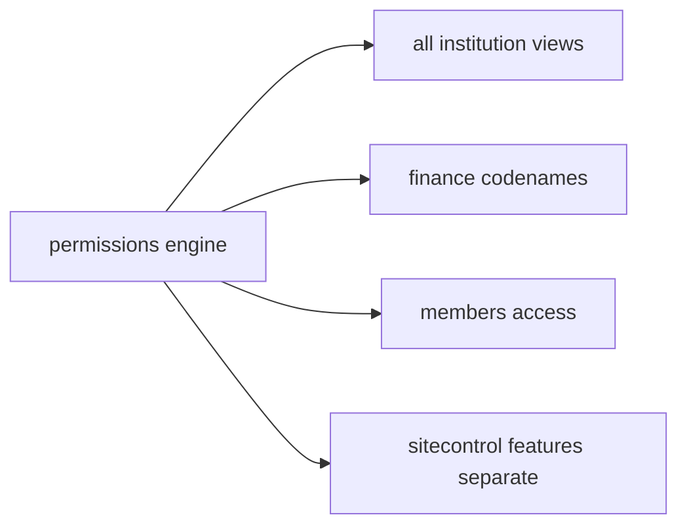

# Permissions Module Specification

**App:** `permissions`  
**Mount:** `/permissions/`  
**Source of truth:** Live Django code  
**Companions:** `docs/SECURITY/AUTHORIZATION.md`, `docs/ARCHITECTURE/MULTI_TENANCY.md`, `AGENTS.md` §4

| Label | Meaning |
|-------|---------|
| **Current** | Implemented today |
| **Planned (AGENTS.md)** | Constitution aspirations |
| **Recommended** | Future improvements |

---

## 1. Purpose

Provide **institution RBAC**: permission catalog, role matrix, per-user overrides, permission resolution, org-subtree scoping helpers, and the permissions administration UI. Also ships middleware for permission caching and church-assignment enforcement.

Platform capabilities (`sitecontrol.rbac`) are separate.

---

## 2. Responsibilities (Current)

| Owns | Does not own |
|------|----------------|
| `Permission` / `RolePermission` / overrides / permission audit | User model (→ `accounts`) |
| `PERMISSION_REGISTRY` defaults | Platform role capabilities |
| `user_has_permission` engine | Django Groups (retired no-op sync) |
| Org scope Q helpers | Church hierarchy data (→ `organization`) |
| Permissions UI under `/permissions/` | Domain feature UIs |

---

## 3. Models (Current)

**Managers:** default only.

| Model | Key points |
|-------|------------|
| `Permission` | UUID; unique `codename`; category, description, `is_active`, sort_order |
| `RolePermission` | UUID; `role` + FK permission; `granted`; unique `(role, permission)` |
| `PermissionOverride` | UUID; user + permission; `granted` (allow/deny); reason; `expires_at`; `is_active`; props `is_expired` / `is_effective` |
| `PermissionAuditLog` | MATRIX_UPDATE, MATRIX_RESET, OVERRIDE_CREATE/UPDATE/DELETE |

---

## 4. Managers

**None custom.**

---

## 4b. Layering (Current — Phase 2 / P1-2 Permissions slice)

```
Views → Services → Selectors → Repositories → Models
```

| Layer | File | Role |
|-------|------|------|
| Selectors | `permissions/selectors.py` | Permission/matrix/override/audit reads; church/user scope querysets; form dropdowns |
| Repositories | `permissions/repositories.py` | Permission/matrix/override/audit persistence (no business rules) |
| Services | `permissions/services.py` | Resolution engine, matrix sync, override/matrix business rules, request cache |
| Scoping | `permissions/scoping.py` / `org_scope.py` / `scoping_checks.py` | Authz scope APIs; ORM via selectors |
| Views / forms | `permissions/views.py`, `forms.py` | HTTP/forms only; ModelForm saves via `commit=False` + repositories |

`tests_layers.py` characterizes effective resolution, override precedence, church/denom isolation, repository writes, and audit creation.

---

## 5. Services and supporting modules (Current)

### `services.py`

| API | Role |
|-----|------|
| `user_has_permission` | Resolution entry point |
| `ensure_permission_matrix` / `reset_matrix_to_defaults` | Sync registry → DB |
| `get_matrix_data` / `update_matrix_cell` / `bulk_update_matrix` | Matrix admin |
| `get_active_override` / `create_override` | Overrides (views often form+audit) |
| `get_effective_permissions` | Full effective map |
| `log_permission_audit` | Audit writer |
| `bind/clear_request_permission_cache` | Middleware cache |
| `sync_role_groups` | **Retired no-op** |
| `get_client_ip` | IP helper |

### Resolution order



`is_superadmin`: Django `is_superuser` or role `SUPER_ADMIN`, **excluding** platform users (`superadmin.py`).

### Other modules

| Module | Role |
|--------|------|
| `registry.py` | Canonical catalog (~95+ codenames), `implies`, default roles |
| `roles.py` | `UserRole` constants + assignability |
| `org_scope.py` | `OrgScopeLevel`, `church_q_for_scope`, `apply_org_scope`, … |
| `scoping.py` | `get_manageable_churches/users`, `user_may_manage_target` |
| `scoping_checks.py` | Object-level church act/approve, pending queues, exclude self |
| `checks.py` | Decorators + all `can_*` helpers + `permission_flags` |
| `middleware.py` | Cache + RoleEnforcement |
| Management | `seed_permissions` / `--reset` |

---

## 6. Views (Current)

All require login + `can_manage_permissions`:

| View | Purpose |
|------|---------|
| `index` | Hub |
| `role_matrix` | Edit/save/reset matrix |
| `role_list` / `role_detail` | Role summaries |
| `override_*` | List/create/edit/delete overrides |
| `user_effective` | Effective permissions for a user |
| `audit_log` | Permission audit |
| `export_matrix_csv` | CSV export |

---

## 7. URLs (Current)

`app_name = permissions` under `/permissions/`:

| Path | Name |
|------|------|
| `` | `permissions:index` |
| `matrix/` | `permissions:matrix` |
| `roles/`, `roles/<slug>/` | `role_list`, `role_detail` |
| `overrides/`, `add/`, `<uuid>/edit/`, `<uuid>/delete/` | `override_*` |
| `users/<uuid>/effective/` | `user_effective` |
| `audit/` | `audit_log` |
| `export/matrix.csv` | `export_matrix` |

---

## 8. Templates (Current)

`templates/permissions/`: `index.html`, `matrix.html`, `role_list.html`, `role_detail.html`, `override_list.html`, `override_form.html`, `override_confirm_delete.html`, `user_effective.html`, `audit_log.html`.

---

## 9. Forms (Current)

`PermissionMatrixForm` (dynamic cells), `PermissionOverrideForm` (manageable users queryset).

---

## 10. Permissions (Current)

UI gated by **`manage_permissions`**. Registry also defines `manage_overrides`, `view_permission_audit`, `export_permission_matrix` (implied by manage_permissions).

Categories span Members, Meetings, Finance, Ledger, Remittance, Payroll, Assets, Budgets, Giving, Announcements, Reports, Organization, Administration, Dashboard, etc.

---

## 11. Business rules (Current)

- Overrides beat matrix (grant or deny).  
- Expired / inactive overrides ignored.  
- `implies` grants recursive capabilities.  
- `conflicts_with` supported in engine but currently unused in registry data.  
- Matrix reset restores registry defaults.  
- Override delete is **hard delete**.  
- Role assignment policy lives in `UserRole.ASSIGNABLE_BY_ROLE` (enforced in accounts).

---

## 12. Workflows (Current)

**Matrix:** POST cells → diff → `bulk_update_matrix` → audit MATRIX_UPDATE; or reset → MATRIX_RESET.

**Overrides:** create/edit/delete for manageable users → OVERRIDE_* audit.

**Seed:** `post_migrate` / `seed_permissions` → `ensure_permission_matrix`.

---

## 13. Signals (Current)

`apps.ready`: `post_migrate` → `ensure_permission_matrix` when sender is permissions app.

---

## 14. Middleware (Current)

Registered in settings:

| Middleware | Behavior |
|------------|----------|
| `PermissionCacheMiddleware` | Bind/clear per-request permission cache |
| `RoleEnforcementMiddleware` | Local roles without church → redirect to profile (exempt `/permissions/`, `/platform/`, `/admin/`, login, etc.) |

---

## 15. Templatetags (Current)

`permissions/templatetags/permission_tags.py`: ``, ``, `has_perm` filter, ``, ``.

---

## 16. Dependencies (Current)

Django User; `organization` hierarchy models; `church_system.denomination_scope` / flash; `sitecontrol.Denomination`; `accounts.control_center` (UCC); consumed by nearly all institution apps via `checks` / scoping.

---

## 17. Public interfaces (Current)

| Interface | Consumers |
|-----------|-----------|
| `permissions.checks` | Views/templates across apps |
| `permissions.services.user_has_permission` | Engine |
| `permissions.org_scope` / `scoping` | Tenancy |
| `permissions.roles.UserRole` | Accounts + forms |
| `/permissions/` UI | Permission admins |

---

## 17b. Cross-module interactions & financial implications



**Financial implications:** Finance codenames (`approve_transactions`, `post_payroll`, etc.) gate money paths. Platform SaaS features (`require_feature`) are separate from RBAC — both must pass where used.

---

## 18. Security considerations (Current)

- Never trust template `` alone.  
- Prefer scoped queryset fetch + `can_act_on_church`.  
- Deny overrides must be honored (members `access.py` checks granular codes directly).  
- Platform users are not institution superadmins via `is_superadmin`.  
- Audit override and matrix changes.

---

## 19. Testing notes (Current)

- `permissions/tests.py` — checks, matrix, implies/cache, scoping, views, middleware  
- `permissions/tests_org_scope.py` — org scope  

Tests often call `ensure_permission_matrix()`.

---

## 20. Current vs Planned vs Recommended

| Topic | Current | Planned (AGENTS) | Recommended |
|-------|---------|------------------|-------------|
| RBAC | Registry + matrix + overrides | Roles/groups/overrides | Keep matrix; groups stay retired unless product reverses |
| Soft-delete overrides | Hard delete | Soft-delete | Soft-deactivate overrides |
| Delegated authority | Overrides | Broader delegation | Time-boxed overrides + review reports |
| Field-level PII perms | Not systematic | Masking framework | Add view_*_pii codenames when needed |
| API authz | N/A (no DRF) | `/api/v1/` uses same engine | Reuse `user_has_permission` |

---

## 21. Known technical debt

- `sync_role_groups` no-op.  
- `conflicts_with` unused in registry.  
- Audit list scoped by `target_user` may hide matrix-only events.  
- Role choice metadata on `RolePermission` may lag new roles if not kept in sync (verify after role expansions).  
- Fat permission registry — document carefully when adding codenames (`implies` trees).

---

## 22. Admin

`PermissionAdmin`, `RolePermissionAdmin`, `PermissionOverrideAdmin`, read-only `PermissionAuditLogAdmin`.
