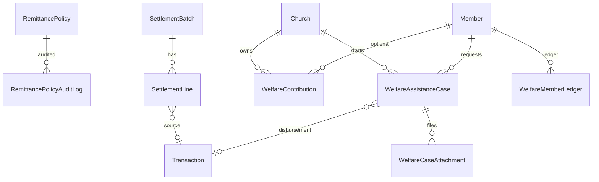
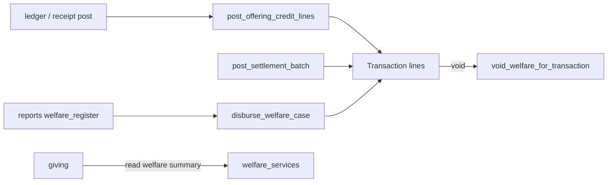

# Remittance Module Specification

**App:** `remittance` (`RemittanceConfig`)  
**Mount:** `/remittance/`  
**Companions:** `../TRANSACTIONS/transactions_spec.md`, `../FINANCE/finance_spec.md`, `AGENTS.md` §3  
**Source of truth:** Live Django code

| Label | Meaning |
|-------|---------|
| **Current** | Implemented |
| **Planned (AGENTS.md)** | Constitution aspirations |
| **Recommended** | Future improvements |

---

## 1. Purpose and responsibilities

Own **retain/remit policies**, hierarchy **settlement batches**, and the church **welfare** fund (contributions, assistance cases, member ledger). Offering credit splits at collection time are applied into `transactions` journals.

| Owns | Does not own |
|------|----------------|
| RemittancePolicy (+ audit) | Chart of accounts |
| SettlementBatch / SettlementLine | MonthlyCutoff (→ `transactions`) |
| Welfare contributions, cases, ledger | Giving statements UI (→ `giving`) |
| Policy/settlement/welfare UI | Payroll / assets |

---

## 2. Models and relationships

### `RemittancePolicy`
- `offering_type`: TITHE / COMBINED / WELFARE  
- `application_scope`: GROSS_COLLECTION / SETTLEMENT_FROM_BELOW  
- `unit_type`: CHURCH / DISTRICT / CONFERENCE / UNION / GENERAL_CONFERENCE  
- `unit_id` (UUID), `retain_percent`, `remit_percent` (**must sum to 100**)  
- Effective dating: `effective_from`, `effective_to`, `is_active`

### `SettlementBatch` / `SettlementLine`
- Status: DRAFT / POSTED / VOID  
- From/to unit type+id, period, gross/retain/remit amounts  
- Lines may link `source_transaction`

### Welfare
- `WelfareContribution` — church, optional member, optional transaction, amount, anonymous flag  
- `WelfareAssistanceCase` — PENDING → UNDER_REVIEW → APPROVED/REJECTED → DISBURSED / CANCELLED; types MEDICAL/BEREAVEMENT/EDUCATION/EMERGENCY/OTHER; unique `(church, case_number)`  
- `WelfareCaseAttachment` — file upload  
- `WelfareMemberLedger` — CONTRIBUTION / REQUEST / DISBURSEMENT / ADJUSTMENT; IN/OUT/NEUTRAL  

**Managers:** none custom.

---

## 3. Business rules (Current)

1. Retain% + remit% = 100 (model `clean`).  
2. `post_offering_credit_lines` splits gross per church collection policy into retention + remit payable accounts.  
3. Settlement draft computes remit payable / received-from-below; `post_settlement_batch` posts church-level balanced TRANSFER journals (typically auto-APPROVED/locked) and marks POSTED. **District+ hierarchy settlement GL posting is not fully implemented** (stub/`pass` path in code).  
4. Welfare disbursement requires sufficient WELFARE_FUND balance; posts via ledger helpers; links `disbursement_transaction`.  
5. Voiding a transaction can call `void_welfare_for_transaction`.  
6. Feature gate: `remittance` (and welfare UI checks `welfare_module_enabled`).

---

## 4. Services (Current)

**`remittance/services.py`:** `calculate_split`, `get_active_policy`, `get_church_collection_policy`, `post_offering_credit_lines`, `ensure_default_policies_for_church`, settlement draft/post, fund balances, policy save/audit.

**`remittance/welfare_services.py`:** contribution/ledger, case lifecycle (create, review, approve, reject, cancel, disburse), manual contribution, statements, dashboard KPIs, `can_view_member_welfare`.

Note: thin wrappers of some welfare functions also exist on `services.py` for convenience.

---

## 5. Permissions (Current)

| Code | Helper |
|------|--------|
| `view_remittance` | `can_view_remittance` |
| `manage_remittance_policy` | `can_manage_remittance_policy` |
| `manage_settlements` | `can_manage_settlements` |
| `post_settlements` | `can_post_settlements` — settlement post gate |
| `view_welfare` | `can_view_welfare` |
| `manage_welfare_cases` | `can_manage_welfare_cases` |
| `approve_welfare` | `can_approve_welfare` |
| `disburse_welfare` | `can_disburse_welfare` |

Views also accept `manage_finances` on some finance/policy gates.

---

## 6. URL structure (Current)

`/remittance/` (`app_name=remittance`):

| Path | Name |
|------|------|
| `` | `index` (policies) |
| `policies/add/`, `policies/<uuid>/edit/` | policy CRUD |
| `settlements/`, `settlements/<uuid>/post/` | settlements |
| `welfare/`, `welfare/member/<uuid>/` | welfare index / member statement |
| `welfare/cases/<uuid>/`, `…/action/` | case detail / actions |

---

## 7. Forms / Views / Templates

**Forms:** `RemittancePolicyForm`, `SettlementDraftForm`, welfare case/approve/reject/review/disburse/contribution/attachment forms.

**Views:** policy index/create/edit; settlement list/post; welfare index, case detail/action, member statement.

**Templates:** under `templates/remittance/`.

---

## 8. Signals

**None** dedicated in remittance. Integrations are call-ins from ledger/transactions posting and void hooks.

---

## 9. Middleware dependencies

- Auth + CSRF (global).  
- `DenominationContextMiddleware` / `UserScopeMiddleware` for tenant wall and church scope.  
- `require_feature("remittance")` on module views (via view decorators).  
- `LoginRateLimitMiddleware` / maintenance — platform-wide only.

---

## 10. Cross-module interactions

---

## 11. Financial implications

- Creates/updates GL lines on collection (payables/retention/welfare).  
- Settlement posting creates hierarchy transfer journals.  
- Disbursement debits welfare fund; must remain balanced via txn services.  
- **Dual path debt:** `transactions.MonthlyCutoff` remittance UI vs `SettlementBatch` — both exist.

---

## 12. Security considerations

- Church/unit scoping on policies and welfare.  
- Welfare attachments under media — permission-gated views.  
- Maker-checker style: approve vs disburse separate permissions.  
- Do not expose anonymous contribution member when `is_anonymous`.

---

## 13. Known architectural gaps

- Dual remittance stories (`transactions:record_remittance` / MonthlyCutoff vs SettlementBatch).  
- District+ settlement ledger posting incomplete.  
- Thin wrappers in `services.py` over `welfare_services.py`.  
- Some welfare paths still import legacy `accounts.permissions.can_manage_finances`.  
- Policy keyed by `unit_type`+`unit_id` without DB FK to org models.  
- Soft-delete not implemented.  
- No DRF API.

---

## 14. Planned (AGENTS.md) vs Recommended

| Topic | Current | Planned | Recommended |
|-------|---------|---------|-------------|
| Remit lifecycle | Policies + settlements + cutoff | Unified treasury remittance | Document one operational path; deprecate the other |
| Welfare | Full case workflow | Broader benevolence | Keep ledger authoritative |
| Soft-delete | None | Soft-delete columns | Prefer void/cancel statuses for financials |

**Must not change:** retain+remit=100; posting through transactions balance rules; welfare fund sufficiency check before disburse.
