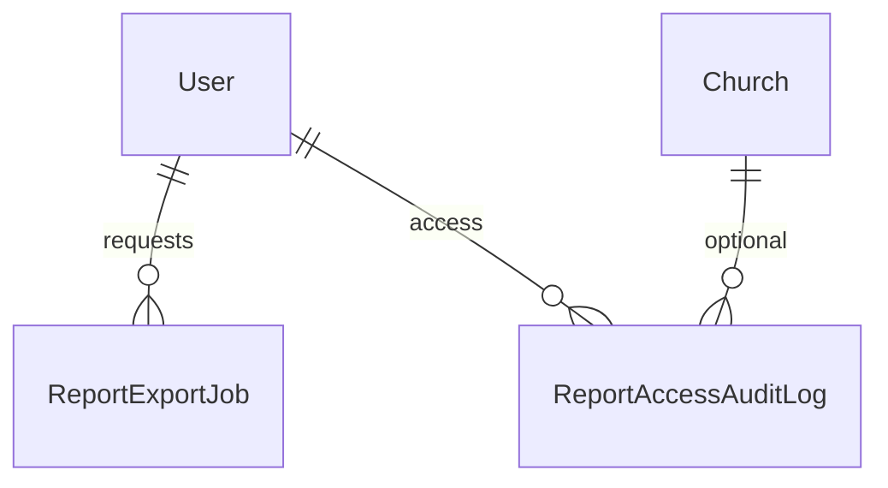
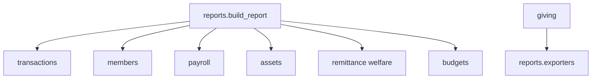

# Reports Module Specification

**App:** `reports`  
**Mount:** `/reports/`  
**Companions:** `docs/API/API_CONVENTIONS.md` (no DRF), `AGENTS.md` §5  
**Source of truth:** Live Django code

| Label | Meaning |
|-------|---------|
| **Current** | Implemented |
| **Planned (AGENTS.md)** | Broader analytics / BI exports |
| **Recommended** | Future improvements |

---

## 1. Purpose and responsibilities

Central **read-only report catalog** with hierarchy filters, period selection, sync export (CSV/Excel/PDF), optional async `ReportExportJob`, and `ReportAccessAuditLog`. Also hosts shared `exporters` used by giving and other apps.

| Owns | Does not own |
|------|----------------|
| REPORT_CATALOG + builders | Transaction posting |
| Export jobs + access audit | Module-specific dashboards (partial overlap) |
| Welfare statement helper view | Platform ops health (→ sitecontrol) |

---

## 2. Models and relationships

### `ReportExportJob`
UUID; user; report_key; format; status; params JSON; result file/path as implemented; timestamps.

### `ReportAccessAuditLog`
Immutable-style access log: user, report_key, action, params, row_count, church, export_format.

**Managers:** none custom.



---

## 3. Business rules (Current)

1. Access requires `view_reports` **plus** domain permission (`finance` / `members` / `overseer` per catalog).  
2. Feature gates fail closed without church (`advanced_reports`, `payroll`, `assets`, `remittance`, `budgets`).  
3. Hierarchy filters resolve manageable churches only.  
4. Detail rows soft-capped (`REPORT_ROW_LIMIT = 500`).  
5. Builders are read-only ORM aggregates — must not post journals.

### Catalog keys (Current)

| Key | Domain | Extra gate |
|-----|--------|------------|
| financial_summary, tithe_report | finance | — |
| trial_balance, balance_sheet, income_statement, cash_position | finance | `advanced_reports` |
| payroll_summary | finance | feature `payroll` |
| asset_register, depreciation_schedule | finance | feature `assets` |
| asset_hierarchy_rollup | overseer | feature `assets` |
| welfare_register | finance | feature `remittance` |
| budget_vs_actual | finance | feature `budgets` |
| member_summary, transfer_report, attendance_summary | members | — |
| hierarchy_rollup | overseer | — |

---

## 4. Services (Current)

**Layering (Phase 2 / P1-2 Reports slice):**

```
Views → Services → Selectors → Repositories → Models
```

| Layer | File | Role |
|-------|------|------|
| Selectors | `reports/selectors.py` | Church/hierarchy scope, transaction/member/welfare/attendance querysets, account balance aggregates, export-job reads |
| Repositories | `reports/repositories.py` | `ReportAccessAuditLog` writes; `ReportExportJob` create/save |
| Services | `reports/services.py` | Access gates, period resolution, builders/formatting, `audit_export` / `log_report_access` |
| Exporters | `reports/exporters.py` | CSV / Excel / PDF bytes (unchanged) |

**`reports/services.py`:** `user_may_access_report`, `reports_for_user`, date range resolve, `build_report`, per-report builders, hierarchy context, `log_report_access`, `audit_export` (domain CSV/Excel/PDF downloads → `ReportAccessAuditLog` via repository).

**`reports/exporters.py`:** CSV / Excel / PDF table exporters; `build_export_bytes`.

**`reports/registry.py`:** `REPORT_CATALOG`, `PERIOD_CHOICES`.

Domain modules that export via `reports.exporters` should call `audit_export` before returning the file response.

`tests_layers.py` characterizes church scope, forged-ID isolation, export audit, and export-job ownership.
---

## 5. Permissions (Current)

Primary: `view_reports`. Domain checks reuse `can_manage_finances`, `can_view_members` / `can_manage_members`, `can_view_all_churches`.

---

## 6. URL structure (Current)

`/reports/` (`app_name=reports`):

| Path | Name |
|------|------|
| `` | `index` |
| `welfare-statement/` | `welfare_statement` |
| `exports/<uuid>/`, `…/download/` | async job status/download |
| `<slug:report_key>/` | `run` |

---

## 7. Forms / Views / Templates

**Forms:** `ReportFilterForm`, `WelfareStatementForm`.

**Views:** index, run_report (filter + export query params), export job status/download, welfare_statement.

**Templates:** `templates/reports/`.

---

## 8. Signals

**None.**

---

## 9. Middleware dependencies

Auth, CSRF, church/denomination scope, feature checks inside services, maintenance/login limits.

---

## 10. Cross-module interactions



---

## 11. Financial implications

Reports **consume** approved/period-scoped financial data; they must never mutate journals. Trial balance / statements classify account types via hardcoded type sets in `services.py` (ASSET_TYPES, LIABILITY_TYPES, etc.).

---

## 12. Security considerations

- Dual permission (catalog + domain).  
- Fail-closed feature flags.  
- Access auditing.  
- Export jobs owned by requesting user.  
- Hierarchy scoping prevents cross-tenant leakage.  
- Sensitive giving detail remains permission-aware in source apps.

---

## 13. Known architectural gaps

- No Power BI / live sheet connectors.  
- Row limit truncation.  
- Account type classification for statements is domain-type based (not classic A/L/E).  
- Async export depends on storage/worker availability as implemented.  
- No REST report API.

---

## 14. Planned vs Recommended

| Topic | Current | Planned (AGENTS) | Recommended |
|-------|---------|------------------|-------------|
| Formats | CSV/Excel/PDF | + BI connectors | Keep exporter shared |
| Catalog | Registry dict | Expand modules | Add keys only with builders + tests |
| Soft-delete | N/A (read) | — | Preserve audit immutability |

**Must not change:** fail-closed feature gates; hierarchy church resolution; read-only builders.
