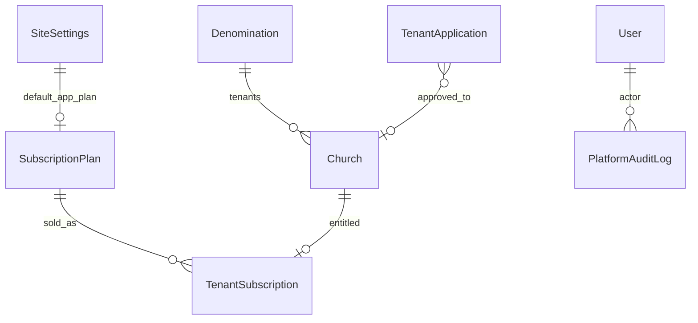
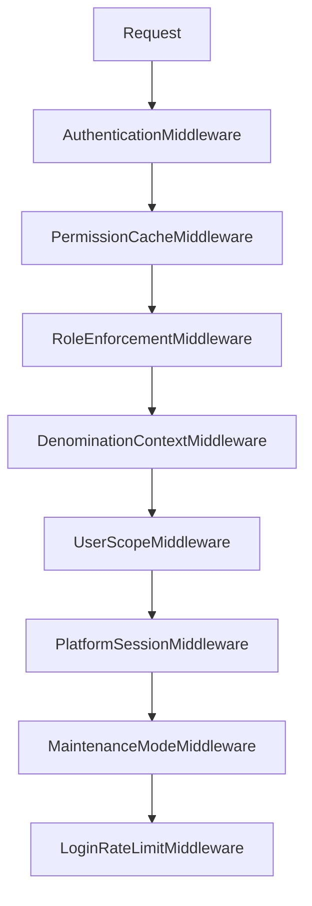
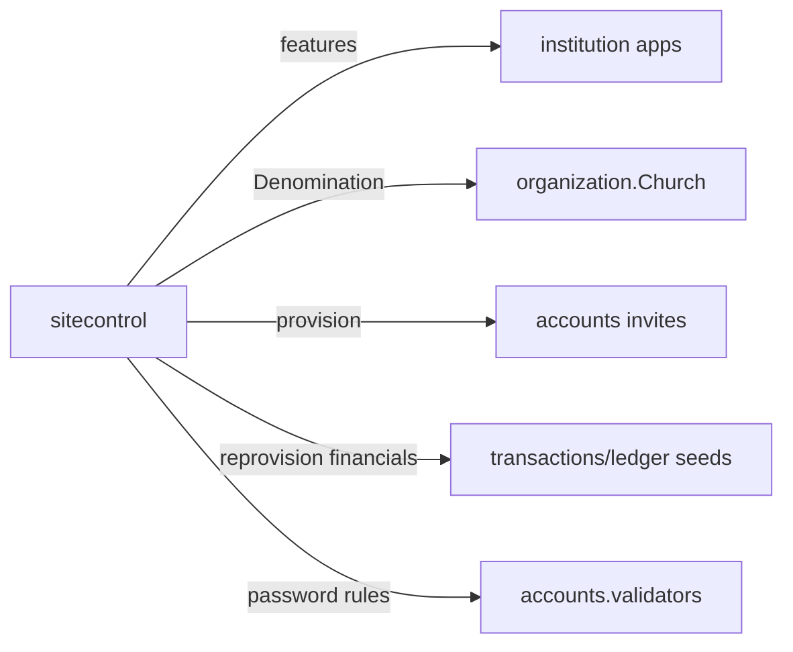

# Site Control Module Specification

**App:** `sitecontrol` (`SitecontrolConfig`)  
**Mount:** `/platform/` (namespace `sitecontrol`)  
**Public registration:** `/apply/`, `/apply/success/` (wired in root `urls.py`)  
**Companions:** `docs/ARCHITECTURE/MULTI_TENANCY.md`, `docs/SECURITY/*`, `AGENTS.md` §4  
**Source of truth:** Live Django code

| Label | Meaning |
|-------|---------|
| **Current** | Implemented |
| **Planned (AGENTS.md)** | Broader SaaS / compliance automation |
| **Recommended** | Future improvements |

---

## 1. Purpose and responsibilities

Platform **control tower**: site settings, denomination SaaS wall, subscription plans/features, tenant lifecycle (provision/suspend/offboard), operator RBAC, registration applications, platform announcements, audit, maintenance, login rate limit, impersonation.

| Owns | Does not own |
|------|----------------|
| SiteSettings singleton | Institution user invites UI (→ accounts) |
| Denomination model + terminology | Org hierarchy CRUD (→ organization) |
| Plans / subscriptions / payment methods | Transaction GL |
| PlatformAuditLog | Institution announcements (→ announcements) |
| Platform middleware | Django admin itself (gated separately) |

---

## 2. Models and relationships

### Core models (Current)
- **SiteSettings** — branding, session timeout, login lockout, maintenance, SMTP (+ encrypted password), password policy knobs, global feature toggles, registration flags, billing currency  
- **SubscriptionPlan** — feature flags + user/branch limits  
- **PlatformPaymentMethod**  
- **TenantSubscription** — church entitlement, status, overrides JSON, expiry  
- **PlatformAuditLog** — immutable-style platform actions  
- **PlatformAnnouncement** — platform banner content  
- **TenantApplication** — public apply workflow  
- **Denomination** — SaaS isolation wall, terminology, branding/seeds  

**Managers:** none custom. Access helpers in `platform_access.py`, `rbac.py`. Reads via `selectors.py`; writes via `repositories.py` (P1-2 layered).

---

## 3. Business rules (Current)

1. `church_has_feature(church, feature)` = global toggle ∧ plan feature ∧ overrides (fail closed).  
2. Features: `payroll`, `remittance`, `ledger`, `meetings`, `advanced_reports`, `budgets`, `giving_portal`, `assets`.  
3. Subscription enforcement optional via `enforce_subscription_limits`.  
4. Maintenance mode: only platform operators; may block `/apply/`.  
5. Login rate limit from SiteSettings (`login_max_attempts`, `login_lockout_minutes`).  
6. Denomination context scopes platform operators who are not global.  
7. Tenant suspend/reactivate/offboard via services; applications approve → provision church + invite.  
8. Platform operators identified by `user.is_platform_user` + `platform_role` capabilities.

---

## 4. Services / selectors / repositories (Current)

| Module | Role |
|--------|------|
| `selectors.py` | Read/query helpers: denominations, plans, payment methods, churches/subscriptions, applications, audit/announcements, operator/user lookups, hierarchy slices |
| `repositories.py` | Persistence only: platform audit, model save, payment bulk create, plan/subscription create/update, application/denomination writes, orphan conference assign |
| `services.py` | Settings cache, features/entitlements, plans, subscriptions lifecycle, tenant suspend/reactivate/offboard, stats, audit helper, seed suite |
| `provisioning_services.py` | Tenant provision workflows |
| `registration_services.py` | Apply / approve / reject applications |
| `denomination_services.py` | Labels, seeds, builtins |
| `billing_services.py` | Denomination billing rollups |
| `platform_access.py` | Operator denomination filters (reads via selectors) |
| `crypto.py` | SMTP secret encrypt/decrypt |
| `navigation.py` | Platform nav |

**Layering (P1-2):** Views → services → selectors/repositories → models. Views/forms handle HTTP and forms only; ModelForm CRUD uses `commit=False` + repositories. Platform vs institution lanes, denomination wall, maintenance, middleware, and public `/apply/` are unchanged.

`tests_layers.py` characterizes denomination isolation, platform operator scoping, application workflow, subscription state, selector reads, repository writes, and audit creation.

Commands: `seed_denominations`, `expire_subscriptions`, `normalize_user_scopes`.

---

## 5. Permissions (Current)

**Not** institution `permissions` matrix for most `/platform/` routes.

Platform uses **capability RBAC** (`sitecontrol.rbac`): roles OWNER / SECURITY / BILLING / SUPPORT / READONLY → capabilities (`manage_tenants`, `impersonate`, `view_audit`, etc.).

Entry: `platform_required` / `require_platform_capability` / `can_manage_platform`.

Institution feature gate decorator: `require_feature` in `sitecontrol.checks`.

---

## 6. URL structure (Current)

`/platform/` (`app_name=sitecontrol`) — selected:

| Area | Paths |
|------|--------|
| Ops | ``, `setup/`, `health/`, `ops/` |
| Audit | `audit/`, `audit/export/` |
| Settings | `settings/`, branding, email, security, features |
| Registration | `registration/`, `applications/…` |
| Billing | plans, subscriptions, `subscriptions/<id>/record-payment/`, payment-methods, billing |
| Denominations | list/detail/edit/terminology/seeds/branding/billing/context |
| Tenants | list/detail/edit/provision/suspend/reactivate/offboard/reprovision-financials |
| Operators | list/add/edit/deactivate |
| Impersonate | `impersonate/<user>/`, `impersonate/end/` |
| Announcements | platform announcements CRUD |
| Hierarchy view | `organization/` |

Public: `/apply/`, `/apply/success/`.

---

## 7. Forms / Views / Templates

**Forms:** SiteSettings*, Registration*, TenantApplication*, Billing*, Plan/Subscription*, PlatformOperator*, Denomination*, PlatformAnnouncement*, provisioning forms (`forms.py`, `denomination_forms.py`).

**Views:** `views.py`, `views_registration.py`, `views_denominations.py`.

**Templates:** `templates/sitecontrol/` (and apply templates).

---

## 8. Signals

No heavy signal module required for core SaaS. SiteSettings.save clears settings cache. Denomination/church provisioning orchestrated in services.

---

## 9. Middleware dependencies (Current) — **critical**

Registered in `settings.MIDDLEWARE`:

| Middleware | Role |
|------------|------|
| `DenominationContextMiddleware` | Request denomination context |
| `UserScopeMiddleware` | Active church / org scope |
| `PlatformSessionMiddleware` | Platform session concerns |
| `MaintenanceModeMiddleware` | Block non-operators when maintenance on |
| `LoginRateLimitMiddleware` | Brute-force protection using SiteSettings |

Also interacts with `permissions.middleware` (cache + role enforcement) earlier in the stack.

---

## 10. Cross-module interactions

---

## 11. Financial implications

- Does not post journals.  
- `tenant_reprovision_financials` may re-seed financial defaults (accounts/ledger) — operational, not day-to-day GL.  
- Subscription billing is SaaS entitlement, not church treasury accounting.

---

## 12. Security considerations

- Platform IP allowlist.  
- Impersonation capability-gated + audited.  
- Encrypted SMTP secrets preferred.  
- Breakglass/owner paths in RBAC.  
- Django admin requires platform superuser path (`can_access_django_admin`); church/unit ModelAdmin querysets additionally use `admin_custom.tenancy` (OWNER global; other roles limited to `managed_denominations`).  
- Never commit SMTP passwords; prefer encrypted field.  
- Maintenance and login lockout protect availability/auth.

---

## 13. Known architectural gaps

- MFA audience policy + enforcement exist in SiteSettings / accounts middleware; richer recovery UX remains Planned.  
- Soft-delete for tenants = suspend/offboard statuses.  
- No customer self-serve billing portal / payment gateway.  
- Operators can **record subscription payments** and advance `next_billing_at` / `expires_at` (manual SaaS billing). Full invoice ledger is Recommended.  
- Feature keys must stay synced across FEATURE_FIELDS / plan fields / `require_feature` callers.

---

## 14. Planned vs Recommended

| Topic | Current | Planned (AGENTS) | Recommended |
|-------|---------|------------------|-------------|
| Tenancy | Denomination + church subscription | Richer multi-tenant ops | Keep denomination wall |
| Auth hardening | Login rate limit, session timeout, MFA audiences/enforcement | Device tracking, recovery UX | Keep MFA fail-closed for required audiences |
| Billing ops | Plans, payment methods, record payment / renew dates | Gateway + invoices | Automate dunning after manual payment flow |
| Compliance | Platform audit | GDPR tooling | Expand audit export carefully |

**Must not change:** denomination isolation; `church_has_feature` fail-closed semantics; capability checks on `/platform/`; maintenance/login middleware behavior without security review.
