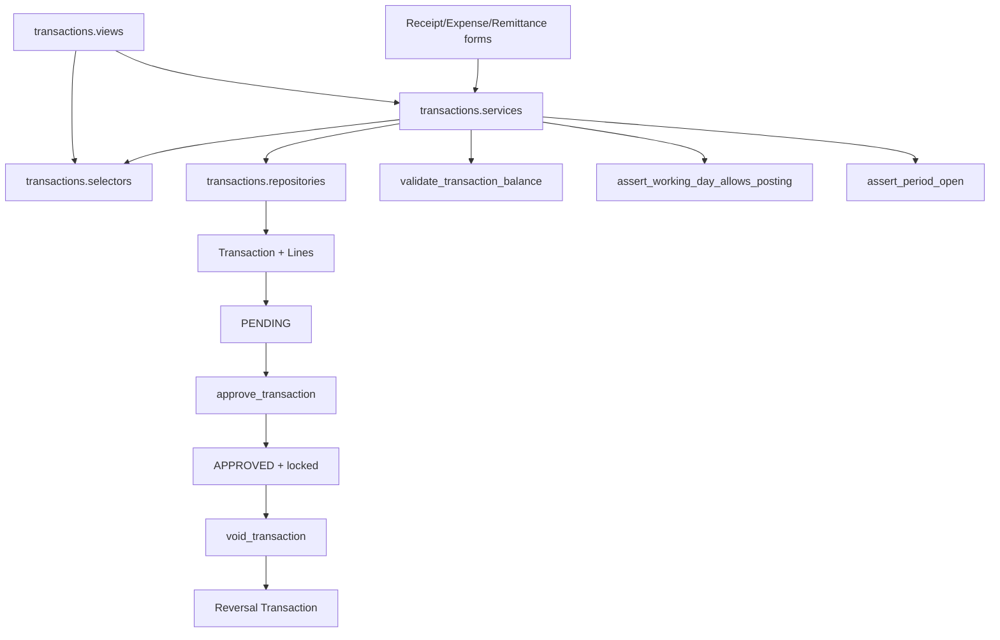
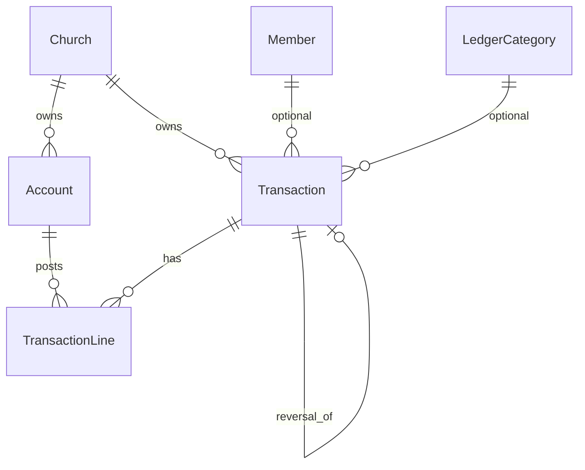
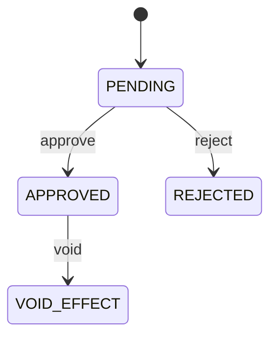

# Transactions Module Specification

**App:** `transactions`  
**Mount:** `/transactions/`  
**Role:** **Books of record** for ChurchHub finance  
**Companions:** `../FINANCE/finance_spec.md`, `docs/SECURITY/AUDIT_COMPLIANCE.md`, `AGENTS.md` §3

| Label | Meaning |
|-------|---------|
| **Current** | Implemented |
| **Planned** | AGENTS aspirations |
| **Must not change** | Integrity invariants |

---

## 1. Purpose

Provide the church general ledger: chart of accounts, double-entry journals, approval/void, working day, financial periods, monthly remittance cutoff, bank reconciliation, financial audit, idempotency, and the Budget model used by the budgets UI.

---

## 2. Responsibilities (Current)

| Owns | Does not own |
|------|----------------|
| Account, Transaction, Lines, WorkingDay, Period, Cutoff, Recon, FinancialAuditLog, Budget model, IdempotencyKey | LedgerCategory templates (→ `ledger`) |
| Treasury receipt/expense/remittance posting UI | Budget planning UI (→ `budgets`) |
| Approve/reject/void | Giving statements (→ `giving`) |
| Bank recon | Remittance policies/settlements (→ `remittance`) |

---

## 3. Architecture (Current)

**Layering (P1-2 slice):** Views use `selectors` for church-scoped reads; services keep business rules and call `repositories` for journal/line/audit persistence. Public service APIs are unchanged.

---

## 4. Models (Current)

**Managers:** none custom.

### `Account`
UUID; `name`, `code`, `account_type`, `is_active`; FK `church`.  
Unique `(church, name)`; unique non-empty `(church, code)`.

**Account types (exact):**  
`TITHE`, `COMBINED`, `INCOME`, `EXPENSE`, `DISTRICT_PAYABLE`, `TITHE_REMIT_PAYABLE`, `COMBINED_REMIT_PAYABLE`, `COMBINED_RETENTION`, `WELFARE_FUND`, `REMITTANCE_RECEIVABLE`, `SALARY_EXPENSE`, `EMPLOYER_SSNIT_EXPENSE`, `SALARIES_PAYABLE`, `PAYE_PAYABLE`, `SSNIT_PAYABLE`, `PENSION_PAYABLE`, `BANK`, `CASH`, `FIXED_ASSET`, `ACCUMULATED_DEPRECIATION`, `DEPRECIATION_EXPENSE`

### `Transaction`
UUID; `reference` (auto); `transaction_type` RECEIPT/EXPENSE/TRANSFER/PAYROLL/CAPITAL; `date`; `description`; FK church, optional member; `approval_status` PENDING/APPROVED/REJECTED; `locked`; void fields; `reversal_of` self-FK; created/approved by; optional `ledger_category`.  
Unique `(church, reference)`.

### `TransactionLine`
FK transaction, account; signed `amount`; optional `fund` (OPERATIONAL, TITHE_TRUST, COMBINED_TRUST, COMBINED_RETENTION, WELFARE).  
Account church must match transaction; locked txn blocks line edits.

### Other models
`MonthlyCutoff`, `OfferingCategory`, `Budget` (levels CHURCH/DEPARTMENT/DISTRICT/CONFERENCE), `FinancialAuditLog`, `BankReconciliation` + `BankReconciliationItem`, `FinancialPeriod`, `WorkingDay` (OPEN/CLOSED), `FinancialIdempotencyKey` (RECEIPT/EXPENSE/REMITTANCE/LEDGER/PAYROLL_POST/PAYROLL_PAY).

---

## 5. Enumerations

Covered above. WorkingDay: OPEN/CLOSED. Audit actions: CREATE, UPDATE, APPROVE, REJECT, VOID, REMIT, BUDGET_*.

---

## 6. Relationships

---

## 7. Managers

**None.** Must not invent managers that bypass service validation.

---

## 8. Services (Current)

**`services.py`:** `validate_transaction_balance`; period/working-day helpers; `create_default_accounts` / offerings; `record_receipt`, `record_expense`, `record_transfer`, `record_district_remittance`; `approve_transaction`, `reject_transaction`, `void_transaction`; `generate_monthly_cutoff`; recon create/match/finalize; `budget_vs_actual` (delegates to budgets).

**Also:** `treasury.py`, `idempotency.py`, `account_codes.py`, `reporting.py`.

**Signals:** `post_save` Church → seed accounts/offerings if not provisioned.

**Command:** `cleanup_financial_idempotency`.

---

## 9. Forms (Current)

`ReceiptForm`, `ExpenseForm`, `PeriodLockForm`, `WorkingDayOpenForm`, `WorkingDayCloseForm`, `VoidTransactionForm`, `BankReconciliationForm`.

---

## 10. Views (Current)

Pending approvals; approve/reject/bulk; receipt/expense/remittance record; **post-record confirmation slip** (`transaction_confirm` / `transaction_receipt`); transaction list/detail/void; financial dashboard + exports; audit log; periods + working day open/close; reconciliations; `budget_report` redirects to `/budgets/`.

Decorator `_finance_required`: login + view/manage finances or receipts/expenses.

---

## 11. URLs (Current)

Under `/transactions/` (`app_name=transactions`):

| Path | Name |
|------|------|
| `pending/` | `pending_approvals` |
| `transactions/`, `<uuid>/`, `<uuid>/void/` | list/detail/void |
| `approve/<uuid>/`, `reject/<uuid>/`, `bulk-approve/` | approval |
| `receipt/<uuid>/` | `transaction_receipt` (printable confirmation) |
| `confirm/<uuid>/` | `transaction_confirm` (same view; used after record receipt/expense) |
| `financial-dashboard/` | `financial_dashboard` |
| `record/receipt/`, `record/expense/`, `remittance/` | posting |
| `budget/` | redirect to budgets |
| `audit-log/` | `audit_log` |
| `periods/`, `lock/`, `unlock/` | periods |
| `working-day/open/`, `close/` | working day |
| `reconciliations/…` | recon |

---

## 12. Templates (Current)

`templates/transactions/`: pending, transaction_list/detail, receipt, financial_dashboard, record_receipt/expense, audit_log, period_list, reconciliation_*, budget_report (legacy file; route redirects).

---

## 13. Business rules (Current)

- Church required on every txn.  
- Reference format `{prefix}-{church.code}-{YYYY-MM}-{NNN}`.  
- Receipt/expense amounts > 0.  
- Remittance posting guarded against double transfer / pending REMIT audits.  
- Only one open working day; close before opening another date (reopen same date allowed).

---

## 14. Financial rules (Current) — **must not change casually**

| Rule | Function |
|------|----------|
| Lines sum to 0 | `validate_transaction_balance` |
| Period open | `assert_period_open` |
| Working day matches date | `assert_working_day_allows_posting` |
| No self-approve (except superadmin) | `approve_transaction` |
| Module posters use PENDING + checker | `approve_module_journal` |
| Receipt/income auto-approve under limit | `TreasuryApprovalPolicy` + `User.max_receipt_auto_approve`; `auto_approve_receipt` (documented SoD exception; audit `auto_approved`) |
| Approve → APPROVED + locked | `approve_transaction` |
| Void only APPROVED non-reversal → reversal | `void_transaction` |
| Locked lines immutable | `TransactionLine.save` |
| Same-church accounts | `_post_line` / line `clean` |
| Recon finalize balanced | `finalize_bank_reconciliation` |

---

## 15. Approval workflows (Current)

Void creates opposite-line APPROVED reversal linked by `reversal_of`; marks original `is_voided`; may call `void_welfare_for_transaction`.

**Module integration (Current):** Settlement, payroll post/pay, and asset capitalization create PENDING journals with `created_by` set to the module maker (batch creator, payroll preparer, asset submitter). Posting completes only when `approve_module_journal` finds a checker distinct from `created_by` (typically the officer posting after module-level SoD). Depreciation and disposal journals remain PENDING until approved in the transactions queue.

---

## 16. Validation rules

Forms + service asserts + model `clean`/`save`. Idempotency keys on receipt/expense (and other financial POSTs via claim helpers).

---

## 17. Permissions (Current)

Uses `can_view_transactions`, `can_manage_finances`, `can_manage_receipts`, `can_manage_expenses`, `can_approve_transactions`, plus granular POST gates: `can_void_transactions`, `can_manage_working_day`, `can_lock_periods`, `can_unlock_periods` (aligned with template flags on period list and transaction detail).

---

## 18. Church & denomination scoping (Current)

`filter_by_church` / `require_church` / `get_active_church` on all views. Services take explicit `church`. Cross-church tests exist.

---

## 19. Audit logging (Current)

`FinancialAuditLog` via `_log_audit` for CREATE/APPROVE/REJECT/VOID/REMIT/UPDATE (working day, period, recon). Budget_* from budgets app.

---

## 20. Reports (Current)

Transaction list export; financial dashboard statement CSV/Excel/PDF (`reporting.py`); audit log UI; cutoff generation for remittance.

---

## 21. Integration with other modules

| Module | Integration |
|--------|-------------|
| remittance | Offering credit splits; welfare; void hook; clearing accounts |
| ledger | Posts PENDING txns with `ledger_category` |
| payroll / assets | Create PAYROLL/CAPITAL txns via `approve_module_journal` |
| budgets | Shares `Budget` model |
| giving | Reads approved lines |
| dashboard | Treasury JSON / cash position |
| organization | Church seed signal |

---

## 22. Current vs Planned vs Must-not-change

| Topic | Current | Planned | Must not change |
|-------|---------|---------|-----------------|
| Soft-delete | Void/reversal | Soft-delete columns | Do not hard-delete posted journals |
| CoA taxonomy | Domain types | Classic A/L/E/I/E | Do not invent types without migration |
| Debit/credit columns | Signed amounts | Optional richer journal UI | Keep balance = 0 invariant |
| Currency | Implicit single | Multi-currency | No silent FX fields |
| Budget lifecycle | Amount rows | Draft→Locked | Don't break `Budget` FKs casually |

---

## 23. Technical debt

- Mega `services.py`.  
- Permission gate inconsistency.  
- Cutoff vs settlement dual remittance UIs remain; `record_district_remittance` refuses when a POSTED church settlement overlaps the cutoff month (`remittance.cross_path`).  
- Some imported `can_*` unused on POST.  

---

## 24. Future recommendations

1. Align POST gates with registry permissions.  
2. Split services (posting / approval / period / recon).  
3. Document remittance ownership with remittance app.  
4. Keep all external posters calling these services.

---

## 25. Testing notes (Current)

`tests.py`, `tests_working_day.py`, `tests_treasury.py`, `tests_auto_approve.py`, `tests_layers.py` — balance, approve/void, remittance, period, recon, idempotency, security, cross-church, working day, cash position, module journal maker-checker, selectors/repositories layering.

---

## 26. Signals (Current)

Church `post_save` → seed default accounts / offering categories when the church is not yet provisioned (see `transactions` signals module).

---

## 27. Middleware dependencies (Current)

No app-local middleware. Depends on auth/CSRF, permissions middleware, sitecontrol denomination/user-scope/maintenance/login-rate-limit. Feature flags for companion finance UIs live in sitecontrol; core `/transactions/` gates use permission helpers.

---

## 28. Security considerations (Current)

- Church-scoped querysets and service arguments.  
- Self-approve blocked (except superadmin).  
- Locked lines immutable; void creates reversal.  
- Idempotency keys on financial POSTs.  
- Audit log append-oriented.  
- Export/dashboard respect finance permissions.

---

## 29. Known architectural gaps

- Mega `services.py`.  
- Dual remittance with remittance app.  
- No soft-delete columns; no REST API.

---

## 30. Planned vs Recommended

| Topic | Current | Planned (AGENTS) | Recommended |
|-------|---------|------------------|-------------|
| GL | Signed lines | Richer journal UX | Keep balance=0 invariant |
| Soft-delete | Void/reversal | Soft-delete | Never hard-delete posted txns |
| CoA | Domain types | Classic taxonomy | Migrate only with approval |

---

## 31. AI agent hard stops

Do **not**:

- Bypass balance / period / working-day checks  
- Edit locked lines or approved journals in place  
- Remove self-approve block  
- Break per-church reference uniqueness  
- Weaken church isolation  
- Invent migrations/fields without approval  
- Disable financial idempotency  
- Treat `FinancialAuditLog` as editable business data  
