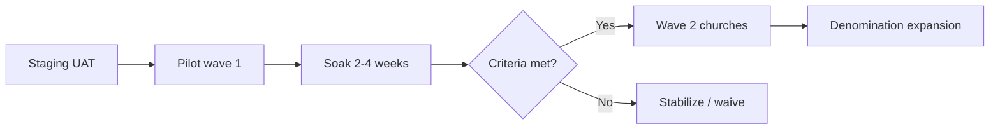

# ChurchHub — Pilot Deployment Plan

**Date:** 22 July 2026  
**Companion:** `UAT_PLAN.md`, `UAT_TEST_CASES.md`, `GO_LIVE_CHECKLIST.md`  
**Candidate:** Current production codebase (Phases 1–5 complete)

---

## 1. Pilot goal

Prove ChurchHub supports **real church operations** for a **limited** set of institutions with production-grade security and finance controls, before broader rollout.

Success = P0 UAT accepted, stable ops for **4–6 weeks**, no Critical tenancy/finance incidents.

---

## 2. Pilot readiness baseline

| Metric | Value |
|--------|-------|
| **Pilot readiness score** | **8.0 / 10** |
| **Security posture** | Phase 5 Conditional Go (8.2/10) |
| **Infrastructure** | Production settings, Redis required, health probes, Beat backups |
| **Recommendation** | **Conditional Go for limited pilot** |

Score assumes UAT P0 execution completes without Blockers. Reduce by 1.0 if finance or isolation P0 fails; raise toward 8.5 after clean 2-week soak.

---

## 3. Recommended rollout strategy

### Strategy: **Narrow vertical pilot → expand**

### Wave 1 (minimum viable pilot)

| Dimension | Recommendation |
|-----------|----------------|
| **Denominations** | **One** primary denomination |
| **Churches** | **2–5** active churches (same district/conference preferred) |
| **Users** | 1 Platform OWNER, 1 denom/tree admin, per church: Pastor, Secretary, Treasurer (+ MFA), 2–3 Members |
| **Modules enabled** | Membership, finance (receipts/expenses/approve), ledger, reports, meetings, announcements, permissions |
| **Modules optional** | Payroll, assets, remittance, budgets, giving statements — enable only if churches will use them in weeks 1–4 |
| **Duration** | 4–6 weeks |
| **Support** | Named eng/ops on-call; weekly office hours |

### Wave 2

- Add churches in the **same** denomination (same training materials).  
- Enable deferred modules after Wave 1 soak.  
- Add second denomination only after isolation UAT (UAT-TEN-*) reconfirmed on pilot data.

### Explicitly delay until post-pilot

- Wide multi-denomination self-serve onboarding  
- Unsupervised platform impersonation by junior support  
- Turning off MFA for privileged roles  
- Large async report exports without Redis/Celery health proof  

---

## 4. Pre-pilot preparation

| # | Activity | Owner |
|---|----------|-------|
| 1 | Freeze release candidate SHA; CI green | Eng |
| 2 | Complete `DEPLOYMENT_CHECKLIST.md` + `PRODUCTION_SECURITY_CHECKLIST.md` | Ops |
| 3 | Execute UAT P0 on staging; sign `UAT_TEST_CASES.md` | Business + Eng |
| 4 | Provision Wave 1 hierarchy + invite users | Platform Admin |
| 5 | Enroll MFA for OWNER, SECURITY, SUPER_ADMIN, TREASURY | Users |
| 6 | Configure SMTP; send test invite + reset | Ops |
| 7 | Confirm Redis, Celery worker, Beat, media strategy | Ops |
| 8 | Run backup + document restore drill | Ops |
| 9 | Train Treasurer/Secretary (90 min each track) | Champion |
| 10 | Agree pilot success metrics (below) | Sponsors |

---

## 5. Pilot success metrics

| Metric | Target |
|--------|--------|
| Critical / Blocker production incidents | **0** tenancy or ledger integrity |
| Finance journals | 100% of pilot postings approved via maker-checker (no self-approve workarounds) |
| Uptime | `/health/ready/` green ≥ 99% during business hours |
| Backup | Daily backup artifact present; restore drill ≤ 1 week old |
| Support | ≤ 5 Major tickets/week by week 3, trending down |
| User sentiment | Treasurers + secretaries able to complete weekly jobs without eng |

---

## 6. Pilot operating model

| Topic | Practice |
|-------|----------|
| **Change freeze** | No feature deploys mid-wave without sponsor approval; security/hotfix only |
| **Data** | Production PII — follow privacy expectations; no shared passwords |
| **Impersonation** | OWNER/SUPPORT with CAP only; always end session; log ticket id |
| **Finance calendar** | Open working days; lock periods at month-end with dual control |
| **Comms** | Slack/WhatsApp pilot channel + weekly 30-min standup |
| **Rollback** | Keep previous release artifact; DB restore runbook linked in `OPERATIONS_RUNBOOK.md` |

---

## 7. Risk register (pilot-specific)

| Risk | Likelihood | Mitigation |
|------|------------|------------|
| Export permission unevenness | Medium | Limit who has report access; monitor export audit |
| MFA SECRET_KEY rotation breaks secrets | Low | Do not rotate SECRET_KEY during pilot without re-encrypt plan |
| Celery/Beat down → missed backups | Medium | Alert on Beat; provider DB backups as belt-and-suspenders |
| Treasurer unavailable (single point) | Medium | Train backup checker + second treasury-capable user |
| Scope creep (all modules day 1) | High | Stick to Wave 1 module list |

---

## 8. Exit criteria → general availability

Pilot graduates when:

1. Wave 1 success metrics met for ≥ 4 weeks.  
2. All **Modules requiring attention** from Phase 6 summary closed or formally waived.  
3. Second-wave training materials updated from pilot lessons.  
4. Sponsors sign `GO_LIVE_CHECKLIST.md` for broader production.

---

## 9. Roles & RACI (pilot)

| Decision | R | A | C | I |
|----------|---|---|---|---|
| Go / No-Go pilot | Eng lead | Sponsor | Ops, Finance champion | Churches |
| Enable payroll/assets | Eng | Sponsor | Treasurer | Churches |
| Hotfix deploy | Eng | Eng lead | Ops | Pilot users |
| Add church to pilot | Platform Admin | Sponsor | Denom admin | Church |

---

## 10. Timeline template

| Week | Focus |
|------|-------|
| −1 | UAT sign-off, staging soak, training |
| 0 | Cutover (`GO_LIVE_CHECKLIST.md`); invite users; MFA |
| 1 | Membership + meetings + light finance |
| 2 | Full weekly finance close; reports |
| 3 | Optional modules; isolation re-check |
| 4–6 | Soak; metrics review; Wave 2 decision |
