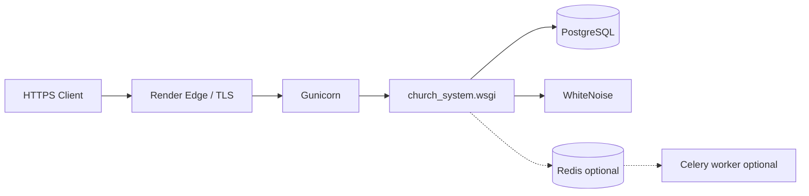

# ChurchHub — Production Readiness Report

**Type:** Read-only production readiness assessment  
**Date:** 21 July 2026  
**Constraint:** No application code was modified for this document  
**Source of truth:** Live Django code, `church_system/settings.py`, CI, deploy scripts, Phase 0/1 docs  
**Companions:** `DEPLOYMENT_CHECKLIST.md`, `OPERATIONS_RUNBOOK.md`, `RISK_REGISTER.md`, `DEVELOPMENT/DEPLOYMENT_NOTES.md`, `PHASE_1_ENTERPRISE_BACKLOG.md`

| Label | Meaning |
|-------|---------|
| **Current** | Observed in code / repo today |
| **Planned** | `AGENTS.md` aspirations |
| **Recommended** | Hardening before or soon after go-live |

---

## Executive summary

| Metric | Result |
|--------|--------|
| **Overall production readiness score** | **8.3 / 10** (updated Phase 3 infrastructure) |
| **Go-live verdict** | **Ready for controlled production** after checklist smoke tests (Redis, media, bootstrap, email, backups) |
| **Primary deploy path** | Render.com: Gunicorn + Redis + Celery/Beat + WhiteNoise + PostgreSQL; Docker Compose + self-host Nginx/systemd also Current |
| **Architecture posture** | Strong RBAC, denomination isolation, double-entry finance SoR, MFA for privileged roles, split settings, health/ready probes |

ChurchHub is a mature Django monolith with real multi-tenancy, finance integrity controls, and a documented Render deploy path. Gaps that most often block “enterprise production” are **ops maturity** (Redis for multi-worker cache/rate limits, durable media, Celery Beat, DR drills), **CI quality gates** (coverage floor, lint, dependency audit, Py3.14 harness), and **session / audit hardening** still listed as Planned.

---

## Scorecard by area

| Area | Score (/10) | Summary |
|------|-------------|---------|
| 1. Security | 8.0 | Sessions, CSRF, MFA, rate limits, HTTPS when `DEBUG=False`; Redis optional; absolute session timeout Planned |
| 2. Performance | 6.5 | Selectors use `select_related` in many paths; giving leaders + heavy dashboards/reports need ORM aggregates / indexes |
| 3. Database | 8.0 | PostgreSQL-first on Render; UUID PKs; constraints/indexes on finance models; soft-delete Planned |
| 4. Infrastructure | 8.5 | Gunicorn config, Nginx/systemd/Supervisor, Redis required in prod, Celery+Beat, Docker prod override |
| 5. CI/CD | 7.5 | Lint, SQLite+coverage, Postgres+Redis, pip-audit, manual production deploy workflow |
| 6. Observability | 8.0 | Structured + rotating file logs; `/health/`, `/live/`, `/ready/`, `/metrics/`; Sentry hooks |
| 7. Disaster recovery | 7.0 | `backup_database` + Beat schedule + scripts; restore drill still operator-owned |

**Overall: 8.3 / 10** (updated after Phase 3 infrastructure implementation).

---

## 1. Security

### Current strengths

| Control | Status | Evidence |
|---------|--------|----------|
| Authentication | Session auth; custom `accounts.User`; password validators incl. platform length/uppercase | `settings.py`, `church_system.auth` |
| Authorization | RBAC via `permissions.services` / `permissions.checks`; platform vs institution lanes | Middleware + checks |
| CSRF | `CsrfViewMiddleware`; `CSRF_TRUSTED_ORIGINS` / Render host auto-append | `settings.py` |
| XSS | Django auto-escape; limited `|safe` for trusted UI partials / chart JSON | Templates |
| SQL injection | ORM-only; raw SQL only health `SELECT 1` | `health.py` |
| Session | Cookie age 4h + `PlatformSessionMiddleware` idle from `SiteSettings` | Middleware |
| Secrets | Env-based; refuse insecure `SECRET_KEY` when `DEBUG=False` | `settings.py` |
| HTTPS | SSL redirect, secure cookies, HSTS when not DEBUG | `settings.py` |
| Headers | `X_FRAME_OPTIONS=DENY`, nosniff, XSS filter flag | `settings.py` |
| Rate limiting | Login + portal login + password reset (cache-backed) | `LoginRateLimitMiddleware` |
| MFA | TOTP + recovery codes; enforced for privileged roles when `mfa_required_for_privileged` | `accounts.mfa`, `MfaEnforcementMiddleware` |
| Audit logging | Domain audit tables + export audit; `PlatformAuditLog` immutable | `AUDIT_COMPLIANCE.md` |
| Admin blast radius | Platform-restricted; tenancy scoping for OWNER vs managed denominations | `admin_custom.tenancy` |
| DEBUG safety | Production-like markers default DEBUG False; health fails if DEBUG on prod-like | `debug_config`, `health.py` |

### Gaps / risks

| Item | Severity | Notes |
|------|----------|-------|
| LocMemCache when `REDIS_URL` unset | **Critical** (multi-worker) | Rate limits and permission cache are **per-process**; Gunicorn default 2 workers → inconsistent lockouts |
| Media not served when `DEBUG=False` | **High** | `urls.py` only mounts media/static helpers under DEBUG; production needs Disk + reverse-proxy / object storage |
| Absolute session timeout / logout-all | Medium | Idle timeout Current; absolute + device list Planned |
| FinancialAuditLog model immutability | Medium | Platform audit immutable; financial audit relies on admin discipline |
| Password history / expiration | Low | Planned in AGENTS |
| Docs drift | Low | Some Phase 0 auth docs may still say MFA “stub”; **code enforces MFA** |

### Recommended before go-live

1. Set `REDIS_URL` on every production web instance with `WEB_CONCURRENCY` > 1.  
2. Attach persistent media (Render Disk or S3) and configure serving path.  
3. Enable `SENTRY_DSN`.  
4. Verify MFA enrollment for all OWNER / SECURITY / SUPER_ADMIN / TREASURY accounts.

---

## 2. Performance

### Current

- Layered selectors in 16 apps often use `select_related` / scoped querysets.
- Reports builders use selectors with related joins for GL/member/welfare paths.
- Dashboard KPIs aggregate via services; chart data built server-side.
- DB `CONN_MAX_AGE` default 600; health checks on connections when using `DATABASE_URL`.
- Celery task for async report export and depreciation (when worker present).

### Gaps

| Item | Severity | Location / note |
|------|----------|-----------------|
| Giving leaders Python loop | Medium | `giving/services.church_giving_leaders` — scale risk |
| Fat dashboard / report paths | Medium | Large service modules; hierarchy templates `.all()` chains |
| Index review incomplete | Medium | P1-7 backlog — EXPLAIN on hot church+date+status filters |
| LocMemCache | Medium | No shared cache → repeated permission / settings loads per worker |
| WhiteNoise only for static | Low | Fine for modest traffic; CDN later |

### Caching opportunities (Recommended)

- Shared Redis for permission matrix cache, SiteSettings, dashboard KPI TTL (tenant-keyed).  
- Avoid caching user-specific sensitive data without isolation.  
- Async large exports via Celery (already wired; ensure worker in prod if used).

---

## 3. Database

### Current

| Topic | Status |
|-------|--------|
| PostgreSQL | Required on Render (`DATABASE_URL`); CI job on Postgres 16 |
| SQLite | Local/dev only; start script refuses SQLite on Render |
| Constraints / indexes | Finance models use unique constraints + indexes (`transactions.models`) |
| Transactions | `@transaction.atomic` / `select_for_update` on critical finance/welfare paths |
| Migrations | Applied on deploy start; CI `makemigrations --check` |
| FKs | Standard Django FK integrity |
| UUID PKs | Dominant on domain models |
| Soft-delete | **Not Current** (Planned) |

### Gaps

- No automated backup schedule in-app (command exists; ops must schedule).  
- Soft-delete / legal hold Planned.  
- Multi-currency / richer CoA taxonomy Planned — do not invent.

---

## 4. Infrastructure

### Current stack

| Component | Current | Gap |
|-----------|---------|-----|
| Gunicorn | `render_start.sh` / `docker-entrypoint.sh` | Tune workers for CPU |
| Nginx | Not in repo (platform edge) | Self-host must add reverse proxy + media |
| Redis | Optional via `REDIS_URL` | **Recommended required** for multi-worker |
| Celery | Optional worker in Compose; tasks exist | Not in `render.yaml` by default |
| Celery Beat | **Absent** | No periodic backup / purge schedule in-app |
| Static | WhiteNoise CompressedStaticFilesStorage | OK |
| Media | Filesystem `MEDIA_ROOT` | Ephemeral on Render without Disk; not served when DEBUG=False |
| Logging | stdout structured | Platform log drain |
| Monitoring | `/health/` + optional Sentry | No Prometheus/APM required |
| Health | DB, cache, migrations, DEBUG-safe | Unauthenticated by design for LBs |

### Docker / Compose

Staging-like: Postgres 16, Redis 7, web, Celery. Default `DJANGO_DEBUG=True` and weak secrets — **not** for internet-facing use without overrides.

---

## 5. CI/CD

### Current (`.github/workflows/ci.yml`)

| Job | What it does |
|-----|----------------|
| `test-sqlite` | Python 3.13; `manage.py check`; migration dry-run; coverage `fail-under=50` |
| `test-postgresql` | Postgres 16 service; full test run |

### Gaps

| Gap | Severity |
|-----|----------|
| No Black/Ruff/flake8 job | Medium |
| No `pip-audit` / Dependabot / Bandit | Medium |
| Coverage gate 50% vs AGENTS 80%+ | Medium |
| CI on 3.13 only; local Py3.14 template harness failures | High for local/CI parity |
| No deploy gate tying health to release | Low (platform-dependent) |

P1-6 full suite locally: 599 tests; failures/errors were **test harness** (MFA fixture + Py3.14 `Context.__copy__`), not finance regressions — still a **release confidence** issue until fixed.

---

## 6. Observability

| Capability | Current | Recommended |
|------------|---------|-------------|
| Structured logging | Yes (`logging_config.py`) | Ship to platform log aggregator |
| Error tracking | Optional Sentry (`configure_sentry` in `AppConfig.ready`) | Require `SENTRY_DSN` in prod |
| Metrics | None first-class | Request latency / 5xx via platform or Sentry performance |
| Health | `/health/` JSON 200/503 | Alert on 503 |
| Audit (business) | Domain audit tables | Retain per policy; export access audited |

---

## 7. Disaster recovery

| Capability | Current | Gap |
|------------|---------|-----|
| DB backup command | `manage.py backup_database` (pg_dump → gzip) | Manual / Shell; needs schedule |
| Provider backups | Render Postgres plan-dependent | Enable + verify RPO |
| Restore procedure | Partially documented | Formal drill checklist → runbook |
| Media backup | Ops responsibility | Disk snapshot / object versioning |
| Secret rotation | Env regenerate on platform | Document Fernet/MFA secret dependency on `SECRET_KEY` |
| Failover | Single-region Render pattern | Multi-AZ / multi-region Planned |

**Critical note:** MFA TOTP secrets are Fernet-encrypted with a key derived from `DJANGO_SECRET_KEY`. Rotating `SECRET_KEY` without a re-encrypt migration **breaks MFA decryption**.

---

## Critical blockers (must resolve before broad production)

1. **`REDIS_URL` for multi-worker production** — shared cache for login rate limits and caches.  
2. **Durable media strategy** — Render Disk or object storage + how files are served when `DEBUG=False`.  
3. **CI / test harness green on release Python** — MFA fixture + Py3.14 template store (or pin CI/runtime to 3.13 consistently).  
4. **Bootstrap hygiene** — `CHURCHHUB_BOOTSTRAP=0` after first success; rotate bootstrap passwords.  
5. **Email path verified** — Platform SMTP or env SMTP; invitations and MFA/recovery UX depend on it.  
6. **Provider DB backups enabled** + at least one restore smoke test.

---

## High-priority improvements

1. Require `SENTRY_DSN` in production env checklist.  
2. Add Celery worker (+ Redis) on Render if async email/exports/depreciation are used.  
3. Raise coverage gate gradually; add shared `ViewTestMixin`.  
4. Index review (P1-7) + giving leaders ORM aggregates (P1-5).  
5. Model-level immutability for `FinancialAuditLog` (P1-9).  
6. Absolute session max age + logout-all on password change for privileged roles.  
7. Remittance dual-path SoR consolidation (P1-1) after ops sign-off.

---

## Medium-priority improvements

1. CI: Ruff/Black + `pip-audit` / Dependabot.  
2. Celery Beat: scheduled `backup_database`, notification purge, depreciation reminders.  
3. Object storage (django-storages) for media.  
4. Soft-delete design (Planned — do not fake as Current).  
5. Service splits for fat finance modules (maintainability).  
6. Canonical permission imports (P1-3).  
7. Budget approve/lock workflow or remove unused permission codes (P1-4).

---

## Low-priority improvements

1. UI consistency / shared partials.  
2. CDN for static assets.  
3. Prometheus / OpenTelemetry metrics.  
4. Multi-region HA design.  
5. Announcement dual status field cleanup.  
6. Nginx sample configs for self-host docs only.

---

## Recommended deployment sequence

1. **Prep** — secrets, hosts, CSRF origins, public URL, Postgres linked, Redis provisioned.  
2. **CI green** on release branch (Python 3.13 matching Render).  
3. **Staging** — migrate, bootstrap once, MFA enroll platform owner, SMTP test, `/health/` green.  
4. **Backup** — enable provider backups; run `backup_database`; store off-platform.  
5. **Media** — mount Disk / set `MEDIA_ROOT`; smoke-test upload.  
6. **Sentry** — set DSN; trigger test error.  
7. **Cutover** — `CHURCHHUB_BOOTSTRAP=0`; change passwords; disable demo flags.  
8. **Hypercare** — watch Sentry, health, login lockouts, finance posting for 1–2 weeks.  
9. **Hardening sprint** — indexes, Celery Beat backups, audit immutability, remittance SoR.

Detailed steps: `DEPLOYMENT_CHECKLIST.md`. Day-2 ops: `OPERATIONS_RUNBOOK.md`. Risk IDs: `RISK_REGISTER.md`.

---

## Estimated effort to reach production

Assumes one experienced Django engineer + part-time ops; existing Render account.

| Track | Effort | Outcome |
|-------|--------|---------|
| Critical blockers (Redis, media, bootstrap, email, backups, CI harness on 3.13) | **3–5 days** | Controlled production go-live |
| High-priority hardening (Sentry, Celery worker, coverage/mixin, indexes/giving, session/audit) | **1–2 weeks** | Stable enterprise ops |
| Medium/low backlog (Beat, object storage, soft-delete design, lint/audit CI, remittance SoR) | **3–6 weeks** | Full Phase 2 readiness |

**Fastest safe path:** ~1 calendar week to **limited production** if Redis + Disk + email + backups are ready and CI stays on Python 3.13.

---

## Related reading

- `docs/DEVELOPMENT/DEPLOYMENT_NOTES.md`  
- `docs/SECURITY/AUTHENTICATION.md`, `AUTHORIZATION.md`, `AUDIT_COMPLIANCE.md`  
- `docs/PHASE_1_ENTERPRISE_BACKLOG.md` (P0 VERIFIED; P1-6 architecture)  
- Root `DEPLOY_RENDER.md`, `.env.example`, `render.yaml`
