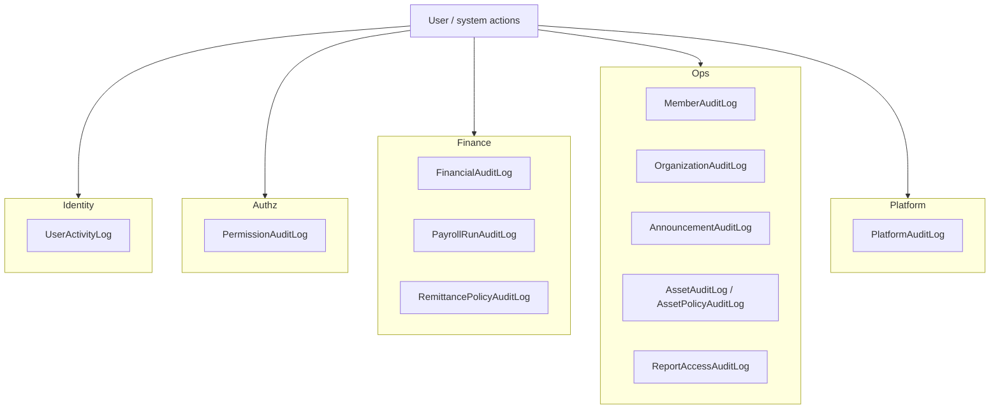
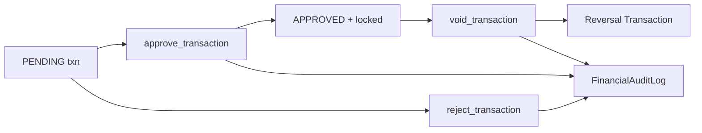
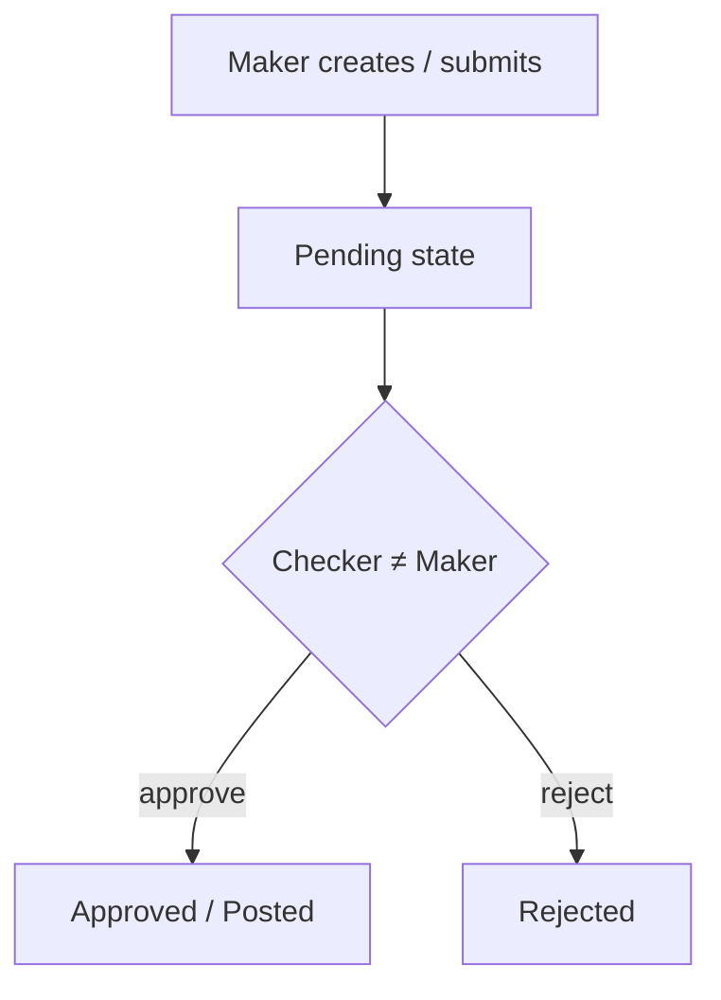

# ChurchHub — Audit and Compliance

**Audience:** Auditors, architects, AI agents, finance controllers  
**Source of truth:** Live audit models, financial services, and SiteSettings  
**Companions:** `AUTHENTICATION.md`, `AUTHORIZATION.md`, `docs/ARCHITECTURE/WORKFLOW_ARCHITECTURE.md`, `docs/DATABASE/DATABASE_SCHEMA.md`, `docs/MODULE_SPECIFICATIONS/FINANCE/finance_spec.md`, `docs/MODULE_SPECIFICATIONS/TRANSACTIONS/transactions_spec.md`, `docs/MODULE_SPECIFICATIONS/SITE_CONTROL/site_control_spec.md`, root `AUDIT_AND_COMPLIANCE.md`, `AGENTS.md` §3–4

| Label | Meaning |
|-------|---------|
| **Current** | Implemented controls and logs |
| **Planned (AGENTS.md)** | Enterprise audit / compliance constitution |
| **Recommended** | Next improvements |

---

## 1. Audit logging architecture (Current)

ChurchHub uses **domain-specific audit tables**, not a single universal audit event store.

| Model | App | Typical actions |
|-------|-----|-----------------|
| `UserActivityLog` | accounts | LOGIN, LOGOUT, PASSWORD_CHANGE, ROLE_CHANGE, CHURCH_ASSIGN, USER_*, INVITE_*, PROFILE_UPDATE, EMAIL_CHANGE, SCOPE_CHANGE |
| `PermissionAuditLog` | permissions | MATRIX_UPDATE, MATRIX_RESET, OVERRIDE_CREATE/UPDATE/DELETE |
| `FinancialAuditLog` | transactions | CREATE, UPDATE, APPROVE, REJECT, VOID, REMIT, BUDGET_* |
| `MemberAuditLog` | members | CREATE, UPDATE, STATUS, TRANSFER_*, EXPORT, DEACTIVATE, ACTIVATE |
| `OrganizationAuditLog` | organization | CREATE, UPDATE, DEACTIVATE, ACTIVATE, TRANSFER |
| `AnnouncementAuditLog` | announcements | CREATE, UPDATE, APPROVE, REJECT, ARCHIVE, PIN, UNPIN, EXPORT |
| `AssetAuditLog` | assets | Service-written actions (SUBMIT, APPROVE, REJECT, DEPRECIATE, DISPOSE, …) |
| `AssetPolicyAuditLog` | assets | POLICY_UPDATE, CATEGORY_CREATE, CATEGORY_UPDATE |
| `PayrollRunAuditLog` | payroll | CREATE, CALCULATE, APPROVE, REJECT, POST, PAY, VOID, REOPEN, REVERSE, EXPORT |
| `RemittancePolicyAuditLog` | remittance | CREATE, UPDATE, DEACTIVATE |
| `ReportAccessAuditLog` | reports | RUN, EXPORT |
| `PlatformAuditLog` | sitecontrol | Tenant/operator/settings/denomination/impersonation/breakglass, … |

**Immutability:** Only `PlatformAuditLog` enforces immutability in `save()`/`delete()` (updates/deletes raise). Other audit models rely on process/admin discipline (`ReadOnlyAuditModelAdmin` in `admin_custom` for several).

### Application logging

`church_system/logging_config.py`: console logging; structured format in non-debug; optional Sentry via `SENTRY_DSN` with `send_default_pii=False`. Never log passwords, tokens, or encryption keys.

---

## 2. Financial audit trail (Current)

**Model:** `transactions.FinancialAuditLog`  
**Writer:** `transactions` services (`_log_audit`) and companion posters that create journals

| Control | Mechanism |
|---------|-----------|
| Trail of mutations | FinancialAuditLog actions + JSON `details` |
| No silent edit of posted books | Void creates reversal; locked lines reject edits |
| Who approved / voided | `approved_by` / `voided_by` on Transaction |
| Remit / budget events | REMIT, BUDGET_* |
| Idempotency | `FinancialIdempotencyKey` for RECEIPT, EXPENSE, REMITTANCE, LEDGER, PAYROLL_POST, PAYROLL_PAY |

**Books of record:** always `transactions`. Ledger posts write CREATE with `details.source = "ledger"` then enter the same approval trail.

Related: `docs/MODULE_SPECIFICATIONS/TRANSACTIONS/transactions_spec.md`, `FINANCE/finance_spec.md`, `LEDGER/ledger_spec.md`.

---

## 3. Permission audit logs (Current)

**Model:** `permissions.PermissionAuditLog`

| Action | Meaning |
|--------|---------|
| `MATRIX_UPDATE` | Role × permission change |
| `MATRIX_RESET` | Matrix reset to defaults |
| `OVERRIDE_CREATE` / `UPDATE` / `DELETE` | Per-user overrides |

Critical for reconstructing why a user could (or could not) perform an action. See `AUTHORIZATION.md`.

---

## 4. Platform audit logs (Current)

**Model:** `sitecontrol.PlatformAuditLog` — **immutable**

Covers (non-exhaustive): settings/plan/subscription/tenant lifecycle, operator changes, maintenance, registration applications, provisioning, payment methods, denomination admin, audit export, email tests, **IMPERSONATE_START/END**, **BREAKGLASS_GRANT**.

Writer: `sitecontrol.services.log_platform_action` (and related services).

Platform IP allowlist and maintenance toggles should appear when changed through platform UI/services.

See `docs/MODULE_SPECIFICATIONS/SITE_CONTROL/site_control_spec.md`.

---

## 5. Member audit logs (Current)

**Model:** `members.MemberAuditLog`  
**Writer:** `members.services.log_member_audit`

Typical: CREATE, UPDATE, STATUS, TRANSFER_*, EXPORT, DEACTIVATE, ACTIVATE.

Church-scoped. Member hard-delete of core records is not the normal UI path; status/`is_active` used instead. Some related rows (e.g. department delete, gift unassign) may still hard-delete — treat carefully.

See `docs/MODULE_SPECIFICATIONS/MEMBERS/members_spec.md`.

---

## 6. Report access logs (Current)

**Model:** `reports.ReportAccessAuditLog`  
**Writer:** `reports.services.log_report_access` / `reports.services.audit_export`

| Action | Meaning |
|--------|---------|
| `RUN` | Report executed |
| `EXPORT` | Export generated |

Also: async `ReportExportJob` for large exports.

**Domain exports (Current):** Module views that call `reports.exporters` (giving, ledger, transactions list/financial statement, member directory/baptism, announcements, organization hierarchy, budgets, remittance welfare statement) invoke `audit_export` so each download creates a `ReportAccessAuditLog` row. Domain-specific EXPORT rows (e.g. `MemberAuditLog`, `AnnouncementAuditLog`) remain where already present.

See `docs/MODULE_SPECIFICATIONS/REPORTS/reports_spec.md`.

---

## 7. Payroll audit logs (Current)

**Model:** `payroll.PayrollRunAuditLog`  
**Writer:** `payroll.services._log_run_audit`

Lifecycle: CREATE → CALCULATE → APPROVE (incl. treasury) → POST → PAY, plus REJECT, VOID, REOPEN, REVERSE, EXPORT.

Payroll also creates `transactions.Transaction` rows (PAYROLL / payment TRANSFER) which appear on the financial trail.

Sensitive PII: TIN/SSNIT/bank encrypted at rest (`payroll.encryption`) — never log decrypted values.

See `docs/MODULE_SPECIFICATIONS/PAYROLL/payroll_spec.md`.

---

## 8. Asset audit logs (Current)

| Model | Purpose |
|-------|---------|
| `AssetAuditLog` | Per-asset lifecycle actions |
| `AssetPolicyAuditLog` | Depreciation policy / category changes |

Acquisition, depreciation, and disposal may also create CAPITAL journals → `FinancialAuditLog`.

See `docs/MODULE_SPECIFICATIONS/ASSETS/assets_spec.md`.

---

## 9. Other domain audit trails (Current)

| Domain | Trail |
|--------|-------|
| Organization | `OrganizationAuditLog` — CREATE/UPDATE/ACTIVATE/DEACTIVATE/TRANSFER |
| Announcements | `AnnouncementAuditLog` — lifecycle + pin/export |
| Remittance policies | `RemittancePolicyAuditLog` — CREATE/UPDATE/DEACTIVATE |
| Welfare | Case/ledger models + disbursement transactions (financial trail); not a separate WelfareAuditLog table |
| Identity | `UserActivityLog` — auth and user admin |

---

## 10. Maker-checker & integrity (Current)

| Domain | Entry points |
|--------|--------------|
| Transactions | Creator cannot approve own (except superadmin path); **receipt auto-approve** under church/user limit is a documented SoD exception with `auto_approved` audit detail |
| Payroll | `approved_by` + `treasury_approved_by` before post |
| Assets | Submit → approve/reject + SoD helpers |
| Meeting minutes | Submit → approve/reject |
| Announcements | Approve/reject (pending excludes creator) |
| Welfare | Review → approve/reject → disburse (separate perms) |

Financial integrity (balance=0, period open, working day, void=reversal) is part of **compliance of the books**, not only audit rows. See transactions / finance module specs.

### Planned (AGENTS.md)

Maker-checker for budget approval/lock, role changes, bulk imports, data migration, member deletion — **not all present** as first-class workflows.

---

## 11. Data retention (Current)

| Capability | Status |
|------------|--------|
| Soft-delete (`is_deleted`) | **Current** on members domain (`Member`, `Family`, `Department`, `Record`, `Visitor`, gifts/leadership); absent elsewhere |
| Audit log purge jobs | **Absent** |
| GDPR erasure framework | **Absent** |
| Notification purge | `purge_old_notifications` (read >90d / unread >180d) |
| Idempotency key cleanup | `cleanup_financial_idempotency` (>30d) |
| Legal hold | Not modeled |

Lifecycle alternatives: `is_active`, membership statuses, transaction void, announcement archive, platform suspend/offboard.

### Planned (AGENTS.md)

Configurable retention, archive/restore, legal hold, scheduled purge for **non-audited** data only; never purge financial records without explicit policy.

### Recommended

1. Retention schedule per audit table (financial/platform longest).  
2. Soft-delete for members/announcements before hard-delete tooling.  
3. No blind purge for `FinancialAuditLog` / `PlatformAuditLog`.  
4. Backup/restore as recovery path until soft-delete exists.

---

## 12. Compliance considerations (Current)

| Area | Current control |
|------|-----------------|
| Least privilege | RBAC + overrides + scope (see AUTHORIZATION) |
| Authentication abuse | Login rate limit + session timeout |
| Privileged platform access | IP allowlist + capabilities + immutable PlatformAuditLog |
| Impersonation | Capability-gated; must remain audited |
| PII in payroll | Field encryption + masking helpers |
| Transport | HTTPS/HSTS when `DEBUG=False` |
| Error reporting | Sentry with `send_default_pii=False` |
| Financial permanence | Void/reversal; locked lines |

AGENTS principles (GDPR, consent tracking, data minimization) are **design goals** — not a full compliance product pack in code.

### Compliance-relevant SiteSettings

`session_timeout_minutes`, `login_max_attempts` / `login_lockout_minutes`, `password_min_length` / `password_require_uppercase`, `maintenance_mode*`, `platform_ip_allowlist`.

---

## 13. Current vs Planned vs Recommended

| Topic | Current | Planned (AGENTS.md) | Recommended |
|-------|---------|---------------------|-------------|
| Audit store | Domain tables | Unified/exportable audit bus | Keep domain writers; add export/search later |
| Immutability | PlatformAuditLog only | All critical audits append-only | Extend model/DB guards |
| Soft-delete | Absent | Required for business records | Introduce carefully |
| MFA | Stub | Required for high privilege | Enforce before claiming compliance |
| Retention | Ad hoc commands | Configurable policy | Written schedule + no financial purge |
| Export audit | ReportAccessAuditLog via catalog + `audit_export` on domain exporters | Unified export catalog | Cover remaining ad-hoc paths (assets/payroll/platform) |
| Remittance narrative | Dual paths | Single remittance SoR | Unify ops + audit story |

---

## 14. Missing enterprise features

| Gap | Impact |
|-----|--------|
| No soft-delete | Hard deletes can erase history where allowed | **Current guards:** department delete blocked when referenced; budget delete blocked when approved actuals exist; gift unassign + budget/override deletes audited; payroll lines purge only on draft workflow |
| Audit tables not all immutable | Only PlatformAuditLog blocks update/delete in model |
| No unified audit schema | Cross-module forensics harder |
| MFA stub | Privileged actions lack second factor |
| Dual remittance paths | Audit story split (cutoff vs settlement; district+ settlement incomplete) |
| Remaining ad-hoc exports | Assets/payroll/platform CSV may still need `audit_export` |
| Field-level privacy masking | Incomplete vs AGENTS PII rules |
| No retention/GDPR toolkit | Manual process only |
| No security monitoring alerts | No automated alerts on denial spikes / large exports |

---

## 15. Recommended improvements

### P0 — Integrity & privilege

1. Enforce MFA for platform OWNER/SECURITY and high-privilege finance roles.  
2. Make critical audit logs append-only beyond PlatformAuditLog.  
3. Close post-fetch authorization gaps so trails are trustworthy.

### P1 — Completeness

4. Soft-delete framework for membership and communications.  
5. Unify remittance audit narrative (settlement as system of record).  
6. Cover remaining ad-hoc exports (assets/payroll/platform) with `audit_export` where still missing.  
7. Expand maker-checker to budget lock / sensitive role assignment if product requires AGENTS parity.

### P2 — Compliance program

8. Written retention schedule + backup verification runbooks.  
9. Optional consent / data-subject request process (product + legal).  
10. Alerts on repeated permission denials, large exports, impersonation spikes.

---

## 16. Agent rules for audit-sensitive changes

1. Never silently edit approved/locked financial records — use void/reversal services.  
2. When adding a sensitive action, write to the appropriate domain audit log (or PlatformAuditLog).  
3. Do not invent a parallel audit table if an existing one covers the domain.  
4. Do not add purge jobs for financial or platform audit without explicit approval.  
5. Preserve `PlatformAuditLog` immutability.  
6. Never log passwords, tokens, decrypted payroll PII, or SMTP secrets.  
7. Update this document when new audit actions or maker-checker domains ship.

---

## 17. Related documents

- `AUTHENTICATION.md` — login/session controls → UserActivityLog  
- `AUTHORIZATION.md` — matrix, overrides, scope  
- `docs/ARCHITECTURE/WORKFLOW_ARCHITECTURE.md` — state machines  
- `docs/DATABASE/DATABASE_SCHEMA.md` — audit model fields  
- Module specs: TRANSACTIONS, FINANCE, PAYROLL, ASSETS, REMITTANCE, REPORTS, MEMBERS, SITE_CONTROL, PERMISSIONS, ACCOUNTS  
- Root `AUDIT_AND_COMPLIANCE.md`, `FINANCE.md`, `SECURITY.md`  
