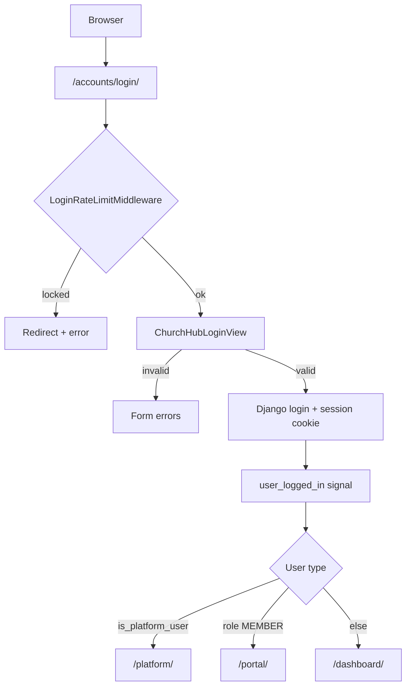
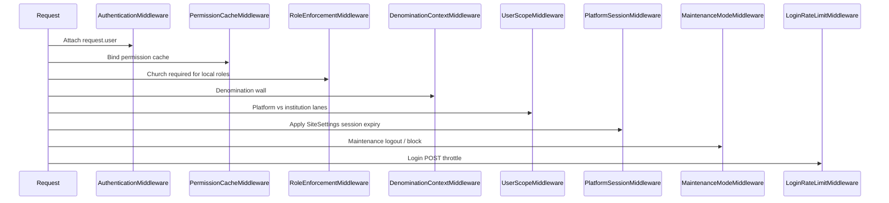
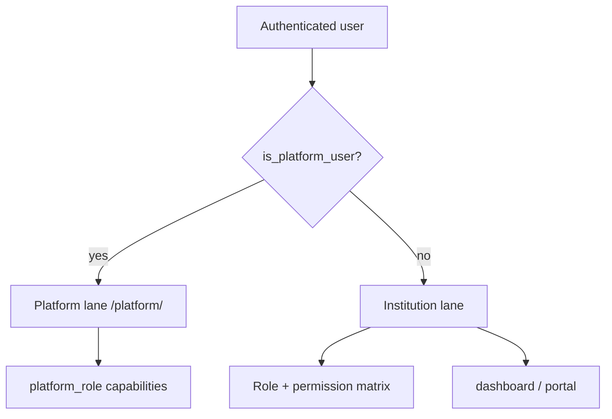
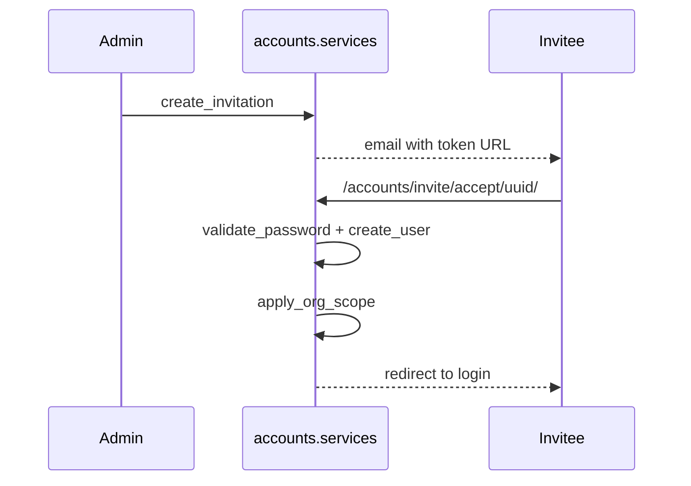

# ChurchHub — Authentication

**Audience:** Security reviewers, architects, AI agents  
**Source of truth:** Live Django auth code and settings  
**Companions:** `AUTHORIZATION.md`, `AUDIT_COMPLIANCE.md`, `docs/ARCHITECTURE/SECURITY_ARCHITECTURE.md`, `docs/MODULE_SPECIFICATIONS/ACCOUNTS/accounts_spec.md`, `docs/MODULE_SPECIFICATIONS/SITE_CONTROL/site_control_spec.md`, root `SECURITY.md`, `AGENTS.md` §4

| Label | Meaning |
|-------|---------|
| **Current** | Implemented in code |
| **Planned (AGENTS.md)** | Enterprise authentication constitution |
| **Recommended** | Hardening next steps |

---

## 1. Login architecture (Current)

ChurchHub uses **Django session authentication** with a custom user model. There is **no** OAuth/OpenID provider and **no** DRF / API token auth surface.



| Item | Detail |
|------|--------|
| Primary login | `/accounts/login/` → `church_system.auth.ChurchHubLoginView` |
| Portal login | `/portal/login/` → `MemberPortalLoginView` |
| Backend | Default `ModelBackend` (no custom `AUTHENTICATION_BACKENDS`) |
| Settings | `LOGIN_URL=/accounts/login/`; `LOGIN_REDIRECT_URL=/dashboard/` (overridden by view) |
| Root | `""` redirects to `login` |
| Also mounted | `django.contrib.auth.urls` under `/accounts/` (password reset/change) |

### Success redirects (`post_login_url`)

| Condition | Destination |
|-----------|-------------|
| `is_platform_user` | `sitecontrol:dashboard` |
| `role == MEMBER` | `portal:home` |
| Otherwise | `dashboard:home` |

Portal login additionally sends users with `member_id` to the portal.

---

## 2. Custom User model (Current)

**Model:** `accounts.User` (`AUTH_USER_MODEL`) — extends `AbstractUser`, UUID PK.

| Field / attribute | Security relevance |
|-------------------|--------------------|
| `username`, `email`, `password` | Credentials (Django hashed password) |
| `is_active` | Inactive users cannot authenticate |
| `is_staff` / `is_superuser` | Admin / break-glass (further constrained for platform) |
| `last_login` | Django-managed |
| `role` | Institution RBAC role (`UserRole`) |
| `scope_level` + scope FKs | Org authorization scope |
| `church` | Home church for local roles |
| `denomination` | Institution denomination binding |
| `is_platform_user` | Platform lane (`/platform/`) |
| `platform_role` | OWNER / SECURITY / BILLING / SUPPORT / READONLY |
| `managed_denominations` | M2M — operator denomination access |
| `mfa_enabled` | **Stub only** — enforcement not implemented |
| `member` | Optional OneToOne to `members.Member` |

Password hashing: Django’s password framework only — never plaintext.

See `docs/MODULE_SPECIFICATIONS/ACCOUNTS/accounts_spec.md`.

---

## 3. Password policy (Current)

**Validators** (`AUTH_PASSWORD_VALIDATORS` in `church_system/settings.py`):

1. `UserAttributeSimilarityValidator`  
2. `accounts.validators.PlatformMinimumLengthValidator` — `SiteSettings.password_min_length` (default 8, range 6–128)  
3. `accounts.validators.PlatformUppercaseValidator` — if `SiteSettings.password_require_uppercase`  
4. `CommonPasswordValidator`  
5. `NumericPasswordValidator`  

**In-session change:** profile view uses Django `PasswordChangeForm`, `update_session_auth_hash`, logs `PASSWORD_CHANGE` on `UserActivityLog`.

### Planned (AGENTS.md)

Lowercase / special character / password history / expiration / reuse prevention — **not** SiteSettings fields today.

### Recommended

Expand SiteSettings (or a policy model) for complexity and history; force reset after invite for privileged roles.

---

## 4. Session management (Current)

| Setting | Value |
|---------|-------|
| `SESSION_COOKIE_AGE` | 4 hours (`60 * 60 * 4`) |
| `SESSION_EXPIRE_AT_BROWSER_CLOSE` | `False` |
| Effective idle timeout | `PlatformSessionMiddleware` sets `session.set_expiry(session_timeout_minutes * 60)` from `SiteSettings` (default **240** minutes; allowed 5–1440) |

### Production cookie hardening (`DEBUG=False`)

- `SESSION_COOKIE_SECURE = True`
- `CSRF_COOKIE_SECURE = True`
- `SECURE_SSL_REDIRECT` (env `SECURE_SSL_REDIRECT`, default True)
- `SECURE_HSTS_SECONDS = 31536000` + include subdomains
- `SECURE_PROXY_SSL_HEADER = ("HTTP_X_FORWARDED_PROTO", "https")`

Always: `X_FRAME_OPTIONS=DENY`, `SECURE_CONTENT_TYPE_NOSNIFF=True`, `SECURE_BROWSER_XSS_FILTER=True`.

### Planned (AGENTS.md)

Absolute session timeout, logout-from-all-devices, device tracking, broader invalidate-on-password-change.

### Recommended

Document absolute max lifetime; add “logout all sessions” for privileged roles; rotate session on privilege elevation.

---

## 5. Authentication-related middleware (Current)

Order (relevant excerpt from `settings.MIDDLEWARE`):



| Middleware | Auth role |
|------------|-----------|
| `AuthenticationMiddleware` | Loads session user |
| `PlatformSessionMiddleware` | Idle timeout from SiteSettings |
| `MaintenanceModeMiddleware` | Logs out non-platform users when maintenance on |
| `LoginRateLimitMiddleware` | Throttles failed login POSTs |
| `UserScopeMiddleware` | Lane isolation after auth (see AUTHORIZATION) |
| `RoleEnforcementMiddleware` | Redirects local roles without church to profile |

CSRF: `CsrfViewMiddleware` globally enabled — never disable globally.

---

## 6. Login / logout flow (Current)

### Login side effects

`accounts/signals.py` `on_user_login` (`user_logged_in`):

- Calls `sync_role_groups` (**no-op** — Django Groups retired)  
- Writes `UserActivityLog` action `LOGIN`

### Logout

| Path | Behavior |
|------|----------|
| Primary UI | `/dashboard/logout/` → `dashboard.views.custom_logout` |
| Steps | Capture denomination id → `logout(request)` → restore `active_denomination_id` → `logged_out.html` |
| Signal | `on_user_logout` → `UserActivityLog` `LOGOUT` |
| Also | Django `/accounts/logout/` → `LOGOUT_REDIRECT_URL=/accounts/login/` |
| Forced | Maintenance middleware logs out non-platform users |

---

## 7. Platform users vs institution users (Current)



| Aspect | Platform | Institution |
|--------|----------|-------------|
| Flag | `is_platform_user=True` | `False` |
| Home after login | `/platform/` | `/dashboard/` or `/portal/` |
| Authz system | `sitecontrol.rbac` capabilities | `permissions` matrix + overrides |
| Django admin | Only if also `is_superuser` (`can_access_django_admin`) | Not via platform break-glass path |
| Institution apps | Blocked by `UserScopeMiddleware` (except limited `/accounts/` profile paths) | Normal access within scope |

Detail: `AUTHORIZATION.md` § Platform vs institution; `docs/MODULE_SPECIFICATIONS/SITE_CONTROL/site_control_spec.md`.

---

## 8. Password reset (Current)

Via:

```text
path("accounts/", include("django.contrib.auth.urls"))
```

Standard Django reset views; templates under `templates/registration/password_reset_*.html`. Login page links ``.

Email delivery depends on platform SMTP / env (`EMAIL_*`, `EMAIL_BACKEND`, `CHURCHHUB_PUBLIC_URL`, SiteSettings SMTP including optional encrypted password).

**Rate limiting:** login POST only — password reset endpoints are **not** covered by `LoginRateLimitMiddleware` today.

---

## 9. Account activation / invitations (Current)

There is **no** separate email-activation token for open signup. Institution users are typically created via **invitation**.



| Item | Detail |
|------|--------|
| Accept URL | `/accounts/invite/accept/<uuid:token>/` |
| Validity | Not accepted, not expired, not revoked (`UserInvitation.is_valid`) |
| Default validity | `days_valid=7` |
| Activation toggle | `activate_user` / `deactivate_user` set `is_active` |
| Audit | INVITE_*, USER_CREATE on `UserActivityLog` |
| Gates | `sitecontrol` invite limits / `institution_invites_allowed()` |

Public tenant onboarding: `/apply/` → platform approve → church provision + invitation — see Site Control spec.

---

## 10. MFA status

| State | Detail |
|-------|--------|
| **Current** | `User.mfa_enabled` boolean stub; help text states enforcement is not implemented; admin/profile treat as non-operational |
| **Planned (AGENTS.md)** | Authenticator apps (TOTP), email OTP, optional SMS OTP, recovery codes; high-privilege accounts should require MFA |
| **Recommended** | Implement TOTP + recovery codes for platform OWNER/SECURITY, institution SUPER_ADMIN, and treasury-capable roles **before** claiming MFA readiness |

Do **not** document MFA as live until challenge/enforcement exists in the login path.

---

## 11. Login rate limiting (Current)

**Middleware:** `sitecontrol.middleware.LoginRateLimitMiddleware`  
**Scope:** `POST` to `/accounts/login` only (not portal login path unless same URL).

| Cache key | Purpose |
|-----------|---------|
| `login_fail:{ip}` / `login_fail_user:{username}` | Fail counters |
| `login_lock:{ip}` / `login_lock_user:{username}` | Lock flags |

| SiteSettings | Default | Range |
|--------------|---------|-------|
| `login_max_attempts` | 5 | 3–20 |
| `login_lockout_minutes` | 15 | 1–120 |

On success: fail keys cleared. Cache: Redis if `REDIS_URL`, else LocMem (locks not shared across processes on LocMem).

**No** automatic `is_active=False` lockout model — only cache lockout + manual deactivate / tenant offboard.

---

## 12. Environment & SiteSettings controls (Current)

| Variable / setting | Effect |
|--------------------|--------|
| `DJANGO_SECRET_KEY` | Required when `DEBUG=False` |
| `DJANGO_DEBUG` | Must be False in production |
| `DJANGO_ALLOWED_HOSTS` | Host allowlist |
| `DJANGO_CSRF_TRUSTED_ORIGINS` | CSRF trusted origins |
| `SECURE_SSL_REDIRECT` | When not DEBUG |
| `REDIS_URL` | Shared cache for rate limits |
| `EMAIL_*` / `DEFAULT_FROM_EMAIL` | Reset / invites |
| `CHURCHHUB_PUBLIC_URL` | Absolute links |
| `SENTRY_DSN` | Errors (`send_default_pii=False`) |

SiteSettings also: session timeout, login attempts/lockout, password min length / uppercase, maintenance mode, platform IP allowlist.

---

## 13. Current vs Planned vs Recommended

| Topic | Current | Planned (AGENTS.md) | Recommended |
|-------|---------|---------------------|-------------|
| Auth style | Session + custom User | + MFA, OAuth readiness, API tokens | Keep session; add MFA before tokens |
| Password | Min length + optional uppercase + Django defaults | History, expiry, full complexity | Expand SiteSettings validators |
| Lockout | Cache rate-limit | Account lock + admin unlock | Persist lock events; unlock UI |
| Sessions | Idle via SiteSettings | Absolute + logout-all + devices | Absolute timeout + logout-all |
| MFA | Stub field | TOTP / OTP / recovery | Enforce for privileged roles |
| Portal | Separate login view | Richer member auth | Keep lane separation |

---

## 14. Security recommendations

1. Implement MFA (TOTP) for privileged roles — do not claim readiness until enforced.  
2. Require Redis in production for shared login lockout.  
3. Fail deploy if `DJANGO_DEBUG=True` in production.  
4. Rate-limit password reset / invite accept endpoints.  
5. Password history + optional expiry for finance/platform roles.  
6. Session absolute timeout + logout-all.  
7. Keep CSRF enabled globally.  
8. Never log passwords, reset tokens, or SMTP secrets.

---

## 15. Related documents

- `AUTHORIZATION.md` — what happens after identity is established  
- `AUDIT_COMPLIANCE.md` — login/activity audit  
- `docs/ARCHITECTURE/SECURITY_ARCHITECTURE.md`  
- `docs/MODULE_SPECIFICATIONS/ACCOUNTS/accounts_spec.md`  
- `docs/MODULE_SPECIFICATIONS/SITE_CONTROL/site_control_spec.md`  
- `docs/AI_CONTEXT/CODING_GUIDE.md`  
