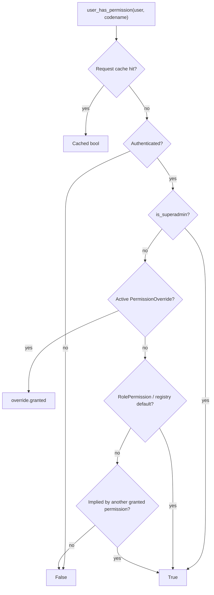
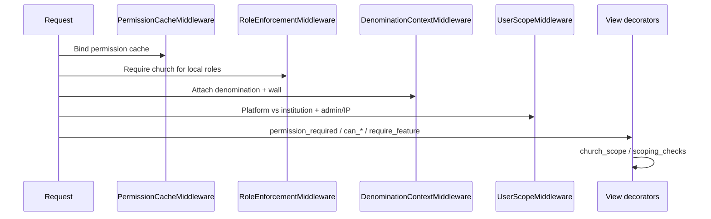
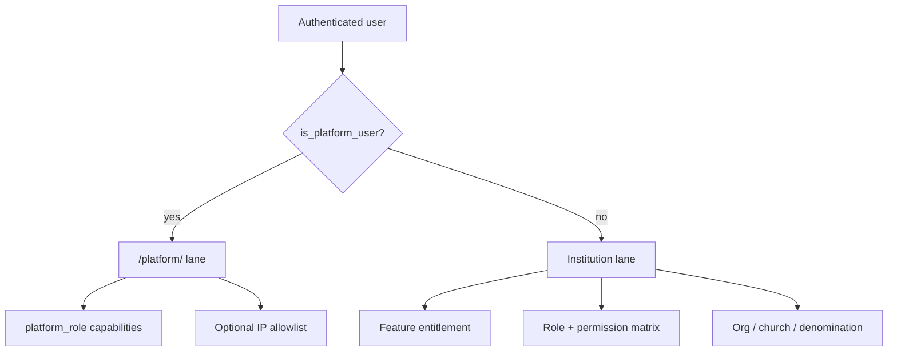

# ChurchHub — Authorization

**Audience:** Security reviewers, architects, AI agents  
**Source of truth:** Live permissions, scoping, middleware, and checks  
**Companions:** `AUTHENTICATION.md`, `AUDIT_COMPLIANCE.md`, `docs/ARCHITECTURE/MULTI_TENANCY.md`, `docs/ARCHITECTURE/SECURITY_ARCHITECTURE.md`, `docs/MODULE_SPECIFICATIONS/PERMISSIONS/permissions_spec.md`, `docs/MODULE_SPECIFICATIONS/SITE_CONTROL/site_control_spec.md`, `AGENTS.md` §4

| Label | Meaning |
|-------|---------|
| **Current** | Implemented today |
| **Planned (AGENTS.md)** | Enterprise authorization constitution |
| **Recommended** | Hardening and consistency |

---

## 1. Authorization philosophy (Current)

```text
Identity (session) → Lane (platform vs institution)
  → Feature entitlement (subscription / SiteSettings)
  → Permission codename (RBAC matrix + overrides + implies)
  → Organizational / church / denomination scope
  → Object-level helpers (maker-checker, segregation)
```

UI permission flags and template tags are **not** security boundaries. Every mutating view must enforce server-side checks.

---

## 2. RBAC architecture (Current)



| Piece | Location |
|-------|----------|
| Engine | `permissions.services.user_has_permission` |
| Superadmin | `permissions.superadmin.is_superadmin` — institution `is_superuser` **or** `role == SUPER_ADMIN`; **excludes** `is_platform_user` |
| Cache | `PermissionCacheMiddleware` → bind/clear per-request cache |
| Registry | `permissions/registry.py` (~100 codenames) |
| Matrix models | `Permission`, `RolePermission` |
| Helpers | `permissions.checks.can_*` wrappers |

Django Groups sync (`sync_role_groups`) is a **retired no-op**. Authz is registry + matrix + overrides — not Django group permissions.

Admin UI: `/permissions/` — see `docs/MODULE_SPECIFICATIONS/PERMISSIONS/permissions_spec.md`.

---

## 3. Permission resolution (Current)

Each registry entry:

```text
PERMISSION_REGISTRY[codename] = {
  name, category, description, default_roles, implies?, conflicts_with?
}
```

| Step | Behavior |
|------|----------|
| Cache | Per-request memoization of `(user_id, codename)` |
| Superadmin | Short-circuit True (institution only) |
| Override | Active non-expired `PermissionOverride` wins (grant **or deny**) |
| Matrix | `RolePermission.granted` for user’s role |
| Defaults | Registry `default_roles` if matrix missing / tables not ready |
| Implies | Recursive: if user has A and A implies B, B is granted |
| Conflicts | `conflicts_with` supported in code; **currently unused** in registry data |

Categories include Members, Meetings, Transactions/Finance, Ledger, Remittance, Payroll, Assets, Budgets, Giving, Announcements, Reports, Organization, Administration, Dashboard.

---

## 4. Roles (Current)

**File:** `permissions/roles.py` — `UserRole`

| Role code | Typical scope |
|-----------|---------------|
| `SUPER_ADMIN` | Full institution (superadmin path) |
| `GENERAL_OVERSEER` | Top hierarchy |
| `UNION_ADMIN` | Union subtree |
| `CONFERENCE_ADMIN` | Conference subtree |
| `ZONE_DIRECTOR` | Zone subtree |
| `DISTRICT_PASTOR` | District subtree |
| `LOCAL_PASTOR` | Church |
| `SECRETARY` | Church ops |
| `TREASURY` | Finance ops |
| `BOARD_MEMBER` | Board |
| `MEMBER` | Self-service portal |

Also: `HIERARCHY`, `TREE_ADMIN_ROLES`, `ASSIGNABLE_BY_ROLE`, `requires_church` helpers.

### Planned (AGENTS.md)

Product labels such as Church Clerk / District Pastor map to these codes. Do **not** invent new role codes without migration + registry + matrix updates.

---

## 5. Permission overrides (Current)

**Model:** `permissions.PermissionOverride`

| Field | Meaning |
|-------|---------|
| `user`, `permission` | Target |
| `granted` | True = force allow; False = force deny |
| `reason`, `expires_at`, `is_active` | Governance |
| `created_by` | Actor |

Overrides evaluate **before** the role matrix. An active deny blocks even if the role would grant.

Audited via `PermissionAuditLog` (`OVERRIDE_CREATE` / `UPDATE` / `DELETE`, plus matrix actions).

---

## 6. Organization scope (Current)

**File:** `permissions/org_scope.py` — `OrgScopeLevel`

`CHURCH` → `DISTRICT` → `ZONE` → `CONFERENCE` → `UNION` → `GENERAL_CONFERENCE` → `DENOMINATION`

Stored on `User.scope_level` plus optional FKs: `scope_district`, `scope_zone`, `scope_conference`, `scope_union`, `scope_general_conference`, plus home `church` and `denomination`.

| Helper | Purpose |
|--------|---------|
| `infer_scope_level` | Effective level |
| `church_q_for_scope(user)` | Q filter for churches in scope |
| `church_in_user_scope` | Boolean membership test |
| `apply_org_scope` / `clear_scope_fks` | Invitation / user admin |

Missing scope anchors generally yield **deny** (empty church set), with break-glass Django superuser exceptions as coded.

See `docs/MODULE_SPECIFICATIONS/ORGANIZATION/organization_spec.md`.

---

## 7. Church scope (Current)

**File:** `church_system/church_scope.py`

| Function | Behavior |
|----------|----------|
| `get_active_church` | Session / `?church=` within manageable churches; **no unscoped fallback** |
| `filter_by_church` | Filter queryset to active church or manageable set |
| `require_church` | Raise `PermissionDenied` if none |
| `get_available_churches` | Toolbar switch list (denomination-filtered) |

**Manageable churches:** `permissions.scoping.get_manageable_churches` — active churches filtered by `church_q_for_scope`.

**Agent rule:** Prefer `get_object_or_404(scoped_queryset, pk=…)` over fetch-by-PK-then-check.

---

## 8. Denomination scope (Current)

**File:** `church_system/denomination_scope.py`  
**Middleware:** `sitecontrol.denomination_middleware.DenominationContextMiddleware`

- Sets `request.denomination`  
- Persists `active_denomination_id` for institution users  
- Blocks institution users when user denomination ≠ active denomination (`PermissionDenied`)  
- Platform users skip the wall check  

Helpers: `assert_same_denomination`, `assert_church_in_active_denomination`, `filter_by_denomination`, …

SaaS wall model: `sitecontrol.Denomination` (via `Conference.denomination`). Detail: `docs/ARCHITECTURE/MULTI_TENANCY.md`, Site Control spec.

---

## 9. Feature entitlements (Current)

Separate from RBAC: `sitecontrol.checks.require_feature` / `church_has_feature`.

```text
Global SiteSettings toggle ∧ Plan feature ∧ Tenant overrides
```

Feature keys used by apps include: `payroll`, `remittance`, `ledger`, `meetings`, `advanced_reports`, `budgets`, `giving_portal`, `assets`.

**Note:** Core `/transactions/` is permission-gated but **not** feature-flagged. Announcements have permissions but **no** `@require_feature`.

Both feature gate **and** permission must pass where both are used.

---

## 10. Middleware interaction (Current)



### RoleEnforcementMiddleware exempt prefixes (selected)

`/accounts/login`, `/accounts/logout`, `/accounts/password`, `/accounts/invite/accept`, `/accounts/profile`, `/admin/`, `/platform/`, `/apply/`, `/static/`, `/media/`, `/health/`, `/permissions/`

### UserScopeMiddleware

- `/platform/` → `can_manage_platform` + optional IP allowlist  
- `/admin/` → `can_access_django_admin`  
- Platform users redirected away from institution prefixes  
- Institution prefixes include `/dashboard/`, `/members/`, `/organization/`, `/transactions/`, `/permissions/`, `/announcements/`, `/reports/`, `/meetings/`, `/budgets/`, `/giving/`, `/ledger/`, `/remittance/`, `/payroll/`, `/assets/`, `/portal/` (as coded)

---

## 11. Platform vs institution authorization (Current)



### Platform RBAC

**Files:** `sitecontrol/checks.py`, `sitecontrol/rbac.py`

| Check | Rule |
|-------|------|
| `can_manage_platform` | Authenticated + `is_platform_user` |
| `can_access_django_admin` | Active + `is_superuser` + `is_platform_user` |
| `require_platform_capability(cap)` | Capability from `ROLE_CAPABILITIES` |

| `platform_role` | Capabilities (summary) |
|-----------------|------------------------|
| `OWNER` | All |
| `SECURITY` | Security, operators, breakglass, audit/export, announcements, registration, ops |
| `BILLING` | Plans, subscriptions, billing view, tenants, audit view |
| `SUPPORT` | Tenants, applications, announcements, audit view, impersonate |
| `READONLY` | View + audit/billing view |

Break-glass: Django superuser or OWNER → full capability set. Impersonation audited (see AUDIT_COMPLIANCE).

---

## 12. Permission decorators (Current)

**Module:** `permissions.checks`

| Decorator / helper | Behavior |
|--------------------|----------|
| `permission_required(codename)` | Exact permission |
| `any_permission_required(*codes)` | Any of listed |
| `role_required(*roles)` | Role membership (superadmin always passes) |
| `financial_required` / `manage_users_required` / `permissions_admin_required` | Convenience wrappers |
| `can_*` functions | Readable wrappers around `user_has_permission` |

Domain apps also use `@require_feature(...)` from `sitecontrol.checks` and local access helpers (`members.access`, `organization.access`, `assets.rbac`, etc.).

---

## 13. Context processors & template tags (Current)

**Context processors** (`church_system/settings.py` → `church_system/context_processors.py`):

| Processor | Authz relevance |
|-----------|-----------------|
| `auth` (Django) | `user`, `perms` |
| `permission_context` | Navigation / UI permission flags |
| `church_context` | Active church |
| `denomination_context` | Active denomination labels |
| `platform_context` | Platform branding / operator cues |
| `navigation_context` | Menu visibility (not a security boundary) |
| `working_day_context` | Finance UI cues |

**Template tags** (`permissions.templatetags.permission_tags`):

``, ``, `has_perm` filter, ``, `` — **UI only**.

---

## 14. Object-level authorization (Current)

**File:** `permissions/scoping_checks.py`

| Helper | Purpose |
|--------|---------|
| `can_act_on_church` | Permission + church in user scope |
| `can_approve_for_church` | Approve flows |
| `filter_queryset_for_church_scope` | Permission-gated scoped queryset |
| `exclude_self_submitted` | Maker-checker segregation |
| `pending_for_church_scope` | Pending approval queues |
| `is_top_level_approver` | Superadmin or DENOMINATION/GC/UNION scope |

Domain examples: transaction self-approve block, payroll dual approval, asset SoD (`assets.rbac.assert_segregation_of_duties`), minutes/announcement pending queues, welfare approve vs disburse.

---

## 15. Security boundaries (Current)

| Boundary | Enforced by |
|----------|-------------|
| Authentication required | `@login_required` / middleware |
| Platform vs institution lane | `UserScopeMiddleware` |
| Denomination SaaS wall | `DenominationContextMiddleware` |
| Org / church data isolation | `church_scope` + `org_scope` + domain services |
| Capability / permission | Decorators + `user_has_permission` |
| Subscription features | `require_feature` / `church_has_feature` |
| Financial integrity | Transaction services (balance, period, working day) — not RBAC alone |
| Django admin | Platform break-glass only |

**Must not change casually:** denomination wall fail-closed; church scope without unscoped fallback; platform exclusion from institution superadmin path.

---

## 16. Current vs Planned (AGENTS.md) vs Recommended

| Topic | Current | Planned | Recommended |
|-------|---------|---------|-------------|
| RBAC | Registry + matrix + overrides | Roles/groups/overrides | Keep matrix; groups stay retired unless product reverses |
| Hierarchy scope | OrgScopeLevel + church_q | Explicit church→division rules | Document role→scope mapping in runbooks |
| Soft-delete authz | N/A (no soft-delete) | Soft-delete semantics | Introduce before purge tooling |
| Delegated authority | Overrides (+ expiry) | Broader delegation | Time-boxed reviews |
| Field-level PII | Payroll encryption only | Systematic masking | Add view_*_pii codes when needed |
| API authz | No DRF `/api/v1/` | Versioned API uses same engine | Reuse `user_has_permission` + scoping |
| Export permissions | Many codenames | Enforce on every export | Audit export paths for gaps |

---

## 17. Architectural gaps

| Gap | Detail |
|-----|--------|
| Post-fetch checks | Some paths may authorize after bare PK load — IDOR risk if inconsistent |
| Uneven POST gates | e.g. transactions sometimes overuse `can_approve_transactions`; assets `view_assets` underused in RBAC helper |
| Unused registry codes | e.g. budgets `approve_budgets` / `lock_budgets` largely unused in views |
| Dual remittance paths | Cutoff vs settlement — authz must cover both |
| Polymorphic units | Remittance/payroll `unit_id` without DB FK — validate in services |
| Two RBAC systems | Institution matrix vs platform capabilities — intentional but easy to confuse |
| MFA | Stub — privileged actors not second-factored |
| Admin ModelAdmin scoping | Stronger in org/members; uneven elsewhere (mitigated by admin access restriction) |

---

## 18. Agent checklist

When adding a feature:

- [ ] `@permission_required` / `@any_permission_required` on views  
- [ ] `@require_feature` when module is subscription-gated  
- [ ] Querysets via `filter_by_church` / `church_q_for_scope` / `get_manageable_churches`  
- [ ] Cross-church ops use denomination asserts / transfer services  
- [ ] Platform features under `/platform/` with capability checks  
- [ ] Maker-checker uses `exclude_self_submitted` where applicable  
- [ ] Template `` never as sole control  
- [ ] Register new codenames in `PERMISSION_REGISTRY` with `implies` / `default_roles`  

---

## 19. Related documents

- `AUTHENTICATION.md`  
- `AUDIT_COMPLIANCE.md`  
- `docs/ARCHITECTURE/MULTI_TENANCY.md`  
- `docs/MODULE_SPECIFICATIONS/PERMISSIONS/permissions_spec.md`  
- `docs/MODULE_SPECIFICATIONS/SITE_CONTROL/site_control_spec.md`  
- `docs/MODULE_SPECIFICATIONS/FINANCE/finance_spec.md`  
- `docs/AI_CONTEXT/BUSINESS_LOGIC.md`  
- Root `ADMINISTRATION_AND_PERMISSIONS.md`, `SECURITY.md`  
