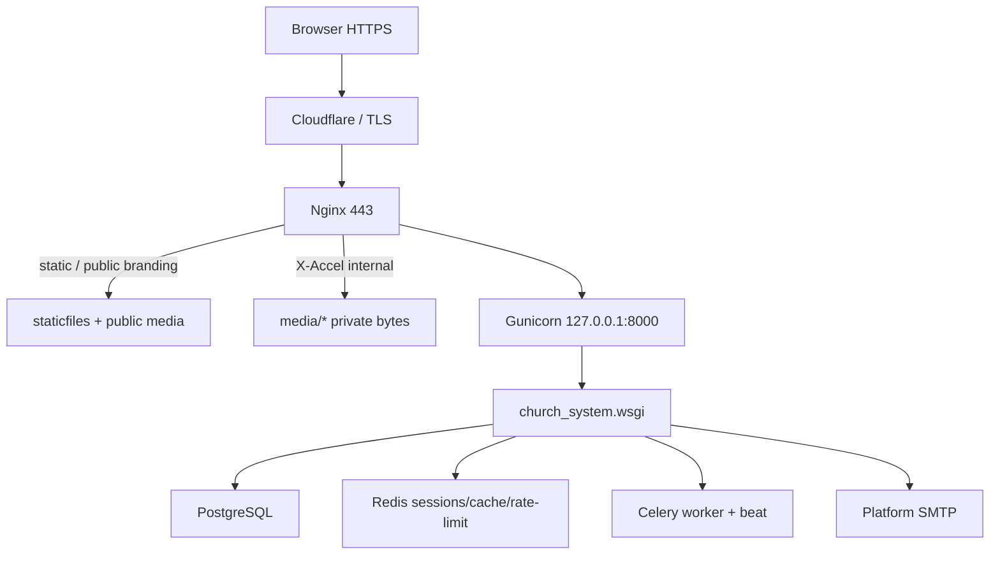

# ChurchHub Full Security Audit Report

**Type:** Read-only professional security review  
**Date:** 14 August 2026  
**Target:** Production application `https://mychurch.zreta.com/`  
**Method:** Source-code evidence, local Django checks, deployment artifacts in-repo  
**Constraint:** No application, configuration, database, or git state was modified for this audit  
**Scope:** Authentication, RBAC, multi-tenancy, financial integrity, Django/config, uploads, injection, secrets, infrastructure, dependencies  

Previous related reports were **not overwritten**:

- `docs/SECURITY_AND_DEPLOYMENT_AUDIT.md` (6 August 2026)
- `docs/SECURITY_VALIDATION_REPORT.md`

Companions created by this audit:

- `docs/SECURITY_FINDINGS_REGISTER.md`
- `docs/SECURITY_REMEDIATION_ROADMAP.md`

---

## Audit identity

| Item | Value |
|------|--------|
| Repository path | `C:\Users\ONE GOD\Desktop\ChurchHub` |
| Git branch | `main` |
| Commit SHA | `8eb5730f91b18212e17f48b3550afa952492437b` |
| Python (local interpreter) | 3.14.2 |
| Django (installed locally) | 5.1.15 |
| `requirements.txt` Django pin | `Django>=6.0.6` (pin drift vs installed 5.1.15) |
| Database backend | PostgreSQL required in production (`psycopg2-binary`); SQLite allowed in development |
| Django apps detected (`*/apps.py`) | 20 |
| `manage.py check --deploy` | Run locally under **development** settings; 6 warnings (DEBUG/SECRET_KEY/SSL cookies). These warnings describe the audit workstation, not production.py |

Custom apps: `admin_custom`, `church_system`, `accounts`, `permissions`, `organization`, `members`, `transactions`, `dashboard`, `announcements`, `reports`, `meetings`, `budgets`, `giving`, `contributions`, `ledger`, `remittance`, `payroll`, `assets`, `portal`, `sitecontrol`.

---

## 1. Executive summary

ChurchHub is a Django monolith with a serious security architecture: platform vs institution lanes, denomination/org-tree scoping, MFA for privileged staff, login rate limits, CSRF middleware, production environment validation, Nginx→loopback Gunicorn, and X-Accel-Redirect for private media bytes.

The remaining failures are not “Django misconfiguration.” They are **authorization and integrity holes in otherwise well-layered code**:

1. **Private media is authenticated, not authorized.** Any logged-in user who knows or guesses a path can read another tenant’s member photos, welfare files, meeting attachments, and report exports. The test suite encodes this as expected behavior.
2. **Some “global” filters punch through the denomination wall** (general announcements; scoped platform operators seeing global stats and other churches’ names).
3. **Financial posting is strong on the core receipt/expense/ledger path**, but asset capitalization, contribution replay, remittance/reconciliation wrappers, and void concurrency are weaker than the core journal.
4. **MFA verification is not throttled**, so a stolen password plus a 6-digit email OTP is brute-forceable in-app.

The product can remain in production, but the media plane and MFA throttle should be treated as urgent. This is **not** security-hardened.

**Verdict: READY WITH CRITICAL REMEDIATIONS**

---

## 2. Security score

**6.2 / 10**

Rationale:

- + Strong lane separation, church-scoped selectors on members/transactions/reports, invitation tokens, CSRF, production validator, proxy IP hardening, marketing intake controls.
- − Shared media authorization model.
- − MFA challenge has no attempt cap.
- − Financial modules outside the core journal do not inherit the same SoD/idempotency/working-day rules.
- − Platform operator scoping is incomplete on dashboard aggregates.

A 6.2 means “engineered for production, with a small number of high-impact defects that a competent attacker or insider can use.” It is not a failing score for a growing SaaS, and it is not a passing score for regulated personal/financial data.

---

## 3. Architecture map (Phase 1)

**Request pipeline (institution):** session → CSRF → login rate limit → maintenance → user-scope middleware → denomination context → MFA gate → view decorator (`login_required` / `permission_required` / `can_*`) → selector scoped by church/org tree → service → repository.

**Request pipeline (platform):** `/platform/` requires `is_platform_user` + capability; Django `/admin/` requires break-glass (`can_access_django_admin`).

**Data model of tenancy:**

- SaaS tenant boundary: `sitecontrol.Denomination`
- Org tree: General Conference → Union → Conference → Zone → District → Church
- People: `accounts.User` (staff/platform) and `members.Member` (PII)
- Money: `transactions.Transaction` + lines, plus ledger/payroll/giving/contributions/remittance/assets/budgets

**There is no Django REST Framework.** “APIs” are session-authenticated `JsonResponse` helpers (member search, notification counts, ledger category lookup, health/metrics).

**Background jobs:** Celery tasks in `church_system/tasks.py` (invitation email, marketing notify, depreciation, report export, backups).

**Integrations:** SMTP email; optional S3 (`django-storages`); Sentry; no Paystack/Stripe/SMS client in-repo.

---

## 4. Critical findings

No finding met the bar for **CRITICAL** (unauthenticated takeover, unauthenticated bulk PII dump, or trivial remote code execution).

The closest production-blocking issues are logged as **HIGH** (CH-SEC-001, CH-SEC-003, CH-SEC-005).

---

## 5. High findings

See register IDs **CH-SEC-001, CH-SEC-002, CH-SEC-003, CH-SEC-004, CH-SEC-005, CH-SEC-006, CH-SEC-007**.

Headline:

| ID | Title | Auth required | Cross-tenant |
|----|--------|---------------|--------------|
| CH-SEC-001 | Private media served to any authenticated user | Yes | Yes |
| CH-SEC-002 | General announcements leak across denominations | Yes | Yes |
| CH-SEC-003 | MFA verification has no attempt throttle | Yes (post-password) | No |
| CH-SEC-004 | Tenant edit can reassign church district without `full_clean()` | Platform operator | Yes |
| CH-SEC-005 | Asset GL journals left pending; working day not enforced | Staff | No |
| CH-SEC-006 | Contribution receipts have no idempotency | Staff | No |
| CH-SEC-007 | Remittance and bank-rec mutations use a read-oriented finance wrapper | Staff | No |

---

## 6. Medium findings

**CH-SEC-008** Announcement detail IDOR for any user with `approve_announcements`.  
**CH-SEC-009** Scoped platform operators receive global counts and other churches’ names in over-limit alerts.  
**CH-SEC-010** Portal login enumerates member/account state.  
**CH-SEC-011** Welfare cases allow same-user approve.  
**CH-SEC-012** `void_transaction` races without `select_for_update`.  
**CH-SEC-013** Financial idempotency keys can be reused while incomplete.  
**CH-SEC-014** `UserActivityLog` is deletable in Django admin.  
**CH-SEC-015** Email + DOB is a first-login credential (mitigated by device email confirmation).  
**CH-SEC-016** Unaudited CSV exports in assets/contributions.

---

## 7. Low findings

**CH-SEC-017** GET `/dashboard/logout/` is CSRF-logout.  
**CH-SEC-018** GET church-context switch mutates session.  
**CH-SEC-019** Identifier-based login lockout enables targeted lockouts.  
**CH-SEC-020** `requirements.txt` Django floor (`>=6.0.6`) does not match installed 5.1.15.  
**CH-SEC-021** Compose publishes Postgres/Redis ports and uses well-known dev passwords.  
**CH-SEC-022** `production.py` HSTS is 3600s while Nginx sends 31536000s.

---

## 8. Authentication assessment

Staff login: Django `ModelBackend` + optional MFA challenge (`accounts/mfa_views.py`). Privileged MFA is policy-driven from `SiteSettings`.

Portal login: email + password. **While `must_change_password` is true, date of birth is accepted as the password** (`portal/services.py` `authenticate_portal_credentials`, `member_matches_dob`, `canonical_dob_password`). New portal users are provisioned with `password = dob.isoformat()` and `must_change_password=True`.

**Implications of email + DOB:**

- DOB is low-entropy personal data, often known to family, church directories, or social media.
- After the member sets a real password, DOB login is disabled.
- First/untrusted-device sign-in still requires a signed, cached, one-hour email confirmation token (`portal_needs_device_confirmation`, `build_confirm_token`). Without mailbox access, DOB alone should not complete first login on a new browser.
- Distinct error strings enable account enumeration (CH-SEC-010).

**Protections that work:**

- Invite tokens: UUID4, 1-hour, single-use, row-locked accept, resend rotates token.
- Login/reset/apply POSTs are rate-limited (`LoginRateLimitMiddleware`). Portal login max attempts = 3.
- Production cookies: `SESSION_COOKIE_SECURE`, `CSRF_COOKIE_SECURE`, `SESSION_COOKIE_HTTPONLY`, SameSite Lax (`production.py` / `base.py`).
- Password validators include platform min-length, uppercase (optional via settings), common, numeric, similarity.
- Impersonation is POST-only, capability-gated, MFA-aware, audited.

**Gaps:** MFA verify/email OTP not in the limiter (CH-SEC-003). GET logout (CH-SEC-017). Trusted-device records are not cleared on every password-reset path (LIKELY, defense-in-depth).

---

## 9. Authorization / RBAC assessment

Institution roles (`permissions/roles.py`): `SUPER_ADMIN`, `GENERAL_OVERSEER`, `UNION_ADMIN`, `CONFERENCE_ADMIN`, `ZONE_DIRECTOR`, `DISTRICT_PASTOR`, `LOCAL_PASTOR`, `SECRETARY`, `TREASURY`, `BOARD_MEMBER`, `MEMBER`.

Platform roles (`sitecontrol/rbac.py`): `OWNER`, `SECURITY`, `BILLING`, `SUPPORT`, `READONLY`.

Enforcement is mostly **server-side** via `permissions.checks.can_*`, `permission_required`, `is_superadmin` (excludes platform users), and object selectors (`filter_by_church`, `get_manageable_churches`, `get_manageable_users`). Role/church form fields use scoped querysets, not trusted hidden IDs.

Weak spots are **wrapper functions that OR together view + mutate permissions** (`transactions.views._finance_required`) and **views that load by global PK then apply a coarse capability** (announcement detail). Portal member pages bind to `request.user.member` — this is sound.

---

## 10. Multi-tenancy assessment

Church-scoped modules (members, transactions, payroll, assets, reports, portal welfare) generally look up objects **inside a scoped queryset**. UUIDs are identifiers, not a security boundary — correctly.

The tenant wall fails where data is **not church-owned**:

- Media files live in a global `MEDIA_ROOT` namespace keyed by path, not tenant.
- `Announcement.visibility="general"` has `church=None` and no denomination FK; `announcements_for_church_ids` includes all general rows.
- Platform `platform_stats()` / over-limit alerts are global.
- `Church.clean()` forbids cross-denomination district moves, but `tenant_edit` → `repo.save_church` → `Model.save()` **does not call `full_clean()`**, so the model rule is skippable.

LIKELY: an institution `SUPER_ADMIN` with neither church nor denomination would see all churches (`permissions/scoping.py`). `User.clean()` intends to prevent that, but `save()` does not call `full_clean()`.

---

## 11. Financial-integrity assessment

**Core journal (receipts, expenses, transfers, ledger, payroll pay/post, welfare disbursement):** atomic services, balanced lines, closed-period checks, working-day checks, creator cannot self-approve (except documented capped receipt auto-approval), payroll/welfare use `select_for_update`.

**Weaker modules:**

- Assets: depreciation/disposal create CAPITAL journals, validate balance, then mark the asset register updated **without approving/locking the journal**; working day is not asserted.
- Contributions: `record_member_contribution` calls `record_receipt` with no `FinancialIdempotencyKey`; double-click/replay creates two receipts.
- Remittance POST and bank-rec create/match sit behind `_finance_required` (SECRETARY with `manage_expenses` qualifies).
- Void: no row lock; two concurrent voids can both pass `is_voided is False`.
- Idempotency helper returns incomplete keys instead of locking them.

Budgets have no maker-checker (product gap, POTENTIAL if budgets are treated as approved control documents).

---

## 12. API security assessment

No DRF. Session JSON endpoints:

| URL (pattern) | Auth | Notes |
|---------------|------|--------|
| `/health/`, `/health/live/`, `/health/ready/` | Optional token; **required in production validation** | Token via query or header; comparison is not `hmac.compare_digest` (POTENTIAL timing) |
| `/metrics/` | Platform/staff/superuser | OK |
| member search JSON | Login + member/finance-related perms | Uses scoped `member_search_results_qs` |
| dashboard notification count | Login | Own unread count |
| ledger category JSON | Feature + login | Church-scoped |

CSRF: global `CsrfViewMiddleware`; no `csrf_exempt` found. Unsafe redirects are filtered to same-origin relative paths (`dashboard/utils.py`).

---

## 13. Django configuration assessment

`church_system/settings/production.py` (source of truth for `DJANGO_ENV=production`):

- `SECURE_SSL_REDIRECT = True`
- `SESSION_COOKIE_SECURE` / `CSRF_COOKIE_SECURE = True`
- `SECURE_HSTS_SECONDS = 3600` (short vs Nginx 1 year)
- `X_FRAME_OPTIONS = DENY`, nosniff, referrer `same-origin`
- `TRUST_X_FORWARDED_FOR` default true; `get_client_ip` requires trusted proxy IPs
- `validate_production_environment` refuses insecure secret, DEBUG, SQLite (except PA), missing Redis/CSRF origins/health token

`base.py`: `CSRF_COOKIE_HTTPONLY = False` (Django default so JS can read CSRF cookie) — **not a finding**.

Local `check --deploy` used development settings (`DEBUG` true, `django-insecure-` default secret). Do not treat those six warnings as live `mychurch.zreta.com` proof. Confirm on the VPS with `DJANGO_ENV=production`.

---

## 14. Infrastructure assessment

Repo deploy artifacts (live VPS may differ):

- Nginx proxies to `127.0.0.1:8000`; Gunicorn default bind is loopback.
- Public branding aliases; other `/media/` goes to Django; `/internal-media/` is `internal`.
- systemd: `PrivateTmp`, `NoNewPrivileges`, `ReadWritePaths` limited.
- Fail2Ban filters exist for nginx-auth and sshd.
- Compose **exposes 5432 and 6379** — development only; do not use that compose file as production.

**Ops gap (not verified on the live host):** whether production Nginx `server_name` includes `mychurch.zreta.com` (repo template lists `zreta.com` / `www.zreta.com`); whether Postgres/Redis listen on localhost only; Cloudflare Full (Strict).

---

## 15. Secrets assessment

- `.env` is gitignored; no committed `.env` found.
- Default `SECRET_KEY` is `django-insecure-change-this-in-production` — blocked by production validator.
- Dev bootstrap passwords `admin12345` in `setup_churchhub.py`; `bootstrap_production.py` refuses weak passwords when `DEBUG` is false.
- `docker-compose.yml` uses `churchhub`/`churchhub` and `docker-dev-secret-change-in-production`.
- CI uses obvious test secrets, not production.
- No Paystack/Stripe/Twilio keys in-repo.

Do not treat compose/bootstrap strings as production credentials; rotate if those commands were ever run against the live database.

---

## 16. Dependency assessment

- Installed Django **5.1.15** (local). `requirements.txt` requires **Django>=6.0.6** — install-from-requirements on a clean host may jump a major version unexpectedly.
- Other pins: gunicorn, redis, celery, pillow 12.3.0, cryptography, sentry-sdk, pyotp.
- CI installs `requirements.txt` on Python 3.13; lint is a narrow Ruff subset.
- pip-audit was **not** executed in this pass (would require extra package install). Run `pip-audit` in CI as a read-only follow-up.

---

## 17. Security test coverage assessment

Existing tests cover media **allowing** any authenticated fetch (`church_system/tests_media_access.py`), marketing hardening, invitation churchless email, client IP spoofing, and institution branding RBAC.

Missing regression tests (should exist, not added in this audit):

- Cross-tenant media deny
- MFA verify lockout after N failures
- General announcement not visible outside denomination
- Announcement detail 404/403 for out-of-scope pending items
- Tenant district change rejected across denominations
- Contribution double-POST creates one receipt
- Remittance POST denied for `view_transactions`-only users
- Concurrent void creates one reversal
- Welfare creator cannot approve own case

---

## 18. Attack-surface map

| Surface | Exposure |
|---------|----------|
| `/accounts/login/`, `/portal/login/` | Public, CSRF + rate limit |
| `/accounts/mfa/verify/` | After password; **no throttle** |
| `/apply/`, `/contact/` | Public; registration/marketing gates |
| `/media/platform\|denominations/branding/` | Public by design |
| `/media/**` else | Any authenticated user |
| `/platform/` | Platform operators + MFA/IP policy |
| `/admin/` | Break-glass platform superuser |
| `/health/` | Token in production |
| Institution modules | Login + RBAC + church scope |
| Celery/Redis/Postgres | Should be localhost; compose publishes ports |

---

## 19. Final production readiness verdict

**READY WITH CRITICAL REMEDIATIONS**

The application is a real production Django system with layered controls. It should not be marketed as security-hardened until private media is object-scoped, MFA challenges are throttled, and the asset/contribution/remittance integrity gaps are closed.

Do **not** use SECURITY-HARDENED.

---

## Distinctions

**NOT A FINDING (suspicious but protected):**

- Invite/password-reset/device-confirm token design (UUID/Django signer/cache nonce).
- Core transaction self-approval block and working-day/period checks.
- Report download bound to export job owner.
- Portal pages bound to `request.user.member`.
- No DRF, no `csrf_exempt`, no `RawSQL`/`extra()`, no `eval`/`pickle`, no user-driven SSRF client.
- `PlatformAuditLog` model-immutable.
- Path traversal on media rejected by `normalize_media_relative_path`.
- Open redirects constrained to relative same-origin paths.

**LIKELY (strong evidence, one runtime condition):**

- Unanchored SUPER_ADMIN becomes global if created without `full_clean`.
- DOB first-login takeover if mailbox is also compromised.
- Upload magic-byte spoof (extension/MIME only).
- Settlement/district remittance duplicate under concurrency.

**POTENTIAL:** backup post-hook executable env; `|safe` action slots if ever passed user HTML; health token comparison timing; Nginx template hostname drift vs `mychurch.zreta.com`.
